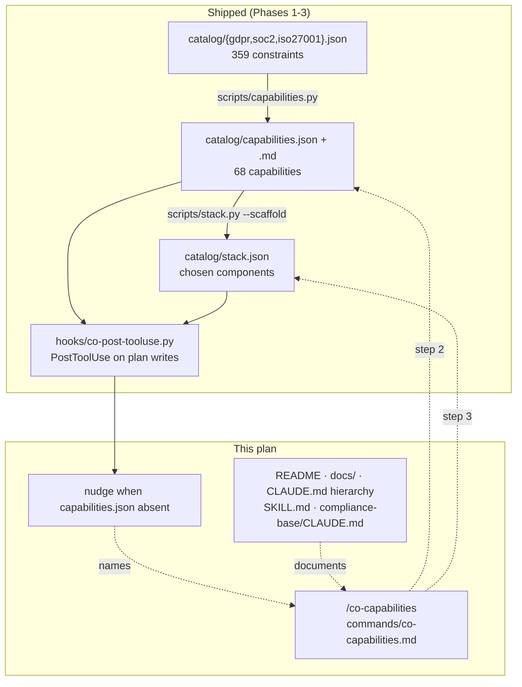

# Wire & document the compliance capability layer

**Plan ID:** `compliance-capabilities-wire-document`
**Source PRD:** `/home/felix/projects/howtobuildsoftware2026/.claude/PRPs/prds/compliance-capabilities.prd.md`
**PRD Phase:** `4 — Wire & document`
**Source Issue:** `None`
**Plan Publication:** `None`

## Outcome

**Problem:** The capability layer is built and merged (Phases 1–3) but has no discoverable surface. `scripts/capabilities.py` and `scripts/stack.py` are reachable only by knowing they exist in the file tree: no slash command runs them, no doc names them, and when `catalog/capabilities.json` is absent the `co-` hook stays silent about it (`compliance-base/hooks/co-post-tooluse.py:55-56` returns `""`). Every other engine surface in this repo — `co-extract`, `co-validate`, `kc-compile`, `cl-update` — has a command plus an entry in README, `docs/INSTALL.md`, `docs/ARCHITECTURE.md`, `CLAUDE.md`, `plugins/CLAUDE.md` and its `SKILL.md`.

**Affected user:** An engineer in a repo with `compliance-compiler` installed — both a fresh install consuming the shipped seed and this repo's self-host — who needs to (re)derive capabilities after the constraint catalog changes, and who needs `catalog/stack.json` refreshed to match.

**User outcome:** `/neurawork-cc-harness:co-capabilities` derives the capability layer and refreshes the stack scaffold in one step; the docs name the capability layer wherever they already name the constraint catalog; a repo without the layer is told, in the hook output it already reads, which command builds it.

**Invariant:** Every shipped capability-layer entry point is reachable from a documented command, and no documented surface describes a mechanism the engine does not have. Specifically: nothing may claim or install a `SessionStart` hook for `compliance-compiler` — `install.py:126-128` prunes exactly that.

**Success signal:** A `grep -rn "co-capabilities"` over the doc surfaces returns a hit on each of the seven that already list `co-extract`, and a capability re-derivation in this repo is performed via the command rather than by typing the `uv run` line from memory.

**Approach:** One new command file, one nudge branch in the existing `PostToolUse` hook (mirrored into the payload), a documentation sweep across the seven surfaces that already list the sibling commands, a new `compliance-base/CLAUDE.md` matching the two sibling install dirs, and a PRD correction recording that the SessionStart bootstrap is superseded by the shipped seed.

## Recommendation

This phase adds **no new mechanism**. Every capability in the PRD's Phase 4 scope is already carried by a shipped primitive; the work is exposing them.

- **Command**: `commands/*.md` files are agent instructions, not scripts (`commands/co-extract.md` is four prose steps around one `uv run` line). Adding `co-capabilities.md` costs one file and no code.
- **Bootstrap**: PRD Phase 4 scoped a "SessionStart bootstrap (build capabilities if missing)". That is superseded and would be actively destroyed by the installer. `install.py:5-8` states "there is no SessionStart bootstrap"; `install.py:126-128` lists `hooks/co-session-start.py` in `REMOVED_TARGET_FILES` / `REMOVED_HOOK_MARKERS` and `_prune_removed()` deletes both the file and its `.claude/settings.json` entry on every install. The bootstrap need it addressed is already met by the prebuilt seed: `payload/catalog-seed/` ships `capabilities.json` + `capabilities.md` (`sync_catalog_seed.py:23-30`), `_seed_catalog()` copies them on a fresh install (`install.py:98-118`), and `tests/test_catalog_seed.py` guards the seed against drift. **User confirmed 2026-08-20: no SessionStart hook — the shipped list covers it.**
- **What the dropped bootstrap did leave behind** is a discoverability hole, not a build hole: when the layer is genuinely absent the hook says nothing. The missing *constraint* catalog already produces a nudge naming its command (`co-post-tooluse.py:79-81`). The same one-line treatment for the capability layer closes the hole without a hook, an event, or a background run.
- **Stack scaffold**: `catalog/stack.json` must be re-scaffolded after any capability change or it silently misses the new capabilities (`stack.py:12-17`). `stack-compiler`'s `/st-*` commands cover scope and select, not `--scaffold` (`stack-compiler.prd.md:207-213`), and `stack.py` is owned here (`stack-compiler.prd.md:91`). Chaining the scaffold as a step of `/co-capabilities` keeps the coupled pair consistent by construction and adds no fourth `co-` command.

### Evidence

- `plugins/neurawork-cc-harness/engines/compliance-compiler/install.py:5-8, 126-172` — the engine has no `SessionStart` hook by design and prunes any it finds.
- `plugins/neurawork-cc-harness/engines/compliance-compiler/install.py:98-118` + `sync_catalog_seed.py:23-30` + `tests/test_catalog_seed.py` — the capability catalog ships prebuilt and drift-guarded, so a fresh install has it without an LLM run.
- `compliance-base/hooks/co-post-tooluse.py:52-56` — `_capability_summary()` returns `""` when `catalog_built` is false: the silent branch.
- `compliance-base/hooks/co-post-tooluse.py:78-81` — the precedent nudge for the missing constraint catalog, naming its command.
- `compliance-base/scripts/capabilities.py:14-19` — the four supported invocations (`--frameworks`, `--all`, `--dry-run`) the command must expose.
- `compliance-base/scripts/stack.py:12-17, 29-32` — `--scaffold` carries human-owned fields over by key; the plain run is report-only and exits 0.
- `plugins/neurawork-cc-harness/commands/co-extract.md` — the command-file shape to follow (locate dir → run → report → point at the artifact).
- `.claude/PRPs/prds/stack-compiler.prd.md:91, 207-213` — `stack.py` and its scaffold belong to `compliance-compiler`; `/st-*` does not cover them.
- `knowledge-base/CLAUDE.md`, `claudemd-lerner/CLAUDE.md` — both sibling install dirs carry a `CLAUDE.md`; `compliance-base/` does not.

### Alternatives considered

- **Build the SessionStart bootstrap as the PRD literally scoped it:** loses against the invariant. The installer would delete the hook it just wrote unless `_prune_removed()` is also changed, and it re-spends the `SessionStart` budget `CLAUDE.md:56-59` reserves for the knowledge engines. Rejected by the user.
- **A separate `/co-stack` command for `stack.py`:** cleaner single responsibility, but adds a fourth `co-` command and permits deriving capabilities while leaving `stack.json` stale — the exact drift `stack.py:12-17` warns about.
- **No hook nudge, command + docs only:** smallest diff, but a repo whose capability layer is missing gets no signal at all — `validate.py` only prints `"capabilities": "not built — gate skipped"` into a detached report the user may never open.

## Visuals

No arrow into a `SessionStart` box: the capability layer reaches a fresh install through `payload/catalog-seed/`, copied by `install.py`, not through a hook.

## Implementation Context

### Mandatory reading

| File | Why it matters |
|---|---|
| `plugins/neurawork-cc-harness/commands/co-extract.md` | The exact command-file shape, frontmatter keys (`description`, `argument-hint`) and `$ARGUMENTS` convention to copy. |
| `compliance-base/scripts/capabilities.py:1-20` | The module docstring lists the four supported invocations verbatim — the command must not invent flags. |
| `compliance-base/scripts/stack.py:1-32` | `--scaffold` vs plain run; the plain run is deliberately report-only and exits 0, so the command must not treat a non-zero gap count as failure. |
| `compliance-base/hooks/co-post-tooluse.py:52-81` | Both the silent branch to change and the nudge precedent to mirror. |
| `plugins/neurawork-cc-harness/engines/compliance-compiler/install.py:5-8, 121-172` | Why no `SessionStart` hook may be added, and that the payload hook file is copied verbatim into the target. |
| `plugins/neurawork-cc-harness/engines/compliance-compiler/tests/test_catalog_seed.py:1-8` | The graceful-skip precedent for a test that reads the self-host tree from the engine test suite. |
| `knowledge-base/CLAUDE.md` | The structure and depth expected of an install-dir `CLAUDE.md` in this repo. |

### Existing patterns and primitives

- **Command file as agent instructions:** `commands/co-extract.md` — YAML frontmatter (`description`, `argument-hint`), then numbered steps that locate the install dir by a marker file, run one `uv run --directory <dir> python scripts/<x>.py $ARGUMENTS`, and end by pointing at the produced artifact. No shell logic beyond that.
- **Nudge on a missing artifact:** `co-post-tooluse.py:78-81` — a single sentence returned as `additionalContext`, naming the fully-qualified command that fixes it.
- **Install-dir marker for discovery:** `co-extract.md:9-11` and `co-validate.md:11-13` locate the catalog dir as "the top-level directory containing `scripts/<script>.py`". `co-capabilities.md` uses `scripts/capabilities.py` as its marker.
- **Payload / self-host mirroring:** the installed `compliance-base/hooks/co-post-tooluse.py` is a byte copy of `plugins/…/engines/compliance-compiler/payload/hooks/co-post-tooluse.py` (`install.py:63-66`). Both copies change together; `compliance-compiler` has no automated drift test (unlike `stack-compiler`'s `tests/test_payload_drift.py`), so the `diff` is a plan validation gate.

### Integration points

- `plugins/neurawork-cc-harness/commands/` — the four existing command files; a fifth lands here and is auto-discovered by the plugin.
- `compliance-base/hooks/co-post-tooluse.py:52` — `_capability_summary()` is called from `_summary()` (line 83) for every plan write; its return value is concatenated into the advisory `additionalContext`.
- Seven documentation surfaces already list `co-extract`: `README.md:55-60`, `CLAUDE.md:52, 59-63`, `plugins/CLAUDE.md:14-16`, `docs/INSTALL.md:116-123`, `docs/ARCHITECTURE.md:29, 106, 111, 132`, `skills/compliance-compiler/SKILL.md:63-68`, and `commands/co-validate.md:20-24`.

## Scope

### In scope

- `/neurawork-cc-harness:co-capabilities` command file covering `capabilities.py` and the coupled `stack.py --scaffold` + gap report.
- A nudge in the existing `PostToolUse` hook when the capability layer is absent, in both the installed and payload copies.
- Documentation sweep across the seven surfaces above, plus the plugin and marketplace manifest descriptions.
- A new `compliance-base/CLAUDE.md`, matching the two sibling install dirs.
- PRD Phase 4 text corrected to record that the SessionStart bootstrap is superseded by the shipped seed.

### Not building

- **A `SessionStart` hook or any bootstrap run** — superseded by `payload/catalog-seed/`; the installer prunes such hooks. User-confirmed.
- **A separate `/co-stack` command** — the scaffold rides along in `/co-capabilities`; see Risks.
- **Any change to `capabilities.py`, `stack.py`, `validate.py` or `precheck.py` behavior** — Phases 1–3 shipped them; this phase only exposes them.
- **Validating PRDs, or gating on chosen stack components** — `neurawork-cc-harness.prd.md` Phase 7 and `stack-compiler.prd.md` Phase 4 respectively.
- **A payload-drift test for `compliance-compiler`** — worth having, but it is not this phase's outcome; the `diff` gate below covers this change.

## Delivery Considerations

| Concern | Decision and owned work |
|---|---|
| Discoverability / adoption | The whole point of the phase: Task 1 (command), Task 2 (hook nudge), Task 3 (docs). |
| Compatibility | The nudge only fires on a branch that currently returns `""`; a repo with a built capability layer sees byte-identical hook output. No config key, no schema change. |
| Rollout / reversibility | Docs and one command file; the hook change is three lines and revertible on its own. Installed repos pick the hook change up on the next `install.py` run — the command file is plugin-level and available immediately. |
| Documentation | Task 3 and Task 4 are the documentation. Task 5 keeps the PRD honest about the dropped bootstrap. |

## Implementation

### 1. `/co-capabilities` derives the capability layer and refreshes the stack scaffold

**Files and integration points**
- `plugins/neurawork-cc-harness/commands/co-capabilities.md` — CREATE — plugin-level commands dir; auto-discovered alongside the four existing files.

**Implementation**
- Follow `co-extract.md` exactly: frontmatter `description` (one line, names the capability layer) and `argument-hint: "[--frameworks gdpr,soc2,iso27001] [--all] [--dry-run]"` — the flags `capabilities.py:14-19` actually supports, no others.
- Step 1: locate the catalog dir as the top-level directory containing `scripts/capabilities.py`, commonly `compliance-base`. If absent, tell the user to install via `/neurawork-cc-harness:compliance-compiler`; if `catalog/<framework>.json` is missing, to run `/neurawork-cc-harness:co-extract` first (`capabilities.py:410` prints exactly that condition).
- Step 2: `uv run --directory <catalog-dir> python scripts/capabilities.py $ARGUMENTS` — note it needs `ANTHROPIC_API_KEY` / `CLAUDE_CODE_OAUTH_TOKEN`, that unchanged frameworks are skipped by content hash, and that the run **fails** on an uncovered mandatory constraint (`capabilities.py:585-589`).
- Step 3: `uv run --directory <catalog-dir> python scripts/stack.py --scaffold`, then a plain `uv run --directory <catalog-dir> python scripts/stack.py`. State that the gap report is report-only and exits 0 (`stack.py:26-28`), so a non-zero gap count is a to-do for the human, not a failure.
- Step 4: report capabilities per framework and the mandatory-coverage line, name any orphaned stack keys the scaffold reported, and point the user at `<catalog-dir>/catalog/capabilities.md` and the gap report under `<catalog-dir>/reports/`.

**Tests**
- None — command files carry no executable logic, matching the four existing ones.

**Validation**
- `head -5 plugins/neurawork-cc-harness/commands/co-capabilities.md` — frontmatter present with `description` and `argument-hint`.
- Run `/neurawork-cc-harness:co-capabilities` in this repo — `capabilities.py` reports `= <fw>: catalog unchanged — reusing existing capabilities` for all three frameworks (the constraint catalog is unchanged), and `stack.py` prints its one-line gap summary.

### 2. A repo with no capability layer is told which command builds it

**Files and integration points**
- `plugins/neurawork-cc-harness/engines/compliance-compiler/payload/hooks/co-post-tooluse.py:52-56` — UPDATE — the payload is the source of truth for engine code.
- `compliance-base/hooks/co-post-tooluse.py:52-56` — UPDATE — the self-host copy, kept byte-identical.

**Implementation**
- In `_capability_summary()`, replace the bare `return ""` on the `not cp["catalog_built"]` branch with one advisory sentence naming `/neurawork-cc-harness:co-capabilities`, mirroring the phrasing of the constraint-catalog nudge at lines 79-81.
- Keep it advisory only. The function's docstring already states it never blocks; do not touch `_summary()`'s block path or `validate_mode`.
- Update that docstring's "or `""` when the capability layer is not built" clause so it no longer describes a silence the function no longer produces.

**Tests**
- `plugins/neurawork-cc-harness/engines/compliance-compiler/tests/test_shards_precheck.py` — add one test asserting that for a precheck result with `capabilities.catalog_built` false the hook's summary names `co-capabilities`, and that a built layer's summary does not. Import the hook module from the installed `compliance-base/` (the payload tree has no sibling `_shared/`, so the payload copy is not importable) and `skipUnless` that directory exists — the graceful-skip precedent is `tests/test_catalog_seed.py:4-6`. Ensure `CLAUDE_INVOKED_BY` is unset for the import, or `recursion_guard()` (`_shared/hookio.py:23-29`) exits the interpreter.

**Validation**
- `cd plugins/neurawork-cc-harness/engines && python3 -m unittest discover -s compliance-compiler/tests` — 91 tests, OK (baseline on `main` is 90).
- `diff plugins/neurawork-cc-harness/engines/compliance-compiler/payload/hooks/co-post-tooluse.py compliance-base/hooks/co-post-tooluse.py` — no output.
- `cd compliance-base && uvx ruff check hooks/co-post-tooluse.py` — no more than the 1 pre-existing error on `main`.

### 3. Every surface that names the constraint catalog also names the capability layer

**Files and integration points**
- `README.md:55-60` — UPDATE — the user-facing command table.
- `CLAUDE.md:52, 59-63` — UPDATE — the run-commands block and the slash-command list.
- `plugins/CLAUDE.md:14-16` — UPDATE — the `commands/` inventory.
- `docs/INSTALL.md:116-123` — UPDATE — the "From then on" bullet list under compliance install.
- `docs/ARCHITECTURE.md:29, 106-111` — UPDATE — the `commands/` line in the layout block and the compliance runtime paragraph.
- `plugins/neurawork-cc-harness/skills/compliance-compiler/SKILL.md:63-68` — UPDATE — the "After install" bullets, and the two-halves intro which currently describes extraction + validation only.
- `plugins/neurawork-cc-harness/commands/co-validate.md:20-24` — UPDATE — step 3 still describes constraint coverage only, though `validate.py` has gated on capabilities since Phase 3 (`validate.py:7-13`).

**Implementation**
- Add `/neurawork-cc-harness:co-capabilities` to each command list, described as deriving the capability layer and refreshing the stack scaffold.
- In `CLAUDE.md:52`, add the `capabilities.py` and `stack.py` run lines next to `extract.py` / `validate.py`. Leave lines 56-59 as they are — they already correctly state that compliance adds only a `PostToolUse` hook and nothing at `SessionStart`.
- In `docs/ARCHITECTURE.md:29`, extend the `commands/` line to five files.
- In `co-validate.md` step 3, say the report covers both mandatory constraints and the capability verdict.
- Mention `stack.json` and the gap report where `capabilities.{json,md}` is already listed (`docs/INSTALL.md:116`, `docs/ARCHITECTURE.md:132`) — it is a tracked artifact that no doc currently names.
- Do not restate the layer's internals in each place; link to `compliance-base/catalog/capabilities.md`.

**Tests**
- None — prose.

**Validation**
- `grep -rln "co-capabilities" README.md CLAUDE.md plugins/CLAUDE.md docs/INSTALL.md docs/ARCHITECTURE.md plugins/neurawork-cc-harness/skills/compliance-compiler/SKILL.md plugins/neurawork-cc-harness/commands/co-validate.md` — all seven files listed.
- `grep -rn "SessionStart" docs/INSTALL.md docs/ARCHITECTURE.md CLAUDE.md | grep -i complian` — no surface claims a compliance `SessionStart` hook.

### 4. `compliance-base/` carries a `CLAUDE.md` like its two sibling install dirs

**Files and integration points**
- `compliance-base/CLAUDE.md` — CREATE — the only install dir in this repo without one.

**Implementation**
- Match `knowledge-base/CLAUDE.md`'s structure and depth. Cover: what the dir is (a self-host install of `compliance-compiler`, machinery copied from the payload — fix bugs in the payload, not here); the four-layer chain constraints → capabilities → `stack.json` → plan validation; the scripts and their exact `uv run --directory compliance-base` invocations; which artifacts are tracked (`catalog/*.json`, `catalog/index.md`, `capabilities.md`, `stack.json`) versus gitignored (`catalog/.shards/`, `reports/`, `scripts/state.json` — see `.gitignore`); the `config.json` keys that change behavior (`frameworks`, `validate_frameworks`, `validate_mode`, `max_concurrency`); that the single hook is `PostToolUse` and there is deliberately none at `SessionStart`; and the copyright constraint on stored standard text (`SKILL.md:29-33`).
- Note the ownership split that is easy to get wrong: `stack.json`'s schema, `--scaffold` and gap report live here, while the scoping/selection that fills `chosen` lives in `stack-base/` and writes through `stack.py --apply-scope` (`CLAUDE.md:87-95`).

**Tests**
- None — prose.

**Validation**
- `ls compliance-base/CLAUDE.md` — exists.
- Cross-check every command it names against `compliance-base/scripts/` — each cited script and flag exists.

### 5. The PRD records that the SessionStart bootstrap is superseded

**Files and integration points**
- `.claude/PRPs/prds/compliance-capabilities.prd.md` — UPDATE — the Phase 4 row in the phase table and the "Phase 4: Wire & document" detail block.

**Implementation**
- Replace "SessionStart bootstrap" in both places with the mechanism that actually delivers bootstrap: the prebuilt `payload/catalog-seed/` copied by `install.py`, plus the hook nudge for a repo that has none. Cite the user decision of 2026-08-20 and `install.py:126-128`.
- Update the phase's success signal accordingly: a fresh install has the capability catalog from the seed with no LLM run, and the command re-derives it on demand.
- Leave the status cell to `/prp-prd-update`.

**Tests**
- None — planning artifact.

**Validation**
- `grep -n "SessionStart" .claude/PRPs/prds/compliance-capabilities.prd.md` — no line claims compliance builds capabilities at `SessionStart`.

### 6. Manifest descriptions name the capability layer

**Files and integration points**
- `plugins/neurawork-cc-harness/.claude-plugin/plugin.json` — UPDATE — `description` names the constraint catalog only.
- `.claude-plugin/marketplace.json` — UPDATE — the plugin entry's `description`, same omission.

**Implementation**
- Extend both descriptions so `compliance-compiler` reads as constraint catalog **plus** derived capabilities and stack mapping. Keep them one sentence each; do not touch `name`, `version`, or the `source` block.

**Tests**
- None.

**Validation**
- `python3 -c "import json;[json.load(open(p)) for p in ['plugins/neurawork-cc-harness/.claude-plugin/plugin.json','.claude-plugin/marketplace.json']]"` — both parse.
- `cd plugins/neurawork-cc-harness/engines && python3 -m unittest discover -s compliance-compiler/tests` — `test_install_recon.py` still passes (it reads the manifest tree).

## Acceptance

1. **AC1 — The capability layer has a command:** `/neurawork-cc-harness:co-capabilities` exists as a plugin command; running it in this repo re-derives the capability catalog (reusing unchanged frameworks by content hash), refreshes `catalog/stack.json` via `--scaffold`, prints the gap summary, and points at `catalog/capabilities.md`.
2. **AC2 — A missing capability layer is announced, not silent:** on a plan write in a repo whose `catalog/capabilities.json` is absent, the `PostToolUse` hook's advisory context names `/neurawork-cc-harness:co-capabilities`. With the layer present, the hook's output is unchanged from before this plan.
3. **AC3 — Documentation is complete and truthful:** each of the seven surfaces that lists `co-extract` also lists `co-capabilities`; `stack.json` and the gap report are named where `capabilities.{json,md}` already is; `compliance-base/CLAUDE.md` exists and every script and flag it cites exists.
4. **AC4 — No `SessionStart` claim survives:** no doc, PRD phase text, manifest, or code path states or installs a `SessionStart` hook for `compliance-compiler`; bootstrap is attributed to `payload/catalog-seed/`.
5. **AC5 — Engine behavior is unchanged:** `capabilities.py`, `stack.py`, `validate.py` and `precheck.py` are untouched; the installed hook and its payload copy remain byte-identical.

## Validation

| Gate | Command or procedure | Proves |
|---|---|---|
| Engine suite | `cd plugins/neurawork-cc-harness/engines && python3 -m unittest discover -s compliance-compiler/tests` | AC2, AC5 — 91 tests OK (90 on `main`, +1 for the nudge). |
| Shared + sibling suites | `cd plugins/neurawork-cc-harness/engines && python3 -m unittest discover -s _shared/tests && python3 -m unittest discover -s knowledge-compiler/tests && python3 -m unittest discover -s claudemd-lerner/tests` | AC5 — nothing else regressed. |
| Payload parity | `diff plugins/neurawork-cc-harness/engines/compliance-compiler/payload/hooks/co-post-tooluse.py compliance-base/hooks/co-post-tooluse.py` | AC5 — no output. |
| Seed parity | `cd plugins/neurawork-cc-harness/engines/compliance-compiler && python3 sync_catalog_seed.py --check` | AC4 — the shipped bootstrap seed is still in sync with this repo's catalog. |
| Lint (changed file) | `cd compliance-base && uvx ruff check hooks/co-post-tooluse.py` | AC5 — no more than the 1 pre-existing error on `main`. |
| Doc coverage | `grep -rln "co-capabilities" README.md CLAUDE.md plugins/CLAUDE.md docs/INSTALL.md docs/ARCHITECTURE.md plugins/neurawork-cc-harness/skills/compliance-compiler/SKILL.md plugins/neurawork-cc-harness/commands/co-validate.md` | AC3 — all seven surfaces updated. |
| Manifests parse | `python3 -c "import json;[json.load(open(p)) for p in ['plugins/neurawork-cc-harness/.claude-plugin/plugin.json','.claude-plugin/marketplace.json']]"` | AC3 — valid JSON. |
| Manual — command end to end | Run `/neurawork-cc-harness:co-capabilities` in this repo | AC1 — three frameworks reported as reused, stack scaffold refreshed, gap line printed, exit 0. |
| Manual — nudge | Temporarily move `compliance-base/catalog/capabilities.json` aside, write a plan file, read the hook's advisory context, restore the file | AC2 — the nudge names the command; restoring returns the previous output. |

## Risks and Decisions

| Decision or risk | Recommendation | Evidence / mitigation | Consequence if different |
|---|---|---|---|
| `stack.py --scaffold` chained into `/co-capabilities` vs. a separate `/co-stack` | Chain it | `stack.py:12-17` — a stale `stack.json` silently misses new capabilities; `/st-*` does not cover `--scaffold` (`stack-compiler.prd.md:207-213`) | A fourth `co-` command, and the pair can drift apart between runs |
| Hook nudge vs. staying silent when the layer is absent | Add the nudge | Mirrors the existing catalog nudge (`co-post-tooluse.py:78-81`); it is the only surviving substitute for the dropped bootstrap | Drop Task 2; the phase becomes command + docs only and a layer-less repo gets no signal |
| The nudge test must import the hook from the self-host tree | Accept, with `skipUnless` | The payload tree has no sibling `_shared/`, so the payload copy is not importable; `tests/test_catalog_seed.py:4-6` already skips gracefully for the same reason | Skip the test and rely on the manual nudge check in Validation |
| `compliance-compiler` has no payload-drift test, unlike `stack-compiler` | Out of scope; covered here by the `diff` gate | `plugins/neurawork-cc-harness/engines/stack-compiler/tests/test_payload_drift.py` is the model if it is ever added | A future hook edit can desync the two copies unnoticed |

## Compliance

**Capabilities**: none — this phase ships one command file, one advisory sentence in an existing hook, prose documentation, and two manifest descriptions. It processes no personal data, stores nothing, adds no access path, and changes no control: `capabilities.py`, `stack.py`, `validate.py` and `precheck.py` are explicitly untouched (AC5). The mandatory constraints stay owned by the capability layer this plan documents rather than modifies.

## Related Plans

- **Depends on:** `/home/felix/projects/howtobuildsoftware2026/.claude/PRPs/plans/completed/compliance-capabilities-engine.plan.md` (Phase 1), `/home/felix/projects/howtobuildsoftware2026/.claude/PRPs/plans/completed/compliance-capabilities-stack-mapping.plan.md` (Phase 2), `/home/felix/projects/howtobuildsoftware2026/.claude/PRPs/plans/completed/compliance-capability-validator.plan.md` (Phase 3)
- **Followed by:** `stack-compiler.prd.md` Phase 4 (`st-` gate on PRD + plan writes against `stack.json`) and `neurawork-cc-harness.prd.md` Phase 7 (`co-` hook extended to PRD writes) — both are separate PRDs and neither is unblocked by this plan.

## Agent Notes

- The plan writes to `.claude/PRPs/plans/`, matching every prior phase of this PRD, rather than the global `~/.prp` store (`PRP_HOME` is unset in this session but the repo convention and the PRD's own links are in-repo).
- Writing this plan file will itself trigger the `co-` `PostToolUse` hook. Its advisory output about mandatory constraints is expected and is not a finding about this plan's content — this phase ships documentation and one advisory string, and touches no data path a compliance constraint governs.
- `uvx ruff check` run from `compliance-base/` reports 40 pre-existing errors on `main` (26 × ISC004 in `scripts/shards.py`, plus RUF100/TRY004/PLW1510/UP017/I001/SIM117), and 48 from the engine dir. Repo-wide lint is therefore not a usable gate; the plan scopes lint to the one changed Python file.
