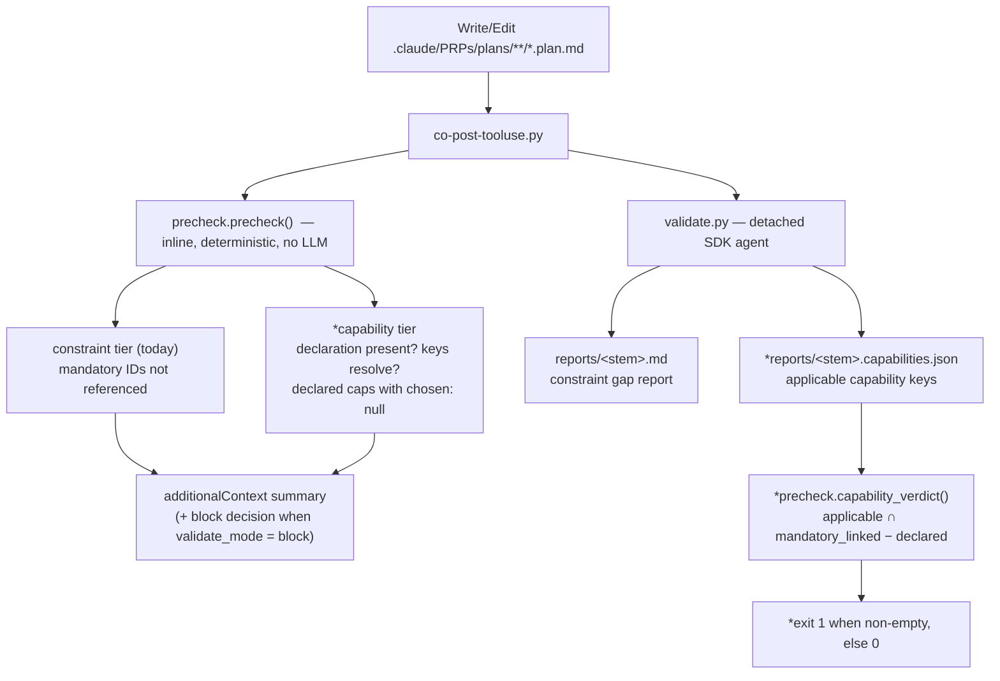
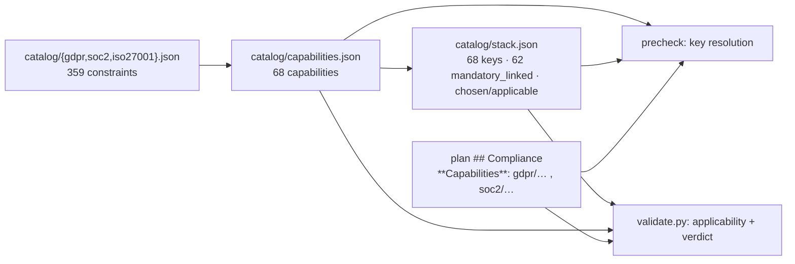

# Feature: Capability-coverage gate on plan writes (`validate.py` + `precheck.py`)

**Plan ID:** `compliance-capability-validator`
**Source PRD:** `/home/felix/projects/howtobuildsoftware2026/.claude/PRPs/prds/compliance-capabilities.prd.md`
**PRD Phase:** `3 — Capability validator`
**Source Issue:** `None`
**Plan Publication:** `None`

## Outcome

**Problem:** The capability layer is derivable (`capabilities.py`) and decidable (`stack.py`), but nothing
checks a PRP plan against it. A plan can deliver a compliance-relevant feature and silently ignore a
mandatory-linked capability; the only write-time signal today is the constraint-ID precheck, which reports
"279/279 mandatory constraints not referenced" on every plan write because no plan in the repo carries
constraint IDs (`.claude/PRPs/plans/completed/*.plan.md` — four `## Compliance` sections, zero IDs).

**Affected user:** The NeuraWork engineer/architect authoring a PRP plan in a repo with
`compliance-compiler` installed — and, downstream, whoever has to defend the delivered system to an auditor.

**User outcome:** A plan states which compliance capabilities it delivers, in a form the tooling can read;
a plan that omits a capability its own content makes applicable is reported at write time and fails
`validate.py`.

**Invariant:** A plan that is judged to make a mandatory-linked capability applicable and does not declare
it must produce a non-zero `validate.py` exit and a report naming that capability. A plan with no
compliance surface, declared as such, must produce exit 0 and no gap.

**Success signal:** PRD success-metric row "Validator enforcement": a deliberately-incomplete plan fails
`validate.py`; the equivalent complete plan passes. Measured by Task 6's manual A/B run.

**Approach:** Two tiers on the existing `co-` PostToolUse surface, mirroring the constraint tiers already
there. **Tier 1** (`precheck.py`, inline, deterministic, <1s): parse a `**Capabilities**:` declaration line
from the plan's `## Compliance` section, resolve each `<framework>/<capability-slug>` key against
`catalog/capabilities.json`, and report unknown keys / capabilities with no chosen component in
`stack.json`. **Tier 2** (`validate.py`, detached LLM): the agent decides which capabilities *apply* to the
plan and writes a verdict JSON beside its report; the script does the set math against the declaration and
exits non-zero when an applicable **mandatory-linked** capability is undeclared.

## Recommendation

Everything needed already exists as a primitive; this phase is set math plus one prompt stage.

- The **identity** of a capability is settled: `stack.capability_key()` (`compliance-base/scripts/stack.py:56-62`)
  = `<framework>/<capability_slug(name)>`. Capabilities carry no `id`; reusing this key means the
  declaration, `stack.json`, and the gap report all speak one vocabulary. No new identifier is invented.
- **Which capabilities matter** is settled: `stack.mandatory_linked_keys()` (`stack.py:65-77`) already
  computes the 62 mandatory-linked keys, and already takes a `catalog_dir` argument — exactly what the
  worktree-redirecting hook needs (`hooks/co-post-tooluse.py:84-87`).
- **Where a deterministic plan check lives** is settled: `precheck.precheck()` (`precheck.py:37-50`) is the
  no-LLM structural module the hook calls inline, and it is SDK-free so it unit-tests straight out of
  `payload/scripts` (`tests/test_shards_precheck.py:12-17`).
- **How an agent returns machine-readable data** is settled: every agent in this engine writes JSON with the
  `Write` tool and lets Python do the math (`AGENTS.md:79-83`, `AGENTS.md:116-118`;
  `capabilities.py:536-545` assembles and gates deterministically over agent output). The capability verdict
  follows that shape rather than parsing prose out of the markdown report.

The one genuinely new decision — **who decides applicability** — is answered by the same split the
constraint tier already uses: `applies_when` reasoning is the LLM's job, coverage arithmetic is Python's.
So the deterministic tier never enumerates all 62 capabilities (that would add a second useless
"62/62 missing" line to the existing 279-ID one), and the LLM tier's judgment is turned into a pass/fail by
code, not by the model asserting its own verdict.

No new script, no new config key, no new dependency: `precheck.py` grows the pure logic, `validate.py`
grows one prompt stage and an exit code, the hook grows one summary sentence.

### Evidence

- `compliance-base/scripts/stack.py:56-62,65-77` — `capability_key()` / `mandatory_linked_keys()`; the
  key vocabulary and the mandatory-linked set, both already `catalog_dir`-parameterized.
- `compliance-base/scripts/precheck.py:37-50` — the inline deterministic check the hook runs; the extension
  point for tier 1.
- `compliance-base/scripts/validate.py:41-69,95-119` — prompt builder and `main()`; `main()` currently
  always returns 0 and the SDK import is function-local, so an exit code is a two-line change.
- `compliance-base/hooks/co-post-tooluse.py:52-64,84-87,108-115` — `_summary()`, the `catalog_dir` override
  under worktree redirect, and the `validate_mode: "block"` branch.
- `compliance-base/catalog/stack.json` — 68 entries, 62 `mandatory_linked: true`, **0 `chosen`**,
  0 `applicable: false`. So "declared capability has no chosen component" is informational today, not a gap.
- `.claude/PRPs/plans/completed/compliance-capabilities-stack-mapping.plan.md:647-664` — an existing
  `## Compliance` section: prose only, no machine-readable declaration. This is the section the new line
  slots into.
- `plugins/neurawork-cc-harness/engines/compliance-compiler/payload/scripts/` is byte-identical to
  `compliance-base/scripts/` (verified by `diff -rq`, only `__pycache__` differs) — every source edit lands
  in both trees, per commit `58611f6`.

### Alternatives considered

- **Deterministic-only full coverage** (every mandatory-linked capability must be declared by every plan):
  rejected with the user. It reproduces the existing 279-ID noise at capability scale — 62 undeclared
  capabilities printed on a plan that adds a slash command — and a signal nobody can act on gets ignored,
  which is worse than no signal.
- **LLM-only** (no deterministic tier): the inline hook stays silent, and a typo'd or upstream-renamed
  capability key is never caught. Key resolution is exactly what cheap deterministic code is good at.
- **YAML frontmatter declaration**: cleanest to parse, but PRP plans have no frontmatter and the template
  lives in an external plugin (`prp-core`), so adopting it would need a change we do not own.

## Visuals

Write-time flow after this change (new elements marked `*`):

Data the two tiers read:

## Implementation Context

### Mandatory reading

| File | Why it matters |
|---|---|
| `compliance-base/scripts/precheck.py:1-50` | The module tier 1 extends; note it is SDK-free and takes `catalog_dir` for the worktree redirect |
| `compliance-base/scripts/stack.py:56-94` | `capability_key`, `mandatory_linked_keys`, `component_options` — import these, do not re-derive keys |
| `compliance-base/scripts/utils.py:45-87` | `load_constraints` / `mandatory_ids` / `validation_frameworks` — the reader shape new catalog readers must mirror (never raise on missing/corrupt) |
| `compliance-base/scripts/validate.py:41-119` | Prompt builder + `main()`; where the capability stage and exit code attach |
| `compliance-base/hooks/co-post-tooluse.py:52-116` | `_summary()` string conventions and the `block` branch |
| `compliance-base/AGENTS.md:84-118` | Validation rules the validator agent follows, and the capability vocabulary it already knows |
| `plugins/…/engines/compliance-compiler/tests/test_shards_precheck.py:1-60` | Test conventions: import from `payload/scripts`, build a temp catalog dir, no LLM |

### Existing patterns and primitives

- **Pure logic split from SDK:** `stack.py` imports `_shared.repo_guard` *inside* `main()` (`stack.py:304`)
  so the module imports cleanly from `payload/scripts` in tests. `validate.py` already does the same with
  `claude_agent_sdk` (`validate.py:73`) but imports `_shared.repo_guard` at module level
  (`validate.py:29`) — therefore all new *testable* capability logic goes in `precheck.py`, and
  `validate.py` only calls it. Do not move `validate.py`'s `_shared` import; nothing requires it.
- **Agent writes JSON, Python judges:** `capabilities.py` gates on `cap_lib.coverage_gap()` over agent
  output rather than trusting an agent's self-reported verdict (`capabilities.py:536-545`). The capability
  verdict does the same: the agent supplies `applicable`, Python computes `undeclared_mandatory`.
- **Catalog readers never raise:** `utils.load_constraints` (`utils.py:52-70`) skips missing/corrupt files
  so an unbuilt catalog yields "not built" rather than a crashed hook. New readers must match.
- **Report paths:** `REPORTS_DIR / f"{plan_path.stem}.md"` (`validate.py:108`); `reports/` is gitignored
  (`install.py:44`), so the verdict JSON beside it stays untracked.

### Integration points

- `compliance-base/scripts/precheck.py` — `precheck()` return dict gains a `capabilities` sub-dict; the hook
  and `validate.py` both consume it.
- `compliance-base/hooks/co-post-tooluse.py:101` — `_summary(pc)` gains one capability sentence.
- `compliance-base/scripts/validate.py:75,95-119` — prompt gains a capability block; `main()` gains the
  verdict read and the exit code.
- `compliance-base/AGENTS.md:97` — a new subsection after the constraint validation rules; the file is
  embedded verbatim into the validator prompt (`validate.py:42`), so this is the agent's spec.

## Scope

### In scope

- A machine-readable capability declaration in a plan's `## Compliance` section:
  `**Capabilities**: gdpr/audit-logging, soc2/change-management`, or
  `**Capabilities**: none — <reason>`.
- Deterministic tier: declaration presence, key resolution against `capabilities.json`, declared-but-unchosen
  and declared-but-scoped-out flags; surfaced in the hook's advisory summary.
- LLM tier: applicability judgment written as `reports/<plan-stem>.capabilities.json`; deterministic verdict
  math; non-zero `validate.py` exit when an applicable mandatory-linked capability is undeclared.
- `AGENTS.md` capability-validation rules (declaration syntax + verdict schema), both trees.
- Unit tests for every pure function; manual A/B proof of the incomplete-vs-complete plan.
- Byte-identical mirror of all four source files into `engines/compliance-compiler/payload/`.

### Not building

- **PRD-write matching, doc-type-aware check levels, and debounce** — harness PRD Phase 7
  (`neurawork-cc-harness.prd.md:203-210`). This phase keeps `is_plan_path()` untouched; the gate fires on
  plan writes only.
- **Component-allowlist and license gating** — `stack-compiler` Phase 4 (`st-` hook). Tier 1 reports a
  declared capability whose `chosen` is null; it does not judge which component is right.
- **Teaching `gaps()` to skip non-applicable capabilities** — explicitly `stack-compiler` Phase 1's task
  (`stack-compiler.prd.md`, phase table). This plan *reads* `applicable`, never rewrites the gap math.
- **Blocking on capability findings.** `validate_mode: "block"` keeps keying on unreferenced mandatory
  constraint IDs exactly as today; capability findings are advisory in the hook. Rationale in Risks.
- **Fixing the constraint tier's 279-ID noise** — pre-existing, and the doc-type-aware rework that fixes it
  is Phase 7's. Flagged, not touched.
- **Slash command / docs / `CLAUDE.md`** — PRD Phase 4.
- **Backfilling declarations into the four completed plans** — they are archived under `completed/` and the
  hook deliberately skips that directory (`precheck.py:34`).

## Delivery Considerations

| Concern | Decision and owned work |
|---|---|
| Discoverability / adoption | No plan carries a declaration today, so the *absence* path is the common one. Task 2 makes the hook's summary state the exact line to add, including the `none — <reason>` escape; Task 4 puts the syntax in `AGENTS.md`, which is both the agent's spec and the human-readable constitution. Task 5 of this plan's own `## Compliance` section carries a real declaration, so the repo ships one worked example. |
| Compatibility | Additive. A plan with no declaration keeps working: tier 1 emits one advisory sentence, tier 2 finds `declared = []` and only fails if the agent judges a mandatory-linked capability applicable. No existing key, config field, or report path changes shape. |
| Rollout / reversibility | Reversible by reverting one commit across both trees; no data migration, `stack.json` and `capabilities.json` are read-only to this change. |
| Observability | The verdict JSON is written per plan under gitignored `reports/`, so a run's applicability judgment is inspectable after the fact rather than only summarized in prose. A missing/corrupt verdict prints an explicit "capability gate skipped" line — never silently passes. |

## Implementation

### 1. Capability declaration parsing and precheck logic

**Files and integration points**
- `compliance-base/scripts/utils.py` — UPDATE: add `load_capability_catalog(catalog_dir=None)` and
  `load_stack(catalog_dir=None)` next to `load_constraints`; `utils` is the engine's catalog-reader owner.
- `compliance-base/scripts/precheck.py` — UPDATE: new pure functions + `precheck()` gains `capabilities`.
- `plugins/neurawork-cc-harness/engines/compliance-compiler/payload/scripts/{utils,precheck}.py` — mirror.

**Implementation**
- Readers mirror `load_constraints` (`utils.py:52-70`): return `{}` on missing/corrupt/non-dict, never raise.
  `load_capability_catalog` reads `<catalog_dir>/capabilities.json`; `load_stack` reads
  `<catalog_dir>/stack.json`. Leave `stack.py`'s private `_load_json` alone — pre-existing, not this
  change's mess.
- `declared_capabilities(plan_text) -> dict` in `precheck.py`. Match
  `^\*\*Capabilities\*\*:\s*(?P<body>.+)$` (MULTILINE, first match wins). Return
  `{"present": bool, "none": bool, "keys": sorted-unique list, "reason": str}`.
  - Body starting with `none` (case-insensitive, optionally backticked) → `none=True`; `reason` is the
    remainder after the first `—`, `–`, `-`, or `:` separator, stripped. No separator → empty reason.
  - Otherwise extract keys with `re.compile(r"[a-z0-9]+/[a-z0-9][a-z0-9-]*")` over the body, so surrounding
    backticks, commas, and `and` are tolerated. Keys are matched case-insensitively by lowercasing the body
    first, because `capability_slug` output is always lowercase (`cap_lib.py:35-43`).
- `capability_precheck(plan_text, cfg, catalog_dir=None) -> dict` in `precheck.py`, importing
  `stack.capability_key` and `stack.mandatory_linked_keys` (both pure, both already `catalog_dir`-aware).
  Build `known = {capability_key(fw, cap["name"]): (fw, cap)}` over `validation_frameworks(cfg)` only —
  a framework excluded from validation must not make its keys "unknown" *or* required. Return:
  `catalog_built`, `declaration_present`, `declared_none`, `none_reason`, `declared` (list),
  `unknown_keys`, `declared_unchosen` (declared ∩ known with falsy/blank `chosen` in `stack.json`),
  `declared_not_applicable` (declared ∩ known with `applicable is False`), `mandatory_linked_total`.
- `capability_verdict(applicable_keys, declared_keys, mandatory_linked) -> dict` in `precheck.py` — pure set
  math, no I/O: `{"undeclared_mandatory": sorted(set(applicable) & set(mandatory_linked) - set(declared)),
  "declared_not_applicable": sorted(set(declared) - set(applicable)), "applicable_total": len(...)}`.
  This is the function Task 3's exit code reads; it never trusts an agent-supplied verdict field.
- `precheck()` adds `"capabilities": capability_precheck(...)` to its existing return dict. Existing keys
  keep their exact names and meanings — the hook and any future consumer must not need a rewrite.

**Tests**
- Declaration parsing: keys with/without backticks; `none — reason`; `none` with no reason; absent line;
  mixed case; a line inside a fenced code block still parses (accepted — a plan quoting the syntax in a
  fence is vanishingly rare and pretending otherwise needs a markdown parser).
- `capability_precheck`: unknown key reported; key from a framework outside `validate_frameworks` treated as
  unknown; `chosen` set vs null; `applicable: false`; missing `capabilities.json` → `catalog_built: false`
  and no crash; corrupt JSON → same.
- `capability_verdict`: undeclared applicable mandatory → listed; applicable but optional-only → not listed;
  over-declaration → `declared_not_applicable`, never a failure.

**Validation**
- `cd plugins/neurawork-cc-harness/engines && python3 -m unittest discover -s compliance-compiler/tests`
  — new precheck classes pass, existing ones unchanged.

### 2. Hook surfaces the capability tier

**Files and integration points**
- `compliance-base/hooks/co-post-tooluse.py:52-64` — UPDATE `_summary()`.
- `plugins/…/payload/hooks/co-post-tooluse.py` — mirror.

**Implementation**
- Append one capability sentence to the existing summary string, after the constraint sentence. Cases, in
  order: capability catalog not built → append nothing; no declaration → name the exact line to add,
  including the `none — <reason>` escape; unknown keys → list them (they are drift or typos, the highest-value
  deterministic finding); otherwise → `Declares N capability/capabilities` plus, when non-zero,
  `M with no chosen component in stack.json` and `K marked not applicable`.
- The `block` branch (`co-post-tooluse.py:108-115`) is **unchanged**: capability findings never block.
- Keep the hook's defensive posture — `capability_precheck` is called from inside `precheck()`, already
  wrapped by the existing `except OSError` at `co-post-tooluse.py:86-89`.

**Tests**
- `_summary()` is hook-local and untested today; do not add a test harness for it. Its behavior is covered
  by Task 6's manual run, which is where the string is actually read by a human.

**Validation**
- `printf '%s' '{"tool_name":"Write","tool_input":{"file_path":"<abs plan path>"}}' | python3 compliance-base/hooks/co-post-tooluse.py`
  — prints JSON whose `additionalContext` contains the capability sentence. (Spawns the detached validator;
  run it against a scratch plan copy, or with no API key set, to keep it cheap.)

### 3. `validate.py` capability stage and exit code

**Files and integration points**
- `compliance-base/scripts/validate.py:32-119` — UPDATE.
- `plugins/…/payload/scripts/validate.py` — mirror.

**Implementation**
- `_capabilities_text(frameworks, declared) -> str`: render one compact line per capability —
  `key | name | category | mandatory-linked yes/no | applicable yes/no | chosen or "(none)"` — from
  `load_capability_catalog()` joined with `load_stack()`. One line each keeps 68 capabilities well inside a
  sane prompt; do **not** inline the 247 component records, which the component-level gate
  (`stack-compiler`) owns.
- Extend `_build_prompt` with a capability task after the existing constraint task: decide which capability
  keys the plan makes applicable, list the declared keys it was given, and write **exactly**
  `reports/<plan-stem>.capabilities.json` containing
  `{"applicable": ["<key>", …], "reasoning": "<one or two sentences>"}` — nothing else, valid JSON, keys
  copied verbatim from the supplied list (inventing a key is an error). Add the verdict path to the "write
  nothing else" instruction so it lists both files.
- `main()`:
  - Compute `declared` via `precheck.declared_capabilities(plan_text)` and pass it into the prompt, so the
    agent judges applicability against what the plan actually claims.
  - After the run, read the verdict JSON. Missing, corrupt, or non-dict → print
    `capability gate skipped: no usable verdict at <path>` and keep the constraint behavior (exit 0).
  - Otherwise compute `precheck.capability_verdict(verdict["applicable"], declared["keys"], mandatory_linked_keys(...))`;
    print it in the existing single-line JSON stdout (`validate.py:118`) as a `capabilities` key; return `1`
    when `undeclared_mandatory` is non-empty, else `0`.
  - Skip the whole stage (and stay exit 0) when `load_capability_catalog()` is empty — an install that never
    ran `capabilities.py` must not start failing.
- Guard the verdict path with `assert_in_repo_not_dotclaude` alongside the existing report guard
  (`validate.py:109-113`).

**Tests**
- No unit test asserts LLM behavior. The pure math is Task 1's `capability_verdict`; the wiring is proven by
  Task 6.

**Validation**
- `python3 -c "import sys; sys.path.insert(0,'compliance-base/scripts'); import validate"` — imports clean.
- `uv run --directory compliance-base python scripts/validate.py <plan>` — see Task 6.

### 4. `AGENTS.md` capability validation rules

**Files and integration points**
- `compliance-base/AGENTS.md:97` — INSERT a `## Capability validation rules (plan → capability verdict)`
  section between the constraint validation rules and `## Capability derivation`.
- `plugins/…/payload/AGENTS.md` — mirror.

**Implementation**
- Document, in the file's existing factual/instructive register: the declaration line syntax and its `none —
  <reason>` form; that a capability key is `<framework>/<capability-slug>` as listed in `capabilities.md`;
  the agent's job (decide applicability from the plan's content, not from the declaration); the exact verdict
  JSON schema and path; and the rule that a key not in the supplied list must never be invented.
- State that the capability tier is advisory in the hook and enforcing in `validate.py`'s exit code, so the
  agent does not moderate its judgment to avoid "blocking" someone.

**Tests**
- `sync_catalog_seed.py --check` covers `catalog-seed/`, not `AGENTS.md`; parity is asserted by Task 5's
  tree-parity test.

**Validation**
- `diff -q compliance-base/AGENTS.md plugins/neurawork-cc-harness/engines/compliance-compiler/payload/AGENTS.md`
  — no output.

### 5. Tests

**Files and integration points**
- `plugins/neurawork-cc-harness/engines/compliance-compiler/tests/test_shards_precheck.py` — UPDATE: add
  `TestCapabilityDeclaration`, `TestCapabilityPrecheck`, `TestCapabilityVerdict`. This file owns
  `precheck.py`'s tests; one file per script is the engine's convention (`test_stack.py`, `test_capabilities.py`).

**Implementation**
- Follow the file's existing shape (`test_shards_precheck.py:12-17`): import from `payload/scripts`,
  `tempfile.TemporaryDirectory`, hand-built minimal `catalog/` fixtures. Reuse the fixture style of
  `test_stack.py:17-60` — one framework, two capabilities, one mandatory-linked and one optional-only —
  plus a matching minimal `stack.json` with one `chosen` set and one null.
- Also assert tree parity as a test, mirroring how `test_install_recon.py:59-63` asserts shipped files:
  a check that `compliance-base/scripts/{precheck,utils,validate}.py`, `hooks/co-post-tooluse.py` and
  `AGENTS.md` are byte-identical to their `payload/` counterparts is **not** added here — the engine has no
  such test today and adding one is out of this plan's scope; parity is a validation gate (Level 4), not a
  unit test.

**Tests**
- The cases enumerated in Task 1.

**Validation**
- `cd plugins/neurawork-cc-harness/engines && python3 -m unittest discover -s compliance-compiler/tests`

### 6. End-to-end proof: incomplete plan fails, complete plan passes

**Files and integration points**
- Scratch fixtures only, under
  `/tmp/claude-1000/-home-felix-projects-howtobuildsoftware2026/552ffee0-9d5b-4129-aba8-8e593e56c91d/scratchpad/`
  copied into `.claude/PRPs/plans/` for the run and removed afterwards; nothing new is committed.

**Implementation**
- Author one short plan with an unmistakable compliance surface (stores user email addresses, writes an
  audit trail, exposes an authenticated API) in two variants: **A** with no `**Capabilities**:` line, **B**
  with a declaration naming the capability keys the run's own verdict listed as applicable.
- Run `uv run --directory compliance-base python scripts/validate.py <plan>` on each; record exit codes,
  the verdict JSON, and the report.
- Requires `ANTHROPIC_API_KEY` or `CLAUDE_CODE_OAUTH_TOKEN`; this is the only step in the plan that spends
  tokens or needs network.
- Remove the scratch plans from `.claude/PRPs/plans/` and confirm `git status --porcelain` shows only the
  intended source changes.

**Tests**
- This *is* the test for AC1 and AC3; nothing else can prove the LLM tier end to end.

**Validation**
- Variant A → exit 1, verdict JSON lists ≥1 applicable mandatory-linked capability, report names the gap.
- Variant B → exit 0, `undeclared_mandatory` empty.

## Acceptance

1. **AC1 — An applicable, undeclared mandatory capability fails the validator:** a plan whose content makes
   a mandatory-linked capability applicable and which does not declare it produces a non-zero
   `validate.py` exit, a `reports/<stem>.capabilities.json` naming the applicable keys, and a report that
   names the gap.
2. **AC2 — A declared or non-applicable plan passes:** the same plan with a declaration covering the
   applicable mandatory-linked capabilities exits 0, as does a plan declaring `none — <reason>` whose
   content genuinely has no compliance surface.
3. **AC3 — The inline tier is deterministic, cheap, and specific:** a plan write produces an
   `additionalContext` summary that states either the exact declaration line to add, the unknown keys found,
   or the declared count with its unchosen/not-applicable counts — computed with no LLM call and no
   enumeration of all 62 mandatory-linked capabilities.
4. **AC4 — Preserved: the constraint tier is unchanged:** `precheck()`'s existing keys, the hook's
   `validate_mode: "block"` behavior, and the constraint report keep their current shape and semantics; a
   capability finding never blocks a write.
5. **AC5 — Preserved: degrades quietly on missing data:** with `capabilities.json` absent or corrupt, the
   hook emits no capability sentence and `validate.py` exits 0; with the verdict JSON missing or corrupt,
   `validate.py` prints an explicit skip line and exits 0.
6. **AC6 — Preserved: the two trees stay byte-identical:** every touched source file matches its
   `payload/` counterpart.

## Validation

| Gate | Command or procedure | Proves |
|---|---|---|
| Static analysis | `cd /home/felix/projects/howtobuildsoftware2026 && uvx ruff check` and `python3 -c "import sys; sys.path.insert(0,'compliance-base/scripts'); import precheck, utils, validate"` | Lint (line-length 100) and clean imports without the SDK |
| Focused behavior | `cd plugins/neurawork-cc-harness/engines && python3 -m unittest discover -s compliance-compiler/tests` | AC3, AC5 (pure paths), Task 1's cases |
| Full suite | `cd plugins/neurawork-cc-harness/engines && python3 -m unittest discover -s _shared/tests && python3 -m unittest discover -s knowledge-compiler/tests && python3 -m unittest discover -s claudemd-lerner/tests && python3 -m unittest discover -s compliance-compiler/tests` | AC4 — no regression in the sibling engines |
| Tree parity | `for f in scripts/precheck.py scripts/utils.py scripts/validate.py hooks/co-post-tooluse.py AGENTS.md; do diff -q "compliance-base/$f" "plugins/neurawork-cc-harness/engines/compliance-compiler/payload/$f" \|\| echo "DRIFT: $f"; done` and `python3 plugins/neurawork-cc-harness/engines/compliance-compiler/sync_catalog_seed.py --check` | AC6 |
| Hook smoke (no LLM) | `printf '%s' '{"tool_name":"Write","tool_input":{"file_path":"<abs plan path>"}}' \| python3 compliance-base/hooks/co-post-tooluse.py` | AC3 — the summary sentence a human actually reads |
| Runtime / manual | Task 6's A/B run with `ANTHROPIC_API_KEY` set | AC1, AC2 — the only proof of the LLM tier |
| Working tree | `git status --porcelain` | No scratch plan, no `reports/` output, tracked changes only |

## Risks and Decisions

| Decision or risk | Recommendation | Evidence / mitigation | Consequence if different |
|---|---|---|---|
| Should a capability finding be blockable under `validate_mode: "block"`? | No — advisory in the hook, enforcing only in `validate.py`'s exit code | The blocking tier must be deterministic and cheap; applicability is an LLM judgment that arrives after the write, and blocking on "no declaration" would block every plan written today (zero plans carry one) | A `block` user would have every plan write rejected until they backfill declarations — a hard adoption wall for an advisory tool |
| The agent invents a capability key not in the supplied list | Filter the verdict's `applicable` against the known key set before the math; `AGENTS.md` states the rule | Same defensive posture as `merge_delta_capabilities`, which skips names the agent invented (`cap_lib.py:166-168`) | An invented key would silently inflate or deflate `undeclared_mandatory` |
| `0 chosen` in `stack.json` today makes "declared but unchosen" fire for every declaration | Report it as informational, never as a gap | `stack.json`: 68 entries, 0 `chosen` — until `stack-compiler` Phase 3 runs, unchosen is the normal state, exactly as `stack.py`'s report-only gap already treats it (`stack.py:24-26`) | Treating it as a gap would make every declaration look broken |
| The constraint tier still reports "279/279 unreferenced" on every plan write | Leave it; flag it | Pre-existing (`precheck.py:49`); the doc-type-aware rework that fixes it is harness Phase 7 (`neurawork-cc-harness.prd.md:207`) | Fixing it here would widen the diff into another PRD's phase and risk the `block` semantics that Phase 7 must redesign anyway |
| A declaration line inside a fenced code block is parsed as a real declaration | Accept | Avoiding it needs a markdown parser in a stdlib-only module for a case with no observed instance | A plan documenting the syntax in a fence would declare capabilities it does not deliver — visible in the summary, harmless |

## Related Plans

- **Depends on:** `/home/felix/projects/howtobuildsoftware2026/.claude/PRPs/plans/completed/compliance-capabilities-engine.plan.md` (Phase 1 — capability catalog), `/home/felix/projects/howtobuildsoftware2026/.claude/PRPs/plans/completed/compliance-capabilities-stack-mapping.plan.md` (Phase 2 — `stack.json` keys and `mandatory_linked`)
- **Followed by:** PRD Phase 4 (`/co-capabilities`, SessionStart bootstrap, docs) — not yet planned

## Compliance

**Capabilities**: none — this change is design-time tooling: a stdlib parser over local markdown plus one
prompt stage in an existing SDK script. It processes no personal data, exposes no interface, stores nothing
outside gitignored `reports/`, and changes no runtime data flow, so no capability in
`catalog/capabilities.json` is delivered by it.

**Relationship to the catalog is supportive, not substitutive:** Phase 1's `cap_lib.coverage_gap` guarantees
every mandatory constraint maps to a capability; Phase 2's gap report names the capabilities with no chosen
component; this phase adds the third link — whether a plan that *should* deliver a capability actually says
so. It weakens no existing check: `capabilities.json` and `stack.json` are read-only to every file touched
here, and the constraint tier is unchanged.

**Self-application:** all output stays inside the repo, never under `.claude/` — the verdict JSON path is
guarded by `repo_guard.assert_in_repo_not_dotclaude` before the agent runs (Task 3), matching the existing
report guard at `validate.py:109-113`.
