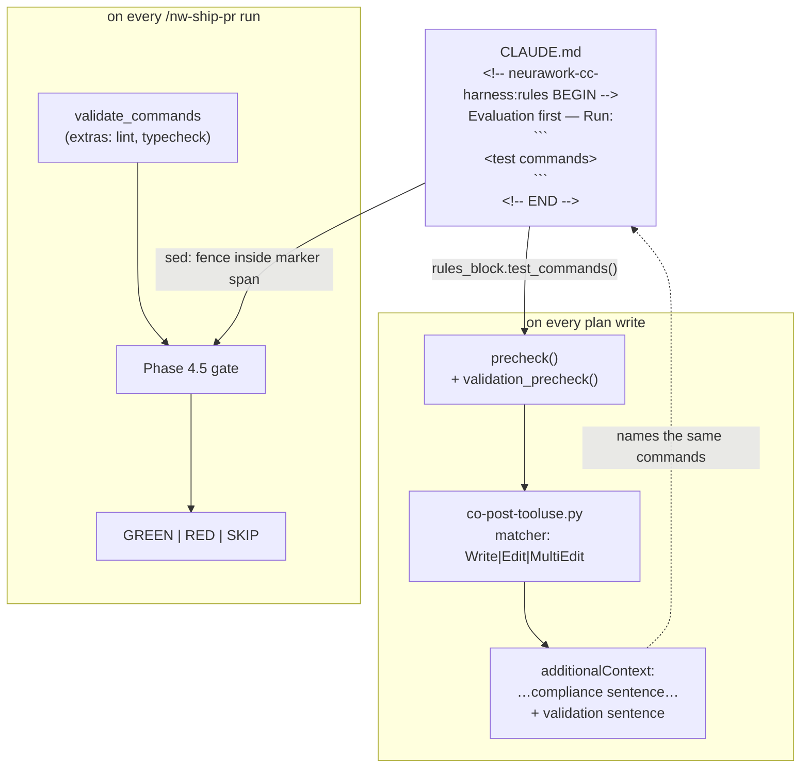

# A plan without a test, and a merge without a test run, both become visible

**Plan ID:** `evaluation-first-gate-coupling`
**Source PRD:** `None`
**PRD Phase:** `None`
**Source Issue:** `None` (backlog cluster B, this session; named as the natural successor in `.claude/PRPs/plans/nw-rules-init-baseline-rules.plan.md` → *Related Plans*)
**Plan Publication:** `None`

## Outcome

**Problem:** The harness already states, deterministically and on every plan write, whether a plan
addresses the compliance constraints it must. It says nothing about whether the plan is testable —
and the merge gate that would catch the consequence is wired to a config key nobody derives from
the repo.

- `compliance-base/scripts/precheck.py:184-198` computes `has_compliance_section` and the missing
  mandatory constraint ids; `compliance-base/hooks/co-post-tooluse.py:80-93` turns that into one
  advisory sentence on `additionalContext`. There is no equivalent signal for `## Validation`. A
  plan whose validation section is empty, or names a gate with no runnable command, or that names
  no test file anywhere, is written and read as complete.
- The evidence that this is not hypothetical: of the 22 plans in `.claude/PRPs/plans/` and
  `plans/completed/`, **all 22** have a `## Validation`-prefixed heading and **all 22** name a
  runnable test command inside it — the convention holds today because a human holds it. Nothing
  reports the first plan that drops it.
- `/nw-ship-pr` Phase 4.5 (`plugins/neurawork-cc-harness/commands/nw-ship-pr.md:280-324`) runs
  `validate_commands` from `.claude/ship-pr.local.md`. That key is hand-transcribed: the file's own
  comment says "The six commands above are this repo's authoritative suites per `CLAUDE.md`", and
  the command file's first-run write (`:412-415`) asks the agent to propose them "when they are
  readable from its `CLAUDE.md`" — a reading no parser performs. The key was empty until
  2026-08-21, and while it was empty the gate reported `SKIP` on every run and PR #32 merged on
  manually-run suites.
- The two facts compound: nothing tells a plan author their plan has no test, and the gate that
  would have run one is configured by a convention that can silently be empty or drift from the
  repo's real command.

**Affected user:** Whoever writes a PRP plan in a repo with the harness installed, and whoever
merges through `/nw-ship-pr` — in this repo, the same person. Both currently rely on remembering.

**User outcome:** Writing a plan that names no test produces the same kind of advisory line the
compliance precheck already produces, naming the repo's own test command. Merging runs that same
command, because the gate reads it from the same place the rule is written, not from a
hand-maintained second copy.

**Invariant:** The commands `/nw-ship-pr` runs at the pre-merge gate are the commands the repo
declares as its test command in the `neurawork-cc-harness:rules` block, plus any extras the repo
explicitly configures. A repo has exactly one place where its test command is authored. No check
added here ever blocks a write or a merge on its own.

**Success signal:** Not measured separately — acceptance covers it. The observable proxy: a plan
written in this repo with an empty `## Validation` section produces an advisory naming the six
`unittest discover` commands, without anyone having typed them into that plan or into
`ship-pr.local.md`.

**Approach:** Make the rules block machine-readable (one fenced code block after `Run:`), add one
pure reader for it, and give both existing mechanisms a new input:
`precheck.py` gains a `validation_precheck` sibling to `capability_precheck`, surfaced through the
existing `PostToolUse` hook's advisory string; Phase 4.5's command list becomes the block's
commands plus `validate_commands`, deduped, falling back to `validate_commands` alone when no
block exists. No new hook, no new config key, no new engine.

## Recommendation

Both halves hang off machinery that already exists and already has the right shape.

- **`precheck.py` already models exactly this.** `capability_precheck()` (`precheck.py:122-157`) is
  a self-contained deterministic sub-check returning a small dict of named signals, nested under
  one key in `precheck()`'s return (`:197`), rendered by one sentence-builder in the hook
  (`co-post-tooluse.py:52-77`) that is folded into `_summary()` in both branches (`:88,93`). A
  validation check is the same object with a different regex. Adding a fourth mechanism would
  duplicate the plan-path matching, the recursion guard, the worktree redirect, and the advisory
  plumbing that `co-post-tooluse.py` already owns.
- **The corpus decides the check's shape, and it contradicts the obvious design.** Scoping "does
  the plan name a test file" to the `## Validation` section fires on **3 of 22** real plans — the
  template deliberately keeps the top-level gate at *directory* granularity
  (`-s compliance-compiler/tests`, `plan-template.md:130-134`) and defers file names to the
  task-level `**Tests**` block (`task-format.md:21-22`). Checked against the whole document it
  fires on 20 of 22, and the two misses are honest ones (a 51-line hotfix with no unit test by
  design; a docs/scaffolding plan whose checks are `test -f` and `grep -q`). So: **section scope
  for the command, document scope for the test file**, and advisory in both cases.
- **The heading must be a prefix match.** 12 plans say `## Validation`, 10 say
  `## Validation Commands`. `^## Validation\b` matches 22/22; `^## Validation$` would report a
  missing section on 45% of the corpus on its first run — the fastest possible way to teach
  everyone to ignore the advisory.
- **Commands must be read only from backticked or fenced spans inside the section.** A bare
  `pytest` substring match misfires on real prose in this very corpus:
  `nw-rules-init-baseline-rules.plan.md:286,341` discusses pytest-vs-unittest *detection in a
  target repo*, not that plan's own gate. Delimiter-scoped extraction is what makes the signal
  mean what it says.
- **The rules block is the single source of the test command, so it must be parseable.**
  `nw-rules-init-baseline-rules.plan.md` decided this explicitly — "No `config.json` key, no
  `.local.md` cache: a second copy of the command is a second thing that can drift" — and its
  Stage 1 already anticipates a repo needing several commands ("this repo needs four `discover -s`
  lines, not one"). But the template renders one inline backtick span
  (`Run: \`<TEST_COMMAND>\``), which cannot carry six commands legibly. One fenced code block
  immediately after `Run:` carries all of them, is stable under `--force` re-render, and is
  extractable by three lines of `sed` in a Bash-only command file and by one small function in
  Python. That template change belongs here, in the plan that consumes it.
- **The gate keeps `validate_commands` as additive extras, not as a second copy.** This repo
  deliberately excludes `uvx ruff check` from the gate (~145 pre-existing findings, a permanent
  false RED — `.claude/ship-pr.local.md`), which is a real distinction the block cannot express: the
  block states the repo's *test* command, the key states everything else that must pass. Disjoint
  roles, no drift. When no block exists — a repo that never ran `/nw-rules-init` — the key alone is
  the input, exactly as today, so nothing regresses for existing installs.

### Evidence

- `compliance-base/scripts/precheck.py:122-157,184-198` — `capability_precheck` and the
  `precheck()` aggregator; the exact function shape and return-key convention a new check mirrors.
- `compliance-base/hooks/co-post-tooluse.py:33,52-77,80-93,98-99,130-145` — `WRITE_TOOLS`, the
  sentence builders, the `_summary` composition, and the `blocking` condition the new check
  deliberately does not join.
- Corpus survey of all 22 plans under `.claude/PRPs/plans/` and `plans/completed/`:
  `^## Validation\b` → 22/22; `^## Validation$` → 12/22; a runnable test command inside the section
  → 22/22; a `test_*.py` path inside the section → 3/22; the same anywhere in the document → 20/22.
- `plugins/neurawork-cc-harness/commands/nw-ship-pr.md:138-147` — the `validate_commands` slice
  extraction; `:287-299` — the gate's input and `SKIP` rule; `:301-309` — the `<wt-root>` anchoring
  rule the new input must not disturb; `:412-415` — the first-run proposal that asks for CLAUDE.md's
  commands without a parser.
- `.claude/ship-pr.local.md` — six hand-transcribed commands and the recorded reason `ruff` is
  excluded; the file states it was "Seeded 2026-08-21" against the backlog item "validate_commands
  is empty, so the pre-merge gate never runs".
- `.claude/PRPs/plans/nw-rules-init-baseline-rules.plan.md` — the block template
  (`Run: \`<TEST_COMMAND>\``), the "no second copy" decision, Stage 1's multi-command handling, and
  *Related Plans*: "the `## Validation`-section precheck in `compliance-compiler` and the
  `nw-ship-pr` validation-gate coupling are the natural successors and consume this block's test
  command."
- `plugins/neurawork-cc-harness/engines/compliance-compiler/tests/test_shards_precheck.py:78-100,171-208,339-390`
  — the temp-catalog fixture pattern, the parameterised catalog helper, and `TestCapabilityAdvisory`,
  which loads the *installed* hook via `importlib` and skips when no self-host exists.
- `plugins/neurawork-cc-harness/tests/test_skill_assets.py:122-180` — where prompt-asset guard
  invariants live, and its docstring's honest limit: "They prove NOTHING about runtime behaviour."

### Alternatives considered

- **A separate `PostToolUse` hook for validation checks:** duplicates `is_plan_path`, the recursion
  guard, the worktree redirect and the advisory plumbing, and doubles the per-write process cost.
  Rejected — the backlog item that started this says "Kein neuer Hook nötig, gleiche Datei
  erweitern."
- **Blocking on a missing test declaration:** `validate_mode: "block"` exists but is reserved for
  unaddressed *mandatory constraints*; the capability check is documented advisory-only for the same
  reason (`co-post-tooluse.py:53-55`). A plan can legitimately have no unit test — two in this
  corpus do. Rejected.
- **Keeping the inline-backtick block and reading several spans from the prose line:** works for one
  or two commands, unreadable for six with `cd … && …` in each, and the sed extraction becomes
  ambiguous the moment a rule sentence contains any other backticked term. Rejected.
- **Retiring `validate_commands` entirely:** loses the repo's deliberate lint exclusion and breaks
  the gate for any repo without a rules block. Rejected.
- **A `test_command` key in `config.json` or `.local.md`:** already decided against in
  `nw-rules-init-baseline-rules.plan.md` → *Not building*, for the drift reason this plan inherits.
- **Deriving the block's commands by parsing `CLAUDE.md`'s prose "Test" section:** that section is
  authored for humans, contains four separate fenced blocks and a paragraph explaining why a single
  top-level `discover` under-collects. Parsing it is guesswork; the marker block exists precisely so
  it does not have to be.

## Visuals

## Implementation Context

### Mandatory reading

| File | Why it matters |
|---|---|
| `compliance-base/scripts/precheck.py:1-40,122-198` | The regex conventions at the top of the file, `capability_precheck`'s exact shape, and `precheck()`'s return contract — the new check mirrors all three. |
| `compliance-base/hooks/co-post-tooluse.py:33,45-49,52-93,96-145` | The full hook path: `WRITE_TOOLS`, plan-path extraction, both sentence builders, `_summary` composition, and the `blocking` condition the new check must not join. |
| `plugins/neurawork-cc-harness/engines/compliance-compiler/tests/test_shards_precheck.py:78-100,171-208,339-390` | The three fixture patterns to reuse: inline temp catalog, module-level parameterised catalog, and the installed-hook `importlib` loader with its `skipTest`. |
| `plugins/neurawork-cc-harness/commands/nw-ship-pr.md:118-160,280-324` | Phase 0.2's config extraction (where the block read joins) and Phase 4.5's whole contract, including the `<wt-root>` anchoring rule and the SKIP semantics that must survive. |
| `.claude/PRPs/plans/nw-rules-init-baseline-rules.plan.md` (Task 2, Stage 1 and Stage 5) | The block template this plan edits, its byte-stability requirement, and the runner-detection stage that produces the commands. |
| `/home/felix/.claude/plugins/cache/prp-marketplace/prp-core/9f6a7c09bae4/skills/prp-plan/templates/plan-template.md:104-135` | The `## Validation` table and the task-level `**Tests**`/`**Validation**` fields — the structure the precheck's regexes target. |

### Existing patterns and primitives

- **Deterministic sub-check + one advisory sentence:** `precheck.capability_precheck` →
  `precheck()["capabilities"]` → `co-post-tooluse._capability_summary` → `_summary`. Four small
  pieces, no state, no config key. The validation check is the same four pieces.
- **Delimiter-scoped extraction:** `precheck.py:_CAP_DECL_RE` matches a labelled body up to the
  next blank line and `_CAP_KEY_RE.fullmatch` accepts only tokens that are *entirely* a key, with
  the documented rationale "so prose that happens to contain a slash … never becomes a phantom
  key". The command extraction uses the same discipline for backticks and fences.
- **Config slice extraction in prose commands:** `nw-ship-pr.md:138-144` reads a YAML list with
  `sed -n '/^key:/,/^[a-z_]*:/p' | grep '^[[:space:]]*- '`. The block read is the same technique
  against a marker span and a fence.
- **Installed-hook test loader:** `test_shards_precheck.py:339-351` walks parents for
  `compliance-base/hooks/co-post-tooluse.py`, asserts `CLAUDE_INVOKED_BY` is unset, and
  `skipTest`s in a pure plugin checkout. Reuse verbatim for the new advisory test.

### Integration points

- `engines/compliance-compiler/payload/scripts/rules_block.py` — new; the only parser of the block
  on the Python side.
- `engines/compliance-compiler/payload/scripts/precheck.py:184-198` — `precheck()` gains a
  `"validation"` key.
- `engines/compliance-compiler/payload/hooks/co-post-tooluse.py:80-93` — `_summary` gains one clause.
- `engines/compliance-compiler/VERSION` — bumped; the check is new installed behaviour.
- `commands/nw-ship-pr.md:118-160` (Phase 0.2 reads the block) and `:280-324` (Phase 4.5 consumes
  the merged list).
- `skills/nw-rules-init/SKILL.md` (created by `nw-rules-init-baseline-rules` Task 2) — the block
  template becomes a fence.
- `.claude/ship-pr.local.md` — its comment is rewritten to say what the key now means.

## Scope

### In scope

- The `neurawork-cc-harness:rules` block renders its test commands in one fenced code block after
  `Run:`, and `/nw-rules-init`'s Stage 1 writes every detected command there.
- `rules_block.py`: a pure reader returning the block's command lines from a repo's `CLAUDE.md`.
- `validation_precheck()` in `precheck.py` and its `"validation"` key in `precheck()`'s return.
- `_validation_summary()` in `co-post-tooluse.py`, folded into both `_summary()` branches, advisory
  only.
- `/nw-ship-pr` Phase 0.2 reads the block; Phase 4.5's input is block commands + `validate_commands`,
  deduped, with the block-absent fallback and the existing SKIP semantics unchanged.
- Unit tests for the reader and the check; an installed-hook advisory test; an asset test for the
  block template's fence and for the gate's documented input.
- `compliance-compiler` `VERSION` bump plus a self-host ADOPT so this repo runs the check.
- Writing the block into this repo's `CLAUDE.md` by running `/neurawork-cc-harness:nw-rules-init`,
  so the gate has a source to read here.
- Rewriting `.claude/ship-pr.local.md`'s comment to state the key's new, narrower meaning.

### Not building

- **`/nw-rules-init` itself** — created by `.claude/PRPs/plans/nw-rules-init-baseline-rules.plan.md`.
  This plan edits one template inside it and depends on it having landed.
- **Blocking on a missing test declaration.** Advisory only, in both mechanisms. No new
  `validate_mode`-style switch.
- **Checking that a named test file exists, or that it is new.** The precheck is a text check; it
  reports what the plan says, never what the tree contains. Claiming otherwise would be the
  untruth this whole cluster exists to remove.
- **Extending the check to PRDs.** `.claude/PRPs/prds/neurawork-cc-harness.prd.md` Phase 7 owns
  PRD-write coverage for the `co-` hook.
- **Retiring `validate_commands`** — see *Recommendation*; it keeps the extras role.
- **Fixing the stale backlog line** claiming `validate_commands` is empty (it was seeded
  2026-08-21). Belongs to whoever grooms `.claude/BACKLOG.md`.
- **Reconciling the duplicate scope/simplicity prose** that writing the rules block will create
  against this repo's hand-written "Working principles" section — see *Risks*.

## Delivery Considerations

| Concern | Decision and owned work |
|---|---|
| Discoverability / adoption | The advisory is the discovery mechanism: it appears on the next plan write with no configuration. For the gate, Task 5 rewrites `.claude/ship-pr.local.md`'s comment so the next reader learns the key changed meaning rather than inferring it. |
| Compatibility / migration | A repo with no rules block sees the gate behave exactly as today (`validate_commands` alone, `SKIP` when empty) and gets one extra advisory sentence telling it the block is missing. No existing config value changes meaning destructively — `validate_commands` entries that duplicate block commands are deduped, not rejected. |
| Rollout / reversibility | Additive. Reverting = deleting `rules_block.py`, the `"validation"` key and its sentence, and restoring Phase 4.5's single input line. The block in `CLAUDE.md` is inert without them. |
| Observability | A `RED` gate names the failing command and the shortest decisive output line, unchanged from today; what changes is that the command came from the block, so the report can say which source produced it. |
| Documentation / communication | The block itself is the documentation. `plugins/neurawork-cc-harness/README.md` is rewritten by `harness-self-description-and-install-reach`; this plan adds no doc surface of its own. |

## Compliance

**Capabilities**: none — this change adds a text check over local Markdown files and a command-list
read in a developer workflow. It stores no data, adds no network path, no authentication or
authorisation surface, no production component, and processes no personal data.

## Implementation

### 1. The rules block carries the repo's test commands in a fenced code block

**Files and integration points**
- `plugins/neurawork-cc-harness/skills/nw-rules-init/SKILL.md` — UPDATE — the verbatim block
  template and Stage 1's rendering rule. (Created by
  `.claude/PRPs/plans/nw-rules-init-baseline-rules.plan.md` Task 2; this plan cannot start before
  that file exists.)

**Implementation**
- The Evaluation-first bullet ends with `Run:` and is followed by one fenced code block containing
  one command per line — no language tag beyond `sh`, no prompt characters, no blank lines inside
  the fence. Everything else in the template stays byte-identical, so `--force` on an unchanged
  repo still produces an empty diff.
- Stage 1 writes **every** detected command, one per line, in the order it detected them. Its
  existing rule stands unchanged: nothing found and the user declines to name one → the bullet
  ships with the generic sentence and **no fence at all**, never an invented command. An absent
  fence is a valid state that both readers must handle.
- The size budget rises from 1,200 to accommodate a realistic multi-command repo; state the new
  number in the skill and in its test, and keep it a hard test rather than a review note. This
  repo's six commands are the worst realistic case to size against.
- State in the skill, in one sentence, that the fence is machine-read by `/nw-ship-pr`'s validation
  gate and by the compliance plan precheck, so a future edit knows what it would break.

**Tests**
- Extend `plugins/neurawork-cc-harness/tests/test_skill_assets.py` (the block-template cases added
  by `nw-rules-init-baseline-rules` Task 2): the template contains exactly one fenced block; that
  fence sits inside the marker span; the rendered template with this repo's six commands is within
  the stated budget; the `Run:` label immediately precedes the fence.

**Validation**
- `cd plugins/neurawork-cc-harness && python3 -m unittest discover -s tests` — green.

### 2. One reader turns the block into a command list

**Files and integration points**
- `plugins/neurawork-cc-harness/engines/compliance-compiler/payload/scripts/rules_block.py` —
  CREATE — pure functions, no SDK import, no I/O beyond one file read.

**Implementation**
- `find_block(text) -> str | None` — the span between
  `<!-- neurawork-cc-harness:rules BEGIN` and `<!-- neurawork-cc-harness:rules END -->`, or `None`.
  Marker recognition matches the `markers.py` regex introduced by
  `nw-rules-init-baseline-rules` Task 1; import it rather than writing a second pattern if that
  module is importable from here, otherwise mirror it and say so in a comment naming the twin.
- `test_commands(claudemd_text) -> list[str]` — the non-empty, non-fence lines of the **first**
  fenced block inside that span, stripped, in order. No block, no fence, or an empty fence → `[]`.
  Never raises.
- `read(repo_root) -> list[str]` — `test_commands((repo_root / "CLAUDE.md").read_text())`, returning
  `[]` on `OSError`. The defensive-read convention the hook path uses throughout.
- Deliberately not exported: any notion of *the* single test command. A repo has a list; collapsing
  it to one is what made the hand-transcribed key necessary.
- Lives in `compliance-compiler`, not `_shared/`, because it has exactly one Python consumer today.
  It moves to `_shared/` when the `st-` gate (`stack-compiler.prd.md` Phase 4) becomes the second.

**Tests**
- `engines/compliance-compiler/tests/test_rules_block.py` (new): a block with a three-line fence
  returns three commands in order; a block whose Evaluation-first bullet has no fence returns `[]`;
  no marker block at all returns `[]`; a fence outside the marker span is ignored; two fences inside
  the span take the first; trailing whitespace and a language tag on the fence are handled; a
  `CLAUDE.md` that does not exist returns `[]` rather than raising.

**Validation**
- `cd plugins/neurawork-cc-harness/engines && python3 -m unittest discover -s compliance-compiler/tests` — new suite green.

### 3. The precheck reports what a plan's validation section does and does not say

**Files and integration points**
- `plugins/neurawork-cc-harness/engines/compliance-compiler/payload/scripts/precheck.py:1-40` —
  UPDATE — three new module-level regexes beside the existing ones.
- `plugins/neurawork-cc-harness/engines/compliance-compiler/payload/scripts/precheck.py:184-198` —
  UPDATE — `precheck()` gains a `"validation"` key and a `repo_root` it can already derive.

**Implementation**
- New regexes, documented in the file's existing comment style:
  - section heading — `^##\s+Validation\b` (prefix, `re.MULTILINE`). Exact-match would report a
    missing section on 10 of this repo's 22 plans, all of which use `## Validation Commands`.
  - section body — from that heading to the next `^## ` or end of document.
  - command spans — inline single-backtick spans and fenced blocks **within the section body only**.
    Extraction is delimiter-scoped for the same reason `_CAP_KEY_RE` uses `fullmatch`: prose in this
    corpus discusses `pytest` without invoking it.
  - test-file paths — `test_[A-Za-z0-9_]+\.py`, `[A-Za-z0-9_]+_test\.py`, and `\.(test|spec)\.[jt]sx?`
    inside backticked spans, searched across the **whole document**, because the plan template puts
    file names in task-level `**Tests**` blocks and keeps the top-level gate at directory
    granularity.
- `validation_precheck(plan_text: str, repo_commands: list[str]) -> dict` returning:
  `section_present`, `commands` (the extracted spans that look runnable), `named_test_files`,
  `repo_commands_total`, `repo_commands_named` (how many of the repo's declared commands the
  section names, matched on the normalised command string). Pure, no I/O, mirroring
  `capability_precheck`'s shape.
- `precheck()` calls it with `rules_block.read(...)` and nests the result under `"validation"`,
  beside `"capabilities"` (`:197`). The repo root is the catalog dir's parent, the same derivation
  `co-post-tooluse.py:101` already performs.
- `repo_commands_named == 0` while `repo_commands_total > 0` is a *signal*, not a verdict: a plan
  may legitimately run a narrower focused command. It is reported as a count, never as an error.

**Tests**
- Extend `engines/compliance-compiler/tests/test_shards_precheck.py` with a `TestValidationPrecheck`
  class following `TestPrecheck`'s fixture style: a `## Validation` table naming two commands and a
  test file yields both; a `## Validation Commands` heading is recognised identically; an absent
  section reports `section_present: False`; a section with prose but no backticked command yields no
  commands; the word `pytest` in prose outside any backticks yields no command (the documented
  false-positive case, cited from `nw-rules-init-baseline-rules.plan.md:286,341`); a test file named
  only in a task-level `**Tests**` block is found; a plan naming a command not in `repo_commands`
  yields `repo_commands_named: 0` without any failure flag.
- One corpus test: run `validation_precheck` over every `*.plan.md` under `.claude/PRPs/plans/`
  (including `completed/`) and assert `section_present` on all of them — the property the survey
  measured, pinned so a future regex tightening cannot silently break the corpus. Skip when the
  directory is absent, matching `test_payload_drift.py`'s pure-plugin-checkout convention.

**Validation**
- `cd plugins/neurawork-cc-harness/engines && python3 -m unittest discover -s compliance-compiler/tests` — green.
- `cd plugins/neurawork-cc-harness/engines && uvx ruff check` — no new findings.

### 4. The advisory says it, on the write, without blocking

**Files and integration points**
- `plugins/neurawork-cc-harness/engines/compliance-compiler/payload/hooks/co-post-tooluse.py:52-93`
  — UPDATE — a `_validation_summary()` sibling to `_capability_summary()`, folded into `_summary()`.
- `plugins/neurawork-cc-harness/engines/compliance-compiler/VERSION` — UPDATE — bumped.
- `compliance-base/` — UPDATE via `install.py` in ADOPT mode, never by hand-copy.

**Implementation**
- `_validation_summary(v: dict) -> str` returns one leading-space-prefixed clause, matching the
  existing concatenation convention (`:88,93`), in this priority order:
  - no `## Validation` section → say so and say what belongs there (a runnable command and the test
    files the change adds).
  - section present, no runnable command in it → say so, and when `repo_commands_total > 0` name the
    repo's commands from the block, truncated the way `_summary` already truncates ids at 15
    (`:91`).
  - section present with commands, no test file named anywhere in the plan → say so; this is the
    weakest signal and must read as a question, not a verdict.
  - otherwise → one short confirming clause, symmetric with the capability path's
    "Plan declares N capability/capabilities".
  - `repo_commands_total == 0` (no rules block in this repo) → a single clause naming
    `/neurawork-cc-harness:nw-rules-init`, mirroring how the capability path names
    `/neurawork-cc-harness:co-capabilities` when its layer is unbuilt (`:57-60`).
- **Do not touch the `blocking` condition** (`:137-141`). Its docstring convention — advisory checks
  never block — is the reason the capability check is safe, and a plan with no unit test is a
  legitimate state twice over in this corpus.
- Bump `VERSION` **before** re-installing: `install.py:_scaffold` stamps it into the target and
  `hooks/version-check.py` compares the two, so a code change without a bump leaves every other
  repo's install silently stale.
- Re-install in ADOPT: `python3 plugins/neurawork-cc-harness/engines/compliance-compiler/install.py`.
  `_copy_code` refreshes `scripts/` and `hooks/`; `_scaffold` leaves `catalog/` and `config.json`
  alone.

**Tests**
- Extend `TestCapabilityAdvisory`'s sibling in `test_shards_precheck.py:339-390` — reuse
  `_installed_hook_path()` and its `skipTest`, and its `CLAUDE_INVOKED_BY` precondition — with cases
  asserting the advisory string for each of the five branches above, and one asserting that a plan
  missing everything still produces `decision` absent from the printed JSON.

**Validation**
- `cd plugins/neurawork-cc-harness/engines && python3 -m unittest discover -s compliance-compiler/tests` — green.
- `diff -r --exclude=__pycache__ --exclude='.ruff_cache' plugins/neurawork-cc-harness/engines/compliance-compiler/payload/scripts compliance-base/scripts` and the same for `payload/hooks` — no output.
- `cat compliance-base/VERSION plugins/neurawork-cc-harness/engines/compliance-compiler/VERSION` — equal.
- Runtime: write a throwaway plan under `.claude/PRPs/plans/` with an empty `## Validation` section,
  read the hook's advisory, delete it. The sentence names this repo's commands; nothing is blocked.

### 5. The pre-merge gate runs the commands the repo declares

**Files and integration points**
- `plugins/neurawork-cc-harness/commands/nw-ship-pr.md:118-160` — UPDATE — Phase 0.2 reads the block.
- `plugins/neurawork-cc-harness/commands/nw-ship-pr.md:280-324` — UPDATE — Phase 4.5's input.
- `plugins/neurawork-cc-harness/commands/nw-ship-pr.md:405-434` — UPDATE — the first-run config
  write and its `validate_commands` proposal rule.
- `.claude/ship-pr.local.md` — UPDATE — comment only; the six entries are reviewed against the new
  meaning.
- `CLAUDE.md` (repo root) — UPDATE — gains the rules block, by running the command.

**Implementation**
- Phase 0.2 gains one read beside the existing `sed` extractions: the fenced lines inside the
  `neurawork-cc-harness:rules` span of `<main-root>/CLAUDE.md`, using the same slice-then-filter
  technique the `validate_commands` extraction already uses (`:138-144`). Absent file, absent block
  or absent fence → an empty list, never a failure — the same rule the config read already follows
  (`:146-147`).
- Phase 4.5's input becomes those commands followed by `validate_commands`, with exact-string
  duplicates dropped, preserving order. Everything else in the phase is untouched: still one Bash
  call per command, still anchored to `<wt-root>` and never to the main root, still `SKIP` on an
  empty merged list, still `RED` on any non-zero exit with no hard stop before Phase 6.
- State the two roles in one sentence where the input is defined: the block is the repo's **test**
  command, `validate_commands` is **everything else** the repo wants green before a merge. That
  sentence is what stops the key from silently becoming a second copy of the block.
- The Phase 5 report line names which source produced the commands that ran, so a `SKIP` is
  diagnosable without opening two files.
- The first-run write's proposal rule (`:412-415`) changes from "propose the repo's commands when
  readable from `CLAUDE.md`" — which no parser did — to: propose an **empty** `validate_commands`
  when a rules block exists (its commands already run), and when none exists, offer to run
  `/neurawork-cc-harness:nw-rules-init` instead of transcribing commands into the key. The existing
  rule stands: propose empty rather than guess.
- Run `/neurawork-cc-harness:nw-rules-init` in this repo and keep the block. Then review
  `.claude/ship-pr.local.md`: entries now covered by the block are removed, and the file's comment
  states that what remains is the extras list and why `uvx ruff check` is not in it.

**Tests**
- Extend `plugins/neurawork-cc-harness/tests/test_skill_assets.py`'s `GuardInvariantTests`, in the
  style of `test_ship_pr_documents_the_config_driven_validation_gate` (`:169-180`) but
  section-scoped like `test_both_worktree_cleanup_phases_carry_their_own_probe` (`:134-153`): the
  Phase 4.5 slice names both input sources and the dedup rule; it still contains `SKIP`; it still
  contains the `<wt-root>` anchoring rule and does **not** anchor the gate to the main root. The
  last assertion is the one whose loss would be silent and expensive — `:301-309` explains why a
  main-root-anchored gate reports GREEN for a PR that breaks the suite.

**Validation**
- `cd plugins/neurawork-cc-harness && python3 -m unittest discover -s tests` — green.
- `grep -n 'rules BEGIN' CLAUDE.md` — one hit, after the command run.
- Runtime: `/nw-ship-pr` on the PR that ships this change. Expect Phase 4.5 to report the commands
  it ran and name the block as their source, and the Phase 5 line to show `GREEN` or a named `RED`.
  This is the only proof that the extraction works in the real command environment; the asset test
  proves only that the prose says so.
- Runtime, fallback: temporarily rename the marker block's BEGIN line in a scratch copy of
  `CLAUDE.md`, re-read Phase 0.2's extraction by hand, and confirm an empty list — then restore.
  Proves the block-absent path without needing a second repo.

## Acceptance

1. **AC1 — A plan with no validation section is reported:** writing a `*.plan.md` under
   `.claude/PRPs/plans/` with no `## Validation` heading produces an advisory clause naming what is
   missing, appended to the existing compliance sentence in the same `additionalContext` string.
2. **AC2 — Both heading spellings are recognised:** `## Validation` and `## Validation Commands`
   both count as present; running the check over all 22 existing plans reports `section_present` for
   every one.
3. **AC3 — Commands are read only from delimited spans:** a plan discussing `pytest` in prose,
   outside backticks and fences, yields no extracted command; a plan naming commands in a fenced
   block or inline backticks inside the section yields exactly those.
4. **AC4 — Nothing blocks:** for every input above, the hook's printed JSON contains no `decision`
   key, and `/nw-ship-pr` reaches its approval gate exactly as before.
5. **AC5 — The block is the gate's source:** with a `neurawork-cc-harness:rules` block present,
   Phase 4.5 runs the block's commands; with `validate_commands` also set, it runs both with exact
   duplicates dropped, in block-then-extras order; with no block, it runs `validate_commands` alone
   and `SKIP`s when that is empty.
6. **AC6 — The gate still tests the branch being shipped:** every command runs anchored to
   `<wt-root>`, never to the main checkout, and the phase still states why.
7. **AC7 — One authoring place:** after this change, this repo's test commands appear in
   `CLAUDE.md`'s rules block, and `.claude/ship-pr.local.md` contains only commands that are not
   tests, with its comment saying so.
8. **AC8 — Existing installs are unaffected until they adopt:** a repo with no rules block sees the
   gate behave as before and gets one advisory clause naming `/neurawork-cc-harness:nw-rules-init`;
   the `compliance-compiler` `VERSION` bump makes the staleness nudge tell it there is something to
   adopt.

## Validation

| Gate | Command or procedure | Proves |
|---|---|---|
| Reader + precheck | `cd plugins/neurawork-cc-harness/engines && python3 -m unittest discover -s compliance-compiler/tests` | AC1, AC2, AC3, AC4 at unit level; the corpus case pins AC2 against real plans |
| Sibling engines | `cd plugins/neurawork-cc-harness/engines && python3 -m unittest discover -s _shared/tests && python3 -m unittest discover -s knowledge-compiler/tests && python3 -m unittest discover -s claudemd-lerner/tests && python3 -m unittest discover -s stack-compiler/tests` | No regression outside `compliance-compiler` |
| Prompt assets | `cd plugins/neurawork-cc-harness && python3 -m unittest discover -s tests` | AC5, AC6 as documented prose; the block template's fence |
| Lint | `cd plugins/neurawork-cc-harness/engines && uvx ruff check` | House style on `rules_block.py` and the two edited modules |
| Payload identity | `diff -r --exclude=__pycache__ --exclude='.ruff_cache' plugins/neurawork-cc-harness/engines/compliance-compiler/payload/scripts compliance-base/scripts` and the same for `payload/hooks` | AC8 — this repo runs the shipped code |
| Runtime — advisory | Write a throwaway plan under `.claude/PRPs/plans/` with an empty `## Validation` section, read the hook's `additionalContext`, delete it | AC1, AC4 end to end through the real hook, which no unit test reaches |
| Runtime — gate | `/nw-ship-pr` on the PR that ships this change | AC5, AC6 — the extraction works in the real command environment |
| Runtime — fallback | Rename the marker BEGIN line in a scratch copy of `CLAUDE.md`, re-run Phase 0.2's extraction by hand, restore | AC8's block-absent path |
| Manual — one authoring place | `grep -n 'rules BEGIN' CLAUDE.md` and read `.claude/ship-pr.local.md` | AC7 |

## Risks and Decisions

| Decision or risk | Recommendation | Evidence / mitigation | Consequence if different |
|---|---|---|---|
| This plan cannot start before `/nw-rules-init` exists | Sequence it after `nw-rules-init-baseline-rules`; Task 1 edits a file that plan creates | That plan's *Related Plans* already names this one as its successor | Starting first means inventing the block format twice |
| The block template change raises the 1,200-char budget that plan set | Raise it, state the new number, keep it a test | Six commands with `cd … && …` exceed the original budget in this repo alone; a budget that the shipping repo violates is not a budget | Keeping 1,200 forces a truncated or single-command block, reintroducing the hand-transcribed key |
| "Names no test file" is the weakest of the three signals | Report it as a question, never a verdict, and never in the blocking path | 2 of 22 plans legitimately name none (a hotfix and a docs plan) | A confident-sounding false alarm on a legitimate plan teaches everyone to ignore every advisory |
| Writing the rules block duplicates this repo's hand-written "Working principles" | Write the block; leave the prose section alone in this plan | The overlap is duplication, not contradiction; `/coding-suite:cl-prune` exists for reconciling CLAUDE.md prose and would make this diff unreviewable | Editing both in one PR mixes a mechanism change with a docs judgement call |
| `rules_block.py` in `compliance-compiler` rather than `_shared/` | Keep it local until a second consumer exists | Root `CLAUDE.md`: "No abstractions for single-use code"; the second consumer is `stack-compiler.prd.md` Phase 4, still `pending` | Putting it in `_shared/` now bumps three engines' `VERSION` for one caller |
| The gate's command list grows silently when both sources are populated | Phase 5 names the source of the commands that ran | The report line is the only place a human sees the merged list | A `SKIP` or a surprise command becomes a two-file investigation |
| `.claude/ship-pr.local.md` is gitignored, so its comment reaches nobody else | Accept; the durable statement lives in `nw-ship-pr.md`'s Phase 4.5 prose and in the first-run write template | `.gitignore`: `.claude/*.local.md` | Tracking the file would commit per-machine config |

## Related Plans

- **Depends on:** `.claude/PRPs/plans/nw-rules-init-baseline-rules.plan.md` — creates the
  `/nw-rules-init` skill, the block, the marker id, and the learner's marker guard. Task 1 here
  edits its block template.
- **Followed by:** None. `.claude/PRPs/plans/harness-self-description-and-install-reach.plan.md`
  is independent but touches the same two files (`nw-ship-pr.md`, `compliance-compiler`'s
  `VERSION`); land either order and rebase.

## Agent Notes

- The corpus numbers in *Recommendation* come from reading all 22 plans, not from sampling. If a
  regex is tightened during implementation, re-run the corpus test in Task 3 before assuming the
  convention still holds — that test exists precisely so the number is not re-derived by hand.
- `precheck()` currently takes `(plan_text, cfg, catalog_dir)`. The new check needs the repo root,
  which is `catalog_dir.parent.parent` in the installed layout and is already computed as
  `repo_root` in the hook at `co-post-tooluse.py:101`. Prefer passing it in over re-deriving it
  inside `precheck()`, and keep the parameter optional so `validate.py`'s existing import
  (`validate.py:37`) and every current test call site keep working unchanged.
- There is no drift test between `compliance-base/scripts/*.py` and the payload — only
  `stack-compiler` has one. The files are byte-identical today because the installer last ran; do
  not assume it. The `diff -r` gate in *Validation* is the check.
- `validate_mode` is `"warn"` in both `config.default.json` and `compliance-base/config.json`, so
  the `block` branch is dormant in this repo. Do not use that as a reason to wire the new check into
  `blocking` "since it would not fire anyway" — a repo that flips the switch would then block on a
  missing unit test.
