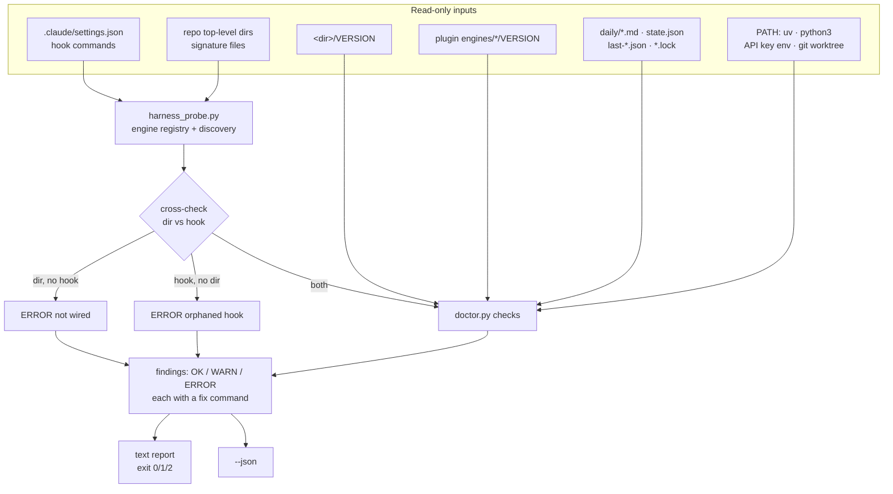

# Harness Doctor — diagnose a repo's harness installs, wiring, and queue health

**Plan ID:** `harness-doctor`
**Source PRD:** `None`
**PRD Phase:** `None`
**Source Issue:** `None`
**Plan Publication:** `None`

## Outcome

**Problem:** A `neurawork-cc-harness` install can be broken in ways nothing reports. The
engines run as detached, fire-and-forget hooks whose stdout goes to `DEVNULL`
(`knowledge-base/hooks/session-start.py:96`, `claudemd-lerner/hooks/cl-session-start.py:66`),
so a compile/update that never completes is invisible. This repo is in exactly that state
right now: `claudemd-lerner/scripts/state.json` does not exist and
`claudemd-lerner/scripts/last-update.json` reads `2026-06-25T18:33:30`, while five daily
logs sit in `claudemd-lerner/daily/` (newest `2026-08-20.md`) — no log has ever been
applied successfully. `cl-update.lock` was rewritten at `2026-08-20 23:32`, which by the
gate's own rule (`lock_fresh`, `cl-session-start.py:58`) suppresses every further spawn
for six hours. The only existing health signal, `plugins/neurawork-cc-harness/hooks/version-check.py`,
covers version drift for three engines and nothing else — not `stack-compiler`, not
missing files, not orphaned hooks, not the queue.

**Affected user:** The repo owner running the harness (and anyone adopting the plugin into
their own repo) who assumes the knowledge base and CLAUDE.md are being kept current.

**User outcome:** One read-only command answers, for the current repo: which engines are
installed and where, whether each is at the shipped version, whether its files and wiring
are intact, and whether its queue is actually draining — each problem paired with the
command that fixes it.

**Invariant:** The doctor only reads. It never writes into the repo, never mutates
`.claude/settings.json`, never removes a lock, and never spawns a compile — and it must
produce a report even when the thing it diagnoses is broken (no venv, no `uv`, unparsable
`settings.json`, missing engine dir).

**Success signal:** Run in this repo today, the doctor reports the `claudemd-lerner` queue
stall (5 pending logs, no successful update since 2026-06-25, a fresh lock with no
completion stamp) and the uncovered `stack-base` install — both of which no current tool
surfaces. Not measured separately beyond that: acceptance is the observable behaviour.

**Approach:** One stdlib-only script, `plugins/neurawork-cc-harness/scripts/doctor.py`, run
from the plugin (where `CLAUDE_PLUGIN_ROOT` and the shipped `VERSION` files live) under
system `python3` with no `uv` and no venv, so it still runs when the environment it checks
is broken. Discovery and the engine registry move into a sibling module,
`plugins/neurawork-cc-harness/scripts/harness_probe.py`, which `version-check.py` then
imports instead of keeping its own copy. A `/nw-doctor` slash command runs it and explains
the result. Findings are `OK` / `WARN` / `ERROR`, each carrying a fix command; the exit
code is the worst severity; `--json` emits the same findings machine-readably.

## Recommendation

The smallest thing that satisfies the invariant is a single read-only script plus the
registry it shares with the existing staleness hook. Reasons:

- **The plugin is the only place that knows the shipped version.** `version-check.py`
  documents this in its own module docstring: the installed copies inside a target repo do
  not have `CLAUDE_PLUGIN_ROOT`, which is why the check cannot live in them. The doctor
  inherits that constraint, so it belongs in the plugin, not in a payload.
- **stdlib-only, system `python3`, no `uv`.** Half the failure modes the doctor exists to
  find (`uv` missing, `.venv` absent, `uv sync` never run) would prevent a `uv run`-based
  doctor from starting at all. `version-check.py` already sets this precedent and
  `engines/_shared/` is stdlib-only by convention (root `CLAUDE.md` → Conventions).
- **Discovery already exists twice, in two different shapes.** `version-check.py:37`
  `installed_dir_for()` reads the install dir back out of the hook command in
  `.claude/settings.json`; `engines/knowledge-compiler/recon.py:44` `_find_existing_kdir()`
  finds an install by probing directories for signature files. The doctor needs *both* —
  their disagreement is itself a finding (dir present but no hook = installed but never
  wired; hook present but no dir = orphaned hook that errors at every session start) —
  so a shared registry replaces the duplicated `ENGINES` map rather than adding a third copy.
- **The queue verdict is already specified in code.** `should_compile()`
  (`engines/knowledge-compiler/payload/scripts/utils.py:145`) and `should_update()`
  (`engines/claudemd-lerner/payload/scripts/utils.py:56`) define exactly when a spawn is
  eligible: new daily content, not in a worktree, no fresh lock, last run at least
  `age_hours` old. The doctor evaluates the same four inputs and reports *which one* is
  currently blocking, instead of inventing a health model.
- **No catalog re-implementation.** `compliance-base/scripts/stack.py:217` `gaps()` already
  computes mandatory-unchosen capabilities and `chosen_from` drift. The doctor checks only
  that the catalog files exist and parse, and points at `stack.py` for the deep answer.

### Evidence

- `plugins/neurawork-cc-harness/hooks/version-check.py:28-32` — the `ENGINES` marker map,
  today covering three engines; `stack-compiler` is absent because it installs no hook.
- `plugins/neurawork-cc-harness/hooks/version-check.py:37,63,71` — `installed_dir_for()`,
  `is_behind()`, `find_stale()`: the discovery and comparison primitives to lift.
- `plugins/neurawork-cc-harness/engines/knowledge-compiler/recon.py:44,56` —
  `_find_existing_kdir()` and `_existing_hooks()`: the directory-signature scan and the
  settings hook probe, both stdlib.
- `plugins/neurawork-cc-harness/engines/knowledge-compiler/payload/scripts/config.py:33,36,37`
  — `STATE_FILE`, `LAST_COMPILE_FILE`, `LOCK_FILE`: the queue state locations.
- `plugins/neurawork-cc-harness/engines/knowledge-compiler/payload/scripts/utils.py:48,145`
  — `file_hash()` (sha256, first 16 hex chars) and `should_compile()`: pending detection
  and the gate contract.
- `plugins/neurawork-cc-harness/engines/claudemd-lerner/payload/scripts/config.py:28,35,36`
  — `STATE_FILE`, `LAST_UPDATE_FILE`, `LOCK_FILE` for the lerner's queue.
- `plugins/neurawork-cc-harness/engines/_shared/gitctx.py:55,60` — `repo_root()` /
  `in_worktree()`: inside a worktree both gates are suppressed by design, so queue lag
  there is expected, not a fault.
- `plugins/neurawork-cc-harness/engines/_shared/tests/test_version_check.py:16-21` — the
  `importlib.util.spec_from_file_location` pattern for testing a non-package script.
- `plugins/neurawork-cc-harness/tests/test_skill_assets.py:1` — the plugin-root suite that
  pins prompt-only assets; the new command's frontmatter test belongs here.
- `plugins/neurawork-cc-harness/hooks/hooks.json` — until 2026-08-21 its events sat at
  the top level instead of under a `hooks` key, so the plugin loader rejected the file
  (`expected record, received undefined` at path `["hooks"]`) and `version-check.py`
  never fired at all. Fixed, with a shape guard in
  `engines/_shared/tests/test_manifest.py::TestHooksJson`. Do not assume the staleness
  nudge has ever run in a user's repo — the doctor is the first health signal that works.
- Live repo state: `claudemd-lerner/scripts/last-update.json` = `1782405210.55`
  (2026-06-25), no `state.json`, 5 files in `claudemd-lerner/daily/`, `cl-update.lock`
  mtime 2026-08-20 23:32 — the queue-stall case the doctor must name.

### Alternatives considered

- **Extend `version-check.py` into the full check and run it at every `SessionStart`:**
  rejected. Queue and integrity checks stat many files and shell out to `git`; paying that
  on every session start, plus the context cost of its `additionalContext`, buys little
  over an on-demand command. `version-check.py` keeps its narrow, quiet job.
- **Ship the doctor as a payload script inside each install dir:** rejected. It could not
  compare against the shipped version (no `CLAUDE_PLUGIN_ROOT`), would need four copies,
  and would be unable to report on an install whose venv is the broken thing.
- **Reuse `recon.py` per engine as the check:** rejected. Recon answers an install-time
  question (FRESH vs ADOPT, seed worth offering) for one engine at a time and emits a
  `RECON_JSON` blob for the install skill; it knows nothing about versions or queues.

## Visuals

## Implementation Context

### Mandatory reading

| File | Why it matters |
|---|---|
| `plugins/neurawork-cc-harness/hooks/version-check.py:1-120` | The whole precedent: plugin-side execution, stdlib-only, never raises, and the three primitives being lifted into the shared registry. |
| `plugins/neurawork-cc-harness/engines/knowledge-compiler/recon.py:44-70` | The directory-signature scan and settings hook probe to generalise across four engines. |
| `plugins/neurawork-cc-harness/engines/knowledge-compiler/payload/scripts/utils.py:145-163` | `should_compile()` — the exact gate the queue verdict must mirror. |
| `plugins/neurawork-cc-harness/engines/knowledge-compiler/payload/hooks/session-start.py:83-105` | How `lock_fresh`, `has_new_daily` and the detached spawn interact; the source of the silent-failure mode. |
| `plugins/neurawork-cc-harness/engines/_shared/tests/test_version_check.py:16-60` | How to load and test a plugin script that is not an importable package. |
| `plugins/neurawork-cc-harness/commands/kc-compile.md` | The command file shape: frontmatter `description` + `argument-hint`, numbered prose steps. |

### Existing patterns and primitives

- **Engine marker map:** `hooks/version-check.py:28` — `{engine: hook-command substring}`.
  The registry extends each entry with the payload signature files, the data dirs, and the
  queue spec (state/stamp/lock filenames + the `*_age_hours` config key).
- **Install-dir extraction:** `hooks/version-check.py:34` `_DIR_RE` matches
  `$CLAUDE_PROJECT_DIR/<dir>` inside a hook command — install dirs are user-chosen, so the
  dir is always read back, never assumed.
- **Version comparison:** `hooks/version-check.py:63` `is_behind()` — integer compare with
  a string-inequality fallback. Reuse as-is; also report *ahead* (installed > shipped),
  which today's nudge silently ignores.
- **Hash-based pending detection:** `payload/scripts/utils.py:48` `file_hash()` —
  `sha256(bytes)[:16]`. The doctor recomputes it to compare against `state.json`'s
  `ingested[<name>].hash`, so an edited-since-compile log counts as pending.
- **Worktree suppression:** `engines/_shared/gitctx.py:60` `in_worktree()` — both
  `SessionStart` gates skip inside a worktree, so the doctor downgrades queue lag to an
  informational note there.
- **Never-raises discipline:** every read in `version-check.py` is wrapped and degrades to
  a safe answer. The doctor holds the same rule per check: one unreadable file yields one
  `ERROR` finding, never a traceback that hides the other twenty checks.

### Integration points

- `plugins/neurawork-cc-harness/hooks/version-check.py:28-88` — drops its local `ENGINES`,
  `installed_dir_for`, `read_version`, `is_behind`, `find_stale` in favour of
  `scripts/harness_probe.py`; its `SessionStart` output must not change.
- `plugins/neurawork-cc-harness/commands/` — gains `nw-doctor.md` alongside the five
  existing commands.
- `plugins/neurawork-cc-harness/tests/` — plugin-root suite, already discovered by the
  documented `python3 -m unittest discover -s tests`; the new tests land here, so no new
  discovery path enters `CLAUDE.md`.
- Root `CLAUDE.md` and `plugins/CLAUDE.md` — the command list and plugin-surface
  description; `README.md` and `docs/INSTALL.md` — user-facing troubleshooting entry point.

## Scope

### In scope

- Discovery of all four engines (`knowledge-compiler`, `claudemd-lerner`,
  `compliance-compiler`, `stack-compiler`) in the current repo, by hook marker *and* by
  directory signature, with the disagreement reported.
- Version drift per install: installed vs shipped, including behind, ahead, and unreadable;
  plus drift of the copied `_shared/` against the plugin's `engines/_shared/`.
- Install integrity: expected payload files, data dirs, `config.json` parses, `VERSION`
  present, `.gitignore` present, `.venv` present.
- Hook wiring: `.claude/settings.json` parses; every discovered install's hooks are
  registered at the right events with the right dir; no hook points at a missing dir.
- Queue health per queued engine: pending daily logs (missing or hash-drifted in
  `state.json`), age of the last successful run, lock present/fresh/stale, and the
  "fresh lock but no completion stamp since" stall; which gate input currently blocks.
- Environment: `uv` on `PATH`, `python3` ≥ 3.12, `ANTHROPIC_API_KEY` or
  `CLAUDE_CODE_OAUTH_TOKEN` present, current checkout is a worktree.
- Catalog presence only: each framework in `config.json["frameworks"]` has a parsing
  `catalog/<fw>.json`; `capabilities.json` and `stack.json` exist and parse.
- `/nw-doctor` command, `--json` output, severity exit codes, tests, documentation.

### Not building

- Any repair (`--fix`, lock removal, `uv sync`, installer re-run). Read-only was chosen;
  every finding names the command a human runs instead.
- Machine-wide scanning of other repositories. The request is this repo's install.
- Deep catalog/stack analysis (mandatory gaps, `chosen_from` drift) — owned by
  `compliance-base/scripts/stack.py:217` `gaps()`; the doctor links to it.
- A `SessionStart` doctor run. `version-check.py` keeps that slot.
- Verifying that a compile's *output* is correct (article quality, CLAUDE.md content).

## Delivery Considerations

| Concern | Decision and owned work |
|---|---|
| Discoverability / adoption | Task 4 registers `/nw-doctor` and documents it in root `CLAUDE.md`, `plugins/CLAUDE.md`, `README.md`, and `docs/INSTALL.md` as the first step when the harness "seems quiet". |
| Compatibility | `version-check.py` keeps identical `SessionStart` behaviour after the refactor; `engines/_shared/tests/test_version_check.py` stays green unmodified, which is the compatibility proof. |
| Rollout / reversibility | Additive: two new scripts, one new command, one refactor. Deleting `scripts/` and restoring the inlined helpers in `version-check.py` reverts it. |
| Observability | The doctor *is* the observability surface for the detached spawns; `--json` lets a future automation consume it. |

## Implementation

### 1. Shared engine registry and install discovery

**Files and integration points**
- `plugins/neurawork-cc-harness/scripts/harness_probe.py` — CREATE — plugin-side, stdlib-only
  module owning the engine registry and discovery; sibling to the doctor and importable by
  `hooks/version-check.py`.
- `plugins/neurawork-cc-harness/tests/test_harness_probe.py` — CREATE.

**Implementation**
- Registry entry per engine, keyed by engine name as it appears under `engines/`:
  hook markers by event (`knowledge-compiler`: `hooks/session-start.py` @ SessionStart,
  `hooks/pre-compact.py` @ PreCompact, `hooks/session-end.py` @ SessionEnd;
  `claudemd-lerner`: the three `cl-`-prefixed equivalents; `compliance-compiler`:
  `hooks/co-post-tooluse.py` @ PostToolUse; `stack-compiler`: none), the signature files
  identifying the dir (`scripts/compile.py`, `scripts/update.py`, `scripts/extract.py`,
  `scripts/scope.py` respectively — each paired with a second required file so a partial
  copy is not mistaken for an install), required payload files, required data dirs, and the
  queue spec (`state.json` / stamp file / lock file / age-config key) or `None`.
  Take the marker strings from `hooks/version-check.py:28-32`; take the install-dir shapes
  from the four `engines/*/install.py` `_copy_code`/`_scaffold` functions and from the
  four live installs in this repo.
- `discover(repo_root, settings) -> list[Install]` merging two sources: hook-derived dirs
  via the lifted `installed_dir_for()` (`version-check.py:37`, keep `_DIR_RE`) and a
  top-level directory scan modelled on `recon.py:44` `_find_existing_kdir()`, skipping
  dot-dirs. Each `Install` records engine, dir (or `None`), `found_by`
  (`hook` / `dir` / `both`), and the events whose hooks are missing.
- Keep `read_version()` and `is_behind()` here verbatim from `version-check.py:55,63` so
  the existing nudge's semantics are unchanged, and add `compare(installed, shipped)`
  returning `behind` / `ahead` / `same` / `unknown`.
- Stdlib only; no function raises — unreadable input yields `None`/empty, and the caller
  turns that into a finding.

**Tests**
- A settings fixture with a renamed install dir resolves that dir (the existing
  `test_version_check.py` cases, re-expressed against the registry).
- A temp repo whose `claudemd-lerner/` exists with no hook in settings is discovered
  `found_by == "dir"` with all three events missing.
- A settings hook pointing at a directory that does not exist is discovered
  `found_by == "hook"` with `dir` recorded and no signature files.
- `stack-compiler` (no hook markers at all) is discovered by signature alone.
- A directory holding only one of the two signature files is not reported as an install.

**Validation**
- `python3 -m unittest discover -s tests` from `plugins/neurawork-cc-harness/` — new
  module's tests pass.

### 2. The doctor: checks, findings, report, exit code

**Files and integration points**
- `plugins/neurawork-cc-harness/scripts/doctor.py` — CREATE — the runner: `python3
  scripts/doctor.py [--repo <path>] [--json]`.
- `plugins/neurawork-cc-harness/tests/test_doctor.py` — CREATE.

**Implementation**
- Resolve the repo from `--repo`, else `CLAUDE_PROJECT_DIR`, else `git rev-parse
  --show-toplevel` (the `_shared/recon.py` `git_root_or_none` contract, re-implemented
  locally rather than importing across the engine boundary); print `NOT_A_GIT_REPO` and
  exit 2 when there is none. Resolve the plugin root from `CLAUDE_PLUGIN_ROOT`, else the
  script's grandparent, mirroring `version-check.py:113`.
- A `Finding(severity, engine, check, message, fix)` record; every check appends findings
  and never raises. Checks, in report order:
  1. **environment** — `settings.json` parses (unparsable = ERROR, and every wiring check
     below is then reported as `unknown` rather than skipped silently); `uv` on `PATH`;
     `python3 >= 3.12`; `ANTHROPIC_API_KEY` or `CLAUDE_CODE_OAUTH_TOKEN` set (WARN:
     capture keeps working, compile/update/extract cannot); worktree (note, and it changes
     the queue verdict below).
  2. **discovery** — one line per engine: installed dir + `found_by`. `found_by == "dir"`
     with missing events = ERROR "installed but not wired — hooks never fire", fix:
     re-run the install skill (ADOPT). `found_by == "hook"` with the dir absent or
     signature files missing = ERROR "orphaned hook — fails at every session start", fix:
     re-install or remove the hook. `stack-compiler` found by dir is expected, not a
     finding (it ships no installer — root `CLAUDE.md`).
  3. **version** — installed vs shipped via `compare()`: behind = WARN with the concrete
     `/neurawork-cc-harness:<engine>` re-run; ahead or unreadable = WARN; same = OK. Also
     compare the install's `_shared/*.py` against `engines/_shared/*.py` byte-wise
     (`CLAUDE.md` → `_shared/` is the single source of truth): any differing or missing
     file = WARN "shared helpers drifted".
  4. **integrity** — required payload files and data dirs from the registry;
     `config.json` parses; `VERSION` present; `.gitignore` present; `.venv/` present
     (WARN with `uv sync --directory <dir>` — absent venv means every `uv run` hook pays
     a resolve or fails).
  5. **queue** — for each engine with a queue spec: pending = `daily/*.md` whose name is
     absent from `state.json`'s `ingested` or whose recomputed `file_hash()`
     (`sha256(bytes)[:16]`) differs; age of the stamp file's `ts`; lock present, its mtime,
     and `fresh` per `age_hours * 3600` exactly as `session-start.py:88` computes it.
     Verdicts: no pending = OK. Pending with `lock_fresh` and stamp older than the lock
     mtime = ERROR "a run was spawned at <lock mtime> and never completed; the fresh lock
     blocks the gate until <expiry>", fix: run the compile/update command in the
     foreground to see the real error, then delete the lock. Pending with a stale lock or
     no lock and stamp older than `age_hours` = WARN "the gate is eligible; it will spawn
     at the next session start", fix: run it now. Pending inside a worktree = note
     ("suppressed by design"). A missing `state.json` with daily logs present means every
     log is pending — say so explicitly, since that is this repo's current state.
  6. **catalog** (compliance only) — each framework in `config.json["frameworks"]` has a
     parsing `catalog/<fw>.json`; `capabilities.json` and `stack.json` exist and parse.
     Missing = WARN, fix: `co-extract` / `co-capabilities`; point at
     `uv run --directory compliance-base python scripts/stack.py` for gap detail.
- Text report grouped by engine, one line per finding as
  `<SEVERITY>  <engine>  <check>  <message>` with the fix indented beneath, then a summary
  line. `--json` emits `{"repo":…, "plugin":…, "findings":[…], "worst":…}` from the same
  records. Exit code: 0 all-OK, 1 worst is WARN, 2 worst is ERROR.
- Read-only: the module performs no write, no `mkdir`, no `Popen`, no lock touch.

**Tests**
- A temp repo with a complete, current, drained install → zero findings above OK, exit 0.
- Stamp older than the lock mtime, lock fresh, logs pending → the ERROR stall finding, and
  its message names the lock time; exit 2.
- Pending logs, no lock, stamp older than `age_hours` → WARN, not ERROR.
- Missing `state.json` with three daily logs → all three counted pending.
- A daily log edited after being recorded in `state.json` (hash mismatch) → counted pending.
- Same stall state inside a worktree → note, not ERROR.
- Installed `VERSION` below shipped → WARN naming both versions; equal → OK; a modified
  `_shared/gitctx.py` in the install → the drift WARN.
- Unparsable `.claude/settings.json` → ERROR, and discovery still reports dir-found
  installs (the report is produced, not aborted).
- `--json` output parses and its `worst` matches the exit code.

**Validation**
- `python3 -m unittest discover -s tests` from `plugins/neurawork-cc-harness/`.
- `python3 plugins/neurawork-cc-harness/scripts/doctor.py` from this repo root — exits
  non-zero and reports the `claudemd-lerner` stall and the four discovered installs.

### 3. Point `version-check.py` at the shared registry

**Files and integration points**
- `plugins/neurawork-cc-harness/hooks/version-check.py:28-88` — UPDATE — delete the local
  `ENGINES`, `_DIR_RE`, `installed_dir_for`, `read_version`, `is_behind`; import them from
  `scripts/harness_probe.py` via a `sys.path` insert of the plugin root (the module is not
  an importable package), keeping the whole import inside the existing top-level
  `try/except` discipline.

**Implementation**
- `find_stale()` keeps its signature and output shape; it now iterates the shared registry.
  Behaviour change limited to one thing: `stack-compiler` has no hook marker, so it is
  skipped by the nudge exactly as today — the doctor is where it surfaces.
- If the import fails for any reason, the hook returns silently, preserving the existing
  "a hook crash must never break session start" contract (`version-check.py:12-13,135`).

**Tests**
- `engines/_shared/tests/test_version_check.py` is **not** modified; its passing is the
  proof that the refactor preserved behaviour. Add one case there for an import-failure
  path only if the module-level import structure makes it reachable.

**Validation**
- `python3 -m unittest discover -s _shared/tests` from
  `plugins/neurawork-cc-harness/engines/` — unchanged suite passes.

### 4. `/nw-doctor` command and documentation

**Files and integration points**
- `plugins/neurawork-cc-harness/commands/nw-doctor.md` — CREATE — modelled on
  `commands/kc-compile.md` (frontmatter `description` + `argument-hint`, numbered steps).
- `plugins/neurawork-cc-harness/tests/test_skill_assets.py` — UPDATE — extend the existing
  command-frontmatter assertions to cover the new command.
- `CLAUDE.md`, `plugins/CLAUDE.md`, `README.md`, `docs/INSTALL.md` — UPDATE.

**Implementation**
- The command runs `python3 "${CLAUDE_PLUGIN_ROOT}/scripts/doctor.py"` (system python3, no
  `uv` — say why in the file), then explains the findings in order of severity and offers
  to run the named fix commands. `argument-hint: "[--json]"`.
- Root `CLAUDE.md`: add `/neurawork-cc-harness:nw-doctor` to the slash-command list and the
  raw invocation to the run-commands block. `plugins/CLAUDE.md`: describe `scripts/` as the
  plugin-side, install-free diagnostic surface next to the workflow surfaces.
  `README.md` / `docs/INSTALL.md`: "if the harness seems quiet, run `/nw-doctor` first".
- No `hooks.json` change — the doctor is on-demand only.

**Tests**
- `test_skill_assets.py`: every file in `commands/` has a non-empty frontmatter
  `description`; `nw-doctor.md` invokes `scripts/doctor.py` and does not invoke `uv run`
  (the stdlib-only entry point is the property whose loss is silent).

**Validation**
- `python3 -m unittest discover -s tests` from `plugins/neurawork-cc-harness/`.
- `/nw-doctor` in this repo returns the same findings as the direct script run.

## Acceptance

1. **AC1 — Every install is located and versioned.** In this repo the doctor reports all
   four installs (`knowledge-base`, `claudemd-lerner`, `compliance-base`, `stack-base`)
   with their directory, how each was discovered, and installed-vs-shipped version —
   including `stack-base`, which `version-check.py` cannot see.
2. **AC2 — A stalled queue is named, with the blocking input.** Given pending daily logs, a
   fresh lock, and a completion stamp older than that lock, the doctor emits an ERROR that
   states the pending count, the lock time, when the gate reopens, and the foreground
   command to reproduce the failure. Run today in this repo, that fires for
   `claudemd-lerner` (5 pending logs, no `state.json`, stamp 2026-06-25).
3. **AC3 — Wiring disagreements are errors.** An install dir with no matching hook in
   `.claude/settings.json` reports "installed but not wired"; a hook whose dir is missing
   or incomplete reports "orphaned hook". Both name the re-install command.
4. **AC4 — It runs when the environment is broken.** The doctor executes under system
   `python3` with no `uv`, no `.venv`, and no API key, and with unparsable
   `.claude/settings.json` it still produces a full report instead of aborting.
5. **AC5 — Read-only.** A doctor run leaves the repo byte-identical: no file created or
   modified, no lock touched, no compile spawned.
6. **AC6 — Worktree-aware.** Inside a linked worktree, queue lag is reported as suppressed
   by design, not as a fault.
7. **AC7 — Machine-readable and scriptable.** `--json` emits the same findings; the exit
   code is 0 / 1 / 2 for OK / WARN / ERROR.
8. **AC8 — The existing nudge is unchanged.** `engines/_shared/tests/test_version_check.py`
   passes unmodified after `version-check.py` moves to the shared registry.

## Validation

| Gate | Command or procedure | Proves |
|---|---|---|
| Plugin asset + doctor suite | `cd plugins/neurawork-cc-harness && python3 -m unittest discover -s tests` | AC1–AC3, AC6, AC7, and the command frontmatter |
| Existing nudge suite | `cd plugins/neurawork-cc-harness/engines && python3 -m unittest discover -s _shared/tests` | AC8 |
| Engine suites (regression) | `cd plugins/neurawork-cc-harness/engines && python3 -m unittest discover -s knowledge-compiler/tests && python3 -m unittest discover -s claudemd-lerner/tests && python3 -m unittest discover -s compliance-compiler/tests` | Nothing in the engines regressed |
| Lint | `uvx ruff check` (repo root and `plugins/neurawork-cc-harness/engines/`) | Style gate, `line-length = 100` |
| Runtime, this repo | `python3 plugins/neurawork-cc-harness/scripts/doctor.py; echo "exit=$?"` then `git status --porcelain` | AC1, AC2, AC5 — the known `claudemd-lerner` stall is reported, exit is 2, and the working tree is unchanged |
| Runtime, degraded | `env -u ANTHROPIC_API_KEY -u CLAUDE_CODE_OAUTH_TOKEN PATH=/usr/bin:/bin python3 plugins/neurawork-cc-harness/scripts/doctor.py --json \| python3 -m json.tool` | AC4, AC7 — runs with no `uv` on `PATH` and no key, emits valid JSON |
| Runtime, command | `/nw-doctor` in this repo | Task 4 — the command resolves and reports the same findings |

## Risks and Decisions

| Decision or risk | Recommendation | Evidence / mitigation | Consequence if different |
|---|---|---|---|
| Where the doctor lives (`plugins/.../scripts/`) | New plugin-level `scripts/` dir | Only the plugin has `CLAUDE_PLUGIN_ROOT` and the shipped `VERSION`s (`version-check.py:1-12`); `engines/` is reserved for install engines with a `payload/` | Inside an engine it would be copied into every target repo and could not compare versions |
| Refactoring `version-check.py` at all | Do it — one registry, two consumers | Its `ENGINES` map already lags reality (no `stack-compiler`); a second copy guarantees the next drift | Leaving two copies means a new engine gets registered in one and missed in the other |
| Byte-comparing the copied `_shared/` | Report as WARN, not ERROR | `CLAUDE.md` declares `engines/_shared/` the single source of truth and every install refreshes it; a local edit is a real but non-fatal divergence | As ERROR, a legitimately pinned older install would fail the doctor |
| Detecting `stack-base` without any hook | Signature-file scan only | `stack-compiler` ships no installer by design (root `CLAUDE.md`); `recon.py:44` sets the scan precedent | Without it the only hand-installed engine stays invisible — the gap that motivated AC1 |
| The live `claudemd-lerner` stall | Out of scope here; the doctor reports it, a separate fix diagnoses why `update.py` never completes | The plan's job is the diagnostic surface; the stall is its acceptance fixture | Folding a root-cause fix in here would blur the deliverable and delay the tool |

## Agent Notes

- The current repo state is the best end-to-end fixture available: 5 pending lerner logs,
  no `state.json`, a stamp from 2026-06-25, a lock from 2026-08-20 23:32, a healthy
  `knowledge-base` (3 logs, all ingested, compiled 2026-08-20 08:45), a `compliance-base`
  with a full catalog, and a `stack-base` no current tool reports. Verify against it, but
  keep the unit tests on temp repos — the live state will change as soon as the stall is fixed.
- `flush.log` in both installs proves capture works while compile/update does not; do not
  conflate the two — the doctor reports the capture side only through pending counts.
- `plugins/neurawork-cc-harness/hooks/__pycache__` and `engines/*/__pycache__` exist in the
  tree; ignore dot- and `__pycache__` dirs during the signature scan.
