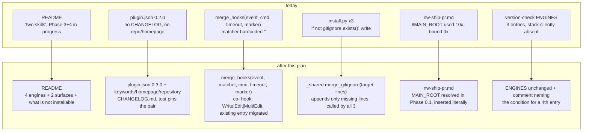

# The plugin describes itself truthfully and every installer change reaches an existing install

**Plan ID:** `harness-self-description-and-install-reach`
**Source PRD:** `None`
**PRD Phase:** `None`
**Source Issue:** `None` (backlog cluster C, this session; individual items also named in `.claude/PRPs/plans/nw-rules-init-baseline-rules.plan.md` → *Agent Notes*)
**Plan Publication:** `None`

## Outcome

**Problem:** Seven independent defects share one shape — the harness ships a statement about
itself that is not true, or a mechanism that silently stops short of an existing install.

- `plugins/neurawork-cc-harness/README.md:3-4` still announces **"two independently installable
  skills"** and its Status block (`:20-24`) marks Phase 3 (`claudemd-lerner`) and Phase 4
  (docs/marketplace/self-host) as *In progress*. Both shipped —
  `.claude/PRPs/prds/neurawork-cc-harness.prd.md:28-31` records `claudemd-lerner` and
  `compliance-compiler` as `shipped`. The README is the plugin's highest-visibility surface and
  the only one still wrong: `plugin.json`'s own `description` and `.claude-plugin/marketplace.json:16`
  already describe three skills plus `/nw-worktree` and `/nw-ship-pr`.
- `plugins/neurawork-cc-harness/engines/stack-compiler/` ships a full `payload/scripts/` (7 modules)
  with **no `install.py` and no `recon.py`**, no `skills/stack-compiler/SKILL.md`, and no slash
  command. Nobody who installs the plugin can install it. `hooks/version-check.py:28-32` cannot
  ever flag `stack-base/` as stale for two compounding reasons: `ENGINES` has no
  `"stack-compiler"` key, and `installed_dir_for()` (`:37-52`) locates an install by grepping the
  engine's **hook command** in `.claude/settings.json` — an engine that registers no hook has no
  marker to find.
- `plugins/neurawork-cc-harness/.claude-plugin/plugin.json:3` is `"version": "0.2.0"`, set in
  commit `a2b03bd`. Six functional commits have landed in `plugins/` since
  (`8ba1c6d`, `aa08fa5`, `58c6b84`, `53f2390`, `3d62184`, `95f10ab`, `a7c97fd`), including the
  `hooks.json` shape fix that made the staleness nudge fire at all. There is no `CHANGELOG.md`
  anywhere in the repo, so "which release contains the hooks.json fix" is answerable only from
  `git log`. The manifest also carries no `keywords`, `homepage`, or `repository`.
- All three installers write their `.gitignore` as **create-if-absent**, never merge —
  `engines/knowledge-compiler/install.py:94-96`, `engines/claudemd-lerner/install.py:88-90`,
  `engines/compliance-compiler/install.py:105-107`, three byte-identical copies of
  `if not gitignore.exists(): gitignore.write_text(GITIGNORE, …)`. A rule added to a `GITIGNORE`
  constant in a later release therefore reaches **only fresh installs**. `catalog/.shards/` is the
  live example: an ADOPT of a `compliance-base/` that predates it leaves the shard files tracked.
- `_shared/settings.py:107-112` hardcodes `matcher: ""` and `merge_hooks(repo_root, hooks)`
  (`:72`) takes a 4-tuple `(event, command, timeout, marker)` with **no matcher field at all**.
  The consequence is concrete: `compliance-base`'s `PostToolUse` hook is registered with an empty
  matcher (`.claude/settings.json:54-63`), so **every** tool call in every session spawns a
  `uv run` subprocess that reads stdin, checks `tool_name not in {"Write","Edit","MultiEdit"}`
  (`compliance-base/hooks/co-post-tooluse.py:98-99`) and exits. The filter is correct; it just
  runs after the process start it exists to avoid.
- `plugins/neurawork-cc-harness/commands/nw-ship-pr.md` uses `$MAIN_ROOT` ten times
  (`:301,308,418,431,519,545,548,613-616`) and **binds it nowhere** — `grep 'MAIN_ROOT='` in that
  file returns nothing. The lowercase placeholder `<main-root>` *is* derived (Phase 0.1, `:77`);
  the uppercase shell variable it turns into after Phase 6.5 is not. Shell state does not survive
  between Bash calls, so the effect is a failed command (`cat > "/.claude/ship-pr.local.md"`), not
  data loss — but the first-run config write and the whole 8.4 branch-cleanup block sit on it.

**Affected user:** Anyone installing or upgrading `neurawork-cc-harness` from the marketplace —
they read the README to decide, read the manifest to know what they have, and rely on ADOPT to
carry a fix into a repo they already set up. Also this repo, which self-hosts all four engines and
pays the per-tool-call hook cost in every session.

**User outcome:** The README, the manifest, and the version-check map describe what the plugin
actually is, including what is deliberately not installable yet. Re-running an installer
propagates newly shipped ignore rules and the narrowed hook matcher into an existing install
instead of only into fresh ones. `/nw-ship-pr` resolves `$MAIN_ROOT` before the first phase that
uses it.

**Invariant:** No shipped artifact of the plugin — README, `plugin.json`, `marketplace.json`,
`version-check.py`'s engine map, or command prose — asserts a state that does not exist in the
tree, and every shell variable a command file uses is bound in that same file before its first
use. Re-running an installer in ADOPT mode leaves an existing install with the same hook
registration and the same ignore rules a fresh install would get.

**Success signal:** Not measured separately — every item is directly observable and covered by
acceptance. The one externally visible proxy: after this lands, a reader of the plugin README can
name all four engines, both workflow surfaces, and which of them they can install today, without
opening the PRDs.

**Approach:** Five tasks in dependency order. Three fix mechanisms (`$MAIN_ROOT` binding, a matcher
parameter on `merge_hooks`, a merging `.gitignore` writer lifted into `_shared/`); two then record
the resulting state (manifest `0.3.0` + `CHANGELOG.md` + metadata keys; README rewritten against
the real inventory). No new engine, no installer for `stack-compiler` — that is
`.claude/PRPs/prds/stack-compiler.prd.md` Phase 5, which is `pending` behind a `pending` Phase 4.

## Recommendation

Fix the mechanisms first, then describe the result once. Every item is small, and the two
documentation tasks are only correct if they run last.

- **`.gitignore` merging belongs in `_shared/`, not in a fourth copy.** The identical three-line
  block appears verbatim in three installers, and `engines/_shared/` is already declared "the
  **single source of truth** for shared helpers" by the root `CLAUDE.md`. A
  `merge_gitignore(target, lines)` helper next to `merge_hooks` in `_shared/settings.py` — same
  idempotent-merge contract, same atomic write style — removes three copies and makes the fix
  reach all three engines at once. Appending only the missing lines (rather than rewriting) is
  what keeps a user's own additions intact; that property is the reason this cannot be a
  `write_text`.
- **`merge_hooks` grows a matcher field rather than a second function.** It already owns
  group selection (`settings.py:107-112`) and already migrates a drifted command in place
  (`:99-104`). A matcher is the same kind of change: widen the tuple to
  `(event, matcher, command, timeout, marker)`, select the group by the requested matcher, and
  extend the existing migration branch so a hook found under the wrong matcher is **moved**, not
  duplicated. All three engines call it, so the tuple change is a compile-time-visible edit at
  three call sites — which is the point: a silent default would leave the two `SessionStart`
  hooks' empty matcher unexamined.
- **`$MAIN_ROOT` is resolved in the Ground rules, where `is_main_checkout` already lives.** That
  section (`nw-ship-pr.md:18-44`) is the file's one established "defined once, used everywhere"
  home, and it already documents the workaround for exactly this problem: "Because ground-rule
  prose is not sourced into each Bash subshell, the affected blocks … inline the raw test
  themselves." `$MAIN_ROOT` gets the same treatment — resolved once in Phase 0.1 next to
  `<main-root>`, and every later use states that the path is inserted **literally**, matching how
  `<wt-root>` is already handled at `:301`.
- **`stack-compiler` gets honesty, not an installer.** `.claude/PRPs/prds/stack-compiler.prd.md`
  Phase 5 ("Wire & document": `install.py`/`recon.py`/payload/tests, `/st-init`, `/st-scope`,
  `/st-select`, `/st-validate`, self-host, docs) is `pending` and `Depends: 3, 4` — Phase 4 (the
  `st-` gate) is itself `pending`. Building it here would pull a PRD phase forward past its
  dependency and turn a cleanup plan into feature work. What is actually broken is that nothing
  *says* so: `test_payload_drift.py:1-11` already explains the situation in a docstring no user
  reads. Lift that sentence into the README and leave `ENGINES` at three entries with a comment
  naming the condition for a fourth.
- **A CHANGELOG is the cheap half of "enforce a version bump".** The optional guard from the
  backlog item — fail when `plugins/` changed without a version bump — needs a git diff against a
  base ref, which is unavailable in a shallow clone and wrong on a merge commit. A test that
  asserts `CHANGELOG.md` contains a section for `plugin.json`'s current version gives the same
  discipline (you cannot bump without writing the entry, and an entry-less release fails) with no
  git dependency. Recorded as a decision, not silently dropped.

### Evidence

- `plugins/neurawork-cc-harness/README.md:3-4,20-24` — the "two skills" claim and the stale
  Status block; the file never mentions `compliance-compiler`, `stack-compiler`, `/nw-worktree`,
  or `/nw-ship-pr`.
- `plugins/neurawork-cc-harness/.claude-plugin/plugin.json:1-10` — `"version": "0.2.0"`; keys are
  exactly `name`, `version`, `description`, `author`, `license`. The `description` is already
  accurate, which is why only the README needs rewriting.
- `.claude-plugin/marketplace.json:16` — the marketplace entry already says "Three independently
  installable skills … Plus two install-free workflow surfaces"; it carries no `version` field, so
  nothing there needs to move in lockstep.
- `plugins/neurawork-cc-harness/hooks/version-check.py:28-32,37-52,71-89` — the three-entry
  `ENGINES` map, the settings-command lookup, and `find_stale`'s `if not dirname: continue` guard.
- `plugins/neurawork-cc-harness/engines/stack-compiler/tests/test_payload_drift.py:1-11` — the
  authoritative statement that `stack-compiler` "has no `install.py` yet (it lands in the PRD's
  Phase 5), so the self-host was installed by hand", and that this test is what holds the two
  copies together meanwhile.
- `.claude/PRPs/prds/stack-compiler.prd.md` — Implementation Phases table: Phase 4 `pending`,
  Phase 5 `pending` with `Depends: 3, 4`.
- `plugins/neurawork-cc-harness/engines/_shared/settings.py:72-119` — `merge_hooks`' full body: the
  4-tuple signature, the marker-based migration branch, and the hardcoded `matcher == ""` group
  selection.
- `compliance-base/hooks/co-post-tooluse.py:33,98-99` — `WRITE_TOOLS = {"Write","Edit","MultiEdit"}`
  and the in-process early exit that the matcher will make redundant for non-write tools.
- `.claude/settings.json:54-63` — the materialised `"matcher": ""` PostToolUse entry.
- `engines/knowledge-compiler/install.py:33-46,94-96`, `engines/claudemd-lerner/install.py:37-50,88-90`,
  `engines/compliance-compiler/install.py:51-62,105-107` — the three `GITIGNORE` constants and the
  three identical create-if-absent blocks.
- `plugins/neurawork-cc-harness/commands/nw-ship-pr.md:18-44,77,301,418,431,545,613-616` — the
  Ground rules block, the Phase 0.1 derivation of `<main-root>`, and the unbound `$MAIN_ROOT` uses.
- `.claude/PRPs/plans/completed/plugin-upgrade-nudge-and-version.plan.md` — the plan that
  introduced the manifest `version` and the `SessionStart` staleness nudge; this plan continues its
  contract rather than reinventing it.
- `plugins/neurawork-cc-harness/tests/test_skill_assets.py:1-12,122-180` — the existing home for
  guard invariants over prompt-only assets, and its honest docstring about what such tests cannot
  prove.

### Alternatives considered

- **Build `stack-compiler`'s installer here:** pulls `stack-compiler.prd.md` Phase 5 ahead of its
  `pending` dependency (Phase 4, the `st-` gate), and the PRD's own success signal for Phase 5 —
  "a second repo installs `stack-compiler` from the marketplace and the gate fires there on the
  next PRD write" — is unreachable without that gate. Rejected as scope theft.
- **Delete `stack-compiler`'s payload from the plugin:** honest about today, but Phase 5 would
  recreate it, and the drift test that currently keeps `stack-base/` and the payload identical
  would go with it. Rejected: the payload is not the problem, the silence about it is.
- **A git-diff-based "version bump required" CI guard:** needs a reliable base ref; fails on
  shallow clones and reports falsely on merge commits. Replaced by the CHANGELOG-covers-version
  test, which is deterministic offline.
- **Default `matcher=""` in `merge_hooks` so call sites need no edit:** would leave the two
  `SessionStart` registrations' matcher unreviewed and hide the change. Rejected — three explicit
  call-site edits are the cheapest possible audit.
- **Rewrite `.gitignore` wholesale on ADOPT:** simplest to implement and destroys any rule the
  user added. Rejected against the invariant.
- **Bind `$MAIN_ROOT` at each use site:** eight duplicated `git rev-parse` blocks that can drift
  apart. Rejected; the Ground rules already solved this shape once for `is_main_checkout`.

## Visuals

## Implementation Context

### Mandatory reading

| File | Why it matters |
|---|---|
| `plugins/neurawork-cc-harness/engines/_shared/settings.py:72-119` | `merge_hooks`' exact contract: marker-based lookup, in-place command migration, group selection, atomic write. Both Task 2 and Task 3 extend this file. |
| `plugins/neurawork-cc-harness/engines/compliance-compiler/install.py:160-165,255-260` | The only `PostToolUse` call site and the `_hooks()` tuple shape that changes. |
| `plugins/neurawork-cc-harness/engines/knowledge-compiler/install.py:33-46,60-96` | The canonical `GITIGNORE` constant plus `_copy_code`/`_scaffold` split — where the merging writer plugs in, and which files ADOPT already refreshes. |
| `plugins/neurawork-cc-harness/commands/nw-ship-pr.md:18-44,70-80,415-435,605-620` | Ground rules (where the binding goes), Phase 0.1 (where `<main-root>` is derived), and the two blocks that consume `$MAIN_ROOT` most. |
| `plugins/neurawork-cc-harness/hooks/version-check.py:28-52,71-89` | Why a fourth `ENGINES` entry is inert until an engine registers a hook. |
| `plugins/neurawork-cc-harness/tests/test_skill_assets.py:1-45,122-180` | Where the `$MAIN_ROOT` and manifest invariants go; reuse `frontmatter()` and the section-scoped assertion style. |
| `.claude/PRPs/prds/stack-compiler.prd.md` (Implementation Phases + Phase 5 detail) | The owner of the `stack-compiler` installer; Task 5's README wording must not contradict it. |

### Existing patterns and primitives

- **Idempotent settings merge:** `_shared/settings.py:72-119` — find by marker substring, migrate in
  place if drifted, else append; write `tmp` + `os.replace`. Both new behaviours (matcher, gitignore)
  follow this contract exactly: re-running changes nothing and returns `False`.
- **Section-scoped prose assertion:** `tests/test_skill_assets.py:134-153`
  (`test_both_worktree_cleanup_phases_carry_their_own_probe`) slices the file between two headings
  and asserts inside each slice, explicitly to stop a global count from masking a lost guard. The
  `$MAIN_ROOT` test uses the same technique: assert the binding appears in Phase 0.1's slice and
  that no `$MAIN_ROOT` use precedes it.
- **Engine `VERSION` as the upgrade signal:** `hooks/version-check.py:62-89` compares the stamped
  in-repo `VERSION` against the shipped one. Any change under an engine's `payload/` or `_shared/`
  is invisible to existing installs unless that engine's `VERSION` is bumped — which makes the bump
  part of Tasks 2 and 3, not an afterthought.
- **Self-host refresh via the installer, never by hand-copy:**
  `.claude/PRPs/plans/nw-rules-init-baseline-rules.plan.md` → Task 3 documents the exact ADOPT
  procedure and the `diff -r` proof; reuse it verbatim for all three engines here.

### Integration points

- `engines/_shared/settings.py` — gains `merge_gitignore`; `merge_hooks` gains a matcher field.
- `engines/{knowledge-compiler,claudemd-lerner,compliance-compiler}/install.py` — three `_hooks()`
  tuples widen; three `.gitignore` blocks collapse into one helper call.
- `engines/*/VERSION` (all three) — bumped so `version-check.py` tells existing installs to ADOPT.
- `commands/nw-ship-pr.md:18-44,70-80` — the binding; `:301,308,418,431,519,545,548,613-616` — the
  consumers, which gain the "inserted literally" note where they lack it.
- `.claude-plugin/plugin.json` + a new `CHANGELOG.md` at the plugin root.
- `README.md` at the plugin root.

## Scope

### In scope

- `$MAIN_ROOT` bound once in `nw-ship-pr.md` and stated as literally inserted at every use.
- `merge_hooks` takes a matcher; the `co-` `PostToolUse` hook registers `Write|Edit|MultiEdit`;
  an existing empty-matcher entry is migrated rather than duplicated.
- `.gitignore` merging lifted into `_shared/settings.py` and called by all three installers on both
  FRESH and ADOPT; the three inline blocks deleted.
- `VERSION` bumps for the three engines touched, plus a self-host ADOPT of each so this repo runs
  the shipped code.
- `plugin.json` → `0.3.0` with `keywords`, `homepage`, `repository`; a `CHANGELOG.md` covering
  `0.3.0` and reconstructing `0.2.0` / `0.1.0` from `git log`, flagged as reconstructed.
- `README.md` rewritten against the real inventory, including `stack-compiler`'s deliberate
  not-installable state and the pointer to `stack-compiler.prd.md` Phase 5.
- Tests: the `$MAIN_ROOT` invariant, matcher merge/migration, gitignore merge, manifest+CHANGELOG
  pairing.

### Not building

- **`stack-compiler`'s `install.py` / `recon.py` / `SKILL.md` / slash commands** — owned by
  `.claude/PRPs/prds/stack-compiler.prd.md` Phase 5, which depends on a still-`pending` Phase 4.
  This plan only stops the README from being silent about it.
- **A fourth `ENGINES` entry in `version-check.py`** — inert until `stack-compiler` registers a
  hook (`version-check.py:74-76` skips any engine with no marker in `settings.json`). A comment
  naming that condition is written instead, so the next reader does not re-derive it.
- **A git-diff "version bump required" CI guard** — see *Alternatives*; the CHANGELOG test covers
  the intent deterministically.
- **`docs/INSTALL.md`, `docs/ARCHITECTURE.md`, the root `CLAUDE.md`** — accurate today and edited
  by `nw-rules-init-baseline-rules` Task 4. Only the README is wrong.
- **`$MAIN_ROOT`'s consumers' behaviour** — the binding is added; Phase 6.5's input set is
  `.claude/PRPs/plans/ship-pr-open-item-capture.plan.md`, which explicitly leaves these lines
  untouched ("Not fixing the unresolved `$MAIN_ROOT`"). The two plans are additive on the same file.
- **Narrowing the two `SessionStart` matchers** — `SessionStart` has no tool to match on; the
  matcher field is passed as `""` there deliberately and the call sites say so.
- **Retro-filling `CHANGELOG.md` beyond `0.1.0`** — the manifest had no version before that.

## Delivery Considerations

| Concern | Decision and owned work |
|---|---|
| Discoverability / adoption | Task 5 rewrites the README, the surface a marketplace reader sees first. Task 4's `homepage`/`repository` make the plugin traceable from the manifest alone. |
| Compatibility / migration | The matcher change moves an existing hook entry between matcher groups; Task 2 owns that migration path and its test. The `.gitignore` merge only ever appends, so no existing rule is lost. Both reach existing installs only via ADOPT, which is why all three `VERSION` files are bumped. |
| Rollout / reversibility | Every change is additive or a documented in-place migration. Reverting = restoring the 4-tuple call sites and the three inline gitignore blocks; no data migration, no catalog rebuild. |
| Observability | The `SessionStart` staleness nudge (`hooks/version-check.py`) is the delivery vehicle: after the `VERSION` bumps, every repo with an older install is told to re-run ADOPT. That is why the bumps are in scope rather than optional. |
| Documentation / communication | `CHANGELOG.md` is created by Task 4 and is the durable record; the README is Task 5. |

## Compliance

**Capabilities**: none — this change edits developer-tooling documentation, a plugin manifest, a
changelog, and two local install helpers. It processes no personal data, adds no data store, no
network path, no authentication or authorisation surface, and no production system component.

## Implementation

### 1. `/nw-ship-pr` binds `$MAIN_ROOT` before anything uses it

**Files and integration points**
- `plugins/neurawork-cc-harness/commands/nw-ship-pr.md:18-44` — UPDATE — Ground rules gain the
  resolution rule next to the `is_main_checkout` probe.
- `plugins/neurawork-cc-harness/commands/nw-ship-pr.md:70-80` — UPDATE — Phase 0.1 emits the
  concrete value alongside `<wt-root>` / `<main-root>`.
- `plugins/neurawork-cc-harness/commands/nw-ship-pr.md:301,308,418,431,519,545,548,613-616` —
  UPDATE — each use states the path is inserted literally.

**Implementation**
- Phase 0.1 already runs `git rev-parse --git-common-dir`; make it also record the resolved main
  root, and state — in the same words Phase 4.5 already uses for `<wt-root>` at `:301` — that the
  value is **inserted literally** into every later command, never referenced as a live shell
  variable. Shell state does not survive between Bash calls; this is the same constraint the
  Ground rules already document for `is_main_checkout` (`:41-43`).
- Replace every `$MAIN_ROOT` occurrence with the `<main-root>` placeholder form the rest of the
  file already uses, so one naming convention covers the whole file, and keep the Ground-rules
  entry as the single statement of what it is and how it is obtained.
- Leave Phase 6.5's surrounding logic untouched — `ship-pr-open-item-capture.plan.md` edits that
  block's input set and expects these lines unchanged in shape.
- The 4.5 escape hatch at `:308` ("anchor **that** command to `$MAIN_ROOT`") keeps its meaning and
  gains the literal-insertion note; it is the one place a command is deliberately anchored off the
  branch.

**Tests**
- Extend `plugins/neurawork-cc-harness/tests/test_skill_assets.py` with a guard test in
  `GuardInvariantTests`: the file resolves the main root exactly once, inside the Phase 0 slice,
  and no use of the main-root placeholder appears before that resolution. Mirror the section-slicing
  technique of `test_both_worktree_cleanup_phases_carry_their_own_probe` (`:134-153`) rather than a
  global count — a global count is exactly what let ten unbound uses survive.

**Validation**
- `cd plugins/neurawork-cc-harness && python3 -m unittest discover -s tests` — new case green,
  existing 9 green.
- `grep -n 'MAIN_ROOT' plugins/neurawork-cc-harness/commands/nw-ship-pr.md` — every hit is either
  the single Ground-rules/Phase-0.1 definition or a literal-insertion placeholder.

### 2. A hook registers under the matcher it needs

**Files and integration points**
- `plugins/neurawork-cc-harness/engines/_shared/settings.py:72-119` — UPDATE — `merge_hooks` takes
  `(event, matcher, command, timeout, marker)`.
- `plugins/neurawork-cc-harness/engines/compliance-compiler/install.py:160-165` — UPDATE —
  `_hooks()` returns `("PostToolUse", "Write|Edit|MultiEdit", …)`.
- `plugins/neurawork-cc-harness/engines/knowledge-compiler/install.py`,
  `plugins/neurawork-cc-harness/engines/claudemd-lerner/install.py` — UPDATE — their `_hooks()`
  tuples pass `""` explicitly, with a one-line comment that `SessionStart` has no tool to match.
- `plugins/neurawork-cc-harness/engines/compliance-compiler/VERSION` and the two others — UPDATE —
  bumped, because `_shared/` is copied into every install.

**Implementation**
- Group selection changes from `g.get("matcher","") == ""` to `== matcher`; the create branch
  appends `{"matcher": matcher, "hooks": [entry]}`.
- Extend the existing migration branch (`:99-104`): today it finds a hook by marker anywhere under
  the event and fixes a drifted **command**. It must now also detect that the hook sits in a group
  whose matcher differs from the requested one and **move** the entry into the correct group,
  removing the now-empty source group. Without this, an existing install keeps its empty-matcher
  entry forever and the narrowing never reaches it — the same class of defect as Task 3.
- A hand-edited matcher is not preserved: the engine owns which tools its hook must see, and a
  silently-kept `""` reproduces the bug. The move is reported through the existing `changed` return
  so the installer's output already surfaces it.
- Leave `compliance-base/hooks/co-post-tooluse.py:98-99`'s `WRITE_TOOLS` check in place. The matcher
  is an optimisation, not a contract: a hook must stay correct if a user edits `settings.json` by
  hand.

**Tests**
- `engines/_shared/tests/` (new cases in the settings suite): a hook merged with a non-empty matcher
  lands in a group with that matcher; re-merging is a no-op returning `False`; an existing entry
  found by marker under `matcher: ""` is moved to the requested matcher with exactly one entry
  remaining across the whole event and the emptied group removed; an unrelated third-party hook in
  the `""` group is untouched by the move.
- `engines/compliance-compiler/tests/test_install_recon.py` — extend the existing hook-shape
  assertions (`:40-104`) so the registered `PostToolUse` group's matcher is `Write|Edit|MultiEdit`,
  and reinstall still yields exactly one entry.

**Validation**
- `cd plugins/neurawork-cc-harness/engines && python3 -m unittest discover -s _shared/tests` — green.
- `cd plugins/neurawork-cc-harness/engines && python3 -m unittest discover -s compliance-compiler/tests` — green.
- After the Task 4 self-host ADOPT: `python3 -c "import json;print([g['matcher'] for g in json.load(open('.claude/settings.json'))['hooks']['PostToolUse']])"` from the repo root — prints
  `['Write|Edit|MultiEdit']`, and the entry count is 1.

### 3. An installer's ignore rules reach an existing install

**Files and integration points**
- `plugins/neurawork-cc-harness/engines/_shared/settings.py` — UPDATE — add
  `merge_gitignore(target: Path, content: str) -> bool`.
- `engines/knowledge-compiler/install.py:94-96`, `engines/claudemd-lerner/install.py:88-90`,
  `engines/compliance-compiler/install.py:105-107` — UPDATE — replace the create-if-absent block
  with the helper call; the three `GITIGNORE` constants stay where they are (each engine owns its
  own rules).

**Implementation**
- `merge_gitignore` splits the shipped constant into lines, reads the existing file (absent → treat
  as empty), and appends only the lines not already present as an exact, stripped match — comments
  and blank lines from the constant are carried along with the first rule that needs them so an
  appended group stays readable. Returns `True` only when something was written.
- Never reorder, never rewrite, never delete: a user's own rules and their ordering survive
  untouched. This is the property that makes the change safe on every existing install.
- Writes atomically (`tmp` + `os.replace`), matching `merge_hooks` (`settings.py:116-118`).
- Called unconditionally from `_scaffold()` in all three installers — the same place the old block
  sat, so FRESH and ADOPT both get it with no new branch.
- Bump each engine's `VERSION` (shared with Task 2, one bump per engine covers both changes).

**Tests**
- `engines/_shared/tests/`: absent file → written verbatim; a file already containing every shipped
  line → no write, returns `False`; a file with a user rule and half the shipped lines → the missing
  lines appended, the user rule present and in its original position, no duplicate; a file whose
  lines differ only by trailing whitespace → matched, not duplicated; two consecutive calls →
  second is a no-op.
- One installer-level case in `engines/compliance-compiler/tests/test_install_recon.py`: a
  pre-existing `compliance-base/.gitignore` missing `catalog/.shards/` gains it on ADOPT — the
  concrete regression this task exists for.

**Validation**
- `cd plugins/neurawork-cc-harness/engines && python3 -m unittest discover -s _shared/tests` — green.
- `cd plugins/neurawork-cc-harness/engines && python3 -m unittest discover -s compliance-compiler/tests`,
  `-s knowledge-compiler/tests`, `-s claudemd-lerner/tests` — green.

### 4. This repo runs the shipped code, and the release says what it contains

**Files and integration points**
- `knowledge-base/`, `claudemd-lerner/`, `compliance-base/` — UPDATE via each engine's `install.py`
  in ADOPT mode, never by hand-copy.
- `plugins/neurawork-cc-harness/.claude-plugin/plugin.json` — UPDATE — `0.3.0` plus `keywords`,
  `homepage`, `repository`.
- `plugins/neurawork-cc-harness/CHANGELOG.md` — CREATE.

**Implementation**
- Run each installer in ADOPT so `_copy_code` refreshes `scripts/`, `AGENTS.md` and the copied
  `_shared/`, and `merge_hooks` performs the matcher migration on this repo's own
  `.claude/settings.json`. Confirm each install dir is byte-identical to its payload afterwards.
- `plugin.json`: `"version": "0.3.0"` — a minor bump, because the matcher narrowing and the
  gitignore merge change installed behaviour without breaking an existing install.
  `"repository": "https://github.com/neurawork-git/howtobuildsoftware2026"` and `"homepage"`
  pointing at the same URL's `docs/INSTALL.md`; `"keywords"` naming what the plugin is searched by
  (`claude-code`, `knowledge-base`, `documentation`, `compliance`, `gdpr`, `soc2`, `iso27001`,
  `prp`). Values are taken from `.claude-plugin/marketplace.json:12` — the URL already recorded in
  the tree, not invented.
- `CHANGELOG.md`: Keep-a-Changelog shape. `0.3.0` lists this plan's five outcomes plus the six
  commits shipped since the last bump (`8ba1c6d`, `aa08fa5`, `58c6b84`, `53f2390`, `3d62184`,
  `95f10ab`). `0.2.0` and `0.1.0` are reconstructed from `git log` and carry an explicit note that
  they were written retroactively — a reconstructed entry presented as contemporaneous is the same
  class of untruth this plan exists to remove.

**Tests**
- `plugins/neurawork-cc-harness/tests/test_skill_assets.py` (or a sibling module if the file grows
  past its topic): `plugin.json` parses, `version` matches a semver pattern, `keywords` is a
  non-empty list of strings, `homepage` and `repository` are absolute URLs, and `CHANGELOG.md`
  contains a heading for exactly the manifest's current version. The last assertion is the
  bump-discipline guard: a release without an entry fails offline, with no git dependency.

**Validation**
- `cd plugins/neurawork-cc-harness && python3 -m unittest discover -s tests` — green.
- `diff -r --exclude=__pycache__ --exclude='.ruff_cache' plugins/neurawork-cc-harness/engines/compliance-compiler/payload/scripts compliance-base/scripts` — no output; same for the other two engines' payload/install pairs.
- `cat compliance-base/VERSION plugins/neurawork-cc-harness/engines/compliance-compiler/VERSION` — equal; same for the other two.
- `cd plugins/neurawork-cc-harness/engines && python3 -m unittest discover -s stack-compiler/tests` — the payload drift guard still passes (nothing in this plan touches `stack-base/`).

### 5. The README describes the plugin that exists

**Files and integration points**
- `plugins/neurawork-cc-harness/README.md` — UPDATE — full rewrite.
- `plugins/neurawork-cc-harness/hooks/version-check.py:28-32` — UPDATE — comment only.

**Implementation**
- Replace "two independently installable skills" with the three that are installable
  (`knowledge-compiler`, `claudemd-lerner`, `compliance-compiler`), each with its install dir and
  hook prefix, matching `.claude/PRPs/prds/neurawork-cc-harness.prd.md:28-31`.
- Add the install-free workflow surfaces: `/nw-worktree` and `/nw-ship-pr`, stating they install
  nothing and have no engine.
- Add `stack-compiler` in its own short section, stated plainly: the engine payload ships, there is
  no installer yet, `stack-base/` in this repo was installed by hand, `tests/test_payload_drift.py`
  is what keeps the two copies identical meanwhile, and the installer is
  `stack-compiler.prd.md` Phase 5. This is the sentence that currently exists only in a test
  docstring.
- Replace the Status block. Phase-numbered progress against a PRD is what went stale; the PRD's own
  phase table is the live record. Link to it and to `docs/INSTALL.md` instead of restating it.
- Refresh the "Shared infrastructure" table — it says helpers are "reused by both skills" and lists
  six modules; verify the module list against `engines/_shared/` before writing, and say *engines*,
  not *both skills*.
- Add the slash-command list (`kc-compile`, `cl-update`, `co-extract`, `co-capabilities`,
  `co-validate`, `nw-ship-pr`) so a reader can see the surface without listing `commands/`.
- In `version-check.py`, add a comment above `ENGINES` recording why there are three entries and not
  four: an engine that registers no hook has no marker for `installed_dir_for()` to find, so
  `stack-compiler` joins this map when Phase 5 gives it a hook — not before.

**Tests**
- None — prose. The one machine-checkable property (the README names every engine directory present
  under `engines/`) is deliberately not tested: it would fail the moment a new engine dir appears,
  which is a normal in-progress state, and a failing test that must be silenced is worse than
  review. Recorded here so the omission is a decision, not an oversight.

**Validation**
- `grep -c 'independently installable skills' plugins/neurawork-cc-harness/README.md` — `0`.
- `grep -n 'compliance-compiler\|stack-compiler\|nw-worktree\|nw-ship-pr' plugins/neurawork-cc-harness/README.md` — a hit for each.
- Manual: read the README top to bottom against `ls plugins/neurawork-cc-harness/{skills,commands,engines,workflows}` and the two PRDs' phase tables; every claim traces to one of them.

## Acceptance

1. **AC1 — `$MAIN_ROOT` is never used unbound:** `nw-ship-pr.md` resolves the main checkout root
   exactly once, in Phase 0 alongside `<wt-root>`, and every later reference is a literal insertion
   of that resolved path. No occurrence precedes the resolution.
2. **AC2 — The compliance hook only wakes for writes:** a fresh install registers its `PostToolUse`
   hook under `matcher: "Write|Edit|MultiEdit"`, and an ADOPT over an install that registered it
   under `matcher: ""` moves that entry — leaving exactly one registration and no orphaned group.
3. **AC3 — Hook merging stays idempotent:** re-running any installer over an up-to-date install
   changes no bytes in `.claude/settings.json` and reports no change.
4. **AC4 — New ignore rules reach old installs:** an ADOPT over an existing install whose
   `.gitignore` lacks a shipped rule appends exactly the missing lines, preserves every pre-existing
   line and its position, and adds no duplicate on a second run.
5. **AC5 — The manifest is complete and dated:** `plugin.json` is `0.3.0`, carries `keywords`,
   `homepage` and `repository`, and `CHANGELOG.md` has a section for that exact version — enforced
   by test, so a future bump without an entry fails.
6. **AC6 — The README is true:** it names three installable skills, both install-free workflow
   surfaces, and `stack-compiler`'s deliberate not-installable state with its PRD phase; it makes no
   claim about phase progress that the PRDs contradict.
7. **AC7 — Existing installs are told to upgrade:** the three touched engines' `VERSION` files are
   bumped and this repo's three install dirs match their payloads byte-for-byte, so
   `hooks/version-check.py` nudges other repos instead of staying silent.
8. **AC8 — `stack-compiler` is untouched:** `stack-base/` and the plugin payload remain
   byte-identical and the drift test passes; no installer, skill, or command was added for it.

## Validation

| Gate | Command or procedure | Proves |
|---|---|---|
| Shared helpers | `python3 -m unittest discover -s _shared/tests` (from `plugins/neurawork-cc-harness/engines/`) | AC2, AC3, AC4 at the unit level |
| Compliance engine | `python3 -m unittest discover -s compliance-compiler/tests` (from `engines/`) | AC2, AC4 at the installer level |
| Other engines | `python3 -m unittest discover -s knowledge-compiler/tests`, `-s claudemd-lerner/tests` (from `engines/`) | The widened `merge_hooks` tuple and the gitignore helper did not break their installs |
| `stack-compiler` drift | `python3 -m unittest discover -s stack-compiler/tests` (from `engines/`) | AC8 |
| Prompt assets | `python3 -m unittest discover -s tests` (from `plugins/neurawork-cc-harness/`) | AC1, AC5 |
| Payload identity | `diff -r --exclude=__pycache__ --exclude='.ruff_cache' <engine>/payload/scripts <installdir>/scripts` for all three engines | AC7 |
| Live settings | `python3 -c "import json;print(json.load(open('.claude/settings.json'))['hooks']['PostToolUse'])"` from the repo root after the ADOPT | AC2 end to end, on this repo's real settings file |
| Manual — README truth | Read the README against `ls plugins/neurawork-cc-harness/{skills,commands,engines,workflows}` and the two PRDs' phase tables | AC6 — prose cannot be unit tested |
| Lint | `uvx ruff check` in `plugins/neurawork-cc-harness/engines/` | Repo style on the two new `_shared/` helpers |

## Risks and Decisions

| Decision or risk | Recommendation | Evidence / mitigation | Consequence if different |
|---|---|---|---|
| Widening the `merge_hooks` tuple touches all three installers | Widen it; pass `""` explicitly for the two `SessionStart` hooks | Three call sites, all in this repo, all covered by tests; a defaulted parameter would hide the two unexamined registrations | A default keeps the diff smaller and leaves the `SessionStart` matchers unreviewed |
| A hand-edited matcher is overwritten on ADOPT | Overwrite it | The engine owns which tools its hook must see; preserving `""` reproduces the exact bug being fixed, and `merge_hooks` already overwrites a drifted command for the same reason (`settings.py:99-104`) | Preserving it means an install that once had `""` never narrows |
| The CHANGELOG test is weaker than a real bump guard | Accept it | It fires offline with no base ref; a git-diff guard is wrong on shallow clones and merge commits | A CI-only guard that cannot run locally, or a flaky one that gets silenced |
| `0.3.0` vs `0.2.1` | `0.3.0` | Installed behaviour changes (hook matcher, ignore-rule propagation) and the six unreleased commits include a new install scaffold — more than a patch | A patch number understates what an ADOPT will change |
| `stack-compiler` stays uninstallable after this plan | Accept and document | `stack-compiler.prd.md` Phase 5 owns it and depends on a `pending` Phase 4 | Building it here pulls a PRD phase past its dependency and turns cleanup into feature work |
| Retroactive `0.2.0` / `0.1.0` CHANGELOG entries could read as contemporaneous | Mark them reconstructed | Same invariant as the rest of the plan: no artifact asserts a state that did not exist | An unmarked reconstruction is a small, avoidable untruth in the file created to stop them |
| `nw-ship-pr.md` is edited by two open plans at once | Land whichever first; the edits are disjoint | `ship-pr-open-item-capture.plan.md` → *Not building*: "Not fixing the unresolved `$MAIN_ROOT` … leave those lines exactly as they are" | A textual conflict in Phase 6.5 that a rebase resolves |

## Related Plans

- **Depends on:** None
- **Followed by:** `.claude/PRPs/plans/ship-pr-open-item-capture.plan.md` — edits the same command
  file (Phase 6.5 input set) and explicitly leaves the `$MAIN_ROOT` lines to this plan.

## Agent Notes

- The six `plugins/`-touching commits since `a2b03bd` are, oldest first: `8ba1c6d`, `aa08fa5`,
  `58c6b84`, `53f2390` (merge), `3d62184`, `95f10ab`, `a7c97fd` (merge). Use the non-merge commits
  for CHANGELOG lines and read each one's message rather than re-deriving intent from the diff.
- `.claude-plugin/marketplace.json` carries **no** `version` field, so nothing there needs to move
  with the manifest bump. Its `description` (`:16`) is already accurate — do not edit it "for
  consistency"; it is the README that lags.
- `engines/_shared/` is copied into every install, so a change there is invisible to an existing
  repo until that engine's `VERSION` is bumped *and* the user re-runs ADOPT. Tasks 2 and 3 both
  land in `_shared/`; one bump per engine covers both.
- `compliance-base/scripts/*.py` and the payload are byte-identical today but nothing enforces it
  (only `stack-compiler` has a drift test). Not this plan's problem to solve, but do not assume the
  installer ran — verify with `diff -r` as Task 4's validation does.
