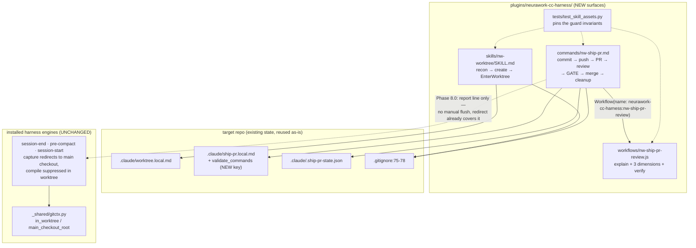

# Port the worktree + ship-pr lifecycle into `neurawork-cc-harness`

**Plan ID:** `harness-worktree-ship-pr-port`
**Source PRD:** None
**PRD Phase:** None
**Source Issue:** None
**Plan Publication:** None

## Outcome

**Problem:** The two workflow surfaces that carry a change from "ready" to "merged" —
`/worktree` (create + enter a Hand worktree) and `/ship-pr` (commit → push → PR → review →
approval gate → merge → cleanup) — live only in the private `coding-suite` plugin
(`/home/felix/.claude/plugins/cache/homeserver-tools/coding-suite/1.13.0`). The publicly
distributed `neurawork-cc-harness` plugin ships three install skills that maintain project
knowledge but has no delivery lifecycle at all. Anyone installing the harness from the
marketplace gets the knowledge half and none of the workflow half, and this repo itself
depends on a plugin it does not distribute.

**Affected user:** Every repo that installs `neurawork-cc-harness` from the
`neurawork-harness` marketplace — including this repo, which self-hosts the harness and
currently borrows `coding-suite` for its own PR lifecycle.

**User outcome:** `/nw-worktree <slug>` and `/nw-ship-pr [pr]` are available from the harness
plugin alone, tuned to the harness's own conventions: they know how the harness's capture
hooks behave inside a worktree, they run the harness's real validation commands as the
pre-merge gate, and they read the same per-repo config files the repo already has.

**Invariant:** A branch never moves and a worktree is never destroyed without the work
inside it being recoverable. Concretely, three properties every acceptable implementation
must preserve:

1. **No merge without explicit approval.** The approval gate is the only path to
   `gh pr merge`, and approval is valid for exactly one run.
2. **No `git checkout` / `git switch` inside a linked worktree.** Every branch-moving
   command is either guarded by an `is_main_checkout` probe or anchored to
   `git -C "$MAIN_ROOT"`. A bare checkout in a worktree detaches HEAD, and the following
   `git branch -d` then eats the branch.
3. **No capture loss on `worktree remove`.** Session capture from inside a worktree lands
   in the main checkout, and the worktree is never removed while the session still sits in it.

**Success signal:** Not measured separately — the acceptance criteria fully capture this.
The observable proxy is that this repo's next feature branch ships end-to-end through
`/nw-ship-pr` without falling back to `coding-suite`.

**Approach:** Port the three `coding-suite` assets into `plugins/neurawork-cc-harness/` as
prompt-only components (no install engine, no payload, no hooks), renamed with an `nw-`
prefix, translated to English, with four harness-specific adaptations: the learning-flush
phase is replaced (the harness already redirects at the hook layer), the pyright type gate
becomes config-driven `validate_commands`, the follow-up sink default probes this repo's
real backlog paths, and the workflow is re-namespaced. Add a structural test suite that
pins the guard invariants, then wire the new surfaces into the manifest and the docs.

## Recommendation

These two surfaces need **no engine**. Every existing harness skill exists to copy a
`payload/` into a target repo and merge hooks into `.claude/settings.json`
(`plugins/CLAUDE.md:19-26`); `/worktree` and `/ship-pr` copy nothing and install nothing —
they are prompt procedures that lazily write one `.claude/*.local.md` config on first run.
Building `install.py` / `recon.py` / `VERSION` shells around them would add three files per
skill, a `version-check.py` entry, and an ADOPT/FRESH code path for a payload that does not
exist. So this plan introduces a second, lighter component category — **workflow skills** —
and documents it, rather than forcing the install shape.

The single most valuable adaptation is a **deletion**. `coding-suite`'s ship-pr Phase 8.0
shells out to `.claude/continuous-learner/learn_session_end.py --manual` because that
engine queues into the *worktree's* own directory, so an in-flight session's work dies with
`git worktree remove`. The harness does not have that problem: all four capture hooks
resolve their output directory through `_shared/gitctx`, mapping the worktree path back onto
the main checkout before writing
(`engines/knowledge-compiler/payload/hooks/session-end.py:30-36`,
`engines/knowledge-compiler/payload/hooks/pre-compact.py:30-32`,
`engines/claudemd-lerner/payload/hooks/cl-session-end.py:30-32`,
`engines/claudemd-lerner/payload/hooks/cl-pre-compact.py:31-32`), and both compile gates
refuse to run inside a worktree at all
(`engines/knowledge-compiler/payload/hooks/session-start.py:106-107`,
`engines/claudemd-lerner/payload/hooks/cl-session-start.py:76-77`). There is no manual flush
entry point in any harness hook — `grep -n "manual\|argv"` across all six payload hooks
returns nothing — and none is needed. Phase 8.0 therefore shrinks from a subprocess call
plus its failure handling to one conditional report line, and the invariant it protected is
carried by machinery that already exists and is already tested.

The remaining adaptations follow the same rule — reuse what the repo already has:

- **Config reuse, not new files.** `.claude/worktree.local.md` already exists in this repo
  with a valid profile (`{repo}-{slug}` / `feature/{slug}` / `free-slug` / `arg-only` /
  `base_ref: main`), and `.gitignore:75-78` already ignores both `.claude/*.local.md` and
  `.claude/.ship-pr-state.json`. The ported skills read and write the same paths and the same
  frontmatter keys, so this repo needs zero recon and zero gitignore edits, and a repo that
  has `coding-suite` installed keeps one shared profile instead of two drifting ones.
- **The validation gate becomes a list, not a language.** The harness is stdlib Python with
  `ruff` and `unittest`; pyright is not in any dev env, so the ported gate would report a
  permanent `SKIP`. A `validate_commands` key in `.claude/ship-pr.local.md` runs whatever the
  repo's `CLAUDE.md` declares authoritative — here the five commands in `CLAUDE.md:19-30` —
  and covers tests, not only types.
- **The workflow ports verbatim except for names and language.** Its pipeline
  (explain → three review dimensions → per-finding adversarial verify → dedupe to a verdict)
  needs no harness-specific change; only `meta.name` and the prompts do.

### Evidence

- `/home/felix/.claude/plugins/cache/homeserver-tools/coding-suite/1.13.0/skills/worktree/SKILL.md:1-284` —
  source skill: universal Hand=sibling rule, `.claude/worktree.local.md` schema, Stage 0/1/2 flow,
  stash-carry step, `EnterWorktree {path}` activation.
- `/home/felix/.claude/plugins/cache/homeserver-tools/coding-suite/1.13.0/commands/ship-pr.md:1-615` —
  source command: Phase 0 (state + resumption guard + config), 1-3 (commit/push/PR), 4 (workflow +
  three-call state marker), 4.5 (type gate), 5 (explanation), 6 (approval gate), 6.5 (follow-up
  capture), 7 (pre-merge checks), 8.0/8.0b/8.1/8.3/8.4 (flush, artifact gate, merge, cleanup), 9 (report).
- `/home/felix/.claude/plugins/cache/homeserver-tools/coding-suite/1.13.0/workflows/ship-pr-review.js:1-147` —
  source workflow: `meta.name: 'ship-pr-review'`, args-as-JSON-string normalisation (lines 17-21),
  `gh pr diff <nr>` as the authoritative checkout-independent diff (line 31), SCOPE rule (lines 38-42),
  `pipeline()` over three dimensions with an inner `parallel()` adversarial verify (lines 103-135),
  return shape `{explanation, findings, blocking_count, total_findings}` (lines 142-147).
- `plugins/neurawork-cc-harness/engines/_shared/gitctx.py:60-100` — `in_worktree()` /
  `main_checkout_root()` / `effective_output_dir()`: the harness's own worktree redirect, the
  primitive that makes ship-pr Phase 8.0 unnecessary.
- `plugins/neurawork-cc-harness/hooks/version-check.py:28-32` — the `ENGINES` map keys off installed
  hook commands; prompt-only skills install no hook and correctly never appear there. No change needed.
- `plugins/neurawork-cc-harness/engines/compliance-compiler/payload/scripts/precheck.py:40-46` —
  `is_plan_path()` matches only `*.plan.md`, so the follow-up capture writing a backlog file never
  triggers the `co-` PostToolUse validator. No interaction to design around.
- `/home/felix/.claude/plugins/cache/homeserver-tools/coding-suite/1.13.0/.claude-plugin/plugin.json` —
  declares no `workflows` key, yet `/ship-pr` resolves `coding-suite:ship-pr-review`: the plugin
  runtime auto-discovers `workflows/*.js` and namespaces by plugin name. The harness needs only the
  directory, not a manifest entry.
- `.claude/worktree.local.md:1-14` and `.gitignore:75-78` — the per-repo profile and both ignore
  lines already exist here.
- `CLAUDE.md:19-30` — the repo's authoritative validation commands (four `unittest discover` runs
  plus `uvx ruff check`), which seed `validate_commands`.

### Alternatives considered

- **Build them as full install engines (`install.py` + `payload/` + `VERSION`).** Loses against
  ownership cost: there is nothing to copy into a target repo. It would also put them under
  `version-check.py`'s staleness nudge, which reads installed hook commands out of
  `.claude/settings.json` (`hooks/version-check.py:28-45`) — these skills install no hook, so the
  nudge could never see them.
- **Depend on `coding-suite` instead of porting.** The harness is MIT and distributed publicly via
  `.claude-plugin/marketplace.json`; `coding-suite` is a private homeserver marketplace. A public
  plugin cannot require a private one.
- **Keep the names `worktree` / `ship-pr`.** Rejected by the user in favour of the `nw-` prefix:
  `coding-suite` is installed at user scope on this machine, so a bare `/worktree` would be
  ambiguous for as long as both are present.
- **Extract the shared prose into one source and generate both plugins' copies** (the
  `test_payload_drift.py` pattern used for `stack-base`). Rejected: the two copies are deliberately
  diverging — different language, different names, different phase 8.0, different gate. Pinning them
  byte-identical would forbid exactly the adaptation this plan exists to make.

## Visuals

Ownership of the delivery lifecycle after the port — what is new, what is reused, and where
the harness-specific adaptation sits:



## Implementation Context

### Mandatory reading

| File | Why it matters |
|---|---|
| `/home/felix/.claude/plugins/cache/homeserver-tools/coding-suite/1.13.0/skills/worktree/SKILL.md:1-284` | The source being ported. Every stage, the config schema, and the "why these rules" section carry hard-won edges — port the reasoning, not just the commands. |
| `/home/felix/.claude/plugins/cache/homeserver-tools/coding-suite/1.13.0/commands/ship-pr.md:1-615` | The source being ported. Phases 0.1, 4, 8.1, 8.3, 8.4 encode failures that already happened (marker-write denial under `.claude/`, `gh pr merge --delete-branch` breaking from a worktree, `worktree remove` refusing on the untracked marker). |
| `/home/felix/.claude/plugins/cache/homeserver-tools/coding-suite/1.13.0/workflows/ship-pr-review.js:1-147` | The workflow being ported. Lines 17-21 (args arrive as a JSON string) and line 31 (`gh pr diff` over local range) are both bug fixes — keep them. |
| `plugins/neurawork-cc-harness/engines/_shared/gitctx.py:1-100` | The primitive that replaces Phase 8.0. Read the detection contract in the module docstring before writing the replacement text. |
| `plugins/neurawork-cc-harness/engines/knowledge-compiler/payload/hooks/session-end.py:28-56` | Proof that capture redirects out of the worktree: `effective_root()` maps `KDIR` onto the main checkout before any write. |
| `plugins/neurawork-cc-harness/commands/kc-compile.md:1-24` | House shape for a harness command file: frontmatter `description` + `argument-hint`, then numbered prose steps. |
| `plugins/neurawork-cc-harness/skills/knowledge-compiler/SKILL.md:1-40` | House shape for a harness `SKILL.md`: frontmatter `name` + one-paragraph trigger-loaded `description`, then phases. |
| `CLAUDE.md:14-40` | The repo's authoritative test/lint commands and the per-directory discovery quirk — the seed values for `validate_commands` and the shape of the new test command. |

### Existing patterns and primitives

- **Worktree detection in bash:** `[ "$(git rev-parse --path-format=absolute --git-dir)" = "$(git rev-parse --path-format=absolute --git-common-dir)" ]` — the `is_main_checkout` probe used inline in ship-pr 8.0/8.3/8.4. Same contract the Python `gitctx.in_worktree()` implements (`engines/_shared/gitctx.py:60-74`). The command stays bash: a plugin command cannot import an engine that may not be installed.
- **Per-repo config as `.claude/<name>.local.md`:** YAML frontmatter read with
  `sed -n '/^---$/,/^---$/{ /^---$/d; p; }'` then `grep` per field
  (`coding-suite/1.13.0/skills/worktree/SKILL.md:113-116`). Covered by the existing
  `.gitignore:78` glob. Both ported surfaces keep this exact technique.
- **Harness command frontmatter:** `description:` + optional `argument-hint:`, no `allowed-tools`
  (`plugins/neurawork-cc-harness/commands/co-validate.md`). Skills additionally carry `name:`.
- **Workflow contract:** `export const meta = {name, description, whenToUse, phases}` as a pure
  literal, then a `phase()` / `agent()` / `pipeline()` / `parallel()` body returning a plain object.

### Integration points

- `plugins/neurawork-cc-harness/.claude-plugin/plugin.json:3` — `version: "0.1.0"`; the description
  enumerates the bundled skills and must name the two new surfaces.
- `.claude-plugin/marketplace.json:15` — the plugin's marketplace description, same enumeration.
- `README.md:48-62` — the slash-command table users read first.
- `docs/ARCHITECTURE.md:24-46` — the plugin source-layout block; gains `workflows/` and the
  workflow-skill category.
- `plugins/CLAUDE.md:9-30` — the layout/conventions guidance for anyone editing the plugin.
- `CLAUDE.md:14-30, 42-56` — repo test commands (a fifth discovery dir) and the architecture summary.

## Scope

### In scope

- `plugins/neurawork-cc-harness/skills/nw-worktree/SKILL.md` — full port of the worktree skill,
  English, harness-adapted.
- `plugins/neurawork-cc-harness/commands/nw-ship-pr.md` — full port of the ship-pr command, English,
  with Phase 8.0 replaced and Phase 4.5 rewritten as a config-driven validation gate.
- `plugins/neurawork-cc-harness/workflows/nw-ship-pr-review.js` — port of the review workflow,
  `meta.name: 'nw-ship-pr-review'`, English prompts.
- `plugins/neurawork-cc-harness/tests/test_skill_assets.py` — structural tests pinning the guard
  invariants and the workflow name resolution.
- Manifest, marketplace, README, `docs/ARCHITECTURE.md`, `plugins/CLAUDE.md`, root `CLAUDE.md` updates.

### Not building

- **No install engine** for either surface — nothing to copy into a target repo (see Recommendation).
- **No `version-check.py` entry** — prompt-only components install no hook, so the staleness nudge
  has nothing to key off (`hooks/version-check.py:28-45`).
- **No compliance gate in `nw-ship-pr`.** Surfacing a `compliance-base/reports/` verdict at the
  approval gate is a plausible harness-specific feature, but it is a new product decision, not part
  of porting an existing one. `is_plan_path()` (`precheck.py:40-46`) confirms the two never collide
  today, so nothing forces the question now.
- **No removal of `coding-suite`'s copies** and no shared-source extraction — the two copies
  deliberately diverge (see Alternatives).
- **No change to the four capture hooks.** They already carry the worktree invariant; the port
  consumes that behavior, it does not extend it.

## Delivery Considerations

| Concern | Decision and owned work |
|---|---|
| Discoverability / adoption | `nw-` prefixed names are typeable without the plugin qualifier and cannot collide with the user-scope `coding-suite` install. README's command table and the skill `description` frontmatter (which drives auto-triggering) both list them — Task 6. |
| Compatibility / migration | Both surfaces read the config paths that already exist in this repo (`.claude/worktree.local.md`, `.gitignore:75-78`), so no migration. `.claude/ship-pr.local.md` does not exist yet and is written on first run; the new `validate_commands` key is additive and ignored by `coding-suite`'s reader, which greps only its own three fields. |
| Rollout / reversibility | Purely additive: new files plus doc edits. Reverting is deleting the three assets and the doc paragraphs; nothing in the installed engines changes, so no installed repo is affected by a rollback. |
| Observability | The failure mode that matters is a *silent* one — a guard removed by a future edit. Task 5's structural tests turn each guard into a failing assertion rather than a comment nobody reads. |
| Documentation / communication | `plugins/CLAUDE.md` gains the workflow-skill category so the next contributor does not "fix" the missing engine; `CLAUDE.md` gains the fifth test-discovery command. |

## Implementation

### 1. `/nw-worktree` creates and enters a Hand worktree from the harness plugin

**Files and integration points**
- `plugins/neurawork-cc-harness/skills/nw-worktree/SKILL.md` — CREATE. Ported from
  `coding-suite/1.13.0/skills/worktree/SKILL.md`.

**Implementation**
- Frontmatter: `name: nw-worktree`; `allowed-tools: Bash, Read, Write, Grep, AskUserQuestion, EnterWorktree`;
  `argument-hint: "[phase number | slug] [optional explicit slug]"`. The `description` keeps the
  source's trigger phrases (both German and English, since triggering is language-sensitive) and adds
  `/nw-worktree`, while dropping the `coding-suite`-specific wording.
- Port Stage 0 (config check), Stage 1 (RECON: detection table, `AskUserQuestion` confirm, write config,
  idempotent `.gitignore` append) and Stage 2 (parse arg → derive slug → expand templates → pull base →
  collision guard → carry pending work → `git worktree add -b` → optional `wslpath -w` → `EnterWorktree {path}`
  → report) with their reasoning intact.
- **Config path stays `<repo-root>/.claude/worktree.local.md`** with the identical frontmatter keys.
  Justification in the file itself: a repo that also has `coding-suite` keeps one profile; this repo's
  existing profile (`.claude/worktree.local.md:1-14`) makes the first `/nw-worktree` run skip RECON entirely.
- **Keep verbatim in substance:** Hand=sibling is fixed and never asked; `git -C "$ROOT"` everywhere
  because the Bash cwd resets between calls; the prohibition on `git checkout` / `git switch` inside a
  worktree, including the instruction to future editors not to add one; the stash-carry step ordered
  after the `.gitignore` write so `stash -u` does not carry the now-ignored config.
- **Harness adaptation — step 10 (learning-systems note).** Replace the `continuous-learner` probe with
  a harness probe: if any of `<root>/*/hooks/session-end.py`, `<root>/*/hooks/cl-session-end.py`, or
  `<root>/*/hooks/co-post-tooluse.py` exists, add one report line stating that harness capture from this
  worktree is redirected into the main checkout by `_shared/gitctx` and both compile gates are suppressed
  here, so no manual step is needed, and that `/nw-ship-pr` never removes a worktree the session is still
  inside. If no harness install is present, omit the line entirely.
- Translate all prose to English, including the two German blocks in the source (the KRITISCH discipline
  section and the `slug_source: prd-grep` worked example). Keep the worked example itself — it is the
  clearest statement of the slug rules — as
  `Phase 10: Layer 4 — Souveränes Hosting` → `layer4-souveraen-hosting`, since it demonstrates the
  umlaut transliteration rule.

**Tests**
- Covered by Task 5 (frontmatter/name agreement, absence of `git checkout`/`git switch` outside the
  prohibition text).

**Validation**
- `python3 -m unittest discover -s tests` from `plugins/neurawork-cc-harness/` — asset tests pass.
- Manual: `/nw-worktree port-smoke` in this repo → no RECON prompt (existing profile), sibling worktree
  at `/home/felix/projects/howtobuildsoftware2026-port-smoke` on branch `feature/port-smoke`, session cwd
  moved into it.

### 2. `/nw-ship-pr` drives the PR lifecycle with a mandatory approval gate

**Files and integration points**
- `plugins/neurawork-cc-harness/commands/nw-ship-pr.md` — CREATE. Ported from
  `coding-suite/1.13.0/commands/ship-pr.md`.

**Implementation**
- Frontmatter: `description:` (one line, English, naming the fixed phase order) and
  `argument-hint: "[PR number]  (empty = PR of the current branch)"`.
- Port the ground rules and Phases 0, 0.1, 0.2, 1, 2, 3, 5, 6, 6.5, 7, 8.0b, 8.1, 8.3, 8.4, 9 with their
  reasoning intact. Specifically preserve, because each encodes an observed failure:
  - **0.1 resumption guard** — the background workflow's completion notification re-invokes the command
    from the top; the guard requires all four conditions (clean status excluding the marker, `AHEAD == 0`,
    an `OPEN` PR, and a witness for this exact HEAD) and treats "first matching marker", not "first
    existing marker", as the witness. Keep the explicit warning that the first three conditions must never
    be weakened to compensate for a missing marker.
  - **Marker writes as separate, literal, single-redirect Bash calls** — never `Write`/`Edit` (denied under
    `.claude/` outside the session cwd) and never a compound command with a computed target (refused
    wholesale in a worktree-isolated session). Keep all three outcomes, including outcome 2's requirement
    to state in the turn-ending message that a review is already running for this SHA.
  - **6.5 follow-up capture before the merge**, anchored with `git -C <wt-root>`, with the branch assertion
    before the commit, plus the de-dup rule and the "why before the merge" paragraph.
  - **7 pre-merge checks** including the `UNKNOWN` re-poll (up to 3×) and the "no checks found" non-block.
  - **8.1 merge without `--delete-branch`**, remote deletion chained with `&&` after a successful merge.
  - **8.3 / 8.4** with the hard `is_main_checkout` guard inline in both, the marker `rm -f` before
    `worktree remove`, and all three `ExitWorktree` outcomes (moved / no-op / hard error) treated as
    non-fatal with fall-back to "later, manually".
  - **8.0b gitignored-artifact gate**, with the exclusion regex updated for the harness: replace the
    `continuous-learner/|knowledge-compiler/` terms with the harness's gitignored output dirs
    (`catalog/\.shards/`, `reports/`, plus the existing generic build/cache terms) and keep
    `\.ship-pr-state`.
- **Harness adaptation — Phase 8.0 (learning flush) is replaced, not ported.** New Phase 8.0 text: run the
  `is_main_checkout` probe; when in a worktree, state in the report that harness capture from this session
  is already redirected into the main checkout by `_shared/gitctx.effective_output_dir()` and both compile
  gates skip inside a worktree, so no flush exists or is needed — the only requirement is the one 8.4
  already enforces, that the worktree is not removed while the session is still inside it. No subprocess,
  no failure handling. Cite the three hook files so a future reader can re-verify the claim.
- **Harness adaptation — Phase 4.5 becomes a config-driven validation gate.** Replace the ~50-line pyright
  block with: read `validate_commands` from `.claude/ship-pr.local.md` (Phase 0.2 gains the key); if absent
  or empty → `SKIP`, no block; otherwise run each command from the main checkout in its own Bash call,
  recording exit status. Any non-zero → gate `RED`, carrying the failing command and the shortest decisive
  output line into Phase 5 and Phase 6, treated exactly as the type gate was (warn at the gate, override
  possible, never a hard exit here). All commands succeeded → `GREEN`. Keep the never-false-block rule:
  a command that cannot be found at all is a skip with its reason, not a failure.
- **Harness adaptation — Phase 4 workflow resolution.** Primary `name: "neurawork-cc-harness:nw-ship-pr-review"`;
  fallback `scriptPath: "${CLAUDE_PLUGIN_ROOT}/workflows/nw-ship-pr-review.js"`. Drop the source's
  middle option (a legacy un-namespaced global copy) — no such copy exists for this plugin. Keep the
  `null`/empty-result handling: one re-run, then an inline mini-review or STOP; never merge unreviewed.
- **Harness adaptation — Phase 6.5 first-run defaults.** The sink proposal probes, in order,
  `.claude/PRPs/feature-backlog.md`, then `.claude/BACKLOG.md` (which this repo has), then falls back to
  `github-issues`. The written config gains `validate_commands`, seeded from the repo's own
  `CLAUDE.md` validation section when one is readable — for this repo, the five commands at `CLAUDE.md:19-30`.
- Keep `.claude/.ship-pr-state.json` as the marker path and `.claude/*.local.md` as the config glob, so
  `.gitignore:75-78` already covers both here. Note in the file that sharing the marker with `coding-suite`
  is safe and intentional: the marker's meaning ("a review was triggered for this SHA") is identical in
  both, so a cross-read prevents a duplicate review rather than causing one.
- Translate all prose to English; keep the phase numbering, including the deliberate gap at 8.2.

**Tests**
- Covered by Task 5: no `--delete-branch`, `is_main_checkout` guard present in both 8.3 and 8.4, the
  workflow name and the `scriptPath` fallback both resolve to the file created in Task 3.

**Validation**
- `python3 -m unittest discover -s tests` from `plugins/neurawork-cc-harness/`.
- Manual: on the port's own feature branch, `/nw-ship-pr` reaches Phase 5 with a populated explanation
  and a `GREEN`/`RED` validation verdict, and stops at the approval gate without merging.

### 3. The review workflow resolves as `neurawork-cc-harness:nw-ship-pr-review`

**Files and integration points**
- `plugins/neurawork-cc-harness/workflows/nw-ship-pr-review.js` — CREATE (new `workflows/` directory).

**Implementation**
- Port `coding-suite/1.13.0/workflows/ship-pr-review.js` with `meta.name: 'nw-ship-pr-review'` and an
  English `description` / `whenToUse` / `phases`.
- Keep unchanged in substance: the args normalisation (the runtime delivers `args` as a JSON **string**,
  so `JSON.parse` with a tolerant fallback — lines 17-21); `gh pr diff <nr>` as the diff source whenever a
  PR number is present, with the local range only as fallback, and the warning `log()` when neither is
  usable; the `git fetch origin <base> --quiet` prefix for a fresh merge-base; the SCOPE rule verbatim in
  meaning (judge only whether the diff meets its stated goal and whether it introduces a new real defect;
  when in doubt, no finding); the three schemas; `pipeline()` over the three dimensions with the inner
  `parallel()` adversarial verify; and the return shape
  `{explanation, findings, blocking_count, total_findings}` that Phase 5 consumes.
- Translate the agent prompts to English. Replace the source's `für den Repo-Owner (Felix)` framing with a
  neutral "for the repository owner" — the plugin ships publicly.
- No manifest entry: the runtime auto-discovers `workflows/*.js` and namespaces by plugin name (evidenced
  by `coding-suite`'s own manifest carrying no `workflows` key while `coding-suite:ship-pr-review` resolves).

**Tests**
- Covered by Task 5: `meta.name` equals the file basename, and the command's two resolution strings both
  match this file.

**Validation**
- `node --check plugins/neurawork-cc-harness/workflows/nw-ship-pr-review.js` — parses.
- Manual: `/nw-ship-pr` Phase 4 launches the workflow under the namespaced name (visible in `/workflows`)
  and returns a non-null `explanation`.

### 4. First-run config writes carry the harness's own validation commands

**Files and integration points**
- `plugins/neurawork-cc-harness/commands/nw-ship-pr.md` — UPDATE (the Phase 0.2 reader and the Phase 6.5
  first-run writer, both authored in Task 2; this task is the contract they must satisfy).

**Implementation**
- Config schema written on first run:
  ```markdown
  ---
  followup_sink: backlog-file | github-issues | none
  backlog_path: .claude/PRPs/feature-backlog.md   # backlog-file only
  worktree_cleanup_default: ask                   # ask | remove | defer
  validate_commands:                              # empty or absent → gate SKIPs
    - uvx ruff check
  ---
  ```
- Phase 0.2 reads `validate_commands` as a YAML list. Parse it with the same frontmatter-slice technique
  plus a `sed -n '/^validate_commands:/,/^[a-z_]*:/p'` list extraction; an unreadable or absent key yields
  an empty list, which means `SKIP` — never a failure.
- The first-run writer proposes the repo's authoritative commands when it can read them from `CLAUDE.md`
  (this repo: the four `unittest discover` runs, executed from
  `plugins/neurawork-cc-harness/engines/`, plus `uvx ruff check`), and asks for confirmation via
  `AskUserQuestion` in the same first-run question that picks the sink. When no source of truth is
  readable, propose an empty list rather than guessing.
- The written file goes into the **main checkout** (`$MAIN_ROOT/.claude/ship-pr.local.md`) so it survives
  `worktree remove`, matching the source's placement.

**Tests**
- Covered by Task 5: the command file documents both the `validate_commands` reader and the writer, and
  the gate's SKIP-on-empty rule.

**Validation**
- Manual: delete `.claude/ship-pr.local.md`, run `/nw-ship-pr` on a throwaway PR, confirm the first-run
  question offers the five repo commands and that the written file round-trips through Phase 0.2 on a
  second run.

### 5. The guard invariants fail a test when removed

**Files and integration points**
- `plugins/neurawork-cc-harness/tests/test_skill_assets.py` — CREATE.
- `plugins/neurawork-cc-harness/tests/__init__.py` — CREATE (empty; makes the dir discoverable).

**Implementation**
- Stdlib `unittest` only, no network, no subprocess beyond `node --check` if available (skip when `node`
  is absent). Resolve the plugin root from `Path(__file__).resolve().parents[1]`.
- Assertions:
  1. Every `skills/*/SKILL.md` has a frontmatter block whose `name:` equals its directory name, and a
     non-empty `description:`.
  2. Every `commands/*.md` has a frontmatter `description:`.
  3. `workflows/nw-ship-pr-review.js` contains `name: 'nw-ship-pr-review'` inside its `meta` literal, and
     the basename matches.
  4. `commands/nw-ship-pr.md` contains both `neurawork-cc-harness:nw-ship-pr-review` and
     `workflows/nw-ship-pr-review.js`, and both resolve to the file that exists.
  5. `commands/nw-ship-pr.md` contains no `--delete-branch` anywhere (the flag that breaks a merge driven
     from a worktree).
  6. The `is_main_checkout` probe string
     `git rev-parse --path-format=absolute --git-dir` appears at least twice in
     `commands/nw-ship-pr.md` (Phases 8.3 and 8.4 each guard independently).
  7. `skills/nw-worktree/SKILL.md` contains no `git checkout ` or `git switch ` occurrence outside the
     paragraph that prohibits them — implemented as: every matching line must also contain a negation
     marker (`NEVER`/`never`), so an added bare checkout fails the test.
- Each assertion carries a failure message naming the invariant it protects, so a future editor reads why
  rather than only what.

**Tests**
- This task *is* the test surface. It proves nothing about runtime behavior — that is what the manual
  validations in Tasks 1-3 are for; the file says so in its module docstring, so nobody mistakes green
  asset tests for a working lifecycle.

**Validation**
- `python3 -m unittest discover -s tests` from `plugins/neurawork-cc-harness/` — all pass.
- Negative check, run once by hand and not committed: delete the `&&` chain guard or add
  `--delete-branch` to `nw-ship-pr.md` and confirm the suite goes red.

### 6. The manifest and docs describe the new surfaces

**Files and integration points**
- `plugins/neurawork-cc-harness/.claude-plugin/plugin.json:3` — UPDATE: `version` `0.1.0` → `0.2.0`
  (additive feature), and extend the `description` to name `/nw-worktree` and `/nw-ship-pr`.
- `.claude-plugin/marketplace.json:15` — UPDATE the plugin description to match.
- `README.md:48-62` — UPDATE: add both to the slash-command table; add a sentence above it distinguishing
  the install skills (which need an install first) from the two workflow surfaces (which do not).
- `docs/ARCHITECTURE.md:24-46` — UPDATE the source-layout block: add `workflows/` and
  `skills/nw-worktree/`, and a short paragraph naming the workflow-skill category and why it has no engine.
- `plugins/CLAUDE.md:9-30` — UPDATE the Layout section with the same distinction, plus a "gotcha" line: a
  workflow skill has no `install.py`, no `payload/`, no `VERSION`, and does not appear in
  `version-check.py`'s `ENGINES` map — that is intended, not an omission.
- `CLAUDE.md:14-30` — UPDATE: add the fifth test command
  (`python3 -m unittest discover -s tests` run from `plugins/neurawork-cc-harness/`, noting it runs from
  the plugin root rather than `engines/`).
- `CLAUDE.md:42-56` — UPDATE the architecture bullet for `plugins/neurawork-cc-harness/` to mention the two
  workflow surfaces and `workflows/`.

**Implementation**
- Keep the house voice: factual, neutral, instructive; ISO dates; no marketing.
- The version bump is the user-visible signal that an installed harness is behind; leave `hooks/version-check.py`
  untouched, since it compares per-engine `VERSION` files and these surfaces have none.

**Tests**
- Task 5 assertion 2 covers the new command's frontmatter. The doc edits carry no test — they are reviewed.

**Validation**
- `python3 -c "import json,pathlib; [json.loads(pathlib.Path(p).read_text()) for p in ['.claude-plugin/marketplace.json','plugins/neurawork-cc-harness/.claude-plugin/plugin.json']]"` —
  both manifests still parse.
- `grep -c "nw-ship-pr\|nw-worktree" README.md docs/ARCHITECTURE.md plugins/CLAUDE.md CLAUDE.md` — each > 0.

## Acceptance

1. **AC1 — Both surfaces run from the harness plugin alone.** With only `neurawork-cc-harness` enabled,
   `/nw-worktree <slug>` creates a sibling worktree on the configured branch pattern and moves the session
   into it, and `/nw-ship-pr` runs commit → push → PR → review → validation gate → explanation and stops at
   the approval gate.
2. **AC2 — No merge without explicit approval.** `gh pr merge` is reachable only through the Phase 6
   `AskUserQuestion` "approve & merge" branch; every other outcome (fix findings, fix validation failures,
   cancel) leaves the PR open. Approval applies to one run only.
3. **AC3 — No branch-moving command runs inside a linked worktree.** `nw-ship-pr.md` contains no
   `--delete-branch`; Phases 8.3 and 8.4 each carry their own `is_main_checkout` probe; the worktree path
   removes the worktree only after the probe confirms the session left it, and falls back to printing the
   manual sequence in all three `ExitWorktree` outcomes.
4. **AC4 — Capture survives worktree removal without a manual flush.** `nw-ship-pr.md` Phase 8.0 performs no
   subprocess call and states the redirect contract with references to the three hook files that implement
   it; the four capture hooks are unmodified by this change.
5. **AC5 — The validation gate is config-driven and never false-blocks.** With `validate_commands` absent
   or empty the gate reports `SKIP` and does not block; with commands present, a non-zero exit yields `RED`
   carried into the approval gate as a warning, not a hard exit; an unavailable command is a skip with a
   named reason.
6. **AC6 — The review workflow resolves under the harness namespace.** Phase 4's primary name is
   `neurawork-cc-harness:nw-ship-pr-review`, the `${CLAUDE_PLUGIN_ROOT}` fallback path exists, and the
   workflow returns `{explanation, findings, blocking_count, total_findings}`.
7. **AC7 — Existing per-repo state is reused, not duplicated.** In this repo `/nw-worktree` performs no
   RECON (the existing `.claude/worktree.local.md` profile is honoured) and neither surface appends to
   `.gitignore`, whose lines 75-78 already cover both paths.
8. **AC8 — The guards are pinned by tests.** `python3 -m unittest discover -s tests` from the plugin root
   passes, and removing any of the three guard properties makes it fail.

## Validation

| Gate | Command or procedure | Proves |
|---|---|---|
| Asset structure | `cd plugins/neurawork-cc-harness && python3 -m unittest discover -s tests` | AC3, AC6, AC8 |
| Engine suites unaffected | From `plugins/neurawork-cc-harness/engines/`: `python3 -m unittest discover -s _shared/tests`, `-s knowledge-compiler/tests`, `-s claudemd-lerner/tests`, `-s compliance-compiler/tests` | AC4 (capture hooks untouched), no regression |
| Lint | `uvx ruff check` from `plugins/neurawork-cc-harness/engines/` | House style on the new test module |
| Workflow parses | `node --check plugins/neurawork-cc-harness/workflows/nw-ship-pr-review.js` | AC6 |
| Manifests parse | `python3 -c "import json,pathlib; [json.loads(pathlib.Path(p).read_text()) for p in ['.claude-plugin/marketplace.json','plugins/neurawork-cc-harness/.claude-plugin/plugin.json']]"` | Task 6 |
| Runtime — worktree | `/nw-worktree port-smoke` in this repo: no RECON prompt; sibling worktree created on `feature/port-smoke`; session cwd inside it; report names the harness redirect. Clean up with `git worktree remove` + `git branch -D`. | AC1, AC7 |
| Runtime — ship | `/nw-ship-pr` on the port's own PR from inside a worktree: reaches Phase 5 with a populated explanation, a `GREEN`/`RED`/`SKIP` validation verdict and any findings, then stops at the approval gate. Approve and observe 8.1 merging without `--delete-branch` and 8.4 refusing to remove the worktree until `ExitWorktree` succeeded. | AC1, AC2, AC3, AC5, AC6 |
| Runtime — first run | Delete `.claude/ship-pr.local.md`, re-run `/nw-ship-pr`, confirm the first-run question proposes the repo's five validation commands and that Phase 0.2 reads them back on the next run. | AC5 |

## Risks and Decisions

| Decision or risk | Recommendation | Evidence / mitigation | Consequence if different |
|---|---|---|---|
| Two copies of ~900 lines of workflow prose will drift from `coding-suite` | Accept the drift; do not extract a shared source | The copies diverge by design (language, names, Phase 8.0, gate). `test_payload_drift.py`-style pinning would forbid the adaptation | A shared source forces both plugins to move together and blocks harness-specific changes |
| Sharing `.claude/.ship-pr-state.json` and `.claude/worktree.local.md` with `coding-suite` | Share them | The marker's meaning is identical in both ("a review ran for this SHA"), so a cross-read prevents a duplicate review; the worktree schema is identical and `coding-suite` greps only its own keys | Separate paths mean a second RECON, two `.gitignore` lines, and two profiles that drift |
| Prompt-only skills have no runtime test coverage | Accept; pin the structural guards and rely on the named manual runs | Prose behavior cannot be unit-tested; Task 5's docstring says so explicitly so green asset tests are not mistaken for a working lifecycle | Attempting to simulate the lifecycle in tests costs a harness that would still not exercise the real tools |
| The English translation could soften a guard whose force lives in its wording | Translate meaning-first and keep every prohibition imperative and absolute ("NEVER", "hard STOP"); Task 5 pins the three that are mechanically checkable | The failures encoded in Phases 0.1, 4, 8.1 and 8.4 are documented inline in the source with their dates | A softened guard reintroduces a failure that has already happened once |
| `plugins/neurawork-cc-harness/tests/` is a fifth discovery root outside `engines/` | Accept and document it in `CLAUDE.md` | The existing four exist because `engines/` under-collects; the plugin root has the same problem for a different reason | An undocumented test dir is a suite nobody runs |
| A compliance gate in `nw-ship-pr` may be wanted later | Leave it out of this port | `precheck.is_plan_path()` (`precheck.py:40-46`) shows no collision today, so nothing forces the decision now | Adding it here mixes a new product decision into a port and widens the review surface |

## Agent Notes

- Plan stored at `.claude/PRPs/plans/` rather than the canonical `$PRP_DIR`: `PRP_HOME` is unset in this
  session, and all fifteen prior plans plus every PRD link live under `.claude/PRPs/plans/`. Following the
  repo convention keeps the plan visible to the repo and to the `co-` PostToolUse validator, which matches
  `.claude/PRPs/plans/**/*.plan.md`.
- The `co-` compliance hook will fire on the write of this plan and emit an advisory precheck summary. That
  is expected and unrelated to the plan's content.
- Source assets are read-only plugin-cache files under
  `/home/felix/.claude/plugins/cache/homeserver-tools/coding-suite/1.13.0/`. That path is version-pinned —
  if the cache advances, re-read the sources before porting rather than working from this plan's excerpts.
