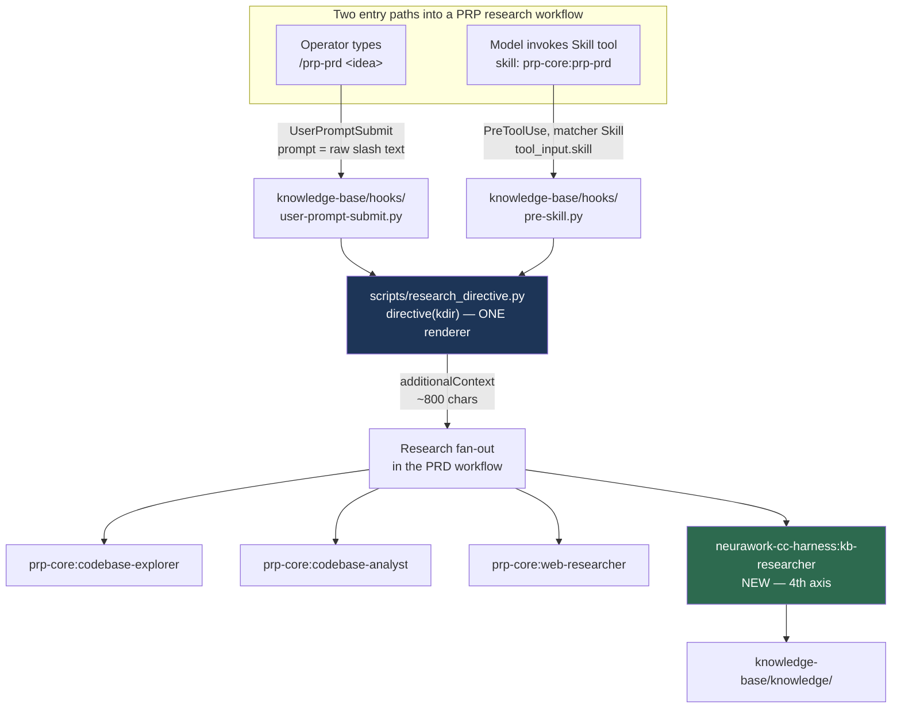
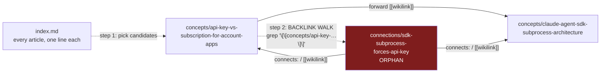

# Spawn a knowledge-base researcher whenever a PRP research workflow starts

**Plan ID:** `kb-researcher-on-prd-research`
**Source PRD:** None
**PRD Phase:** None
**Source Issue:** None
**Plan Publication:** None

## Outcome

**Problem:** When `/prp-prd` (and its siblings `/prp-plan`, `/prp-debug`) fan out research agents, they consult three axes: `codebase-explorer` (where code lives), `codebase-analyst` (how it behaves), `web-researcher` (what external sources say). The repository's own compiled knowledge base — the only place a finding distilled from a past session exists — is consulted by none of them. Findings that were expensive once get re-derived.

**Affected user:** The operator running a PRD/plan/debug workflow in any repo that has a `knowledge-compiler` install (today: this repo's `knowledge-base/`, and every downstream install of the harness plugin).

**User outcome:** A PRD or plan begins with what the repo already learned. Prior decisions, gotchas and non-obvious cross-cutting insights arrive as cited article paths alongside the other three research reports, in the same turn, without the operator remembering to ask.

**Invariant:** No PRP research workflow (`prp-prd`, `prp-plan`, `prp-debug`) starts in a repo with a compiled knowledge base without a directive to spawn the knowledge-base researcher — regardless of whether the workflow was entered by a typed slash command or by the model invoking the Skill tool. The directive never blocks a tool call and never degrades a session when the config, corpus or regex is broken.

**Success signal:** In PRD/plan sessions run after delivery, the resulting artifact either cites at least one `knowledge-base/knowledge/**` article path in its research/evidence section, or explicitly records that the corpus holds nothing on the topic. Not a metric to be gamed — the observable is "the KB was consulted", not "the KB was useful".

**Approach:** Two payload hooks in the `knowledge-compiler` engine (`user-prompt-submit.py`, `pre-skill.py`) render one shared directive string from `scripts/research_directive.py` and inject it as `additionalContext` when a research workflow is entered. The directive names a new read-only plugin agent, `neurawork-cc-harness:kb-researcher`, and hands it the resolved absolute knowledge dir. The agent walks the corpus **index-first, then by backlinks** — the only graph route to this corpus's `connections/` layer.

## Recommendation

Three forces pin this design:

**1. The trigger cannot live in the PRD skill.** `/prp-prd` is `prp-core`, a third-party plugin installed from GitHub (`Wirasm/PRPs-agentic-eng`, per `/home/felix/.claude/plugins/known_marketplaces.json`) into a version-pinned cache dir. Editing `skills/prp-prd/SKILL.md` there is erased by the next marketplace update. A hook in our own engine is the only durable injection point, and the harness already owns hook merging (`_shared/settings.py`).

**2. Two hook events are needed, not one.** A skill is entered by two paths and no single event sees both: a typed `/prp-prd …` is expanded into the prompt (UserPromptSubmit only — PreToolUse never fires), while a model-invoked skill arrives as `tool_name: "Skill"`, `tool_input: {"skill": "prp-core:prp-prd"}` with no new prompt (PreToolUse only). Both paths occur in practice. This was probed on Claude Code 2.1.234 (2026-08-18) in the sibling `homeserver` repo and is documented verbatim in `plugins/coding-suite/engines/knowledge-compiler/payload/scripts/research_directive.py:5-17` there. Both hooks render the **same** string from one module so the two cannot drift.

**3. Backlink traversal is not a stylistic preference here — it is the only route to `connections/`.** `lint --structural-only` run against this repo's corpus on 2026-08-20 reports `Orphan pages: 2` and names both of them:

```
connections/sdk-subprocess-forces-api-key.md — Orphan: nothing links to [[connections/sdk-subprocess-forces-api-key]]
connections/session-capture-to-compile-pipeline.md — Orphan: nothing links to [[connections/session-capture-to-compile-pipeline]]
```

`AGENTS.md:` compile rule 6 requires every article to link out to two others, but nothing requires a concept to link back *up* to a connection. Connections link **down** to their concepts (`connects:` frontmatter plus `## Related Concepts`); concepts do not link up. So an agent that follows forward `[[wikilinks]]` from a concept hit can never reach the cross-cutting insight layer — the layer whose whole purpose is "this problem and that problem are the same problem". A `grep` for `[[<slug>]]` reaches it in one hop. The corpus already ships the primitive for exactly this: `knowledge-base/scripts/utils.py:116` `count_inbound_links(target)`.

Nothing new is built beyond that: no backlink index artifact, no embeddings, no search layer. `AGENTS.md` "Why No RAG" fixes that policy until ~2,000 articles; the corpus holds 16.

### Evidence

- `/home/felix/.claude/plugins/known_marketplaces.json:19-25` — `prp-marketplace` source is GitHub `Wirasm/PRPs-agentic-eng`; the skill body lives in a replaceable cache dir.
- `/home/felix/.claude/plugins/cache/prp-marketplace/prp-core/fabc81d862c6/skills/prp-prd/SKILL.md` Phase 3 + Phase 5 — the PRD skill spawns `prp-core:web-researcher`, `codebase-explorer`, `codebase-analyst`; there is no fourth axis and no extension point.
- `plugins/neurawork-cc-harness/engines/_shared/settings.py:23` — `merge_hooks(repo_root, hooks)` takes `(event, command, timeout, marker)`; `:70-72` always selects or creates a `matcher: ""` group. No matcher support exists yet.
- `plugins/neurawork-cc-harness/engines/knowledge-compiler/install.py:112-119` — `_hooks(kdir)` returns exactly three hooks (SessionStart / PreCompact / SessionEnd); this is where the two new ones register.
- `plugins/neurawork-cc-harness/engines/knowledge-compiler/payload/scripts/config.py:41-58` — `DEFAULT_CFG` + `load_cfg()` merges `<kdir>/config.json` over defaults and never raises; new keys need no migration of the installed `knowledge-base/config.json`.
- `plugins/neurawork-cc-harness/engines/_shared/hookio.py:23,32` — `recursion_guard()` and `read_hook_input()` are the established hook entry primitives (Windows-safe stdin parse included).
- `knowledge-base/scripts/utils.py:66,116` — `extract_wikilinks()` and `count_inbound_links()`; the corpus's link model is plain `[[path/slug]]` strings, greppable.
- `knowledge-base/reports/lint-2026-08-20.md` — `Orphan pages: 2`, `Missing backlinks: 8`; both `connections/` articles are unreachable by forward links.
- `knowledge-base/AGENTS.md` "Article Formats" / "Compile Rules" 6-7 / "Why No RAG" — frontmatter schema (`title`, `aliases`, `tags`, `sources`, `created`, `updated`, `connects`), the two-outbound-links rule, and the standing no-embeddings decision.
- `/home/felix/projects/homeserver/plugins/coding-suite/engines/knowledge-compiler/payload/{hooks/pre-skill.py,hooks/user-prompt-submit.py,scripts/matcher_config.py,scripts/research_directive.py}` — a working prior art of this exact mechanism: probed event payloads, the anchored-regex reasoning, the `\b`-vs-`$` bug that made `/prp-prd-update` match (PR #296 review), and the "keep the directive short, a large `additionalContext` payload is offloaded to a ~2KB preview" budget note.

### Alternatives considered

- **Reuse `coding-suite:kb-researcher` and ship only the hooks.** That agent already exists and is enabled in this machine's session. Rejected: `coding-suite` is a private directory-marketplace plugin from `/home/felix/projects/homeserver`; the harness is published to third parties via `.claude-plugin/marketplace.json` and must be self-contained. It is also written for a *different* corpus shape — typed edge headings (`## Caused by`, `## Fixed by`), `entities/{services,hosts,tools}/`, `status`/`stale_after` frontmatter — none of which exist in this repo's schema. Pointing it at this corpus would send it hunting for structure that is not there.
- **Materialize a backlink index (`knowledge/backlinks.json`) at compile time.** Rejected: a second derived artifact that can go stale between compiles, for a 16-article corpus where one `grep` is instant. Revisit only alongside the ~2,000-article threshold `AGENTS.md` already names.
- **Register the PreToolUse hook in the existing `matcher: ""` group.** Rejected: it would spawn a `uv run python` process on *every* tool call in the session. The `matcher: "Skill"` group is what keeps it near-free — and getting it requires the `_shared/settings.py` change in task 1.
- **Add a repo-root `CLAUDE.md` rule instead of hooks.** Rejected: it fires nowhere near the moment of the fan-out, competes with everything else in the file, and does not ship to downstream installs of the plugin.

## Visuals





The second diagram is the whole reason the agent needs a backlink step: every arrow into `connections/` points *downward*. Forward traversal from a concept hit terminates inside `concepts/`.

## Implementation Context

### Mandatory reading

| File | Why it matters |
|---|---|
| `plugins/neurawork-cc-harness/engines/_shared/settings.py:23-84` | The merge contract to extend. Note the marker-based "is this ours" lookup scans *all* groups of an event, and the group selection at `:70-72` is what hard-codes `matcher: ""`. |
| `plugins/neurawork-cc-harness/engines/knowledge-compiler/install.py:112-119,137-142` | `_hooks(kdir)` shape and the single `merge_hooks` call site. |
| `plugins/neurawork-cc-harness/engines/knowledge-compiler/payload/hooks/session-start.py:1-60` | House style for a payload hook: `sys.path` setup for `_shared` and `scripts`, `recursion_guard()` before heavy imports, JSON envelope on stdout. |
| `plugins/neurawork-cc-harness/engines/_shared/hookio.py:23-52` | `recursion_guard()`, `read_hook_input()`. Do not re-implement stdin parsing. |
| `plugins/neurawork-cc-harness/engines/knowledge-compiler/payload/scripts/config.py:41-58` | Where the three new config keys go and how `load_cfg()` degrades. |
| `knowledge-base/AGENTS.md` (Article Formats, Compile Rules 6-7, Index) | The corpus schema the agent is written against: frontmatter fields, `[[path/slug]]` link form, the `connects:` list, `index.md` as the retrieval entry point. |
| `/home/felix/projects/homeserver/plugins/coding-suite/engines/knowledge-compiler/payload/scripts/matcher_config.py:41-62` | The two anchored regexes and the recorded reason the skill half must end in `$` and the prompt half in `(?![\w-])` — both halves must reject `/prp-prd-update`. |

### Existing patterns and primitives

- **Hook JSON envelope:** `payload/hooks/session-start.py` — print exactly one `{"hookSpecificOutput": {"hookEventName": ..., "additionalContext": ...}}` object and nothing else. Stray stdout breaks the parse and silently drops the context that was built.
- **Idempotent hook registration:** `_shared/settings.py:57-73` — a hook is "ours" when its command string contains the marker (e.g. `hooks/pre-skill.py`); a drifted command is rewritten in place, timeout/type preserved.
- **Config degradation:** `payload/scripts/config.py:48-58` — `load_cfg()` swallows `JSONDecodeError`/`OSError` and returns defaults. A bad *regex* is not covered by that and must be handled where it is compiled.
- **Read-only agent contract:** `/home/felix/projects/homeserver/plugins/coding-suite/agents/kb-researcher.md` — the report format (Overview / Prior Findings table / Mechanisms / Gaps), the "report what the corpus holds, nothing more" framing, and the explicit ban on running `scripts/query.py` (it calls `read_all_wiki_content()` and dumps the entire corpus into the prompt — see `knowledge-base/scripts/query.py:29`). Adapt the shape; do not copy the typed-edge/entity machinery, which this corpus does not have.

### Integration points

- `.claude/settings.json` — currently holds SessionStart/PreCompact/SessionEnd (`matcher: ""`, two hooks each: knowledge-base + claudemd-lerner) and PostToolUse (`matcher: ""`, compliance-base). Two new events are added; nothing existing is touched. The new `PreToolUse` group carries `matcher: "Skill"` and must **not** join compliance's `PostToolUse` group or any `matcher: ""` group.
- `plugins/neurawork-cc-harness/agents/` — does not exist yet. Creating it makes the plugin export agents for the first time (`neurawork-cc-harness:kb-researcher`), the same mechanism by which `coding-suite/agents/kb-researcher.md` becomes `coding-suite:kb-researcher`.
- `knowledge-base/` — the live self-host install. It only receives the new files by re-running `install.py` in ADOPT mode (task 9).

## Scope

### In scope

- A `neurawork-cc-harness:kb-researcher` agent specified against **this** corpus schema, doing index-first retrieval plus an explicit backlink walk, strictly read-only.
- One shared directive renderer plus the two hooks that call it (typed-slash path and model-invoked-Skill path).
- Config keys (`research_directive`, `research_skill_match`, `research_prompt_match`) defaulting to `prp-(plan|prd|debug)` and overridable per repo.
- `merge_hooks` matcher support, backwards compatible with the three existing 4-tuple callers.
- Installer registration, tests, self-host refresh, and the doc updates that make the fourth axis discoverable.

### Not building

- **A concept-retrieval hook** that injects matched articles into every prompt. `coding-suite` has one; it is a separate mechanism with its own budget, scoring and dedup problems. The ask is the researcher spawn.
- **A materialized backlink index.** Grep is the mechanism (see Alternatives).
- **A fix for the orphaned `connections/` articles.** The compiler writes connections that nothing links back to (`AGENTS.md` rule 6 requires outbound links only), which is why `lint` reports 2 orphans and 8 missing backlinks. That is a real defect in the compile constitution — it is flagged in Risks, and this plan *works with* the corpus as it is rather than depending on a corpus change.
- **Editing `prp-core`.** Not ours; not durable.
- **A `/kb-research` slash command** for asking the corpus directly. Different entry point, different ask.

## Delivery Considerations

| Concern | Decision and owned work |
|---|---|
| Discoverability / adoption | The directive is the adoption mechanism — it fires without the operator knowing it exists. Task 8 documents the fourth axis in the install skill, `knowledge-base/CLAUDE.md`, root `CLAUDE.md` and `docs/ARCHITECTURE.md` so a reader can find and disable it. |
| Compatibility / migration | New config keys land in `DEFAULT_CFG`; existing installed `config.json` files lack them and inherit defaults — no migration, no installer-forced rewrite. `merge_hooks` keeps accepting 4-tuples, so `claudemd-lerner` and `compliance-compiler` installers are untouched. Existing `.claude/settings.json` entries are preserved by the marker-based merge. |
| Rollout / reversibility | Two independent kill switches without an installer re-run: `"research_directive": false` in `<kdir>/config.json` disables injection while leaving the hooks registered; deleting the two hook entries from `.claude/settings.json` removes them entirely. Both hooks fail **open** — any exception yields no output and exit 0. |
| Observability | Silence is the failure mode: a hook that emits nothing is indistinguishable from a hook that decided not to fire. Task 10 covers this with unit tests over the pure decision function rather than runtime logging — a hook on this path must not write to stdout. |
| Documentation / communication | Task 8. Includes the explicit note that `PreToolUse` must never exit non-zero, since exit code 2 on that event **blocks the tool call**. |

## Implementation

### 1. Give `merge_hooks` optional matcher support

**Files and integration points**
- `plugins/neurawork-cc-harness/engines/_shared/settings.py:23-84` — UPDATE. Shared by all three installers, so the change must be additive.
- `plugins/neurawork-cc-harness/engines/_shared/tests/test_settings.py` — UPDATE.

**Implementation**
- Accept both `(event, command, timeout, marker)` and `(event, command, timeout, marker, matcher)`; unpack by length, defaulting `matcher` to `""`. Update the type hint and the docstring's hook-tuple description.
- Group selection at `:70-72`: select the group whose `matcher` equals the requested one, else append `{"matcher": <matcher>, "hooks": [entry]}`.
- Leave the marker-based existing-hook lookup unchanged — it scans every group of the event, so a hook already present in some other group is still recognized and not duplicated.
- Do not build a migration that moves an already-registered hook between matcher groups. No prior install registers these hooks, so no such state exists; adding the machinery would be speculative.

**Tests**
- A 5-tuple with `matcher: "Skill"` creates a `Skill` group and leaves a pre-existing `matcher: ""` group of the same event untouched.
- Re-merging the same 5-tuple is a no-op returning `False`.
- A 4-tuple still lands in the `matcher: ""` group (regression guard for the other two installers).

**Validation**
- `cd plugins/neurawork-cc-harness/engines && python3 -m unittest discover -s _shared/tests` — all pass, including the five pre-existing `merge_hooks` tests.

### 2. Add the shared directive renderer

**Files and integration points**
- `plugins/neurawork-cc-harness/engines/knowledge-compiler/payload/scripts/research_directive.py` — CREATE. Lives in `scripts/` because both hooks already put `<kdir>/scripts` on `sys.path`.

**Implementation**
- `directive(kdir: Path) -> str` returning a markdown block, kept under ~900 characters. Every line earns its place:
  - names the agent exactly as the Agent tool needs it — `neurawork-cc-harness:kb-researcher` — because a name the model cannot use verbatim is one it will approximate;
  - names the three `prp-core` agents so the model places it *among* them rather than substituting it for one;
  - says "launch it in the **same message** as the other research agents", which is what makes the four run concurrently instead of serially;
  - passes the resolved absolute knowledge dir so the agent never globs for the corpus;
  - states the traversal contract in one line: index first, then backlinks, because the `connections/` layer is only reachable that way.
- Keep it short deliberately: `additionalContext` payloads above a threshold are offloaded to a short preview (recorded in the sibling `coding-suite` engine's `matcher_config.py`), which would silently truncate the directive. This is a cross-repo observation, not something verified in this repo — treat the size ceiling as a cheap precaution, not a proven limit.
- Add `research_enabled(cfg, key, value) -> bool` in the same module: reads the config flag, compiles the configured regex inside `try/except re.error`, and falls back to the module default on a bad pattern. Both hooks call it, so a broken user regex degrades to default behavior in exactly one place.
- Pure stdlib, no file I/O, never raises.

**Tests**
- Covered by task 10.

**Validation**
- `cd plugins/neurawork-cc-harness/engines && uvx ruff check` — clean.

### 3. Add the three config keys

**Files and integration points**
- `plugins/neurawork-cc-harness/engines/knowledge-compiler/payload/scripts/config.py:41-45` — UPDATE `DEFAULT_CFG`.
- `plugins/neurawork-cc-harness/engines/knowledge-compiler/config.default.json` — UPDATE (what a fresh install writes).

**Implementation**
- `"research_directive": true`.
- `"research_skill_match": "^([\\w-]+:)?prp-(plan|prd|debug)$"` — matched against `tool_input["skill"]`, which carries the **plugin-qualified** name (`prp-core:prp-prd`), hence the optional prefix. Anchored at both ends.
- `"research_prompt_match": "^\\s*/(?:[\\w-]+:)?prp-(plan|prd|debug)(?![\\w-])"` — matched against the raw prompt, anchored at the start so a mid-sentence mention does not fire.
- Both patterns must reject `prp-prd-update`, a real `prp-core` skill. Use `$` on the skill half and the negated class on the prompt half; a trailing `\b` does **not** work, because `-` is a word boundary — recorded in `matcher_config.py:57-62` of the sibling repo as a review finding.
- Do not touch the installed `knowledge-base/config.json`; `load_cfg()` merges defaults under it.

**Tests**
- Covered by task 10.

**Validation**
- `python3 -c "import json,pathlib; json.loads(pathlib.Path('plugins/neurawork-cc-harness/engines/knowledge-compiler/config.default.json').read_text())"` — parses.

### 4. Add the `UserPromptSubmit` hook (typed slash path)

**Files and integration points**
- `plugins/neurawork-cc-harness/engines/knowledge-compiler/payload/hooks/user-prompt-submit.py` — CREATE.

**Implementation**
- Follow `session-start.py:22-30` verbatim for `sys.path` setup and `recursion_guard()` placement (before heavy imports).
- Read the payload with `read_hook_input()`, take `prompt`, and consult `research_enabled(...)` from task 2 against `research_prompt_match`.
- On a match: print the single JSON envelope with `hookEventName: "UserPromptSubmit"` and the directive as `additionalContext`. On no match: print **nothing at all** and exit 0.
- Wrap `main()` in a bare `except Exception: return`. Fail open — a session must never break because the corpus or config is malformed.
- Document in the module docstring which path this covers and which it cannot see, pointing at the sibling module.

**Tests**
- Covered by task 10.

**Validation**
- `echo '{"prompt":"/prp-prd a new thing"}' | uv run --directory knowledge-base python hooks/user-prompt-submit.py` — after task 9 — prints one JSON object naming `neurawork-cc-harness:kb-researcher`.
- `echo '{"prompt":"/prp-commit"}' | uv run --directory knowledge-base python hooks/user-prompt-submit.py` — prints nothing, exit 0.

### 5. Add the `PreToolUse` hook (model-invoked Skill path)

**Files and integration points**
- `plugins/neurawork-cc-harness/engines/knowledge-compiler/payload/hooks/pre-skill.py` — CREATE.

**Implementation**
- Same skeleton as task 4, against `tool_name` / `tool_input`.
- Return the directive only when `tool_name == "Skill"` **and** `tool_input["skill"]` is a non-empty string matching `research_skill_match`. Anything else emits nothing.
- Three hard constraints, stated in the module docstring because each has a distinct failure mode:
  1. **Never exit non-zero.** Exit code 2 on `PreToolUse` *blocks the tool call*. Every path ends at exit 0.
  2. **Never print anything but the JSON envelope.** Stray stdout here is not injected as context — it breaks the parse and the built `additionalContext` is silently lost.
  3. **Stay fast, and never emit `permissionDecision`.** This hook injects; it never allows, denies or asks. It reads no corpus files — the directive is a static string and the config is one small file.

**Tests**
- Covered by task 10.

**Validation**
- `echo '{"tool_name":"Skill","tool_input":{"skill":"prp-core:prp-prd"}}' | uv run --directory knowledge-base python hooks/pre-skill.py` — one JSON object; `echo $?` is 0.
- Same with `{"skill":"prp-core:prp-prd-update"}` and with `{"tool_name":"Bash",...}` — no output, exit 0.

### 6. Register both hooks in the installer

**Files and integration points**
- `plugins/neurawork-cc-harness/engines/knowledge-compiler/install.py:112-119` — UPDATE `_hooks(kdir)`.

**Implementation**
- Append two entries: `("UserPromptSubmit", f"{base} hooks/user-prompt-submit.py", 10, "hooks/user-prompt-submit.py")` and `("PreToolUse", f"{base} hooks/pre-skill.py", 10, "hooks/pre-skill.py", "Skill")`.
- The `PreToolUse` entry is the 5-tuple; the matcher is what stops it firing on every tool call.
- `_copy_code()` already globs `payload/hooks/*.py` and `payload/scripts/*.py`, so the three new files are copied with no change there.

**Tests**
- Extend `tests/test_install_recon.py`: the returned hook list contains both new events; the `PreToolUse` entry carries matcher `"Skill"`; a full install into a temp git repo produces a `.claude/settings.json` with a `PreToolUse` group whose matcher is `"Skill"` and whose sibling `matcher: ""` groups are intact.

**Validation**
- `cd plugins/neurawork-cc-harness/engines && python3 -m unittest discover -s knowledge-compiler/tests`.

### 7. Add the `kb-researcher` agent

**Files and integration points**
- `plugins/neurawork-cc-harness/agents/kb-researcher.md` — CREATE (new directory; the plugin exports agents for the first time).

**Implementation**
- Frontmatter: `name: kb-researcher`; `tools: Read, Grep, Glob` (read-only by construction, not by instruction); `model: sonnet`; a description that positions it as the fourth research axis and states it does not read source code and does not search the web.
- Body, in order:
  1. **Resolve the corpus.** The spawning directive names `<kdir>` absolutely. If it does not, glob for a dir containing both `VERSION` and `knowledge/index.md`. If none exists, report "this repository has no compiled knowledge base" and stop. Never fall back to `docs/` or the source tree.
  2. **Index first.** `knowledge/index.md` lists every article with a one-line summary and its compiled-from log — it is the retrieval mechanism (`AGENTS.md`, "Index"). Read it before any grep.
  3. **Vocabulary grep.** Search `aliases:`, `tags:`, `title:` across `knowledge/{concepts,connections}/*.md`. `aliases` is the hand-curated symptom vocabulary. Search German and English forms — this corpus is bilingual.
  4. **Backlink walk — the step that distinguishes this agent.** For every candidate article, `grep -rn "\[\[<dir>/<slug>\]\]" knowledge/` to find what points *at* it, excluding `index.md`. A `connections/` hit is the highest-value result available: connections exist precisely to record a non-obvious relationship between two concepts (`AGENTS.md`, "Connection article"), and in this corpus they are orphans — no forward link reaches them. Also grep `connects:` in `connections/*.md` frontmatter for the concept's path. State plainly: an answer that reports only concepts and no backlink walk has not done the job.
  5. **Bound the traversal.** Roughly 10-15 article reads answer any question at this corpus size. Past that, the corpus does not hold the answer — say so.
  6. **Never run `scripts/query.py`.** It calls `read_all_wiki_content()` (`knowledge-base/scripts/query.py:29`) and pushes the entire corpus into a prompt — the exact failure this agent exists to avoid. Never write, never edit, least of all `index.md` or `log.md`.
  7. **Freshness.** Report each cited article's `created` / `updated` and its `sources:` daily logs. Flag when an article names a file, flag or command that no longer exists; a `Glob` to confirm a cited path's existence is the *only* legitimate reason to touch the source tree.
  8. **Report format.** `## Knowledge Base Research: [Topic]` → `### Overview` → `### Prior Findings` (table: article path | relevance to *this* task | updated) → `### Connections Found via Backlinks` (which concept led there, and the insight) → `### Gaps`. Omit an empty section; always keep `Gaps`.
  9. **Standing rules:** full article path for every claim; quote the decisive lines rather than paraphrasing; never invent a path, quote or date; never pad a thin result with weak matches — "the corpus holds nothing on this" is a complete and valuable answer; never recommend an implementation.

**Tests**
- Behavioral, run by hand in task 11 (a prompt-specified agent has no unit-testable surface). The probe is chosen so a forward-links-only agent fails it.

**Validation**
- Covered by AC3 in task 11.

### 8. Document the fourth axis

**Files and integration points**
- `plugins/neurawork-cc-harness/skills/knowledge-compiler/SKILL.md` — UPDATE: the install now registers five hooks, not three; name the agent, the three config keys, and the two kill switches.
- `knowledge-base/CLAUDE.md` — UPDATE: what the two new hooks do in this repo and how to disable them.
- `CLAUDE.md` (root) — UPDATE the `knowledge-base/` bullet under "High-level architecture" and the hook description under "Build / test / lint / run commands", which currently says the knowledge-compiler contributes `SessionStart`/`PreCompact`/`SessionEnd` only.
- `docs/ARCHITECTURE.md` — UPDATE: the research-axis diagram/description.

**Implementation**
- State the `PreToolUse`-exit-2-blocks-the-tool-call constraint where a future maintainer of these hooks will read it.
- Note the deliberate split: `compliance-compiler` owns `PostToolUse`, `knowledge-compiler` now owns `PreToolUse` with a `Skill` matcher — they do not collide.

**Validation**
- `git diff --stat` shows all four docs touched; no stale "three hooks" claim survives (`grep -rn "SessionStart / PreCompact / SessionEnd" CLAUDE.md docs/ knowledge-base/CLAUDE.md plugins/`).

### 9. Refresh the self-host install

**Files and integration points**
- `knowledge-base/hooks/`, `knowledge-base/scripts/`, `.claude/settings.json` — regenerated, not hand-edited.

**Implementation**
- `python3 plugins/neurawork-cc-harness/engines/knowledge-compiler/install.py --knowledge-dir knowledge-base` (ADOPT mode — `_is_adopt()` is true here, so code refreshes and no data is clobbered).
- Verify `.claude/settings.json` afterwards: the three existing `matcher: ""` groups still carry both the knowledge-base and claudemd-lerner commands, `PostToolUse` still carries compliance-base, and the new `PreToolUse` group's matcher is `"Skill"`.
- Commit `knowledge-base/` and `.claude/settings.json` together with the engine change so payload and self-host do not drift.

**Validation**
- `git diff .claude/settings.json` — additive only.
- `uv run --directory knowledge-base python hooks/pre-skill.py` fed the payloads from task 5 — behaves as specified.

### 10. Unit tests for the decision logic

**Files and integration points**
- `plugins/neurawork-cc-harness/engines/knowledge-compiler/tests/test_research_directive.py` — CREATE, following `tests/test_utils_trigger.py:9-16` (`sys.path.insert` to `payload/scripts`, stdlib `unittest`, no network).

**Implementation**
- Matching: `prp-prd`, `prp-core:prp-prd`, `prp-plan`, `prp-debug` all match the skill regex; `prp-prd-update`, `prp-core:prp-prd-update`, `prp-commit`, `prp-plan-b`, `""` do not.
- Prompt matching: `/prp-prd idea`, `  /prp-prd`, `/prp-core:prp-plan x` match; `/prp-prd-update`, `see /prp-prd for context`, `/prp-commit` do not.
- Directive content: contains the literal `neurawork-cc-harness:kb-researcher`, contains the passed knowledge dir, mentions the three `prp-core` agents, says "same message", stays under the size ceiling.
- Degradation: `research_directive: false` suppresses; an uncompilable regex in config falls back to the default rather than raising.
- Hook decision functions: import each hook's `build_context`-equivalent and assert it returns `""` for a non-`Skill` tool, an empty skill, and a non-research skill.

**Validation**
- `cd plugins/neurawork-cc-harness/engines && python3 -m unittest discover -s knowledge-compiler/tests` — all pass.

### 11. End-to-end behavioral check

**Files and integration points**
- None. Manual, in a fresh session in this repo, after task 9.

**Implementation**
- **Typed path:** start a new session, type `/prp-prd a throwaway idea`. The directive must appear in context and the research fan-out must include `neurawork-cc-harness:kb-researcher` in the same message as the `prp-core` agents. Abandon the PRD before it writes a file.
- **Model-invoked path:** in prose, ask Claude to plan something with `prp-plan` so it invokes the Skill tool. Same directive must appear.
- **Backlink proof (the decisive one):** spawn the agent directly on "what do we know about using an API key versus a subscription login". A forward-links-only agent returns `concepts/api-key-vs-subscription-for-account-apps.md` and stops. This agent must additionally return `connections/sdk-subprocess-forces-api-key.md` — an orphan reachable only by backlink — and say which concept led there.
- **Negative control:** type `/prp-commit`. No directive.

**Validation**
- Records AC1, AC2, AC3, AC4. Note the outcome in the implementation report; if the backlink probe fails, the agent prompt (task 7 step 4) is the thing to fix, not the hooks.

## Acceptance

1. **AC1 — Typed entry injects the directive:** Typing `/prp-prd <idea>` in a repo with a knowledge-compiler install injects a directive naming `neurawork-cc-harness:kb-researcher` and the absolute knowledge dir, instructing that it launch in the same message as the `prp-core` research agents.
2. **AC2 — Model-invoked entry injects the same directive:** A `Skill` tool call with `tool_input.skill` matching `^([\w-]+:)?prp-(plan|prd|debug)$` yields byte-identical directive text, because both hooks render it from one module.
3. **AC3 — Backlink traversal reaches the connections layer:** Asked about a concept that has an orphaned connection article, the agent returns that `connections/*.md` path and names the concept whose backlinks led to it. Concretely: the API-key question returns `knowledge-base/knowledge/connections/sdk-subprocess-forces-api-key.md`.
4. **AC4 — No false triggers:** `/prp-prd-update`, `/prp-commit`, a mid-sentence `/prp-prd` mention, a non-`Skill` tool call, and an empty skill name all produce no output and exit 0.
5. **AC5 — Nothing is blocked or clobbered:** The `PreToolUse` hook never exits non-zero and never emits `permissionDecision`; every failure path is silent and exit 0. After install, `.claude/settings.json` retains its existing SessionStart/PreCompact/SessionEnd/PostToolUse entries verbatim, and the new `PreToolUse` group carries `matcher: "Skill"` — not `""`.
6. **AC6 — Shared helper stays compatible:** `merge_hooks` accepts 4-tuples with unchanged behavior; the `claudemd-lerner` and `compliance-compiler` installers are not modified and their tests pass.
7. **AC7 — Disable works without an installer run:** Setting `"research_directive": false` in `<kdir>/config.json` stops injection on both paths, live.

## Validation

| Gate | Command or procedure | Proves |
|---|---|---|
| Shared helpers | `cd plugins/neurawork-cc-harness/engines && python3 -m unittest discover -s _shared/tests` | AC6, matcher-group behavior |
| Engine unit tests | `cd plugins/neurawork-cc-harness/engines && python3 -m unittest discover -s knowledge-compiler/tests` | AC1, AC2, AC4, AC7 decision logic; installer hook list |
| Sibling engines unaffected | `cd plugins/neurawork-cc-harness/engines && python3 -m unittest discover -s claudemd-lerner/tests && python3 -m unittest discover -s compliance-compiler/tests` | AC6 |
| Lint | `cd plugins/neurawork-cc-harness/engines && uvx ruff check` | House style, line-length 100 |
| Hook smoke test | `echo '{"tool_name":"Skill","tool_input":{"skill":"prp-core:prp-prd"}}' \| uv run --directory knowledge-base python hooks/pre-skill.py; echo $?` | AC5 — one JSON object, exit 0 |
| Settings integrity | `git diff .claude/settings.json` after task 9 | AC5 — additive only, `PreToolUse` matcher is `"Skill"` |
| Corpus unharmed | `uv run --directory knowledge-base python scripts/lint.py --structural-only` | Read-only agent changed nothing: still `Broken links: 0`, `Orphan pages: 2` |
| Runtime / manual | Task 11 (typed path, model-invoked path, backlink probe, negative control) | AC1, AC2, AC3, AC4 |

## Risks and Decisions

| Decision or risk | Recommendation | Evidence / mitigation | Consequence if different |
|---|---|---|---|
| `prp-core` is third-party; its skill names could be renamed upstream, silently killing the trigger | Ship the regexes as config keys, not constants | `config.py:48-58` merges `config.json` over defaults with no installer run | A rename needs a one-line config edit, not a release |
| `additionalContext` size: large payloads are reportedly offloaded to a short preview | Keep the directive under ~900 chars and assert the ceiling in a test | Recorded in the sibling `coding-suite` engine's `matcher_config.py`; **not independently verified in this repo** | If the limit is different or absent, the only cost is a shorter directive than necessary |
| Both `coding-suite:kb-researcher` and `neurawork-cc-harness:kb-researcher` will exist on this machine | Always name the plugin-qualified agent in the directive | Two enabled plugins can export the same bare agent name; the qualified name disambiguates, and it matches the repo convention in `CLAUDE.md` → Conventions | An unqualified name could resolve to the coding-suite agent, which is written for a corpus schema this repo does not have |
| The `connections/` layer is orphaned — `lint` reports 2 orphan pages and 8 missing backlinks | Out of scope here; fix the compile constitution separately | `AGENTS.md` compile rule 6 requires outbound links only, so nothing makes a concept link up to its connection | Fixing it later makes forward traversal work too; the backlink step stays correct either way and costs one grep |
| `PreToolUse` fires on every `Skill` invocation, not just research ones | Accept; the hook reads no corpus files and returns on a string compare | Process spawn per `Skill` call only — the `matcher: "Skill"` group is what bounds it | Without the matcher change in task 1 it would fire on every tool call, which is why that task is first |

## Agent Notes

The two orphaned `connections/` articles are the sharpest available proof that this design is right, and they are also a latent defect in the compiler. Do not "fix" the corpus to make the backlink step look unnecessary — the AC3 probe depends on that state, and even in a fully back-linked corpus the connections layer is where the cross-cutting answer lives.

`homeserver/plugins/coding-suite/engines/knowledge-compiler/` is prior art for the hook half, not a template to copy. Its probed event payloads and its `\b`-vs-`$` regex finding are hard-won and worth reusing verbatim; its `matcher_config.py` scoring, its retrieval hook and its typed-edge/entity agent are a different product against a different corpus schema and are explicitly out of scope.
