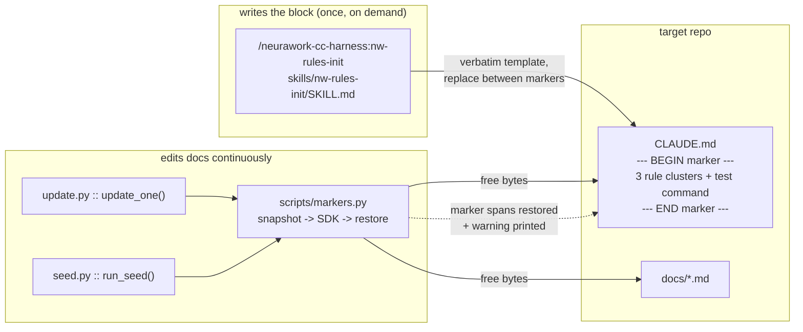

# Baseline coding rules land in a target repo's CLAUDE.md and survive the learner

**Plan ID:** `nw-rules-init-baseline-rules`
**Source PRD:** `None`
**PRD Phase:** `None`
**Source Issue:** `None`
**Plan Publication:** `None`

## Outcome

**Problem:** The harness installs three engines that describe a repo (`knowledge-compiler`,
`claudemd-lerner`, `compliance-compiler`) but ships **no prescriptive working rules**. A repo that
installs `claudemd-lerner` gets a CLAUDE.md full of *what the repo is* and nothing about *how to
change it*: no scope discipline, no YAGNI, no test-first. Whoever wants those rules writes them by
hand, and hand-written prose in CLAUDE.md is exactly what the learner rewrites — the root
`CLAUDE.md` of this repo carries a hand-written "Working principles" section today with **zero
marker protection** (`grep '<!--' CLAUDE.md` → no hits), so every `update.py` run may reword or
drop it.

**Affected user:** Any developer installing the harness into a repo, and this repo itself
(self-host).

**User outcome:** One command writes a small, auditable, idempotent rules block into the root
`CLAUDE.md` — scope discipline, simplicity, and evaluation-first with *this repo's real test
command* — and the learner can never silently edit it again.

**Invariant:** Bytes between a `<!-- … BEGIN … -->` / `<!-- … END -->` marker pair in any file the
learner may edit are identical before and after a learner run. Re-running the rules command on an
already-initialised repo produces an empty diff and never a second block.

**Success signal:** In this repo, after `/neurawork-cc-harness:nw-rules-init` and a subsequent
`uv run --directory claudemd-lerner python scripts/update.py --all`, the block's bytes are
unchanged and `git diff CLAUDE.md` shows no edit inside the marker span. Not measured beyond that —
whether the rules improve agent behaviour is not observable from this repo.

**Approach:** One prompt-only skill (`skills/nw-rules-init/SKILL.md`, no engine — the rule text is
static, the recon is reading) that detects the repo's test runner, reports a per-cluster coverage
verdict against the existing CLAUDE.md, asks, then writes one marker-delimited block verbatim.
Plus a deterministic marker guard in the `claudemd-lerner` payload that snapshots every marker
span before the SDK edits and restores any span the model touched.

## Recommendation

The simplest thing that satisfies the invariant is **static text + a byte guard**, not a new
engine.

- The rule text never varies except for one interpolated test command, so there is nothing for an
  LLM to synthesize and no state to persist. `/coding-suite:coding-discipline-init`
  (`~/.claude/plugins/cache/homeserver-tools/coding-suite/1.13.0/commands/coding-discipline-init.md`)
  proves the whole shape works with no engine: recon by reading, `AskUserQuestion`, one verbatim
  marker block, `--force` to refresh.
- The plugin already carries install-free prompt surfaces with no engine — `skills/nw-worktree/`
  and `commands/nw-ship-pr.md` — so this needs no new plumbing, no `install.py`, no `VERSION`, and
  no entry in `hooks/version-check.py:29-33` (that map exists to flag *installed engine copies*
  that drift; a prompt-only surface has no in-repo copy to drift).
- The guard belongs in the learner, not in the rules skill, because the learner is the thing that
  edits CLAUDE.md. Making it **marker-generic** (any `owner:name BEGIN/END` pair) rather than
  hard-coding `neurawork-cc-harness:rules` also protects the `coding-suite:coding-discipline-init`
  block a repo may already have — same cost, wider invariant.
- Prose alone cannot hold this. `AGENTS.md` already says "prefer a surgical Edit" and "preserve
  hand-written content", and the hand-written principles in this repo's CLAUDE.md are still
  unprotected. The guard is a byte comparison in `update_one()` and `run_seed()`, i.e. code that
  fails loudly, not an instruction the model may weigh against other instructions.
- The test command is interpolated into the block and read back from the block on re-run. No
  `config.json` key, no `.local.md` cache: a second copy of the command is a second thing that can
  drift, and `rules-init` must work in a repo that never installed the learner.

### Evidence

- `plugins/neurawork-cc-harness/engines/claudemd-lerner/payload/AGENTS.md:1-119` — the learner's
  constitution is entirely descriptive (purpose, commands, architecture, conventions, decisions).
  No coding rule, no test rule. Update rules 1-7 (`:78-101`) never mention marker blocks.
- `plugins/neurawork-cc-harness/engines/claudemd-lerner/install.py:60-92` — the installer copies
  machinery only and explicitly never scaffolds CLAUDE.md; only `seed.py`/`update.py` write it.
- `plugins/neurawork-cc-harness/engines/claudemd-lerner/payload/scripts/update.py:126-162` —
  `update_one()` runs the SDK with `allowed_tools=["Read","Write","Edit","Glob","Grep"]` and
  `permission_mode="acceptEdits"`. The model edits files directly; nothing inspects the result.
  This is the single choke point where a guard sees "before" and "after".
- `plugins/neurawork-cc-harness/engines/claudemd-lerner/payload/scripts/seed.py:74-135` — the seed
  path has the same shape (`assert_in_repo_not_dotclaude` at `:79-80`, `query(...)` at `:111`) and
  runs against an existing repo, so it needs the same guard.
- `plugins/neurawork-cc-harness/engines/claudemd-lerner/payload/scripts/update.py:45-60` —
  `_list_claudemd_files(depth, excluded)` (`:45-60`) and `_list_docs(excluded)` (`:63-72`) already compute
  exactly the file set the learner may edit. The guard reuses them instead of re-globbing.
- `~/.claude/plugins/cache/homeserver-tools/coding-suite/1.13.0/commands/coding-discipline-init.md`
  — the recon-first, marker-delimited, `--force`-refresh pattern being adopted, including its
  budget argument ("a generic four-cluster block was 1,898 chars").
- `plugins/neurawork-cc-harness/skills/nw-worktree/SKILL.md:1-8` — precedent for a prompt-only
  skill in this plugin: frontmatter `name` matching the directory, `allowed-tools`,
  `argument-hint`.
- `plugins/neurawork-cc-harness/tests/test_skill_assets.py:1-30,51-79` — the existing home for
  structural invariants of prompt-only assets, with a `frontmatter()` parser already written. Its
  docstring states the honest limit: these tests pin guard invariants, not behaviour.
- `CLAUDE.md` (repo root) + 23 modules importing `unittest`, 0 using pytest — the repo's real gate
  is `python3 -m unittest discover -s <dir>/tests`. A hard-coded "always pytest" rule would be
  false in the very repo that ships it; hence runner detection.

### Alternatives considered

- **Extend `claudemd-lerner` to write the rules at install time:** couples a prescriptive block to
  an engine install a user may not want, and puts static text behind an LLM path. Rejected.
- **A new engine with `install.py` + `payload/`:** buys `VERSION` staleness tracking for text that
  changes only when we edit the skill. All three existing engines exist because they *run
  something*; this one would run nothing.
- **AGENTS.md rule only, no code guard:** cheapest, and demonstrably insufficient — the current
  AGENTS.md already asks for exactly this care and the unprotected principles section in this
  repo's CLAUDE.md is the counter-example.
- **Block hard-codes pytest:** contradicts this repo's own suite; would make the harness ship a
  rule its own CI violates.

## Visuals



## Implementation Context

### Mandatory reading

| File | Why it matters |
|---|---|
| `plugins/neurawork-cc-harness/engines/claudemd-lerner/payload/scripts/update.py:45-72,126-162` | The file list the learner may edit, and the exact call the guard must wrap. |
| `plugins/neurawork-cc-harness/engines/claudemd-lerner/payload/scripts/seed.py:74-135` | The second write path with the same shape; both must be guarded or the guard is bypassable. |
| `plugins/neurawork-cc-harness/engines/claudemd-lerner/payload/scripts/config.py:22-36` | `ROOT_DIR`/`REPO_ROOT`/`CLAUDEMD_FILE` — how payload scripts resolve paths, and `LERNER_ROOT` which tests use to point the engine at a temp repo. |
| `plugins/neurawork-cc-harness/engines/claudemd-lerner/payload/AGENTS.md:78-101` | Update Rules 1-7; the marker rule joins this numbered list. |
| `~/.claude/plugins/cache/homeserver-tools/coding-suite/1.13.0/commands/coding-discipline-init.md` | The stage structure, coverage table, idempotency handling and budget rationale being adopted. |
| `plugins/neurawork-cc-harness/skills/nw-worktree/SKILL.md` | Frontmatter and prose conventions for a prompt-only skill in this plugin. |
| `plugins/neurawork-cc-harness/tests/test_skill_assets.py` | Where the new asset invariants go; reuse `frontmatter()`. |

### Existing patterns and primitives

- **Prompt-only surface, no engine:** `skills/nw-worktree/SKILL.md` — frontmatter with `name`,
  `description`, `allowed-tools`, `argument-hint`; body is numbered stages the agent executes.
- **Recon-first + `AskUserQuestion` + verbatim marker block:** the `coding-discipline-init`
  command's Stages 0-5. Adopt the structure; the content is ours.
- **Path resolution in payload scripts:** `config.py:22` reads `LERNER_ROOT` from the environment,
  which is how `engines/claudemd-lerner/tests/` already drives the payload against a temp repo —
  the marker tests do the same rather than inventing a fixture harness.
- **Structural asset tests:** `tests/test_skill_assets.py:51-79` — `subTest` per asset, failure
  messages that state *why the invariant matters*, not just what differs.

### Integration points

- `payload/scripts/update.py:126` — `update_one()`; snapshot before `query(...)`, restore after the
  `async for` loop completes (including on the `except` path, which currently returns early at
  `:158-160`).
- `payload/scripts/seed.py:111` — `query(...)` in `run_seed()`; same wrap.
- `payload/AGENTS.md:101` — end of the Update Rules list; the marker rule is appended as rule 8.
- `plugins/neurawork-cc-harness/README.md` + `docs/INSTALL.md` — where install-free surfaces are
  advertised.

## Scope

### In scope

- `skills/nw-rules-init/SKILL.md`: stages, runner detection, coverage recon, `AskUserQuestion`
  gate, `--force`, verbatim English block template with three clusters and an interpolated test
  command.
- `payload/scripts/markers.py` in `claudemd-lerner` + wiring into `update.py` and `seed.py`.
- Update Rule 8 in `payload/AGENTS.md`.
- Unit tests for the marker helpers; asset tests for the block template (size budget, single
  occurrence, marker pair well-formed).
- Refresh of the self-hosted `claudemd-lerner/` install so this repo runs the guarded code.
- Documentation of the new surface in the plugin README, `docs/INSTALL.md`, root `CLAUDE.md`.

### Not building

- **Writing the block into this repo's CLAUDE.md.** That is a run of the finished command, not a
  code change; the plan's validation runs it, the user decides whether to keep the diff.
- **A `test_command` config key or `.local.md` cache** — decided against; the block is the source.
- **The `## Validation`-section precheck in `compliance-compiler`** and the `nw-ship-pr`
  validation-gate coupling — separate plan; they consume this block, they do not require it.
- **The stale plugin `README.md` in full** (it still says "two independently installable skills"
  and marks finished phases in-progress). This plan adds its own surface to it; the general
  refresh stays a backlog item so this diff stays reviewable.
- **A German block variant.** English only, matching every other asset in the plugin.
- **Guarding files outside the learner's own edit set** (e.g. an editor rewriting CLAUDE.md).

## Delivery Considerations

| Concern | Decision and owned work |
|---|---|
| Discoverability / adoption | Task 4 lists the surface in the plugin README, `docs/INSTALL.md`, and the root `CLAUDE.md` command list; the skill description carries the trigger phrases users actually type. |
| Compatibility | The guard is marker-generic, so repos already carrying a `coding-suite:coding-discipline-init` block gain protection with no action. Repos with no markers see no behaviour change (snapshot empty → restore no-op). |
| Rollout / reversibility | Both pieces are additive. Reverting = deleting the skill dir and the `markers.py` import; no data migration, no settings change, no hook change. |
| Observability | A restored span prints one explicit warning line naming the file and marker id, so a learner run that tried to eat a block is visible in the hook log instead of silent. |
| Documentation | Covered by Task 4. |

## Compliance

**Capabilities**: none — this change ships static prompt text plus a byte-preserving guard in
local developer tooling. It processes no personal data, adds no data store, no network path, no
authentication or authorisation surface, and no production system component.

## Implementation

### 1. The learner can no longer change bytes inside a marker block

**Files and integration points**
- `plugins/neurawork-cc-harness/engines/claudemd-lerner/payload/scripts/markers.py` — CREATE — pure
  functions, no SDK import, so they are unit-testable without an LLM.
- `plugins/neurawork-cc-harness/engines/claudemd-lerner/payload/scripts/update.py:126-162` — UPDATE
  — wrap `update_one()`'s SDK call.
- `plugins/neurawork-cc-harness/engines/claudemd-lerner/payload/scripts/seed.py:74-135` — UPDATE —
  wrap `run_seed()`'s SDK call.
- `plugins/neurawork-cc-harness/engines/claudemd-lerner/payload/AGENTS.md:101` — UPDATE — Update
  Rule 8.

**Implementation**
- `markers.py` exposes three pure functions:
  - `find_spans(text) -> list[Span]` where a span is `(marker_id, start, end, body_bytes)`. The
    pair is recognised by `<!-- <owner>:<name> BEGIN` … `<!-- <owner>:<name> END -->` with the same
    `owner:name`; `owner:name` matches `[A-Za-z0-9_.-]+:[A-Za-z0-9_.-]+`. Everything from the
    opening `<!--` through the closing `-->` inclusive is the span, so the marker comments
    themselves are protected, not just the text between them.
  - `snapshot(paths) -> dict[Path, dict[str, str]]` — per file, per marker id, the exact span text.
    Missing/unreadable files are skipped, never raised.
  - `restore(snapshot) -> list[str]` — re-reads each file and, per marker id: if the span text
    differs, splice the original back in; if the marker pair is gone, append the original span at
    end of file after a blank line. Returns one human-readable message per restoration; writes
    atomically (`tmp` + `os.replace`), matching `_shared/settings.py`'s write style.
- Unmatched or nested markers are left alone and reported — a `BEGIN` without its `END` is not a
  span, and guessing its extent could delete real content.
- `update_one()`: build the guarded path list from `_list_claudemd_files(depth, excluded)` +
  `_list_docs(excluded)` (already computed in `_build_prompt`; lift them so both uses share one
  call), `snapshot(...)` before `query(...)`, and `restore(...)` in a `finally` so the early return
  in the `except Exception` handler (`:159-161`) cannot skip it. Print each returned message
  prefixed `  Marker guard:`.
- `run_seed()`: same wrap around `query(...)` at `seed.py:111`.
- AGENTS.md Update Rule 8, byte-exact intent: *"Never edit inside a marker block. Text delimited by
  `<!-- owner:name BEGIN … -->` and `<!-- owner:name END -->` is owned by the tool that wrote it —
  read it for context, never rewrite, reword, reorder, or delete it, and never write a second block
  with the same marker id."*

**Tests**
- `engines/claudemd-lerner/tests/test_markers.py` (new): a span is found with its comments included;
  a snapshot/restore round-trip over unmodified text is a byte-identical no-op that reports nothing;
  a body edited between markers is restored and reported; a whole deleted block is re-appended; a
  file with two different marker ids restores only the touched one; an unmatched `BEGIN` is left
  untouched and reported; text outside markers stays exactly as the model left it (the guard must
  not roll back legitimate learning).
- The last case is the important one — a guard that restores whole files would silently discard the
  learner's real work.

**Validation**
- `python3 -m unittest discover -s claudemd-lerner/tests` from
  `plugins/neurawork-cc-harness/engines/` — new suite green, existing 13 tests still green.

### 2. `/neurawork-cc-harness:nw-rules-init` writes the baseline rules block

**Files and integration points**
- `plugins/neurawork-cc-harness/skills/nw-rules-init/SKILL.md` — CREATE — the only place the block
  template exists, so byte-stability has one owner.

**Implementation**
- Frontmatter per `skills/nw-worktree/SKILL.md`: `name: nw-rules-init` (must equal the directory —
  pinned by `test_skill_assets.py:51`), a `description` carrying the trigger phrases ("rules init",
  "nw-rules-init", "coding rules", "baseline rules", "Regeln einrichten", "coding discipline",
  "test-first rules"), `allowed-tools: Bash, Read, Edit, Write, Grep, Glob, AskUserQuestion`,
  `argument-hint: "[--force]"`.
- Stages, each with absolute paths and `git -C "$ROOT"` because the Bash cwd resets between calls:
  - **Stage 0 — anchor.** `ROOT="$(git -C "$PWD" rev-parse --show-toplevel)"`; not a git repo →
    report and stop. `CLAUDE.md` absent → `AskUserQuestion` {Create it / Stop}; on create, the file
    is `# CLAUDE.md` plus the block. Present → Read it fully.
  - **Stage 1 — runner detection.** Deterministic evidence in a fixed order, first hit wins, every
    hit quoted back to the user: an existing test command in the CLAUDE.md being read; CI workflow
    steps under `.github/workflows/`; `pyproject.toml` (`pytest` in dependencies/`[tool.pytest]` →
    pytest; otherwise a `tests/` tree of `test_*.py` with `import unittest` → `python3 -m unittest
    discover -s <dir>`); `package.json` `scripts.test`; `go.mod` → `go test ./...`; `Cargo.toml` →
    `cargo test`. Multiple suites in different directories are reported as the multi-line command
    the repo actually uses — this repo needs four `discover -s` lines, not one. Nothing found →
    `AskUserQuestion` for the command; on refusal the Evaluation-first bullet still ships with the
    generic sentence and no command, never with an invented one.
  - **Stage 2 — coverage recon.** Having read the CLAUDE.md, classify each of the three clusters:
    `✅ already covered` (name the section/line), `⚠️ conflicts` (quote it — e.g. a repo that
    mandates code-then-test), `➕ absent`. Present the 3-row table with real quotes.
  - **Stage 3 — ask.** One `AskUserQuestion` {Write it / Skip}; recommend "Write it" only when at
    least one cluster is `➕ absent`, otherwise recommend "Skip". Skip → report "nothing written"
    and stop. All-or-nothing: no per-cluster selection.
  - **Stage 4 — idempotency.** If `<!-- neurawork-cc-harness:rules BEGIN` is present: `--force` →
    replace silently; else `AskUserQuestion` {Replace / Keep existing}. Never write a second block.
  - **Stage 5 — write.** Marker absent → append after a blank line at end of file. Present →
    replace everything between BEGIN and END inclusive. Copy the template byte-for-byte, changing
    only the interpolated test command, so a re-run over an unchanged repo produces an empty diff.
  - **Stage 6 — report.** Which file, the block's char count, the detected command and the evidence
    it came from, whether the learner guard is active in this repo
    (`ls <ldir>/scripts/markers.py`), and "commit the CLAUDE.md change".
- The block template, verbatim in the SKILL.md (771 bytes with this repo's command interpolated;
  budget 1,200):

```markdown
<!-- neurawork-cc-harness:rules BEGIN (auto-managed — re-run /neurawork-cc-harness:nw-rules-init to refresh) -->
### Coding Discipline

- **Scope** — touch only what the request requires; leave neighbouring code, formatting and
  working sections alone. Remove only the orphans your change created; name pre-existing dead
  code instead of deleting it.
- **Simplicity** — write the minimum that solves the problem. No speculative features, no
  abstraction for a single use, no configurability nobody asked for.
- **Evaluation first** — a behaviour change starts with a test that fails for the right reason.
  Run: `<TEST_COMMAND>`. Done means that test passes, not that the code is written.
<!-- neurawork-cc-harness:rules END -->
```

- No `MUST`/`NEVER` and no `(MANDATORY)`: none of the three clusters guards a secret, data loss, a
  broken deploy, or a trust boundary.

**Tests**
- Extend `plugins/neurawork-cc-harness/tests/test_skill_assets.py`: the SKILL.md contains exactly
  one fenced block template; that template's `BEGIN`/`END` markers use the same `owner:name`; the
  rendered template is ≤ 1,200 characters with a representative command substituted; the skill
  states the `--force` refresh path and the "never a second block" rule; the marker id in the skill
  is matched by the `markers.py` span regex from Task 1 (import it, so a change to either side that
  breaks the pairing fails a test rather than silently unprotecting the block).
- `test_every_skill_name_matches_its_directory` (`:51`) covers the frontmatter automatically.

**Validation**
- `python3 -m unittest discover -s tests` from `plugins/neurawork-cc-harness/` — 9 existing plus the
  new cases green.
- Manual: run `/neurawork-cc-harness:nw-rules-init` in this repo. Expect Stage 1 to propose the
  four-line `python3 -m unittest discover -s …` command and **not** pytest (23 modules import
  `unittest`; zero use pytest), and Stage 2 to mark Scope and Simplicity `✅ already covered`,
  quoting the "Working principles" section, hence a recommended **Skip**. That recommendation
  is the proof the recon reads rather than assumes.

### 3. This repo runs the guarded learner

**Files and integration points**
- `claudemd-lerner/scripts/markers.py`, `claudemd-lerner/scripts/update.py`,
  `claudemd-lerner/scripts/seed.py`, `claudemd-lerner/AGENTS.md` — UPDATE via the installer, not by
  hand-copying.
- `plugins/neurawork-cc-harness/engines/claudemd-lerner/VERSION` — UPDATE — `2` → `3`.

**Implementation**
- Bump the engine `VERSION` **before** re-installing: `install.py:_scaffold` stamps
  `VERSION` into the target on every run (`install.py:92`), and `hooks/version-check.py` compares
  those two files — an engine code change without a bump leaves every other repo's install silently
  stale.
- Re-install in ADOPT mode: `python3 plugins/neurawork-cc-harness/engines/claudemd-lerner/install.py`.
  `_is_adopt` (`:55-57`) sees the existing install, `_copy_code` (`:60-74`) refreshes `scripts/`,
  `AGENTS.md` and `_shared/`, `_scaffold` leaves `daily/` and `config.json` alone.
- Confirm the copy is byte-identical to the payload; the two must not diverge.

**Tests**
- No new test. The identity is verified by the validation command below.

**Validation**
- `diff -r --exclude=__pycache__ --exclude='.ruff_cache' plugins/neurawork-cc-harness/engines/claudemd-lerner/payload/scripts claudemd-lerner/scripts` — no output.
- `cat claudemd-lerner/VERSION plugins/neurawork-cc-harness/engines/claudemd-lerner/VERSION` — both `3`.
- `python3 -m unittest discover -s claudemd-lerner/tests` from `plugins/neurawork-cc-harness/engines/` — green.

### 4. The new surface is documented where users look

**Files and integration points**
- `plugins/neurawork-cc-harness/README.md` — UPDATE — add `nw-rules-init` to the install-free
  surfaces.
- `docs/INSTALL.md:139` — UPDATE — a short section after the three skill installs: what the block
  contains, that it is idempotent and `--force`-refreshable, and that the learner's marker guard
  protects it.
- `CLAUDE.md` (repo root) — UPDATE — name the surface in the harness description alongside
  `/nw-worktree` and `/nw-ship-pr`, and note that marker blocks are learner-protected.
- `plugins/CLAUDE.md` — UPDATE — one line, since it maps the plugin's asset tree.

**Implementation**
- Describe the three clusters and the marker id verbatim so a reader can grep for the block.
- State the honest limit: the block is advisory prose for the agent; the marker guard is the only
  enforced part.
- Do not fix the README's unrelated staleness here (see *Not building*).

**Tests**
- None — prose. Covered by review.

**Validation**
- `grep -n "nw-rules-init" plugins/neurawork-cc-harness/README.md docs/INSTALL.md CLAUDE.md plugins/CLAUDE.md` — a hit in each.

## Acceptance

1. **AC1 — Rules land, once, verbatim:** In a git repo with a root `CLAUDE.md`,
   `/neurawork-cc-harness:nw-rules-init` reports a 3-row coverage table quoting the real file,
   asks, and on approval appends exactly one `neurawork-cc-harness:rules` block containing the
   Scope, Simplicity and Evaluation-first clusters with the detected test command interpolated.
2. **AC2 — Idempotent, never duplicated:** Re-running without `--force` offers Replace/Keep and
   never writes a second block; re-running with `--force` on an unchanged repo produces an empty
   `git diff`.
3. **AC3 — Detection reflects the repo, not a default:** In this repo Stage 1 proposes the
   `python3 -m unittest discover` commands and never pytest, citing the files it read.
4. **AC4 — The learner cannot touch a marker block:** After a `claudemd-lerner` update or seed run
   over a file containing any `owner:name` marker pair, the span's bytes are identical to before,
   and any attempted change is reported on stdout naming file and marker id.
5. **AC5 — The guard is surgical:** Text outside marker spans is exactly what the learner wrote;
   the guard never restores a whole file and never discards legitimate learning.
6. **AC6 — Budget held:** The rendered block is ≤ 1,200 characters, enforced by a test rather than
   by review.
7. **AC7 — Upgrade path intact:** The engine `VERSION` is bumped and the self-hosted
   `claudemd-lerner/` matches the payload byte-for-byte, so `hooks/version-check.py` flags other
   repos' stale installs instead of staying silent.

## Validation

| Gate | Command or procedure | Proves |
|---|---|---|
| Marker guard behaviour | `python3 -m unittest discover -s claudemd-lerner/tests` (from `plugins/neurawork-cc-harness/engines/`) | AC4, AC5 |
| Prompt-asset invariants | `python3 -m unittest discover -s tests` (from `plugins/neurawork-cc-harness/`) | AC1 template shape, AC2 refresh path, AC6 |
| Full suite unbroken | `python3 -m unittest discover -s _shared/tests`, `-s knowledge-compiler/tests`, `-s claudemd-lerner/tests`, `-s compliance-compiler/tests`, `-s stack-compiler/tests` (from `engines/`) | No regression across the 330 existing tests |
| Lint | `uvx ruff check` in `plugins/neurawork-cc-harness/engines/` | Repo style on `markers.py` and the two wired scripts |
| Payload identity | `diff -r --exclude=__pycache__ --exclude='.ruff_cache' plugins/neurawork-cc-harness/engines/claudemd-lerner/payload/scripts claudemd-lerner/scripts` | AC7 |
| Manual — recon truthfulness | Run `/neurawork-cc-harness:nw-rules-init` in this repo; read the Stage 1 evidence and the Stage 2 table | AC1, AC3 — and the recommended **Skip** here is the expected outcome, not a failure |
| Manual — guard under a real run | Add a throwaway marker block to a `docs/` file, run `uv run --directory claudemd-lerner python scripts/update.py --all` with an unapplied daily log, then `git diff` | AC4, AC5 end-to-end through the SDK path, which no unit test reaches |

## Risks and Decisions

| Decision or risk | Recommendation | Evidence / mitigation | Consequence if different |
|---|---|---|---|
| Restoring a span silently disagrees with the model's edit | Restore and print a warning, do not fail the run | A learner run is a background hook (`cl-session-start.py`); a hard failure there is worse than a reported restoration | Failing loudly would break session start for a doc-formatting disagreement |
| A repo genuinely wants to edit its own block | Editing by hand outside the markers, or `--force` to refresh, are both open; the guard only stops the *learner* | The guard runs inside `update.py`/`seed.py` only | Guarding all writers would need a hook and would fight the user's own editor |
| Runner detection guesses wrong in an unfamiliar repo | Every proposal is presented with the file it came from and confirmed before writing | Stage 1 quotes its evidence; Stage 3 gates the write | A silent default (pytest) would ship a false rule — the failure mode this plan exists to avoid |
| Three clusters may already be covered in mature repos | Recommend Skip when all three are `✅` | Mirrors `coding-discipline-init`'s Stage 2 rule | Writing anyway duplicates a house rule and burns the CLAUDE.md budget |
| `markers.py` lives in the learner payload, so a repo without the learner has no guard | Accepted for this plan | `rules-init` is standalone by design; a repo without the learner has no automated CLAUDE.md writer to defend against | A shared guard would need a home outside any engine — `_shared/` — worth revisiting only if a second engine starts writing CLAUDE.md |

## Related Plans

- **Depends on:** None
- **Followed by:** None yet — the `## Validation`-section precheck in `compliance-compiler` and the
  `nw-ship-pr` validation-gate coupling are the natural successors and consume this block's test
  command.

## Agent Notes

- The learner's own SDK call uses `permission_mode="acceptEdits"` (`update.py:145`), so nothing
  short of post-hoc byte comparison can stop an edit. Do not attempt a `PreToolUse`-style
  interception inside the SDK options; the guard's whole design premise is that it runs after.
- `_build_prompt` (`update.py:74`) computes the CLAUDE.md and docs lists and throws them away. Lift
  both into `update_one` and pass them down rather than calling the globs twice — same result,
  one traversal, and the guard is provably scoped to the exact files the prompt advertised.
- Backlog items deliberately not folded in here, each cheap and independent: the plugin README's
  general staleness, the missing `plugin.json` version bump plus CHANGELOG, `stack-compiler`
  shipping without an installer or docs, `.gitignore` not merged on ADOPT, and the compliance
  `PostToolUse` hook running with an empty matcher on every tool call.
