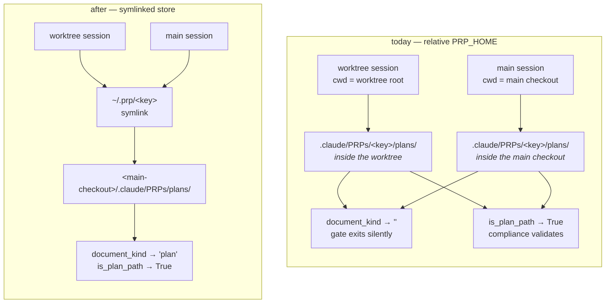

# One PRP store per repo, and a stack gate that can see it

**Plan ID:** `prp-store-symlink-wiring-and-stack-gate-blindness`
**Source PRD:** None
**PRD Phase:** None
**Source Issue:** None
**Plan Publication:** None

## Outcome

**Problem:** The harness wires prp-core's artifact store into a repo by writing a *relative*
`PRP_HOME` (`.claude/PRPs`) into `.claude/settings.json`. Two things follow from that, both
observed in this repo. First, prp-core appends its own `<slug>-<hash8>` store key, so documents
land in `.claude/PRPs/<slug>-<hash8>/plans/` — a layout the stack-compiler gate does not
recognise, so it exits silently on every PRD and plan prp-core writes. Second, a relative path
is resolved by the shell against the session's working directory, so a worktree session gets its
own physical store instead of the single shared one prp-core's `--git-common-dir` key is designed
to produce.

**Affected user:** Anyone who installs `compliance-compiler` or `stack-compiler` into a repo and
then writes a PRD or plan — including this repo. The gate they installed appears healthy and
validates nothing.

**User outcome:** Every PRD and plan prp-core writes is seen by the gate that was installed to
check it, from the main checkout and from any worktree, and the doctor names the wiring when it
is wrong instead of leaving a silent hook.

**Invariant:** A PRP document written anywhere inside the repo's artifact store is classified by
both gates as the document it is. Archived documents (`completed/` below the store) stay
unclassified, and no path outside the repo root is ever classified.

**Success signal:** `/nw-doctor` reports the store wiring on every repo it runs in, and a
deliberately off-stack component written into a plan produces a stack-gate report. Today that
same write produces nothing at all.

**Approach:** Replace the `PRP_HOME` env write with a symlink `~/.prp/<slug>-<hash8>` →
`<main-checkout>/.claude/PRPs`, keeping `PRP_HOME` only as a fallback where symlinks are not
available. Independently, widen `document_kind` to accept the one store segment that
`is_plan_path` already accepts, so a gate is never blind again regardless of how a repo was
wired. Add a doctor check that reports the store wiring and a split store.

## Recommendation

The symlink is the smallest wiring that satisfies both halves of the invariant at once, because
it moves the decision out of the shell's cwd resolution and into the filesystem.

prp-core's resolver already computes a worktree-invariant identity: `_root` comes from
`git rev-parse --path-format=absolute --git-common-dir`, which returns the main checkout's `.git`
for every linked worktree, so `<slug>-<hash8>` is byte-identical from anywhere in the repo. The
only thing that breaks the shared store is the *prefix*: `PRP_DIR="${PRP_HOME:-$HOME/.prp}/..."`
is plain string concatenation, and the shell resolves the relative result against wherever the
session happens to stand. With `PRP_HOME` unset, the prefix is `$HOME/.prp` — absolute, cwd-independent —
and a symlink at `~/.prp/<key>` sends it into the repo. The worktree-invariant key and the
worktree-invariant path then agree, which is what the resolver's design intended all along.

The symlink also fixes the gate blindness as a side effect, because both gates call `.resolve()`
before `relative_to()` (`gate_lib.py:69`, `precheck.py:85`), so a path under the symlinked store
collapses to the flat in-repo path both filters already accept. That was verified empirically,
not inferred.

The `document_kind` widening is still worth doing, and is not redundant: it is defence for repos
already wired with `PRP_HOME` (every existing install), and for the fallback path. It costs one
`elif` branch mirroring a contract `is_plan_path` has carried and tested since the store layout
was introduced — this makes two implementations of one decision agree rather than adding a
mechanism.

No new state, no new subsystem. The store key is computable from stdlib (`hashlib.sha1` over
git's blob preimage) — verified to produce `35325a96` for this repo, identical to
`git hash-object` — so the installers need no new dependency and no subprocess.

### Evidence

- `stack-base/scripts/gate_lib.py:72-75` — `if parts[: len(head)] != head: return ""`. A single
  literal prefix equality against one `head` tuple. For `.claude/PRPs/<slug>-<hash8>/plans/x.plan.md`,
  `parts[:3]` is `(".claude", "PRPs", "<slug>-<hash8>")` and never equals `(".claude", "PRPs", "plans")`.
- `compliance-base/scripts/precheck.py:92-98` — the same decision with a second branch:
  `rest[:1] == ("plans",)` or `rest[1:2] == ("plans",)`. One store segment, any name. This is the
  contract `document_kind` is missing.
- `stack-base/hooks/st-post-tooluse.py:92-94` — `kind = document_kind(...)`; `if not kind: return`.
  Returns before the existence check (`:99`), the catalog load (`:115-119`), the spawn ledger
  (`:123-138`) and the only `print` in the file (`:150`). No logging, no stderr, no report file:
  the gate leaves no trace that it considered the write.
- `compliance-base/hooks/co-post-tooluse.py:133` + `precheck.py:82` — the compliance gate is
  **not** affected: it accepts both layouts for `.plan.md`, and never handled `.prd.md` at all.
- `engines/compliance-compiler/install.py:269-280` and `engines/stack-compiler/install.py:161-172`
  — both call `set_env_default(root, "PRP_HOME", ".claude/PRPs")`, and both merely *print* on
  `"conflict"`. A repo wired to a different store still reports a successful install.
- `engines/_shared/settings.py:38-71` — `set_env_default` returns `("wrote"|"already"|"conflict", current)`,
  writes atomically, never touches unrelated keys. This is the contract the new linker mirrors.
- `engines/compliance-compiler/tests/test_shards_precheck.py:136-151` —
  `test_matches_prp_home_store_layout` pins the store-segment tolerance for `is_plan_path`.
  `engines/stack-compiler/tests/test_gate_lib.py` has no counterpart, which is why the blindness
  was never caught.
- `plugins/neurawork-cc-harness/scripts/doctor.py:679-706` — `run_checks` is the single dispatcher;
  a check is a `check_<name>(...) -> list[Finding]` plus one `findings.extend(...)` line. It already
  computes `worktree = in_worktree(repo_root)` and `main_checkout_root(repo_root)` (`:684-687`).
- `engines/stack-compiler/tests/test_payload_drift.py:40-70` — compares sorted filenames and then
  bytes for `scripts/` and `hooks/` between `payload/` and the `stack-base/` self-host. Any payload
  edit must be mirrored, or the suite fails.
- [git worktree docs](https://web.mit.edu/git/git-doc/git-worktree.html) — `git worktree add` does
  not materialise gitignored files, which is why an absolute `PRP_HOME` in `settings.local.json`
  is not an option and the installer comment (`install.py:41-45`) is correct on that point.
- [claude-code#46889](https://github.com/anthropics/claude-code/issues/46889) — variable expansion
  in the settings `env` block is closed as not planned; values are literal strings. The relative
  value cannot be made absolute inside `settings.json`.

### Alternatives considered

- **Keep `PRP_HOME`, only fix `document_kind`:** leaves the worktree split in place and keeps two
  physical stores per repo. Rejected at the design gate in favour of one store.
- **Absolute `PRP_HOME` in `.claude/settings.local.json`:** `git worktree add` does not create the
  file, so every worktree silently falls back to `~/.prp`. This is exactly the failure the current
  comment cites.
- **Configure `plans_subpath`/`prds_subpath` to include the store segment:** `document_kind` matches
  exactly one `head` tuple, so this trades the store layout for the flat layout rather than
  supporting both, and bakes a per-repo path hash into config that goes stale when the repo moves.
- **Teach the gate to glob for `plans` anywhere in the path:** turns any directory into an accepted
  store and breaks the closed-root guarantee the `.resolve().relative_to()` guard provides.

## Root Cause

- **Observed failure:** `gate_lib.document_kind` returns `''` for
  `.claude/PRPs/<slug>-<hash8>/plans/x.plan.md` and `.../prds/x.prd.md`, and `'plan'`/`'prd'` for
  the flat layout and for a path under a symlinked store. Measured directly against this repo's
  installed `stack-base/`.
- **Causal chain:** installer writes relative `PRP_HOME=.claude/PRPs` → prp-core's resolver appends
  `<slug>-<hash8>` → documents land one directory deeper than `plans_subpath` describes →
  `document_kind`'s single-prefix equality fails → `st-post-tooluse.py:93` returns before producing
  any output → the gate is indistinguishable from a gate that ran and approved.
- **Fix boundary:** `stack-base/scripts/gate_lib.py:72-75` (and its payload twin) for the blindness;
  the installers' `set_env_default` call sites for the wiring. Both call sites of `document_kind`
  (the hook and `validate.py`) route through the one function.
- **Regression proof:** a `document_kind` test asserting `'plan'`/`'prd'` for the store layout fails
  before the change and passes after; `test_gate_hook.py` gains an end-to-end case proving the hook
  emits output for a store-layout write.
- **Remaining uncertainty:** None for the blindness. For the wiring, the behaviour change is
  deliberate and stated under Delivery Considerations: a plan written from a worktree now lands in
  the main checkout and no longer travels with the feature branch.

## Visuals

Where a PRD/plan write lands, and which gate sees it.

The store key `<key>` is identical in every box — prp-core derives it from `--git-common-dir`. Only
the prefix differs, and only because a relative prefix is resolved against the session's cwd.

## Implementation Context

### Mandatory reading

| File | Why it matters |
|---|---|
| `engines/stack-compiler/payload/scripts/gate_lib.py:50-76` | The function to widen. Its contract, the `completed/` rejection and the closed-root guard must survive. |
| `engines/compliance-compiler/payload/scripts/precheck.py:70-99` | The already-correct two-layout contract to mirror, including its docstring rationale for allowing exactly one segment. |
| `engines/_shared/settings.py:38-71` | `set_env_default`'s status-tuple contract and atomic-write discipline; the new linker mirrors both. |
| `engines/compliance-compiler/install.py:255-284` | The install step to replace, and how a non-fatal wiring result is reported. |
| `engines/stack-compiler/install.py:145-180` | The same step in the second installer, plus the precedent for a warn-never-fail dependency notice. |
| `plugins/neurawork-cc-harness/scripts/doctor.py:679-706` | `run_checks`, the single dispatcher and the only extension point for a new check. |
| `plugins/neurawork-cc-harness/scripts/doctor.py:64-70` | The `Finding` shape and the `OK/NOTE/WARN/ERROR` severity ladder that drives the exit code. |
| `engines/stack-compiler/tests/test_payload_drift.py:40-70` | Why every payload edit must be mirrored into `stack-base/`. |

### Existing patterns and primitives

- **Two-layout path acceptance:** `precheck.py:92-98` — `rest[:1] == ("plans",)` else
  `rest[1:2] == ("plans",)`, with `tail` taken from whichever branch matched so the `completed/`
  rejection applies identically to both. This exact shape transfers to `document_kind`, where the
  subpath's last element plays the role of `"plans"` and the leading elements the role of `PRP_SUBPATH`.
- **Status-tuple wiring result:** `set_env_default` (`_shared/settings.py:38-71`) returns
  `(status, current)` and leaves the decision about severity to the caller. The linker uses the same
  shape so both installers keep one reporting style.
- **Store key from stdlib:** `hashlib.sha1(b"blob %d\0" % len(p) + p).hexdigest()[:8]` over the
  resolved root path reproduces `git hash-object --stdin` exactly (verified: `35325a96`). No
  subprocess, consistent with the stdlib-only engine rule.
- **Repo-scoped doctor findings:** `doctor.py:189-226` emits `Finding(..., REPO, "settings"|"uv"|...)`
  for facts that belong to the repo rather than an engine. Store wiring is repo-scoped in the same way.
- **Worktree awareness in the doctor:** `doctor.py:684-687` already distinguishes the checkout it
  stands in from the main checkout, and uses the latter for queue state. The store check needs the
  same distinction.

### Integration points

- `engines/compliance-compiler/install.py:269` and `engines/stack-compiler/install.py:161` — the two
  `set_env_default` call sites being replaced.
- `stack-base/hooks/st-post-tooluse.py:92` and `stack-base/scripts/validate.py` — the two callers of
  `document_kind`; both benefit from the widening without changes of their own.
- `plugins/neurawork-cc-harness/scripts/doctor.py:689` — where a repo-scoped check joins the report.

## Scope

### In scope

- Widen `document_kind` to accept exactly one store segment, with the regression test the stack side
  never had.
- A shared `link_prp_store` helper that creates `~/.prp/<slug>-<hash8>` → `<main-checkout>/.claude/PRPs`,
  reports a conflicting or unlinkable target instead of overwriting, and computes the key from stdlib.
- Both installers switch to it, falling back to the existing `PRP_HOME` write only when linking is
  unsupported, and reporting what they did either way.
- A doctor check reporting the store wiring — linked, `PRP_HOME`, both, neither — and a split store
  found in a worktree.
- Mirror every payload edit into `compliance-base/` and `stack-base/` so `test_payload_drift.py` passes.
- Documentation: the store-wiring paragraph in `CLAUDE.md` and `docs/ARCHITECTURE.md`, since the
  installed behaviour changes.

### Not building

- Migrating existing repos' artifacts. The doctor reports a split store and names the fix; moving
  another repo's files is not this change's business.
- Removing `PRP_HOME` support. It stays as the documented fallback and keeps working for repos
  already wired that way — which is precisely what the widened `document_kind` protects.
- A drift guard for `compliance-compiler` (`payload/` vs `compliance-base/`), which `stack-compiler`
  has and compliance does not. Real gap, separate change.
- Deleting the unused `PLANS_SUBPATH` constant (`compliance/payload/scripts/config.py:36`).
  Pre-existing dead code, named here rather than removed.
- Changing prp-core. Its resolver is correct; only the harness's prefix was wrong.

## Delivery Considerations

| Concern | Decision and owned work |
|---|---|
| Compatibility / migration | Repos already wired with `PRP_HOME` keep working unchanged: the widened `document_kind` makes their existing store layout visible to the gate for the first time. No artifact is moved by this change. Task 4's doctor check tells an operator whether their repo is on the old wiring. |
| Behaviour change | With a shared store, a plan written from a worktree session lands in the **main checkout** and no longer travels with the feature branch — PR #45 carried its own plan; a future one will not. This was chosen deliberately at the design gate. Task 5 documents it. |
| Rollout / reversibility | Reversible per repo by deleting the symlink and restoring the `PRP_HOME` key; both layouts stay supported, so neither direction strands artifacts. Reaching installed plugin caches needs a version bump — see Risks. |
| Observability | The silent-exit path is the whole defect. Task 4's doctor check turns "the gate never fired" into a reported finding. |
| Documentation | `CLAUDE.md` and `docs/ARCHITECTURE.md` describe the `PRP_HOME` wiring today and become false. Task 5 owns both, and the `neurawork-cc-harness:rules` marker block must stay byte-identical. |

## Implementation

### 1. The stack gate recognises a store-layout document

**Files and integration points**
- `engines/stack-compiler/payload/scripts/gate_lib.py:68-76` — UPDATE — the single function both
  the hook and `validate.py` route through.
- `stack-base/scripts/gate_lib.py` — UPDATE — byte-identical mirror, required by `test_payload_drift.py`.

**Implementation**
- After computing `rel` and `head`, accept two shapes instead of one, mirroring `precheck.py:92-98`:
  the configured subpath matched directly at the front, or matched with exactly one arbitrary segment
  inserted before its final element (the store key). Take the remaining tail from whichever branch
  matched, so the existing `completed` rejection applies identically to both.
- Do not glob and do not search for `plans`/`prds` anywhere in the path: exactly one extra segment,
  in one position. The closed-root guarantee from `.resolve().relative_to()` (`:69`) stays as is.
- The `cfg`-driven subpath stays authoritative — a repo that overrode `plans_subpath` to `docs/plans`
  gets the same one-segment tolerance relative to its own value.

**Tests**
- `engines/stack-compiler/tests/test_gate_lib.py` — a store-layout `.plan.md` and `.prd.md` classify
  as `plan`/`prd`; their `completed/` variants classify as `''`; two inserted segments classify as
  `''`; a `prds`-layout path under a store dir does not leak into the `plans` branch. Mirror the
  coverage `test_shards_precheck.py:136-165` already gives the compliance side.
- Keep every existing assertion in `test_gate_lib.py:125-159` green, especially the
  custom-`prds_subpath` case at `:155-159`.

**Validation**
- `cd plugins/neurawork-cc-harness/engines && python3 -m unittest discover -s stack-compiler/tests`
  — the new store-layout tests fail before the change, pass after; `test_payload_drift` stays green,
  proving both copies were updated.

### 2. The hook proves it end to end

**Files and integration points**
- `engines/stack-compiler/tests/test_gate_hook.py` — UPDATE — extend the existing silent-path suite
  at `:92-127`.

**Implementation**
- Add a case that drives the hook's JSON-in/JSON-out contract with a plan written at
  `.claude/PRPs/<slug>-<hash8>/plans/<name>.plan.md` containing an off-stack component, and assert
  the hook emits output rather than exiting empty. Use `test_block_mode_blocks_only_on_an_off_stack_component`
  (`:185-`) as the precedent for constructing a document the gate must react to.
- This is the test that would have caught the defect: `document_kind` unit coverage alone would not
  have, since the blindness lives in the agreement between the installed wiring and the filter.

**Tests**
- The case above. Keep the four existing silent-path assertions (`:92-127`) intact — an archived
  document and a non-PRP path must stay silent.

**Validation**
- `cd plugins/neurawork-cc-harness/engines && python3 -m unittest discover -s stack-compiler/tests`
  — the hook test fails before task 1 and passes after.

### 3. One store per repo, wired by symlink

**Files and integration points**
- `engines/_shared/prp_store.py` — CREATE — store identity and linking belong with the other shared
  install helpers, not duplicated in two installers.
- `engines/_shared/tests/test_prp_store.py` — CREATE.
- `engines/compliance-compiler/install.py:267-280` — UPDATE.
- `engines/stack-compiler/install.py:159-172` — UPDATE.
- `compliance-base/_shared/prp_store.py`, `stack-base/_shared/prp_store.py` — the refreshed `_shared/`
  copies each install carries.

**Implementation**
- `store_key(repo_root) -> str`: `<slug>-<hash8>`, where the slug is the resolved main-checkout
  basename lowercased with non-alphanumerics collapsed to `-` and trimmed, and `hash8` is
  `hashlib.sha1(b"blob %d\0" % len(p) + p).hexdigest()[:8]` over the resolved path with no trailing
  newline. Must reproduce `git hash-object --stdin` byte for byte — assert this against the known
  value for a fixture path.
- Resolve the main checkout the way prp-core does, via `git rev-parse --path-format=absolute
  --git-common-dir` stripped of its trailing `/.git`, so installing from a worktree links the main
  checkout and not the worktree. `_shared/recon.py`'s `git_root_or_none` is the existing entry point
  for git queries; extend or reuse rather than adding a second git-invocation style.
- `link_prp_store(repo_root, prp_home=Path.home()/".prp") -> tuple[str, str | None]` mirroring
  `set_env_default`'s contract:
  - `"linked"` — created, target is `<main-checkout>/.claude/PRPs`;
  - `"already"` — a symlink already resolving to that target;
  - `"conflict"` — the path exists as a real directory, or as a symlink pointing elsewhere. Never
    replace it; return what is there and let the caller report it. A real directory means another
    repo's artifacts or an older global store.
  - `"unsupported"` — `OSError`/`NotImplementedError` from `symlink_to` (Windows without Developer
    Mode). Not an error; the caller falls back.
- Create `<repo>/.claude/PRPs` first if absent, so the link never dangles.
- Installers: call `link_prp_store` first. On `"linked"`/`"already"`, say so and do **not** write
  `PRP_HOME`. On `"unsupported"`, fall back to the existing `set_env_default` call unchanged and say
  which path was taken. On `"conflict"`, report the occupying path and fall back to `PRP_HOME` — the
  gate still sees documents there thanks to task 1. Keep the current posture: a wiring problem prints
  and does not fail the install, matching `install.py:279`.

**Tests**
- `engines/_shared/tests/test_prp_store.py`: key reproduces the known `git hash-object` value; fresh
  link returns `"linked"` and resolves into the repo; a second call returns `"already"` and does not
  rewrite; a real directory at the target returns `"conflict"` with its path and is left untouched;
  a symlink to a different target returns `"conflict"`; a monkeypatched `symlink_to` raising `OSError`
  returns `"unsupported"`. Point `prp_home` at a `tmp_path` — never touch the real `~/.prp`.
- `engines/compliance-compiler/tests/test_install_recon.py` and
  `engines/stack-compiler/tests/test_install_recon.py`: a fresh install links and leaves
  `env.PRP_HOME` **absent**; an install whose link is unsupported writes `PRP_HOME` as before. This
  replaces `test_fresh_install_points_prp_home_at_the_repo` (`:206-215`) and the `PRP_HOME` assertion
  at `stack-compiler/tests/test_install_recon.py:108`. Keep
  `test_adopt_leaves_a_differing_prp_home_alone` (`:218-232`) green — an operator's own value is still
  never overwritten.
- `engines/_shared/tests/test_settings.py:226-273` keeps all five `set_env_default` cases: the helper
  is unchanged and still used on the fallback path.

**Validation**
- `cd plugins/neurawork-cc-harness/engines && python3 -m unittest discover -s _shared/tests`
- `cd plugins/neurawork-cc-harness/engines && python3 -m unittest discover -s compliance-compiler/tests`
- `cd plugins/neurawork-cc-harness/engines && python3 -m unittest discover -s stack-compiler/tests`

### 4. The doctor reports the store wiring

**Files and integration points**
- `plugins/neurawork-cc-harness/scripts/doctor.py` — UPDATE — add `check_prp_store(...) -> list[Finding]`
  and one `findings.extend(...)` line in `run_checks` (`:689`), beside the other repo-scoped checks.
- `plugins/neurawork-cc-harness/tests/test_doctor.py` — UPDATE.

**Implementation**
- Repo-scoped (`REPO`), read-only, no git writes and no filesystem changes — the doctor's standing
  contract (`doctor.py:18-21`).
- Report, using `probe.load_settings` for the env value and `os.path.realpath` for the link:
  - linked correctly and no `PRP_HOME` → `OK`;
  - neither a link nor `PRP_HOME` → `WARN`, since documents land in `~/.prp` outside the repo where
    neither gate sees them; fix names the install command that wires it;
  - `PRP_HOME` set and no link → `NOTE` naming the older wiring, not an error: it works, and task 1
    makes the gate see it;
  - both → `NOTE` stating that `PRP_HOME` wins and the link is inert;
  - `~/.prp/<key>` present but resolving somewhere else → `WARN` with both paths.
- Split store: when `in_worktree(repo_root)` (`:684`), compare `.claude/PRPs` here against
  `main_checkout_root(repo_root)`'s and report `WARN` with the count of documents that exist only in
  the worktree. Reuse the existing worktree helpers rather than adding a third way to ask the question.
- Only run the check when at least one gate-owning engine (`compliance-compiler`, `stack-compiler`)
  is installed. A repo with neither has no store to wire, and a `WARN` there would be noise.

**Tests**
- `tests/test_doctor.py`: each branch above against a temp repo — linked, absent, `PRP_HOME`-only,
  both, wrong target, worktree split. Assert severity and that the message names the offending path.
- One test asserting the check emits nothing when neither gate engine is installed.
- Keep the read-only assertion green.

**Validation**
- `cd plugins/neurawork-cc-harness && python3 -m unittest discover -s tests`
- `python3 plugins/neurawork-cc-harness/scripts/doctor.py` — in this repo, reports the store as linked.

### 5. Documentation matches the installed behaviour

**Files and integration points**
- `CLAUDE.md` — UPDATE — the `compliance-base`/`stack-base` paragraphs describing the gates.
- `docs/ARCHITECTURE.md` — UPDATE.
- `plugins/neurawork-cc-harness/skills/compliance-compiler/SKILL.md:24-25` and
  `skills/stack-compiler/SKILL.md:88` — UPDATE — both currently tell the reader the install sets
  `PRP_HOME`.
- `plugins/neurawork-cc-harness/commands/co-validate.md:22` — UPDATE — quotes the
  `.claude/PRPs/<repo>-<hash>/plans/` layout as the store path.

**Implementation**
- State the wiring as it now is: a symlink at `~/.prp/<slug>-<hash8>` into the repo, `PRP_HOME` as the
  documented fallback, and both layouts accepted by both gates.
- State the worktree consequence explicitly — one shared store, so a plan written from a worktree lands
  in the main checkout and does not travel with the feature branch.
- Leave the `neurawork-cc-harness:rules` marker block byte-identical; `claudemd-lerner` restores marker
  spans (`payload/scripts/markers.py`) and a reworded block is a silent conflict.

**Tests**
- The plugin-root suite pins the prompt-only assets, including the rules block's 1,500-char budget.

**Validation**
- `cd plugins/neurawork-cc-harness && python3 -m unittest discover -s tests`
- `grep -c 'neurawork-cc-harness:rules' CLAUDE.md` — exactly 2 (one BEGIN, one END).

## Acceptance

1. **AC1 — the stack gate sees a store-layout document:** given `stack-compiler` installed and a plan
   written to `.claude/PRPs/<slug>-<hash8>/plans/<name>.plan.md` naming an off-stack component, the
   `st-` PostToolUse hook emits its verdict instead of exiting empty. The same holds for a `.prd.md`
   under that store's `prds/`.
2. **AC2 — archived and foreign paths stay unclassified:** `document_kind` returns `''` for any path
   with `completed` below the subpath, for two or more inserted segments, and for any path outside the
   repo root. The `cfg`-driven subpath override keeps working.
3. **AC3 — one store per repo:** after a fresh install, `~/.prp/<slug>-<hash8>` is a symlink to the
   main checkout's `.claude/PRPs`, `env.PRP_HOME` is absent from `.claude/settings.json`, and a session
   in a linked worktree resolves its store to the same directory as a session in the main checkout.
4. **AC4 — an occupied or unlinkable target is reported, never overwritten:** a real directory or a
   foreign symlink at `~/.prp/<key>` leaves that path untouched, the installer falls back to `PRP_HOME`,
   and both facts are printed. A platform that cannot symlink installs successfully via the fallback.
5. **AC5 — the wiring is visible:** `/nw-doctor` reports the store wiring in any repo with a gate-owning
   engine, warns when documents would land outside the repo, and warns on a worktree split naming the
   count of worktree-only documents.
6. **AC6 — the existing contracts survive:** the compliance gate keeps classifying plans in both
   layouts, `set_env_default`'s five pinned behaviours are unchanged, and `test_payload_drift` proves
   payload and self-host copies stayed identical.

## Validation

| Gate | Command or procedure | Proves |
|---|---|---|
| Shared helpers | `cd plugins/neurawork-cc-harness/engines && python3 -m unittest discover -s _shared/tests` | AC3, AC4 (store key, link statuses), AC6 (`set_env_default` intact) |
| Compliance engine | `cd plugins/neurawork-cc-harness/engines && python3 -m unittest discover -s compliance-compiler/tests` | AC6 (both layouts still classify), install wiring |
| Stack engine | `cd plugins/neurawork-cc-harness/engines && python3 -m unittest discover -s stack-compiler/tests` | AC1, AC2, AC6 (payload drift) |
| Learner + knowledge engines | `cd plugins/neurawork-cc-harness/engines && python3 -m unittest discover -s knowledge-compiler/tests` and `-s claudemd-lerner/tests` | No collateral damage in the untouched engines |
| Prompt-only assets | `cd plugins/neurawork-cc-harness && python3 -m unittest discover -s tests` | AC5 (doctor), task 5 (docs, rules block) |
| Lint | `cd plugins/neurawork-cc-harness/engines/_shared && uvx ruff check` (and in each edited engine dir) | `line-length = 100` and the stdlib-only convention |
| Runtime | `python3 plugins/neurawork-cc-harness/scripts/doctor.py` in this repo | AC5 against the real install |
| Runtime | Write a plan naming an off-stack component into this repo's store and confirm a `stack-base/reports/<stem>.md` appears | AC1 end to end, outside the test harness |

## Risks and Decisions

| Decision or risk | Recommendation | Evidence / mitigation | Consequence if different |
|---|---|---|---|
| Symlink support on Windows without Developer Mode | Ship the `"unsupported"` fallback to `PRP_HOME`; do not detect the platform, catch the error | `link_prp_store` returns a status rather than raising; task 1 makes the fallback layout fully visible to the gate | Without the fallback, installs fail on a platform the harness never claimed to exclude |
| A real `~/.prp/<key>` directory from an older global store | Report `"conflict"` and fall back; never move or delete another store's contents | This repo had exactly that state, holding eleven reports | Auto-migration risks destroying artifacts the installer cannot attribute |
| The fix does not reach installed plugin caches without a version bump | Bump the plugin version in the same PR | `knowledge-base/knowledge/concepts/plugin-version-bump-propagates-cache.md` — the marketplace pulls only on a new version; a prior fix sat unused until `0.3.1` | The change lands on `main` and no installed repo behaves differently |
| Minor: `PRP_HOME` in an already-running session's process environment | Note it in the install output | Observed here — `settings.json` no longer sets it, yet the resolver still saw it until restart | An operator concludes the wiring failed when it only needs a restart |
| Minor: no payload drift guard for `compliance-compiler` | Out of scope; named under Not building | `test_payload_drift.py` exists only for `stack-compiler` | A compliance payload edit can silently diverge from `compliance-base/` |

## Compliance

**Capabilities**: none — this change touches only developer tooling that runs on a maintainer's own
machine. It processes no personal data, adds no data subject, no external interface and no
authentication or authorisation surface. The three artifacts it moves or reclassifies (PRP plans,
PRDs, reports) are the repository's own tracked documents, written by the maintainer for the
maintainer. It stores nothing new: the one filesystem object it creates is a symlink whose target
is a directory already tracked in git.

The one adjacent control worth naming is that the change makes an existing gate *work* rather than
weakening one — `stack-base`'s PostToolUse validator currently exits silently on every document
prp-core writes, and after this change it validates them. Nothing here loosens a check.

## Agent Notes

- Both engines exist twice: `engines/<name>/payload/...` and the live self-host (`compliance-base/`,
  `stack-base/`). They were byte-identical at planning time. Edit the payload and re-run the installer
  to propagate, rather than hand-editing both trees.
- The store key was verified reproducible from stdlib during planning:
  `hashlib.sha1(b"blob %d\0" % len(p) + p).hexdigest()[:8]` over `/home/felix/projects/howtobuildsoftware2026`
  yields `35325a96`, matching `printf %s "$path" | git hash-object --stdin`. Note the absent trailing
  newline — `echo` instead of `printf %s` produces a different hash.
- The compliance gate is **not** part of the defect. It classifies plans in both layouts and never
  handled PRDs. Do not "fix" `precheck.py`.
- `PLANS_SUBPATH` (`compliance/payload/scripts/config.py:36`) is unused dead code. Left in place
  deliberately.
- This repo's knowledge base holds nothing on `PRP_HOME`, the store layout, the gates or worktree hook
  behaviour — checked during planning. The lessons from this change are worth capturing afterwards.
