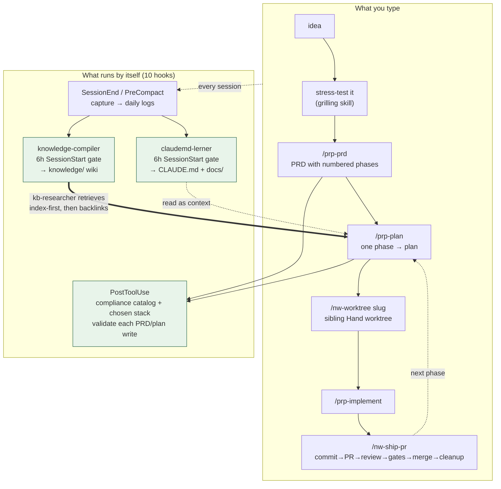

# The repo-root README is the harness's landing page: what it is, what to install beside it, and how a full loop runs

**Plan ID:** `root-readme-landing-page`
**Source PRD:** `None`
**PRD Phase:** `None`
**Source Issue:** `None` (conversation, 2026-08-27)
**Plan Publication:** `None`

## Outcome

**Problem:** `README.md` at the repo root is what GitHub renders for
`neurawork-git/howtobuildsoftware2026` and what a marketplace reader lands on. It is a
correct-but-partial install sheet, and three of the harness's load-bearing capabilities are
absent from it entirely:

- The **`kb-researcher` agent** and the two hooks that spawn it
  (`knowledge-base/hooks/user-prompt-submit.py`, `knowledge-base/hooks/pre-skill.py`) appear
  nowhere in the README's 97 lines. This is the plugin's one exported agent, its most
  distinctive capability, and the reason `knowledge-compiler` is more than a log archive.
  `.claude-plugin/marketplace.json:16` already advertises it; the README does not.
- **`/nw-rules-init`** is a shipped skill (`plugins/neurawork-cc-harness/skills/nw-rules-init/SKILL.md`)
  and is missing from the command table (`README.md:56-63`), which lists seven of eight surfaces.
- **`stack-compiler` / `stack-base`** is invisible. The engine payload ships
  (`plugins/neurawork-cc-harness/engines/stack-compiler/payload/`), it has no installer, and this
  repo's `stack-base/` was installed by hand. A reader who greps the tree finds a fourth engine
  the README does not mention.

Two further gaps are about use rather than inventory. The README never names the **companion
plugins the harness assumes** — every one of its five slash commands that acts on a PRP artifact
(`co-validate`, and the `PostToolUse` gates that fire on `.claude/PRPs/plans/*.plan.md` writes) is
inert without `prp-core`, and `/nw-ship-pr` shells out to the `gh` CLI 18 times
(`plugins/neurawork-cc-harness/commands/nw-ship-pr.md:23,56,61,63,112,205,555-571,644`). And it
never shows **how the pieces combine** — a reader can learn what each of the eight surfaces does
and still not know which to type when, or that the knowledge a later phase reads was written by
the earlier phases without anyone asking.

**Affected user:** Someone arriving at the GitHub repo or the marketplace listing who has not seen
this repo before, deciding whether the harness solves their problem and what a day of work with it
looks like. Secondarily the repo's own contributors, who currently learn the workflow loop by
being told it rather than by reading it.

**User outcome:** A stranger reads one page and can (1) name every surface the plugin ships,
including the one that is deliberately not installable yet; (2) install the harness and the two
companions it depends on; and (3) follow the idea → PRD → plan → worktree → implement → ship loop
without opening `docs/INSTALL.md` or `docs/ARCHITECTURE.md` first — while every deeper question is
one link away in those two files.

**Invariant:** Every claim in the root README traces to a file in this tree, a frontmatter
`description`, or a PRD phase table. The README states the *shape* of the harness and links for
depth; it never becomes a second copy of `docs/INSTALL.md` (install mechanics, recon, seeding,
local development) or `docs/ARCHITECTURE.md` (engine/payload split, `_shared/`, install flow).
The marketplace install commands stay inline in the README rather than behind a link.

**Success signal:** Not measured separately — the outcome is the page itself and is fully covered
by acceptance. The observable proxy: a reader who has never opened this repo can, from the README
alone, name all four engines, all eight command surfaces, the one exported agent, and the two
companion plugins, and can state which single command starts each stage of the loop.

**Approach:** One file, restructured into nine sections in reading order, in four tasks that each
own a distinct section boundary and each carry their own grep validation. The rewrite lands
**after** `harness-doctor` merges and absorbs its `/nw-doctor` row and "if the harness seems
quiet" paragraph as existing text rather than re-authoring them.

## Recommendation

Restructure rather than extend. The current README is organized as *inventory, then install* —
correct for a reader who already knows they want it, wrong for the landing page of a repo whose
whole thesis is a **workflow**. The three missing capabilities are not three more bullets; they
are the evidence for the claim the page never makes, which is that the harness closes a loop.

Three decisions carry the design:

- **The workflow narrative is the centrepiece, and it needs a diagram.** The loop has two
  concentric parts — a human path (`grill → /prp-prd → /prp-plan → /nw-worktree → /prp-implement →
  /nw-ship-pr`) and a background path (10 hooks registered in `.claude/settings.json` that capture,
  compile, learn, and gate without being asked). Prose can carry either one; only a diagram carries
  the fact that the second **feeds back into** the first — that `kb-researcher` retrieves at the
  next `/prp-plan` what the previous phase's session logs became. That feedback edge is the
  product, and it is exactly what a linear bullet list cannot draw. `references/visuals.md`'s
  architecture-diagram criterion (changed data flow, ownership across boundaries) applies.

- **Companion plugins are stated as prerequisites with evidence, not as a recommendation list.**
  `prp-core` is load-bearing and provably so: `compliance-base/hooks/co-post-tooluse.py` and
  `stack-base/hooks/st-post-tooluse.py` both trigger on writes to `.claude/PRPs/plans/*.plan.md`
  and `.claude/PRPs/prds/*.prd.md` — paths only `prp-core` creates — and
  `knowledge-base/scripts/research_directive.py:32,39` matches
  `^([\w-]+:)?prp-(plan|prd|debug)$`, so the `kb-researcher` spawn directive has no trigger at all
  without it. Two of the harness's four installs are inert on their own. That is a requirement, and
  the README should say requirement.

  The `gh` requirement is a **correction to the stated intent** and is recorded here rather than
  buried: `/nw-ship-pr` uses the `gh` **CLI** directly (18 invocations, `commands/nw-ship-pr.md`),
  not the `github@claude-plugins-official` plugin and not GitHub MCP. Listing the plugin would be
  a false prerequisite. The README lists `gh`, installed and authenticated.

- **`stack-compiler` gets a named, honest section, not silence.** The sentence that explains it
  exists today only in a test docstring
  (`engines/stack-compiler/tests/test_payload_drift.py:1-13`) that no user reads. Lifting it into
  the README is the whole fix: the payload ships, there is no installer yet, this repo's
  `stack-base/` was installed by hand, that drift test is what keeps the two copies identical
  meanwhile, and the installer is `stack-compiler.prd.md` Phase 5. A reader who greps the tree
  finds the fourth engine either way; the only choice is whether the README explains it.

### Evidence

- `README.md:1-97` — the current page: `## Overview`, `## Status`, `## Install / Use`,
  `### Slash commands`, `## Sources`, `## Contributing`, `## License`. No workflow section, no
  agent, no companions, no `stack-compiler`.
- `plugins/neurawork-cc-harness/agents/kb-researcher.md:1-101` — the one exported agent:
  `tools: Read, Grep, Glob`; index-first (`:44-52`), then a **backlink walk** (`:66-86`) which is
  the only route into the `connections/` layer, because forward links run from `connections/` down
  to `concepts/` and never back up.
- `.claude/settings.json:9,14,26,31,43,48,60,65,77,89` — ten hooks: `knowledge-base` 5,
  `claudemd-lerner` 3, `compliance-base` 1, `stack-base` 1. Plus a separate plugin-level
  `SessionStart` staleness nudge in `plugins/neurawork-cc-harness/hooks/hooks.json:1-16`, which is
  wired by the plugin itself and never appears in the repo's `settings.json`.
- `knowledge-base/scripts/research_directive.py:32,39,53-82,96` — the two-hook spawn directive:
  `DEFAULT_SKILL_MATCH = r"^([\w-]+:)?prp-(plan|prd|debug)$"`,
  `DEFAULT_PROMPT_MATCH = r"^\s*/(?:[\w-]+:)?prp-(plan|prd|debug)(?![\w-])"`, the injected
  "FOURTH research axis" text, and the `research_directive` config key (default `True`).
  Two hooks because a typed `/prp-prd` fires only `UserPromptSubmit`
  (`knowledge-base/hooks/user-prompt-submit.py:1-6`) and a model-invoked one only
  `PreToolUse`/`Skill` (`knowledge-base/hooks/pre-skill.py:1-7`); both fail open
  (`pre-skill.py:76`, `user-prompt-submit.py:61`).
- `plugins/neurawork-cc-harness/engines/stack-compiler/` — `VERSION`, `config.default.json`,
  `payload/`, `tests/`; **no** `install.py`, **no** `recon.py`. The other three engines have both.
- `engines/stack-compiler/tests/test_payload_drift.py:1-13` — the docstring to lift: "`stack-compiler`
  has no `install.py` yet (it lands in the PRD's Phase 5), so the self-host was installed by hand.
  Until then this test is what keeps the two copies identical."
- `plugins/neurawork-cc-harness/skills/nw-rules-init/SKILL.md:2-5` and
  `skills/nw-worktree/SKILL.md:2-5` — the two install-free skills; both carry `argument-hint`, and
  neither has a file in `commands/` (which holds exactly six: `kc-compile`, `cl-update`,
  `co-extract`, `co-capabilities`, `co-validate`, `nw-ship-pr`).
- `docs/INSTALL.md:23,38,44,59,100,113,148,180,199,208` and `docs/ARCHITECTURE.md:7,24,55,68,77,91,109,120,194`
  — the section maps that define what the README must **not** duplicate. `docs/ARCHITECTURE.md:120`
  ("Runtime: the fourth research axis") already owns the deep explanation of `kb-researcher`; the
  README states the capability and links there.
- `knowledge-base/knowledge/concepts/plugin-marketplace-install.md` — prior decision: the two
  `/plugin` commands belong **inline** in the README's install section, not behind a link to
  `INSTALL.md`.
- `knowledge-base/knowledge/concepts/readme-getting-started-vs-contributing.md` — prior decision:
  the README splits user install/use from contributor clone instructions. `README.md:80-92` already
  implements it; the rewrite preserves that split.
- `knowledge-base/knowledge/concepts/verify-generated-artifacts-before-commit.md` — prior finding
  from `0.3.1`: LLM-written docs in this repo were fact-checked against real files and config
  before commit. That is the standard this rewrite is held to, and the reason every task below ends
  in a grep rather than a reading.
- `/home/felix/projects/howtobuildsoftware2026-harness-doctor` — `git diff -- README.md` shows 14
  changed lines already in the working tree: the `last two` → `last three` sentence, a `/nw-doctor`
  table row, a five-line "if the harness seems quiet" paragraph, and an amended API-key note. This
  is a live edit to the same three regions this plan rewrites.
- `claudemd-lerner/scripts/update.py:132-135` and `claudemd-lerner/scripts/seed.py:75-87` — the
  learner's marker guard snapshots `claudemds + docs` only. `README.md` is in neither set.

### Alternatives considered

- **Put the workflow narrative in `docs/` and link to it from the README.** Loses the readers it is
  for. The loop *is* the pitch; a landing page that defers its own thesis to a subpage gets read as
  another install sheet. `docs/ARCHITECTURE.md:109-193` already owns the mechanism-level version
  (runtime, capture, synthesis, the fourth axis) — the README owns the *use* version, which is a
  different document, not a shorter one.
- **Add the missing pieces as bullets to the existing structure.** Cheapest, and it fixes the
  inventory gaps. It does not fix the ordering problem: `## Status` ("🚧 Early stage") sits above
  the install block, and the workflow has nowhere to go that is not an appendix. The three gaps are
  a symptom; the missing spine is the defect.
- **Protect the rewritten README with a `neurawork-cc-harness:readme` marker block.** A trap, and
  worth recording so nobody tries it: `markers.py` protects only the paths passed to `snapshot()`,
  and both call sites pass `claudemds + docs` (`update.py:132-135`, `seed.py:126`). A marker in
  `README.md` would be parsed by nothing and restored by nothing — protection that reads as real
  and is not. See *Risks and Decisions* for why no protection is needed.

## Visuals

The loop the README must draw — human path in sequence, background path fed by the same sessions,
and the one edge that closes it:



The thick edge is the point of the page: the knowledge a later phase plans against was written by
the earlier phases, and nobody asked for it. `kb-researcher` is what turns the wiki from an archive
into a research axis, and the two `research_directive` hooks are what make the retrieval automatic
rather than remembered. Everything else in the diagram already appears in the README in some form.

## Implementation Context

### Mandatory reading

| File | Why it matters |
|---|---|
| `README.md:1-97` | The page being rewritten. Sections to preserve verbatim in substance: the inline `/plugin` install block (`:34-38`), the per-skill invocation block (`:43-47`), the docs links (`:74-77`), `## Sources` (`:78-...`), `## Contributing` (`:80-92`), `## License`. |
| `plugins/neurawork-cc-harness/agents/kb-researcher.md:1-101` | The agent's real contract: read-only tool set, index-first, backlink walk, ~10-15 article bound. The README must not overstate it as search-anything. |
| `knowledge-base/scripts/research_directive.py:32,39,53-82,96` | The exact trigger regexes, the injected directive, and the `research_directive` off-switch. Any README claim about "automatic" retrieval is bounded by these two regexes. |
| `.claude/settings.json` | The ten hooks, their events and owners. The "what runs by itself" section is written from this file, not from memory. |
| `engines/stack-compiler/tests/test_payload_drift.py:1-13` | The `stack-compiler` status sentence, already written, currently invisible. |
| `docs/INSTALL.md:23-228` and `docs/ARCHITECTURE.md:7-217` | The duplication boundary. Read both section maps before writing, and link rather than restate. |
| `plugins/neurawork-cc-harness/commands/nw-ship-pr.md:1-6,23,56,61,205,555-571,644` | The `/nw-ship-pr` phase order (frontmatter `description` is authoritative) and the `gh` CLI dependency. |
| `.claude/PRPs/plans/harness-self-description-and-install-reach.plan.md:466-503` | Task 5, which owns the **plugin** README. Read it to stay on the correct side of the boundary and to keep the two pages consistent where they overlap. |

### Existing patterns and primitives

- **Prior README decisions are recorded, not guesswork.**
  `knowledge-base/knowledge/concepts/plugin-marketplace-install.md` (install commands inline) and
  `knowledge-base/knowledge/concepts/readme-getting-started-vs-contributing.md` (user vs
  contributor split) are the two constraints the current structure already satisfies. Preserve both.
- **Command-table precedent:** `README.md:56-63` — a two-column `| Command | What it does |` table
  whose right column is one sentence taken from the command's frontmatter `description`. Extend the
  same table; do not invent a second format.
- **Honest-omission precedent:** `docs/ARCHITECTURE.md:55-66` ("install skills vs. workflow skills")
  already distinguishes the two surface kinds in prose the README can compress rather than re-derive.
- **Prose register:** root `CLAUDE.md` → *Conventions*: "Doc prose is factual, neutral, instructive."
  Dates ISO 8601. Skills referred to by fully qualified name where a collision is plausible.

### Integration points

- `README.md` — the only file this plan writes. No code, no tests, no manifest, no `docs/` changes.
- `docs/INSTALL.md` and `docs/ARCHITECTURE.md` — link targets only. If the rewrite reveals that a
  README claim has no home in either file, that is a finding to report, not a silent edit here.

## Scope

### In scope

- A full restructure of `README.md` into nine sections in reading order: what it is → install →
  companions → the workflow → command reference → what runs by itself → not installable yet →
  deeper docs → contributing / sources / license.
- The three missing inventory items: `kb-researcher` (+ its two spawn hooks and off-switch),
  `/nw-rules-init`, `stack-compiler`/`stack-base`.
- A prerequisites section naming `prp-core` (with its marketplace install commands) and the `gh`
  CLI, each with the reason it is required.
- The workflow narrative with the mermaid diagram above, naming which command starts each stage.
- Preserving the inline install block, the docs links, `## Sources`, `## Contributing`, `## License`.

### Not building

- **`plugins/neurawork-cc-harness/README.md`, `plugin.json`, `CHANGELOG.md`** — owned by
  `.claude/PRPs/plans/harness-self-description-and-install-reach.plan.md` Task 4 and Task 5. That
  plan is open and unstarted (`feature/harness-self-description` clean at `910b0f9`). Touching them
  here would produce two rewrites of one file.
- **`/nw-doctor` documentation** — authored by `.claude/PRPs/plans/harness-doctor.plan.md` Task 4,
  in flight now. This plan lands after it and carries its text forward; it does not re-derive it.
- **`docs/INSTALL.md` / `docs/ARCHITECTURE.md` edits** — the README links to them. Any gap found in
  them is reported, not fixed here.
- **A `stack-compiler` installer** — `stack-compiler.prd.md` Phase 5, `pending` behind a `pending`
  Phase 4. This plan only stops the README from being silent about the situation.
- **Marker-protecting the README** — see *Alternatives considered*; the protection would not exist.
- **A link-checker or docs test in CI** — the repo has no docs test surface, and adding one to
  validate one file is machinery for a single use.

## Delivery Considerations

| Concern | Decision and owned work |
|---|---|
| Discoverability / adoption | The README *is* the discoverability surface. Task 2's workflow section and Task 1's prerequisites are what let a marketplace reader act; today they can install but not proceed. |
| Compatibility / migration | None — one Markdown file, no consumer parses it. The relative links (`docs/INSTALL.md`, `docs/ARCHITECTURE.md`, `LICENSE`, and the `#local-development-working-on-the-plugin` anchor at `README.md:88`) must survive; Task 4 verifies each target exists. |
| Rollout / reversibility | `git revert` of one commit. Sequenced after `harness-doctor` merges (see *Risks*), so no conflict resolution is part of the work. |
| Documentation / communication | This plan is the doc change. The plugin README stays consistent because the other plan writes it from the same tree — Task 4 diffs the two claim sets and reports any contradiction rather than editing the plugin side. |

## Implementation

### 1. A reader knows what to install beside the harness, and why

**Files and integration points**
- `README.md:17-47` — UPDATE — a new `## Before you start` section between the install block and
  the command table. It sits after the harness install because `prp-core` is a prerequisite for
  *use*, not for install.

**Implementation**
- Name `prp-core` as **required**, with the marketplace install commands verified against
  `~/.claude/plugins/known_marketplaces.json` before writing:
  `/plugin marketplace add Wirasm/PRPs-agentic-eng` then
  `/plugin install prp-core@prp-marketplace`. Link https://github.com/Wirasm/PRPs-agentic-eng.
- State the dependency concretely, not as a preference. `prp-core` supplies `/prp-prd`,
  `/prp-plan`, `/prp-implement`, `/prp-review`, `/prp-commit`, `/prp-pr` and the three research
  agents (`codebase-explorer`, `codebase-analyst`, `web-researcher`) that `kb-researcher` joins as
  the fourth. Without it: the compliance and stack `PostToolUse` gates never fire, because they key
  on `.claude/PRPs/plans/*.plan.md` and `.claude/PRPs/prds/*.prd.md` paths that only `prp-core`
  writes; and `research_directive.py`'s two regexes (`:32,39`) match nothing, so `kb-researcher` is
  never spawned automatically.
- Name the **`gh` CLI**, installed and authenticated, as required by `/nw-ship-pr` — which calls it
  18 times (`commands/nw-ship-pr.md:23,56,61,63,112,205,555-571,644`) for default-branch detection,
  PR create/view/checks, and merge. Do **not** list `github@claude-plugins-official`: `/nw-ship-pr`
  does not use the plugin or GitHub MCP, and listing it would be a false prerequisite.
- Name the API-key requirement once here rather than twice on the page: the LLM paths
  (`kc-compile`, `cl-update`, `co-extract`, `co-capabilities`, `co-validate`, and the stack scoping
  and ranking passes) need `ANTHROPIC_API_KEY` or `CLAUDE_CODE_OAUTH_TOKEN`; install, scaffolding,
  the inline plan prechecks, `stack-base`'s selection pass, and `/nw-doctor` run without one. Verify
  against the eight call sites before writing — `claudemd-lerner/scripts/update.py:126`,
  `knowledge-base/scripts/compile.py:97`, `compliance-base/scripts/extract.py:80`,
  `compliance-base/scripts/capabilities.py:149,237,278`, `compliance-base/scripts/validate.py:149`,
  `stack-base/scripts/scope.py:239`, `stack-base/scripts/rank.py:179`,
  `stack-base/scripts/validate.py:169` — and that `stack-base/scripts/selection.py` imports no SDK.
- Mention the grilling step's tooling as **optional**, one line, in the workflow section rather than
  here: `mattpocock-skills@claude-plugins-official` provides a `grilling` skill for stress-testing
  an idea before it becomes a PRD. Optional because the loop starts fine at `/prp-prd`.

**Validation**
- `grep -n 'PRPs-agentic-eng\|prp-core@prp-marketplace' README.md` — both present.
- `grep -n 'github@claude-plugins-official' README.md` — no output (the false prerequisite is absent).
- `grep -c 'ANTHROPIC_API_KEY' README.md` — `1` (stated once, not twice).

### 2. A reader can follow one loop from idea to merged PR

**Files and integration points**
- `README.md` — UPDATE — a new `## The standard workflow` section, placed after `## Before you
  start` and **before** the command reference table. Order matters: the table is a lookup, the
  narrative is what makes it legible.

**Implementation**
- Write the human path as numbered stages, each naming exactly one command and what it produces:
  1. **Stress-test the idea** — optional; `mattpocock-skills:grilling` from
     `anthropics/claude-plugins-official`. Output: an idea that survived questioning.
  2. **`/prp-prd`** — a PRD with numbered implementation phases, written to
     `.claude/PRPs/prds/<name>.prd.md`.
  3. **`/prp-plan`** — one phase becomes an implementation-ready plan in
     `.claude/PRPs/plans/<name>.plan.md`. This is where `kb-researcher` is spawned automatically.
  4. **`/nw-worktree <slug>`** — a sibling Hand worktree on a new branch, session cwd switched into
     it, so the phase is built in isolation. Conventions are detected once and cached in
     `<repo-root>/.claude/worktree.local.md` (`skills/nw-worktree/SKILL.md:2`).
  5. **`/prp-implement`** — build the plan.
  6. **`/nw-ship-pr`** — the fixed lifecycle, quoted from the command's own frontmatter
     (`commands/nw-ship-pr.md:2`): commit → push → PR → workflow review → validation gate →
     explanation → approval gate → follow-up capture → merge → branch cleanup. The review fan-out
     runs `workflows/nw-ship-pr-review.js` (`commands/nw-ship-pr.md:207-212`).
  7. **Back to step 3** for the next PRD phase.
- Then the background path, in one short paragraph plus the diagram: every session is captured on
  `SessionEnd` and `PreCompact`; behind a 6-hour `SessionStart` gate, `knowledge-compiler` distils
  the logs into `knowledge/` and `claudemd-lerner` edits `CLAUDE.md` + `docs/` in place; a
  `PostToolUse` pair checks each PRD/plan write against the compliance catalog and the chosen stack
  as it is written. State the count — ten hooks — and that it is visible in the repo's own
  `.claude/settings.json`.
- Close the loop explicitly in prose under the diagram: the next `/prp-plan` retrieves what the
  previous phases produced. Name the mechanism accurately — `kb-researcher` reads `knowledge/index.md`
  first and then walks **backlinks**, which is the only route into the `connections/` layer
  (`agents/kb-researcher.md:44-52,66-86`) — and name the two hooks that spawn it and the
  `"research_directive": false` key that disables both, live
  (`knowledge-base/config.json`, `research_directive.py:96`).
- Insert the mermaid diagram from *Visuals* above. GitHub renders mermaid in Markdown natively.
- Bound the automatic-retrieval claim honestly: the directive fires on `/prp-plan`, `/prp-prd` and
  `/prp-debug` only (`research_directive.py:32,39`), typed or model-invoked. Do not write "on every
  research task".

**Validation**
- `grep -n 'kb-researcher' README.md` — at least two hits (the workflow section and the command/agent
  reference).
- `grep -n 'prp-prd\|prp-plan\|nw-worktree\|prp-implement\|nw-ship-pr' README.md` — a hit for each of
  the five stages.
- `grep -n 'backlink' README.md` — present; the retrieval claim names its real mechanism.
- `grep -c '```mermaid' README.md` — `1`.

### 3. The inventory is complete: the agent, the eighth surface, and the engine with no installer

**Files and integration points**
- `README.md:17-32` — UPDATE — the skill list gains each install's directory name and hook prefix.
- `README.md:49-63` — UPDATE — the command table gains `/nw-rules-init`; the sentence above it is
  corrected to the real split.
- `README.md` — UPDATE — a new `## Not installable yet: stack-compiler` section after the command
  reference.

**Implementation**
- For each of the three installable skills, add its install directory and hook prefix, from
  `.claude/settings.json` and this repo's own tree: `knowledge-compiler` → `knowledge-base/`, 5
  hooks, no prefix; `claudemd-lerner` → `claudemd-lerner/`, 3 hooks, `cl-` prefix;
  `compliance-compiler` → `compliance-base/`, 1 `PostToolUse` hook, `co-` prefix. State the reason
  the prefixes exist — distinct filenames are what let the three coexist in one
  `.claude/settings.json` (root `CLAUDE.md` → *Key decisions*).
- Add `/nw-rules-init` to the command table, described from its own frontmatter
  (`skills/nw-rules-init/SKILL.md:2`): writes the baseline coding rules — scope, simplicity,
  evaluation-first with this repo's real test command — into the root `CLAUDE.md` as one
  marker-delimited idempotent block.
- Correct the surface split above the table. After `harness-doctor` lands it reads "the last three
  are workflow surfaces"; with `nw-rules-init` added it is **four** install-free surfaces
  (`/nw-worktree`, `/nw-ship-pr`, `/nw-rules-init`, `/nw-doctor`) against five install-skill
  commands. Recount against `ls plugins/neurawork-cc-harness/{commands,skills}` at write time rather
  than trusting this number.
- Note the invocation form once: `nw-worktree` and `nw-rules-init` ship as skills with no file in
  `commands/`, so a bare `/nw-worktree` resolves only when no other enabled plugin claims the name;
  the fully qualified `/neurawork-cc-harness:nw-worktree` always resolves here. This matches root
  `CLAUDE.md` → *Conventions* and `docs/INSTALL.md:199` ("Fully qualified names").
- Give `kb-researcher` its own short subsection: `neurawork-cc-harness:kb-researcher`, read-only
  (`Read, Grep, Glob`), the fourth research axis beside `prp-core`'s three, index-first then
  backlinks, spawned by two hooks, disabled by one config key. Link
  `docs/ARCHITECTURE.md#runtime-the-fourth-research-axis` for the mechanism and stop there.
- Write the `stack-compiler` section from `test_payload_drift.py:1-13`: the engine payload ships
  under `engines/stack-compiler/payload/`; there is no `install.py` and no `recon.py`, so nobody can
  install it from the marketplace today; this repo's `stack-base/` was installed by hand; a drift
  test keeps the two copies byte-identical meanwhile; the installer is `stack-compiler.prd.md`
  Phase 5. One short paragraph — the detail belongs in the PRD.

**Validation**
- `grep -n 'nw-rules-init' README.md` — present in the command table.
- `grep -n 'stack-compiler\|stack-base' README.md` — both present.
- `grep -n 'knowledge-base/\|claudemd-lerner/\|compliance-base/' README.md` — all three install dirs named.
- `ls plugins/neurawork-cc-harness/commands/ plugins/neurawork-cc-harness/skills/` cross-checked
  against the table — every surface listed, none invented.

### 4. The page is coherent, non-duplicating, and every link resolves

**Files and integration points**
- `README.md` — UPDATE — final structural pass over the whole file.

**Implementation**
- Fix section order to reading order: what it is → install → before you start → the standard
  workflow → command reference → what runs by itself → not installable yet → deeper docs →
  contributing → sources → license.
- Resolve `## Status` (`README.md:13-15`, "🚧 Early stage. Structure and content are evolving").
  Recommendation: keep one honest line and attach it to the version the plugin actually ships
  (`plugin.json` `0.3.1` at the time of writing) plus a link to
  `.claude/PRPs/prds/neurawork-cc-harness.prd.md`'s phase table, which is the live record. Do not
  restate phase numbers in the README — that is exactly what went stale on the plugin README
  (`harness-self-description-and-install-reach.plan.md:14-19`).
- Read `docs/INSTALL.md` and `docs/ARCHITECTURE.md` section maps and delete any README paragraph
  that restates them. Specifically: recon/seed mechanics, the engine/payload split, `_shared/`, and
  local-development plugin loading all belong to the two guides. The README keeps only the inline
  `/plugin` install block, per `knowledge-base/knowledge/concepts/plugin-marketplace-install.md`.
- Preserve `## Contributing` (`README.md:80-92`) unchanged in substance — the user/contributor split
  is a recorded decision
  (`knowledge-base/knowledge/concepts/readme-getting-started-vs-contributing.md`).
- Verify every relative link target exists: `docs/INSTALL.md`, `docs/ARCHITECTURE.md`, `LICENSE`,
  and the `docs/INSTALL.md#local-development-working-on-the-plugin` anchor (`README.md:88`) against
  `docs/INSTALL.md:180`.
- Diff the README's claim set against
  `.claude/PRPs/plans/harness-self-description-and-install-reach.plan.md:466-489` (the plugin
  README's planned content). Where both pages will state the same fact — the three installable
  skills, the workflow surfaces, `stack-compiler`'s status — the wording may differ but the claims
  must not contradict. **Report** any contradiction; do not edit the plugin README.

**Validation**
- `grep -c 'independently installable skills' README.md` — the phrase, if kept, is accompanied by
  the correct count; the count matches `ls plugins/neurawork-cc-harness/engines/ | grep -v _shared | wc -l`
  minus `stack-compiler`.
- For each relative link: `test -e <target>` — all pass. For the one anchor, confirm the matching
  heading text at `docs/INSTALL.md:180`.
- `cd plugins/neurawork-cc-harness && python3 -m unittest discover -s tests` — green (proves the
  rewrite touched nothing the plugin's own guard tests cover).
- Manual: read the finished page top to bottom against
  `ls plugins/neurawork-cc-harness/{skills,commands,agents,workflows,engines}` and `.claude/settings.json`.
  Every claim traces to one of them.

## Acceptance

1. **AC1 — Every shipped surface appears exactly once:** the README names three installable skills
   (with install dir and hook prefix), four install-free surfaces (`/nw-worktree`, `/nw-ship-pr`,
   `/nw-rules-init`, `/nw-doctor`), five install-skill commands, the `kb-researcher` agent, and
   `stack-compiler` as shipped-but-not-installable. Nothing in
   `plugins/neurawork-cc-harness/{skills,commands,agents,engines}/` is absent, and nothing named is
   absent from the tree.
2. **AC2 — The prerequisites are stated and true:** `prp-core` is named as required with working
   marketplace install commands and a link; the `gh` CLI is named as required by `/nw-ship-pr`;
   `github@claude-plugins-official` is not named; the API-key requirement appears once and correctly
   separates LLM paths from key-free paths.
3. **AC3 — The loop is followable end to end:** a reader can name, in order, the command that starts
   each of the six stages, and can state that the knowledge and docs a later `/prp-plan` reads were
   produced by earlier sessions via the hook pipeline. The diagram renders on GitHub.
4. **AC4 — The automatic-retrieval claim is bounded:** the README states that the `kb-researcher`
   directive fires on `/prp-plan`, `/prp-prd` and `/prp-debug` (typed or model-invoked), names the
   two hooks, names `"research_directive": false` as the off-switch, and describes retrieval as
   index-first then backlinks — not as general search.
5. **AC5 — No duplication of the two guides:** install mechanics beyond the two `/plugin` commands,
   recon/seed detail, the engine/payload split, and local-development loading appear in
   `docs/INSTALL.md` / `docs/ARCHITECTURE.md` and are linked, not restated.
6. **AC6 — Scope held:** `git diff --name-only` for this change lists `README.md` and nothing else.
   `plugins/neurawork-cc-harness/README.md`, `plugin.json`, `CHANGELOG.md`, `docs/INSTALL.md` and
   `docs/ARCHITECTURE.md` are untouched.
7. **AC7 — Prior README decisions preserved:** the two `/plugin` install commands remain inline in
   the README, and the user-install / contributor-clone split remains.

## Validation

| Gate | Command or procedure | Proves |
|---|---|---|
| Surface completeness | `for s in kc-compile cl-update co-extract co-capabilities co-validate nw-ship-pr nw-worktree nw-rules-init nw-doctor kb-researcher stack-compiler; do grep -q "$s" README.md \|\| echo "MISSING: $s"; done` | AC1 — no output |
| Prerequisites | `grep -n 'PRPs-agentic-eng' README.md; grep -n 'gh ' README.md; ! grep -q 'github@claude-plugins-official' README.md; test "$(grep -c ANTHROPIC_API_KEY README.md)" = 1` | AC2 |
| Loop + diagram | `grep -c '```mermaid' README.md` = 1; manual read of the stage list against `commands/nw-ship-pr.md:2` and each skill's frontmatter | AC3 |
| Retrieval claim | `grep -n 'backlink' README.md; grep -n 'research_directive' README.md` — both present; claim checked against `knowledge-base/scripts/research_directive.py:32,39,96` | AC4 |
| Link integrity | `test -e docs/INSTALL.md && test -e docs/ARCHITECTURE.md && test -e LICENSE`; confirm the `#local-development-working-on-the-plugin` anchor against `docs/INSTALL.md:180` | AC5 |
| Scope | `git diff --name-only` = exactly `README.md` | AC6 |
| Plugin guard suite | `cd plugins/neurawork-cc-harness && python3 -m unittest discover -s tests` | Nothing the plugin's own tests cover regressed |
| Manual truth pass | Read the finished page against `ls plugins/neurawork-cc-harness/{skills,commands,agents,workflows,engines}` and `.claude/settings.json` | AC1, AC3 — prose cannot be unit tested |

## Risks and Decisions

| Decision or risk | Recommendation | Evidence / mitigation | Consequence if different |
|---|---|---|---|
| `harness-doctor` has uncommitted edits to the same three README regions | **Land this rewrite after `harness-doctor` merges to `main`.** Rebase on it, absorb the `/nw-doctor` row and the "if the harness seems quiet" paragraph as existing text, and count `/nw-doctor` among the install-free surfaces. | `git diff -- README.md` in `/home/felix/projects/howtobuildsoftware2026-harness-doctor`: 14 changed lines hitting the surface-count sentence, the command table, and the API-key note — the exact regions Tasks 1 and 3 rewrite. Confirmed as the user's decision. | Starting in parallel means a hand-resolved conflict in the one section the rewrite exists to replace, and a real chance of dropping the `/nw-doctor` paragraph. |
| The learner could overwrite the rewritten README | **No protection needed; do not add a marker block.** | `update.py:132-135` and `seed.py:75-87,126` snapshot `claudemds + docs` only — `README.md` is in neither the guarded set nor the write target set. The prompt (`update.py:114-119`) directs the agent to `CLAUDE.md` + `docs/` and forbids `.claude/`. `git log -- README.md` shows 8 commits, none from a learner run. | A marker block in `README.md` would be parsed and restored by nothing — protection that reads as real and is not. If the learner ever *does* touch the README, the fix is widening the guarded set in `markers.py`'s call sites, which is a code change and a different plan. |
| The `github` plugin was named as a companion; `/nw-ship-pr` does not use it | **List the `gh` CLI, not the plugin.** | `commands/nw-ship-pr.md` contains 18 `gh` invocations and no `mcp__github` reference. | Listing `github@claude-plugins-official` would make the README state a dependency that does not exist — the exact failure this plan exists to end. |
| GrillMe (the user's requirements-interview app) is the real step-1 tool but is a separate, unpublished project | **Describe the step generically and name the publicly installable `mattpocock-skills:grilling` as the concrete option.** | `knowledge-base/knowledge/concepts/grillme-app.md` — a separate Next.js + Python + Postgres app, not shipped from this repo. A GitHub reader cannot obtain it. Confirmed as the user's decision. | Naming GrillMe points a stranger at a tool they cannot get, which reads as a broken instruction on the landing page. |
| The knowledge base has nothing on the PRD → ship loop | Accept; write the workflow section from source, not from the KB. | Backlink and alias search across `knowledge/` returned zero hits for `prp-prd`, `prp-plan`, `nw-worktree`, `nw-ship-pr`, `worktree`. The three README articles date from 2026-07-02 and predate the workflow surfaces entirely. | None, if the section is written from `commands/`, `skills/` and `.claude/settings.json`. The risk is only in assuming the KB would have caught an error here — it would not. |
| Section counts ("the last three are workflow surfaces") go stale the moment a surface is added | Write counts that are recomputed at write time and keep them in one place — the sentence above the command table — rather than scattered through the page. | `README.md:51` already carries this exact failure mode: it said "last two" until `harness-doctor` changed it to "last three", and `nw-rules-init` makes it four. | A number in three places goes stale in three places. |

## Related Plans

- **Depends on:** `/home/felix/projects/howtobuildsoftware2026/.claude/PRPs/plans/harness-doctor.plan.md` — must merge first; this rewrite absorbs its README edit.
- **Sibling (do not overlap):** `/home/felix/projects/howtobuildsoftware2026/.claude/PRPs/plans/harness-self-description-and-install-reach.plan.md` — owns the **plugin** README, `plugin.json`, and `CHANGELOG.md`. Task 4 here diffs claim sets across the two pages and reports contradictions without editing that side.

## Agent Notes

- **PRP store note (unrelated to this plan, worth someone's attention):** `PRP_HOME` is set to the
  relative path `.claude/PRPs` in this session, so the canonical store resolver appends a
  `<slug>-<hash8>` segment and produces `.claude/PRPs/howtobuildsoftware2026-35325a96/plans/` —
  one level deeper than where every existing plan lives (`.claude/PRPs/plans/`). This plan was
  written to the real location. `~/.prp/howtobuildsoftware2026-35325a96/` is also a real directory
  rather than a symlink into the repo, unlike the two sibling repos there. `coding-suite:workflow-rules-init`
  is the command that fixes this; it is not in this plan's scope.
- **Verified counts at planning time** (recount at write time, do not trust these):
  10 hooks in `.claude/settings.json` (knowledge-base 5, claudemd-lerner 3, compliance-base 1,
  stack-base 1) plus 1 plugin-level `SessionStart` nudge in `hooks/hooks.json`; 6 files in
  `commands/`; 5 in `skills/`; 1 in `agents/`; 1 in `workflows/`; 5 dirs in `engines/` including
  `_shared`. `plugin.json` version `0.3.1`.
- **A note recorded in this session's `CLAUDE.md` on disk** claims compliance's `co-` `PostToolUse`
  hook has moved to `matcher: "Write|Edit|MultiEdit"` while `.claude/settings.json:60` still shows
  `matcher: ""`. That change belongs to another in-flight plan. The README should not state hook
  matchers at all, so this does not affect the rewrite — but do not copy either claim into it.
