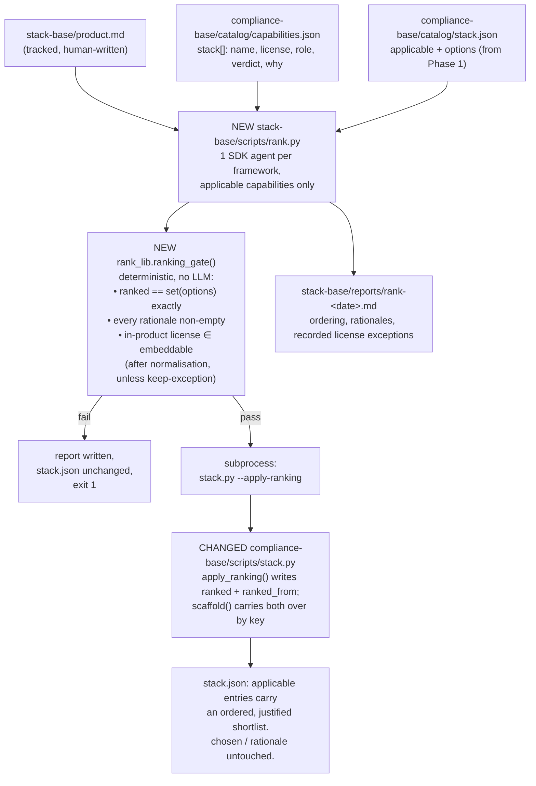

# Rank every applicable capability's catalog components against this product

**Plan ID:** `stack-compiler-map-rank`
**Source PRD:** `/home/felix/projects/howtobuildsoftware2026/.claude/PRPs/prds/stack-compiler.prd.md`
**PRD Phase:** `2 — Map & rank`
**Source Issue:** None
**Plan Publication:** None

## Outcome

**Problem:** After Phase 1, `compliance-base/catalog/stack.json` says *which* 41 of 68 capabilities
this product must satisfy, but for each of them it still offers only an unordered list of component
names copied verbatim from the catalog (`options`). Nothing says which of "Fides (Ethyca) / Probo /
SimpleRisk Core" fits *this* product, or why. The engineer who reaches the selection step is handed
the same undifferentiated pool the catalog started with, so the comparison happens in their head and
is not written down — the untracked narrowing this skill exists to remove, one layer lower.

**Affected user:** The NeuraWork engineer/architect who runs `stack-compiler` on a new product and
has to fix one component per applicable capability.

**User outcome:** For every applicable capability, `stack.json` carries the same components in a
product-justified order, each with a one-sentence reason tied to this product's description. The
selection pass becomes "confirm or override the top entry", and the ordering plus its reasoning is a
reviewable diff instead of a recollection.

**Invariant:** For every capability still applicable to this product, `stack.json` records an
ordering of exactly that capability's catalog components — no component dropped, duplicated, or
invented — each carrying a non-empty product-specific rationale; and no `in-product` component whose
license is outside the catalog's embeddable policy is accepted unless the catalog itself already
records it as `verdict: "keep-exception"`. If any of that fails, nothing is written.

**Success signal:** The `/st-select` pass (Phase 3) opens on a pre-ordered shortlist and the engineer
confirms rather than researches: the rationale text in `stack.json` is what the eventual `chosen`
entry cites, rather than a fresh argument made at selection time.

**Approach:** A new `rank.py` + `rank_lib.py` in `stack-base/`, structurally the twin of the shipped
`scope.py` + `scope_lib.py`: one SDK agent per framework over that framework's *applicable*
capabilities, a purely deterministic gate before any write, and the write itself delegated through
`compliance-base/scripts/stack.py`, which gains a `--apply-ranking` mode and two additive
carry-over fields (`ranked`, `ranked_from`). No adversarial LLM pass — for ranking, the checks that
matter are set equality against `options` and the license policy, both of which are deterministic and
stronger than a challenge agent.

## Recommendation

Every mechanism this phase needs already exists one directory away and is proven by a real run:

- **The engine shape.** `scope.py` already does preflight → per-framework SDK fan-out → shard parse →
  deterministic gate → `subprocess` write-through → report → state. Phase 2 needs the same pipeline
  with a different prompt and a different gate. Mirroring it keeps one readable pattern in
  `stack-base/` instead of two.
- **The schema extension.** `stack.py:105-147` already carries five decision-owned fields across a
  `--scaffold` rebuild by key. Adding `ranked`/`ranked_from` to that carry-over list is the identical,
  already-debugged move that resolved the PRD's first open question — and it is *mandatory*, not
  cosmetic: `options` itself is recomputed from the catalog on every scaffold, so a ranking stored
  there would be silently erased.
- **The license policy is already data.** `capabilities.json` carries `license_policy` with
  `embeddable` / `not_in_product` lists and an `internal_infra_exception` clause, and every component
  carries `license`, `role`, and `verdict`. The gate is a lookup, not a judgement.

Two findings shrink the phase against the PRD's wording, and both are load-bearing:

1. **The pool is already the shortlist.** Across the 41 applicable capabilities, `options` holds
   min 2 / max 4 / mean 3.7 components (151 total). The PRD's "return 2–4 ranked options" describes a
   narrowing that the catalog has already performed. So this phase **orders and justifies**; it does
   not select a subset. Requiring `ranked` to be a *permutation* of `options` is both simpler and a
   far stronger gate than "⊆ options": a set-equality check makes omission, duplication and invention
   all impossible in one assertion, and removes any need for a "why was this one dropped" mechanism.
2. **`verdict: "keep-exception"` already encodes justified license deviations** — 45 components carry
   it catalog-wide. Honouring it turns the license gate from a source of false positives into a real
   check: applied to today's catalog it produces **0 hard failures and 1 recorded exception** (OWASP
   ASVS 5.0, `CC-BY-SA-4.0`, whose own `why` text states the deviation). Without it, the first
   self-host run would fail on three components that the catalog has already reasoned about.

The remaining gap is string form, not policy: the catalog writes `CC0-1.0` where the policy lists
`CC0`, and `LGPL-2.1` / `LGPL-3.0` where the policy lists `LGPL (dynamic)`. A three-entry
normalisation closes it; anything still unmatched after normalisation fails the run and names the
component and license, so a genuinely new copyleft license cannot slip through as "unknown".

### Evidence

- `compliance-base/scripts/stack.py:105-147` — `scaffold()` rebuilds every entry from the catalog and
  carries over **only** `chosen`, `rationale`, `applicable`, `applicability_reason`, `scoped_from`.
  Anything else written into an entry is erased by the next `--scaffold`.
- `compliance-base/scripts/stack.py:88-102` — `component_options()` builds `options` from
  `cap["stack"]` names, order preserved, deduped; its docstring records that `verdict: "replaced"`
  means *superseded during the license audit*, never *rejected* — so every `stack[]` entry, whatever
  its verdict, is a live candidate.
- `compliance-base/scripts/stack.py:209-245` — `apply_scope()` is the template for `apply_ranking()`:
  validate the whole payload against the existing key set, refuse partial writes, copy each entry
  forward with `dict(choices[key])` and overwrite only its own fields.
- `compliance-base/scripts/stack.py:196-201` — `gaps()` flags `chosen not in options`; keeping
  `options` untouched by this phase means that check keeps working unchanged.
- `stack-base/scripts/scope.py:401-436` — per-framework grouping plus
  `asyncio.gather(..., return_exceptions=True)` under a `max_concurrency` semaphore; three agents for
  three frameworks today.
- `stack-base/scripts/scope.py:237-266` — `_run_agent()`: unlink the shard first so its existence
  proves this run wrote it, `allowed_tools=["Read","Write"]`, `max_turns=30`, cost from `ResultMessage`.
- `stack-base/scripts/scope.py:437-444` — one failed framework agent fails the whole run and writes
  nothing; the comment states why there is deliberately no carry-over path.
- `stack-base/scripts/scope.py:472-528` — deterministic gate → report → shard payload →
  `subprocess.run([sys.executable, stack_py, "--apply-scope", path], cwd=comp)`; a non-zero exit
  leaves `stack.json` unchanged.
- `stack-base/scripts/scope_lib.py:91-146` — `safety_gate()`: pure set math, no LLM, returns a
  structured result with an `ok` flag and named failure buckets.
- `stack-base/AGENTS.md:81-82` — "This engine **never** picks a component and never touches `chosen`
  or `rationale`. Ranking and selection are separate passes with their own gates." Phase 2 is the
  ranking pass; `chosen` stays untouched.
- `compliance-base/catalog/capabilities.json` → `license_policy` — `embeddable` (11 entries),
  `not_in_product` (9 entries), `internal_infra_exception` prose.
- Live catalog measurements (this session): 41 of 68 capabilities applicable — gdpr 9, soc2 17,
  iso27001 15; `options` per applicable capability min 2 / max 4 / mean 3.7, 151 total; component
  roles 131 `in-product` / 116 `internal-infra`; verdicts 89 `keep` / 113 `replaced` /
  45 `keep-exception`; `in-product` components with a `not_in_product` license: **0**; `in-product`
  components in applicable capabilities whose license matches neither policy list: 3
  (`security.txt (RFC 9116)` `CC0-1.0`, `Semgrep` `LGPL-2.1`, `OWASP ASVS 5.0` `CC-BY-SA-4.0`), of
  which the last is already `verdict: "keep-exception"` and the first two are normalisation cases.
- `plugins/neurawork-cc-harness/engines/stack-compiler/tests/test_payload_drift.py:38-56` — payload
  and `stack-base/` must stay byte-identical for `scripts/*.py`, `AGENTS.md`, `pyproject.toml`,
  `VERSION`; there is no installer yet, so this test is the only thing keeping them in step.
- `plugins/neurawork-cc-harness/engines/stack-compiler/tests/test_scope.py:17-18` — tests import from
  `payload/scripts`, never from `stack-base/scripts`.

### Alternatives considered

- **Store the ranking in `options` itself (reorder in place).** Loses to the invariant: `options` is
  recomputed from the catalog by `scaffold()` (`stack.py:128-138`), so the ordering and every
  rationale would vanish on the next `--scaffold`. This is the same failure the PRD's resolved open
  question 1 already caught for the applicability fields.
- **Report-only ranking (no schema change).** Rejected by the user at the design gate. It would keep
  `compliance-compiler` untouched, but the ranking would live in a dated report and a gitignored
  `.shards/` dir, so Phase 3 would either re-run the LLM or depend on untracked state — and the
  decision artifact would not carry the reasoning behind the choice it records.
- **A `chosen: string[]` schema change now** (PRD open question: one component per capability or a
  set?). Deferred: `chosen` is written by Phase 3, `gaps()` reads it as a scalar
  (`stack.py:186,196`), and nothing in ranking needs the answer. Ordering an entire pool is strictly
  more information than any later choice needs, whether that choice turns out to be one component or
  two.
- **An adversarial "challenge" pass, mirroring Phase 1.** Phase 1 needs it because "not applicable"
  is a claim about the product that only prose can refute. A ranking's checkable claims — the pool is
  exactly `options`, the licenses satisfy policy — are decidable without an LLM, and the deterministic
  gate decides them more reliably. The subjective part (the order) has no ground truth to challenge;
  the human confirms it in Phase 3. One agent pass, not two.
- **One agent per capability** (the `capabilities.py` fan-out shape). Unnecessary at this size: the
  largest framework is 17 applicable capabilities and roughly 15k characters of component `why` text.
  Per-framework batching keeps the run at three agents and lets one prompt see sibling capabilities,
  which matters when the same component appears in several of them.

## Visuals

The single structural decision here is the split between the two boxes on the write path: the engine
that *produces* the ranking never touches the file that *stores* it. That is the same boundary
Phase 1 established (`stack-base/AGENTS.md:79-80`) and the reason `stack.json` has exactly one schema
owner.

## Implementation Context

### Mandatory reading

| File | Why it matters |
|---|---|
| `stack-base/scripts/scope.py:82-128, 183-211, 237-300, 343-538` | The pipeline `rank.py` mirrors: prompt construction, shard parsing, `_run_agent`/`_fan_out`, and the full `main()` order (preflight → skip check → repo guard → fan-out → gate → report → apply → state). |
| `stack-base/scripts/scope_lib.py:91-164` | `safety_gate()` result shape (`ok` flag + named failure buckets) and `decisions_payload()`, which is where the internal field name is mapped onto the schema owner's field name — "in one place", per its docstring. |
| `compliance-base/scripts/stack.py:88-147, 209-245, 389-474` | `component_options()`, the `scaffold()` carry-over list that must gain two entries, `apply_scope()` as the validation template, and `main()`'s flag handling plus the trailing gap-report step. |
| `compliance-base/catalog/capabilities.json` (`license_policy`, any `frameworks.*.capabilities[].stack[]`) | The policy lists and the per-component fields the gate and the prompt both read: `name`, `license`, `role`, `verdict`, `why`. |
| `stack-base/AGENTS.md:41-83` | The constitution embedded verbatim into every prompt; it currently declares ranking out of scope and must gain a ranking section. |
| `plugins/neurawork-cc-harness/engines/stack-compiler/tests/test_scope_lib.py:114-201` | How a gate is tested: one test per failure bucket, plain `tempfile.TemporaryDirectory()`, no git, no SDK. |

### Existing patterns and primitives

- **Per-framework fan-out:** `stack-base/scripts/scope.py:401-436` — group the universe on
  `framework`, build one thunk per group, run under `_fan_out` (`:292-300`). Reuse verbatim; only the
  universe is pre-filtered to `applicable` entries.
- **Shard contract:** `stack-base/scripts/scope.py:241-242, 261-266` — unlink first, require the file
  afterwards, `RuntimeError` on missing file or invalid JSON, no repair and no retry.
- **Whole-payload validation:** `stack-base/scripts/scope.py:183-211` — reject a non-array, a blank
  key, a duplicate key, and any key-set mismatch against the expected set, before the caller sees it.
- **Write-through:** `stack-base/scripts/scope.py:511-528` — serialise the payload into
  `.shards/`, `subprocess.run` with a fixed argv and `cwd=comp`, echo stdout, inspect `returncode`,
  never import the schema owner (`scope_lib.py:1-16` records why: both installs have a same-named
  `config` module, so an in-process import binds the wrong catalog dir).
- **Run-level idempotency:** `stack-base/scripts/scope.py:335-338, 414-417` — a content hash on the
  product description recorded per entry (`scoped_from`); the run is skipped when every entry already
  carries it, unless `--all`.
- **In-repo write guard:** `stack-base/scripts/scope.py:419-424` — guard the reports dir before
  creating it; `stack.py:399-405` guards the catalog dir independently.

### Integration points

- `compliance-base/scripts/stack.py:128-138` — the `scaffold()` entry literal; two keys are added and
  must appear in the carry-over set.
- `compliance-base/scripts/stack.py:389-397` — `argparse` block; gains `--apply-ranking PATH`.
- `stack-base/scripts/config.py:27-39` — `SHARDS_DIR`, `REPORTS_DIR`, `STATE_FILE`, `DEFAULT_CFG`;
  `rank.py` reuses all four unchanged.
- `stack-base/AGENTS.md:79-83` — the Boundaries block whose "ranking is a separate pass" sentence
  becomes describable rather than aspirational.
- `CLAUDE.md` — the `stack-base` bullet and the self-host command list, which name `scripts/scope.py`
  only.

## Scope

### In scope

- `ranked` + `ranked_from` as additive, carried-over fields on a `stack.json` entry, owned and
  validated by `compliance-base/scripts/stack.py` via a new `--apply-ranking` mode.
- `stack-base/scripts/rank_lib.py` — pure logic: license normalisation and policy check, the
  deterministic ranking gate, the apply payload, and the report renderer.
- `stack-base/scripts/rank.py` — CLI (`--product`, `--all`, `--dry-run`), preflight, per-framework
  SDK fan-out over applicable capabilities, shard parsing, gate, report, write-through, state.
- A ranking section in `stack-base/AGENTS.md` (the constitution the prompt embeds).
- Tests for both new modules and for the two new `stack.py` behaviours.
- Mirroring every change into `plugins/neurawork-cc-harness/engines/{stack-compiler,compliance-compiler}/payload/`.
- Running the ranking on this repo's own self-host and committing the resulting `stack.json`.
- The `CLAUDE.md` self-host command list.

### Not building

- **Writing `chosen` or `rationale`.** Phase 3 owns the selection. This phase leaves both exactly as
  it found them (`stack-base/AGENTS.md:81-82`).
- **Narrowing the pool.** `ranked` is a permutation of `options`, not a subset — see Recommendation
  finding 1. A capability whose catalog pool grows past four components still gets a full ordering;
  introducing a "top N" would reintroduce unexplained omission.
- **Per-capability staleness detection.** PRD Phase 3's scope. Today `gaps()["stale"]` already flags a
  whole-file catalog-hash change (`stack.py:203`).
- **An adversarial challenge agent.** See Alternatives.
- **Live research on components.** PRD "Could", and the catalog's `why` text is the evidence base.
- **`install.py` / `recon.py` / slash commands.** PRD Phase 5.
- **Editing `capabilities.json` to resolve license findings.** The gate reports them; the catalog is
  `compliance-compiler`'s to fix. No such fix is needed for the current catalog.

## Delivery Considerations

| Concern | Decision and owned work |
|---|---|
| Compatibility / migration | The two new fields are additive and default to absent. Task 1 makes `scaffold()` carry them, so an existing `stack.json` that has never been ranked keeps working, and a ranked one survives a re-scaffold. No migration step: an entry without `ranked` is simply not yet ranked. |
| Rollout / reversibility | `stack.json` is tracked; a bad ranking run is a reviewable diff and `git checkout` reverts it. The run itself is all-or-nothing — every failure path writes the report and leaves `stack.json` untouched, mirroring `scope.py:437-444`. |
| Observability | `stack-base/reports/rank-<date>.md` records the ordering, every rationale, and every honoured `keep-exception`; `state.json` accumulates cost and `last_run.applied`. |
| Documentation | `stack-base/AGENTS.md` gains the ranking constitution (Task 4) and `CLAUDE.md` gains the command (Task 5). The user-facing `docs/` pass belongs to PRD Phase 5. |

## Implementation

### 1. `stack.json` learns to hold and preserve a ranking

**Files and integration points**
- `compliance-base/scripts/stack.py:105-147` — UPDATE — `scaffold()` is the only place an entry
  literal is built; the carry-over set lives here.
- `compliance-base/scripts/stack.py:209-245` — UPDATE — add `apply_ranking()` next to `apply_scope()`,
  which it mirrors.
- `compliance-base/scripts/stack.py:389-474` — UPDATE — `--apply-ranking PATH` flag and its branch in
  `main()`.
- `plugins/neurawork-cc-harness/engines/compliance-compiler/payload/scripts/stack.py` — UPDATE —
  byte-identical mirror.
- `plugins/neurawork-cc-harness/engines/compliance-compiler/tests/test_stack.py` — UPDATE.

**Implementation**
- Add `"ranked": prev.get("ranked")` and `"ranked_from": prev.get("ranked_from")` to the `scaffold()`
  entry literal, beside the existing `scoped_from` carry-over. Default `None`, not `[]`, so "never
  ranked" and "ranked to an empty list" stay distinguishable.
- `apply_ranking(stack, rankings, ranked_from)` mirrors `apply_scope()` (`:209-245`): copy each entry
  forward with `dict(choices[key])`, overwrite only `ranked` and `ranked_from`, return
  `{**stack, "choices": out}`. It must never read or write `chosen`, `rationale`, `applicable`,
  `applicability_reason`, or `options`.
- Refuse the whole write — raising `ValueError` with every problem joined, as `apply_scope()` does —
  when any of these hold:
  - a ranking is given for a key not in `choices`;
  - a ranking is given for a key whose entry is not `applicable`;
  - an applicable key has no ranking (the omission this schema exists to prevent);
  - the component names in a ranking are not exactly the entry's `options` as a set (catches
    dropped, duplicated, and invented components in one check);
  - any entry's `rationale` is blank after stripping.
- Payload shape, matching `decisions_payload`'s style
  (`stack-base/scripts/scope_lib.py:149-164`):
  `{"ranked_from": "<hash>", "rankings": {"<key>": [{"component": str, "rationale": str}, ...]}}`.
- In `main()`, `--apply-ranking` loads the payload, calls `apply_ranking()`, writes atomically via the
  existing `_write_json_atomic` (`:382-386`), and falls through to the existing gap-report step, the
  same way `--apply-scope` does (`:416-473`).

**Tests**
- `scaffold()` re-run preserves an existing `ranked`/`ranked_from` and still recomputes `options` from
  the catalog.
- `apply_ranking()` writes both fields and leaves `chosen`, `rationale`, `applicable`,
  `applicability_reason` and `options` byte-identical on every entry.
- Each refusal condition above fails with nothing written: unknown key, non-applicable key, missing
  applicable key, a ranking missing one of `options`, a ranking naming a component not in `options`,
  a ranking listing the same component twice, and a blank rationale.

**Validation**
- `cd plugins/neurawork-cc-harness/engines && python3 -m unittest discover -s compliance-compiler/tests`
  — the new `TestApplyRanking` cases and the extended `TestScaffold` pass; existing `TestApplyScope`
  and `TestGaps` are unchanged.

### 2. The deterministic ranking gate

**Files and integration points**
- `plugins/neurawork-cc-harness/engines/stack-compiler/payload/scripts/rank_lib.py` — CREATE — pure
  logic, stdlib only, no SDK import, mirroring `scope_lib.py`'s role.
- `stack-base/scripts/rank_lib.py` — CREATE — byte-identical mirror.
- `plugins/neurawork-cc-harness/engines/stack-compiler/tests/test_rank_lib.py` — CREATE.

**Implementation**
- `rankable_universe(stack, capabilities)` — like `scope_lib.capability_universe()`
  (`scope_lib.py:53-79`), keys come from `stack.json`'s `choices`, but keep only `applicable` entries
  and join in each capability's full `stack[]` entries (`name`, `license`, `role`, `verdict`, `why`)
  plus `description` and `category` from `capabilities.json`. `stack.json` stores no `category`, so
  the join is required.
- `normalize_license(text)` — map `CC0-1.0` → `CC0` and any `LGPL-*` → `LGPL (dynamic)`, otherwise
  return the input unchanged. Keep the table explicit and small; it exists because the catalog and the
  policy spell the same license differently, not to interpret licenses.
- `license_check(component, policy)` — returns `ok` / `exception` / `violation`:
  - `role != "in-product"` → `ok` (the policy's `internal_infra_exception` clause);
  - normalised license in `policy["embeddable"]` → `ok`;
  - otherwise `verdict == "keep-exception"` → `exception` (recorded, not fatal — the catalog already
    reasoned about it, and its `why` text carries that reasoning);
  - otherwise → `violation`, carrying the capability key, component name and raw license string.
- `ranking_gate(universe, rankings, policy)` — pure, no LLM, modelled on
  `scope_lib.safety_gate()` (`:91-146`). Returns a dict with an `ok` flag and named buckets:
  `missing_rankings`, `unknown_rankings`, `set_mismatches` (per key: `missing`, `unexpected`,
  `duplicated`), `blank_rationales`, `violations`, and the informational `exceptions`.
  `ok = not (missing_rankings or unknown_rankings or set_mismatches or blank_rationales or violations)`.
- `rankings_payload(rankings, ranked_from)` — the `--apply-ranking` payload; this is the one place the
  engine's internal shape is mapped onto the schema owner's field names.
- `render_rank_report(universe, rankings, gate, product_hash, generated, product_path)` — markdown,
  same structure as `render_scope_report()` (`scope_lib.py:167-266`): header, gate failures when the
  gate failed plus an explicit "nothing was written" line, the per-capability ordering with each
  rationale, and a section listing every honoured `keep-exception` with its license.

**Tests**
- `normalize_license` maps the three real catalog spellings and passes an unknown license through
  untouched.
- `license_check` returns `ok` for an `internal-infra` component under an AGPL license, `ok` for an
  `in-product` MIT component, `exception` for an `in-product` `CC-BY-SA-4.0` component whose verdict
  is `keep-exception`, and `violation` for an `in-product` `AGPL-3.0` component whose verdict is
  `keep`.
- `ranking_gate` passes on a complete, correctly-ordered, fully-rationalised set.
- `ranking_gate` fails, one test each, on: an applicable capability with no ranking; a ranking for an
  unknown key; a ranking that omits one of `options`; a ranking naming a component absent from
  `options`; a ranking listing a component twice; a blank rationale; a licensing violation.
- A `keep-exception` component reaches `gate["exceptions"]` while `gate["ok"]` stays `True`.
- `render_rank_report` states that nothing was written when the gate failed, and quotes the honoured
  exception when one exists.

**Validation**
- `cd plugins/neurawork-cc-harness/engines && python3 -m unittest discover -s stack-compiler/tests`
  — every `test_rank_lib` case passes.

### 3. The ranking run

**Files and integration points**
- `plugins/neurawork-cc-harness/engines/stack-compiler/payload/scripts/rank.py` — CREATE.
- `stack-base/scripts/rank.py` — CREATE — byte-identical mirror.
- `plugins/neurawork-cc-harness/engines/stack-compiler/tests/test_rank.py` — CREATE.

**Implementation**
- Reuse `scripts/config.py` unchanged: `ROOT_DIR`, `SHARDS_DIR`, `REPORTS_DIR`, `STATE_FILE`,
  `load_cfg()`, `compliance_root()`, `product_file()`, `now_iso()`, `today_iso()`.
- CLI: `--product PATH`, `--all`, `--dry-run` — same three flags and same meanings as
  `scope.py:343-352`.
- Preflight, in the order `scope.py:361-391` uses, with one addition: after loading `stack.json`,
  if no entry carries a `scoped_from`, stop with "run `scripts/scope.py` first — nothing is scoped
  yet" and return 1. Ranking an unscoped stack would rank all 68 capabilities, including the ones
  scoping is there to rule out.
- Skip check: `already_ranked(stack, product_hash)` — true when every **applicable** entry carries a
  non-empty `ranked` and `ranked_from == product_hash`. Bypassed by `--all`. Mirrors
  `already_scoped()` (`scope.py:335-338`) but is quantified over applicable entries only.
- `--dry-run` prints per framework the applicable-capability count and the total component count, then
  returns 0 without any SDK call, matching `scope.py:406-412`.
- `build_rank_prompt(fw, caps, product, shard_path)` — the constitution verbatim via `_constitution()`
  (`scope.py:78-79`), the full product description, then for each capability its key, name, category,
  description and every catalog component as `name / license / role / verdict / why`. The contract:
  order **every** listed component for each capability, best fit first, and give each a one-sentence
  rationale specific to this product; never add or omit a component; write exactly one JSON array to
  the named shard path with the Write tool and nothing else.
- `parse_rank_shard(raw, expected_keys, fw)` — mirrors `parse_scope_shard()` (`scope.py:183-211`):
  reject a non-array, a blank or duplicate `key`, and any key-set mismatch against `expected_keys`.
  Additionally require each element's `ranked` to be a non-empty array of objects with a non-empty
  `component`; strip every string. Do not check the component names against `options` here — that is
  the gate's job, so that the failure is reported by one owner with full context.
- Fan-out: one `rank_one(fw, caps, ...)` per framework through the existing `_run_agent`/`_fan_out`
  shape (`scope.py:237-300`), shard path `.shards/rank-{fw}.json`. Any framework agent raising fails
  the whole run with nothing written, exactly as `scope.py:437-444`.
- Then, in order: `rank_lib.ranking_gate(...)` → write
  `reports/rank-<date>.md` (always, once past the skip check, as `scope.py:474-478` does) → on
  `not gate["ok"]` print the named failures, save state with `applied: False`, return 1 → otherwise
  write `.shards/rankings.json` and `subprocess.run([sys.executable, stack_py, "--apply-ranking",
  path], cwd=comp)`, inspecting `returncode` as `scope.py:518-528` does.
- Guard `REPORTS_DIR` with `assert_in_repo_not_dotclaude` before creating it (`scope.py:419-424`).
- State: reuse `load_state()`/`save_state()`; accumulate into the same `total_cost`, and record
  `last_rank_run` alongside the existing `last_run` so the two passes do not overwrite each other.

**Tests**
- `build_rank_prompt` carries the product text, every expected key, every component's license, role
  and verdict, the shard path, and the "order every component, omit none" instruction.
- `parse_rank_shard` accepts a well-formed shard and strips whitespace; rejects a non-array, a
  dropped key, an invented key, a duplicate key, an empty `ranked` list, and a blank `component`.
- `already_ranked` is true only when every applicable entry carries the current hash and a non-empty
  `ranked`; a non-applicable entry without `ranked` does not make it false; an empty `choices` is
  never already ranked.
- Preflight, using the tempdir-without-git pattern of `test_scope.py:141-186`: missing compliance
  install, missing `stack.json`, missing product file, empty product file, and a `stack.json` that
  carries no `scoped_from` each stop with the right message and return 1.

**Validation**
- `cd plugins/neurawork-cc-harness/engines && python3 -m unittest discover -s stack-compiler/tests`
  — `test_rank` and `test_rank_lib` pass, `test_scope*` unchanged.
- `cd stack-base && uv run python scripts/rank.py --dry-run` — prints 41 applicable capabilities
  across 3 frameworks and 151 components, makes no SDK call, exits 0.

### 4. The ranking constitution

**Files and integration points**
- `plugins/neurawork-cc-harness/engines/stack-compiler/payload/AGENTS.md:41-83` — UPDATE.
- `stack-base/AGENTS.md` — UPDATE — byte-identical mirror.

**Implementation**
- Add a "Ranking" section beside the existing scoping and challenge sections. It is embedded verbatim
  into every ranking prompt, so it is the behavioural specification, not commentary. It must state:
  - order every component the capability lists; the pool is closed and complete — never add, never
    omit, never invent a component;
  - rank on fit to *this* product as described in `product.md` — deployment shape, data held,
    integrations, non-goals — not on general popularity;
  - `verdict: "replaced"` means the component superseded another during the license audit, never that
    it was rejected (`compliance-base/scripts/stack.py:91-94`); rank it on its merits;
  - each rationale is one factual sentence naming the product-specific reason for that position, with
    no hedging and no restating the component's catalog `why` back;
  - licenses are checked deterministically after the run — do not silently drop a component that looks
    license-incompatible; rank it last and say so in its rationale.
- Update the Boundaries block (`:79-83`): the engine still never writes `stack.json` directly and
  still never touches `chosen`/`rationale`, but ranking is now a pass this engine performs, applied
  through `stack.py --apply-ranking`.
- Update the vocabulary line at `:18-19` that currently calls components "not this engine's concern at
  the scoping stage" so it names the ranking stage as where they become one.

**Tests**
- Covered by Task 3's `build_rank_prompt` test asserting the constitution text reaches the prompt, and
  by Task 5's drift test.

**Validation**
- `cd plugins/neurawork-cc-harness/engines && python3 -m unittest discover -s stack-compiler/tests`
  — `TestPayloadDrift` passes, proving both copies match.

### 5. Mirror, lint, and document the command

**Files and integration points**
- `plugins/neurawork-cc-harness/engines/stack-compiler/payload/**` ↔ `stack-base/**` — verify
  byte-identical.
- `plugins/neurawork-cc-harness/engines/compliance-compiler/payload/scripts/stack.py` ↔
  `compliance-base/scripts/stack.py` — verify byte-identical.
- `CLAUDE.md` — UPDATE — the self-host command block and the `stack-base/` architecture bullet.

**Implementation**
- Confirm both mirrors with `diff`; `test_payload_drift.py` covers `stack-compiler` but there is no
  equivalent for `compliance-compiler`'s `stack.py`, so the `diff` is the check there.
- Add `uv run --directory stack-base python scripts/rank.py` to the self-host command list in
  `CLAUDE.md`, next to the existing `scope.py` line.
- Extend the `stack-base/` bullet in `CLAUDE.md`'s architecture list: `scope.py` decides *whether* a
  capability applies, `rank.py` orders its catalog components for this product, and both write through
  `compliance-base/scripts/stack.py` — still no data artifact of its own.

**Validation**
- `uvx ruff check` from `stack-base/` and from `compliance-base/` — clean.
- `diff -r plugins/neurawork-cc-harness/engines/stack-compiler/payload stack-base` — differs only in
  the paths `test_payload_drift.py` deliberately ignores (`.gitignore`, `VERSION` handling,
  `_shared/`, `config.json`, `product.md`, `reports/`, `.shards/`).

### 6. Rank this repo's own stack

**Files and integration points**
- `stack-base/product.md` — READ — the tracked description Phase 1 already scoped from.
- `compliance-base/catalog/stack.json` — the run's output; tracked and committed.
- `stack-base/reports/rank-<date>.md` — generated, gitignored.

**Implementation**
- Run `uv run --directory stack-base python scripts/rank.py` against the live catalog.
- Confirm the run touches the 41 applicable capabilities and leaves all 27 non-applicable ones without
  `ranked`.
- Confirm the report records exactly one honoured `keep-exception` — OWASP ASVS 5.0,
  `CC-BY-SA-4.0`, under `iso27001/secure-development-lifecycle-secure-coding` — and no violation. If a
  violation does appear, it is a real catalog finding: report it and stop, since fixing
  `capabilities.json` is `compliance-compiler`'s to own, not this phase's.
- Review the `stack.json` diff: `chosen`, `rationale`, `applicable`, `applicability_reason`,
  `scoped_from` and `options` unchanged on every entry; only `ranked` and `ranked_from` added.

**Validation**
- `git diff --stat compliance-base/catalog/stack.json` — one file changed.
- `python3 -c` over the written `stack.json`: every applicable entry's `ranked` component names equal
  its `options` as a set, every rationale is non-empty, and every non-applicable entry has
  `ranked is None`.
- `uv run --directory compliance-base python scripts/stack.py` — the gap report still reports 41
  applicable mandatory-and-optional capabilities unchosen (Phase 3's job) and no new warnings.

## Acceptance

1. **AC1 — Every applicable capability carries a justified ordering.** After a successful
   `rank.py` run, each `applicable: true` entry in `compliance-base/catalog/stack.json` has `ranked`
   as a list whose `component` values equal that entry's `options` as a set — same members, no
   duplicates — ordered best-fit-first, each with a non-empty `rationale`, and `ranked_from` equal to
   the hash of the product description the run read.
2. **AC2 — The selection decision is untouched.** No code path in this phase reads or writes `chosen`
   or `rationale`, and no non-applicable capability receives a `ranked` value. A `stack.json` entry's
   `options`, `applicable`, `applicability_reason` and `scoped_from` are byte-identical before and
   after a ranking run.
3. **AC3 — A license-policy violation stops the run.** An `in-product` component whose normalised
   license is outside `license_policy.embeddable` and whose `verdict` is not `keep-exception` fails
   the run: the report names the capability, component and license, `stack.json` is unchanged, and the
   exit code is 1. A component that *is* `keep-exception` passes and is listed in the report as a
   recorded exception.
4. **AC4 — An incomplete or invented ranking stops the run.** A ranking that omits one of a
   capability's `options`, names a component that is not in them, lists one twice, leaves a rationale
   blank, or skips an applicable capability entirely fails before any write, at both the engine gate
   and the schema owner's independent validation.
5. **AC5 — A ranking survives a catalog re-scaffold.** After `stack.py --scaffold` re-runs against an
   unchanged catalog, every `ranked` and `ranked_from` value is preserved, while `options` is still
   recomputed from `capabilities.json`.
6. **AC6 — The shipped payload matches the self-host.** `stack-compiler`'s `payload/scripts/*.py`,
   `AGENTS.md`, `pyproject.toml` and `VERSION` remain byte-identical to `stack-base/`, and
   `compliance-compiler`'s `payload/scripts/stack.py` to `compliance-base/scripts/stack.py`.

## Validation

| Gate | Command or procedure | Proves |
|---|---|---|
| Schema owner | `cd plugins/neurawork-cc-harness/engines && python3 -m unittest discover -s compliance-compiler/tests` | AC2, AC4 (owner-side), AC5 |
| Engine behavior | `cd plugins/neurawork-cc-harness/engines && python3 -m unittest discover -s stack-compiler/tests` | AC1, AC3, AC4 (gate-side), AC6 |
| Untouched siblings | `cd plugins/neurawork-cc-harness/engines && python3 -m unittest discover -s _shared/tests && python3 -m unittest discover -s knowledge-compiler/tests && python3 -m unittest discover -s claudemd-lerner/tests` | No regression in the other three engines |
| Lint | `uvx ruff check` in `stack-base/` and in `compliance-base/` | `line-length = 100` and the repo's ruff config, clean |
| Plan without LLM | `uv run --directory stack-base python scripts/rank.py --dry-run` | Preflight, the applicable-only universe, and the per-framework grouping, with no SDK call |
| Integrated run | `uv run --directory stack-base python scripts/rank.py`, then inspect `git diff compliance-base/catalog/stack.json` and `stack-base/reports/rank-<date>.md` | AC1, AC2 and AC3 end-to-end on the live 41-capability catalog, including the one recorded `keep-exception` |

## Risks and Decisions

| Decision or risk | Recommendation | Evidence / mitigation | Consequence if different |
|---|---|---|---|
| `ranked` is a permutation of `options`, not a subset | Adopt it | `options` already holds min 2 / max 4 / mean 3.7 components per applicable capability, so the catalog has already narrowed; set equality is a strictly stronger gate than `⊆` and needs no drop-justification mechanism | A subset model would need its own "why was this dropped" field and gate, reintroducing exactly the unexplained-omission failure mode the safety gate exists to prevent |
| The license normalisation table | Keep it to the three spellings the catalog actually uses (`CC0-1.0`, `LGPL-*`) and fail on anything else unknown | Measured: those three cover every unmatched `in-product` license in the current catalog; a genuinely new copyleft license still fails loudly | A broader fuzzy match would let an unreviewed license through as "probably fine" |
| Ranking goes stale when the catalog changes | Leave per-capability staleness to PRD Phase 3 | `gaps()["stale"]` already flags a whole-file `capabilities_hash` change (`stack.py:203`), and `apply_ranking`'s set-equality check fails loudly the next time a stale ranking is re-applied | Building per-capability hashing here duplicates work Phase 3 scopes and owns |
| `chosen: string` vs `string[]` (PRD open question) | Defer to Phase 3 | Nothing in ranking depends on it; `gaps()` reads `chosen` as a scalar (`stack.py:186,196`) and an ordering of the full pool serves either answer | Deciding it now would change `gaps()` and the gap report for a phase that does not need it |
| A capability's `options` could grow well past four in a future catalog, making one prompt large | Accept; revisit only if it happens | Per-framework prompts today carry at most ~15k characters of `why` text; `max_concurrency` is 12 and only 3 agents run | Per-capability fan-out (the `capabilities.py` shape) is the drop-in escalation if a framework's prompt stops fitting |

## Compliance

**Capabilities**: none — this change is design-time tooling. It adds two fields to a tracked JSON
file, one deterministic gate, and one SDK script that reads a repository-local product description.
It processes no personal data, exposes no runtime interface, ships nothing into a product, and writes
only inside the repo (`compliance-base/catalog/stack.json` plus a gitignored `stack-base/reports/`),
so no capability in `catalog/capabilities.json` is delivered by it.

**Relationship to the catalog is supportive, not substitutive:** this phase makes the catalog's
existing component recommendations decidable for one product by ordering them and recording why. The
constraint→capability coverage guarantee stays with `compliance-compiler`, and the capability→chosen
component gap report (`stack.py` `gaps()`) still reads 41 unchosen after this phase — closing it is
PRD Phase 3's job, not this one's.

## Related Plans

- **Depends on:** `/home/felix/projects/howtobuildsoftware2026/.claude/PRPs/plans/completed/stack-compiler-scope-engine.plan.md` — Phase 1 scope engine, which produces the `applicable` / `scoped_from` fields this phase reads.
- **Followed by:** None yet — PRD Phase 3 (Selection) and Phase 4 (`st-` gate) both consume `ranked`.

## Agent Notes

Two facts about the catalog are easy to get wrong and are worth re-reading before touching the gate:

- `verdict: "replaced"` does **not** mean rejected. `compliance-base/scripts/stack.py:91-94` records
  that it means this component *superseded* the one named in `replaced_from` during the license audit.
  All three verdict values name live candidates. 113 of the 247 component entries carry it.
- `verdict: "keep-exception"` is the catalog's own record of a knowing policy deviation, and the
  component's `why` text carries the reasoning. Treating it as a violation would fail the run on
  material the catalog has already adjudicated; treating it as ordinary would erase the distinction.
  45 components carry it catalog-wide, exactly one of them inside an applicable capability.

The `product.md` in this repo has two sections (`## Who receives data`, `## Explicit non-goals`) that
`scope.py`'s `PRODUCT_TEMPLATE` (`scope.py:54-73`) does not generate — they were added by hand. The
ranking prompt should pass the product text through whole rather than parsing for known headings.
