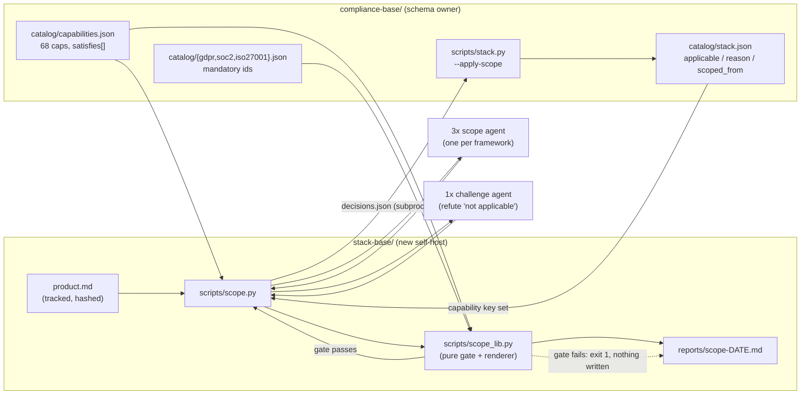

# Narrow the 68-capability catalog to one product, accountably

**Plan ID:** `stack-compiler-scope-engine`
**Source PRD:** `/home/felix/projects/howtobuildsoftware2026/.claude/PRPs/prds/stack-compiler.prd.md`
**PRD Phase:** `1 — Scope engine`
**Source Issue:** `None`
**Plan Publication:** `None`

## Outcome

**Problem:** `compliance-base/catalog/stack.json` carries all 68 capabilities of the
capability catalog for every product. A service that stores no personal data still gets
25 GDPR entries to fill. Today the narrowing happens in an engineer's head and is written
nowhere, so an untracked narrowing is indistinguishable from an oversight — and
`stack.py:gaps()` counts every unchosen capability as a gap regardless of whether it
applies, so the gap report can never reach 0 for a scoped product.

**Affected user:** The NeuraWork engineer/architect standing up a compliant greenfield
product, and the auditor who later has to be shown why a capability was skipped.

**User outcome:** The engineer describes the product once in a tracked file, and every
capability is recorded as applicable or not-applicable **with a reason**, in the tracked
artifact. A capability dropped without justification, or a "does not apply" that
contradicts the product description, fails the run instead of quietly shrinking the
compliance surface.

**Invariant:** Every mandatory constraint is either covered by an applicable capability,
or every capability covering it is marked non-applicable with a non-empty, non-refuted
reason. There is no third state — no mandatory constraint may leave the scoping pass
undecided or silently omitted, and no scoping run that violates this writes to
`stack.json`.

**Success signal:** A product description that claims "no personal data" while plainly
storing user emails fails the scoping run and names the refuted decisions; a truthful
description completes with 100% of non-applicable capabilities carrying a recorded
reason and 0 unexplained omissions in `stack.json`.

**Approach:** A new engine `stack-compiler` (`engines/stack-compiler/`, self-hosted as
`stack-base/`) whose `scope.py` reads a tracked `stack-base/product.md`, fans out one
Claude Agent SDK agent per framework to decide applicability per capability, runs a
single **challenge agent** that tries to refute every `applicable: false` decision
against the same description, then applies a purely deterministic safety gate before
writing anything. Writes land in `compliance-base/catalog/stack.json` through a new
`stack.py --apply-scope` CLI — the schema owner stays the schema owner, and the two
engines never import each other's modules.

## Recommendation

Every mechanism this needs already exists in the repo and is reused rather than rebuilt:

- **Parallel agents:** `capabilities.py:315-338` (`_fan_out`: `asyncio.Semaphore` +
  `asyncio.gather(return_exceptions=True)`) and `capabilities.py:147-180` (`cluster_one`:
  shard file deleted first so its existence proves this run wrote it, JSON shape checked
  on read). The scoping pass is the same shape at a different granularity — one agent per
  framework, exactly the "capability group" the PRD asks for.
- **Pure-logic / SDK split:** `cap_lib.py` holds the coverage math and renderers with no
  `claude_agent_sdk` import so it is unit-testable; `capabilities.py` holds the glue.
  `scope_lib.py` / `scope.py` mirror that split, which is what makes the safety gate
  testable without an API key.
- **Hash-based skip:** `capabilities.py:415-425` skips a framework whose catalog hash is
  unchanged. The same idea keyed on the product-description hash keeps a re-run free.
- **Applicability fields already shipped:** `stack.py:120-130` writes and carries over
  `applicable` / `applicability_reason` / `scoped_from`; `test_stack.py:138-152` already
  proves a re-scaffold cannot erase them. Nothing about the schema needs to change — only
  a writer and a reader that respect it.
- **Drift guard precedent:** `test_catalog_seed.py:1-44` compares the shipped payload
  against this repo's self-host and skips when the self-host is absent. The same test
  keeps `stack-base/` honest until Phase 5's `install.py` exists.

The one genuinely new decision is **how `stack-compiler` writes through `stack.py`**, and
the evidence forces it. `stack.py:43` does `from config import CATALOG_DIR, …`;
`stack-compiler` needs its own `config.py`. If `scope.py` imported `stack` in-process,
`sys.modules["config"]` would already be bound to `stack-base/scripts/config.py`, and
`STACK_JSON` would resolve to `stack-base/catalog/stack.json` — a second stack file, the
exact drift this feature exists to kill, created silently. A subprocess call with a
decisions JSON file removes the failure mode entirely, keeps `stack.py` stdlib-only on
that path (no `uv` environment needed), and fails loud and cheap when `compliance-base`
is absent, satisfying the PRD's graceful-degrade requirement.

The deterministic gate alone cannot deliver the PRD's Phase-1 success signal: whether
"this product stores no personal data" is *true* is a semantic claim about the product
description, not set math. One challenge agent over the (typically 20–40) non-applicable
decisions is the smallest mechanism that makes the stated signal real — roughly one extra
agent call per run against three scoping agents.

### Evidence

- `plugins/neurawork-cc-harness/engines/compliance-compiler/payload/scripts/stack.py:140-181`
  — `gaps()` reads `chosen` only; `applicable` is never consulted, so a scoped-out
  capability is still reported as a mandatory gap. This is the defect PRD Phase 1 names.
- `.../payload/scripts/stack.py:97-137` — `scaffold()` already carries the three
  applicability fields over by key; the schema half of the work is done and merged
  (commit `58611f6`).
- `.../payload/scripts/stack.py:40-48` — `_shared/` is imported inside `main()` precisely
  so the pure logic stays importable from `payload/scripts`; the same constraint means a
  payload script is **not runnable in place**, which is why the self-host is part of this
  phase.
- `.../payload/scripts/capabilities.py:147-180, 276-338` — the parallel-agent template
  (options block: `allowed_tools=["Read","Write"]`, `permission_mode="acceptEdits"`,
  `setting_sources=[]`, `strict_mcp_config=True`, `max_turns=30`).
- `.../payload/scripts/config.py:19` — `ROOT_DIR` honours a `COMPLIANCE_ROOT` env
  override; `stack-compiler` mirrors this as `STACK_ROOT`.
- `compliance-base/catalog/stack.json:1-25` — live shape: 68 keys
  `<framework>/<capability-slug>`, each already carrying `applicable: true`,
  `applicability_reason: ""`, `scoped_from: null`.
- `.claude/PRPs/prds/compliance-capabilities.prd.md` — Phase 2 is `complete`; this plan's
  dependency is satisfied.

### Alternatives considered

- **Import `stack.py` in-process from `scope.py`:** fewer moving parts on paper, but the
  `config` module-name collision above makes it write to the wrong file with no error.
  Rejected on evidence, not taste.
- **Duplicate `capability_slug()` into `stack-compiler` to compute keys:** rejected —
  `scope.py` instead reads the key set straight out of `stack.json` and joins capability
  descriptions by exact `name`, so the closed key set is enforced by construction and no
  slug logic is duplicated across engines.
- **Deterministic gate only, no challenge agent:** cheaper and fully offline, but the
  PRD's Phase-1 success signal would have to be rewritten, and a well-worded but false
  "not applicable" would pass. Rejected by the user at the design gate.
- **One challenge agent per framework:** more scrutiny, ~2× cost and three more parallel
  failure paths for a judgement that needs the whole product description in one context
  anyway.
- **Defer the `stack-base/` self-host to Phase 5:** would leave the scope engine never
  executed against the real 68-capability catalog until two phases later. Rejected by the
  user at the design gate; the drift-guard test carries the cost of the hand install.

## Visuals

## Implementation Context

### Mandatory reading

| File | Why it matters |
|---|---|
| `plugins/neurawork-cc-harness/engines/compliance-compiler/payload/scripts/stack.py:97-181` | `scaffold()` field ownership and the `gaps()` logic being changed; the key format `<framework>/<slug>` |
| `plugins/neurawork-cc-harness/engines/compliance-compiler/payload/scripts/capabilities.py:147-180, 276-338` | The exact SDK options block, shard-as-proof pattern, and `_fan_out` semaphore to copy |
| `plugins/neurawork-cc-harness/engines/compliance-compiler/payload/scripts/cap_lib.py:1-15, 46-53` | Why pure logic is split out (SDK-free ⇒ testable) and the shape of a deterministic coverage gate |
| `plugins/neurawork-cc-harness/engines/compliance-compiler/tests/test_stack.py:1-60, 96-152` | Test conventions: sys.path to `payload/scripts`, temp catalog dirs, existing applicability assertions to extend |
| `plugins/neurawork-cc-harness/engines/compliance-compiler/tests/test_catalog_seed.py:1-44` | The drift-guard test shape (walk parents to find the self-host, skip when absent) |
| `plugins/neurawork-cc-harness/engines/compliance-compiler/payload/scripts/config.py:19-53` | Path/env/config conventions to mirror in `stack-compiler`'s `config.py` |
| `compliance-base/AGENTS.md:99-120` | The constitution section the scoping constitution must sit beside without contradicting |

### Existing patterns and primitives

- **Shard file as proof of work:** `capabilities.py:151-179` — delete the shard, run the
  agent, treat a missing file as a hard failure, validate the parsed JSON is the expected
  container type. Reuse verbatim for scope and challenge shards.
- **Never-raising fan-out:** `capabilities.py:315-323` — `return_exceptions=True`, callers
  filter `isinstance(r, Exception)` and report failures without losing the successes. A
  failed *scoping* agent must fail the run (an unscoped framework is an unexplained
  omission), unlike `capabilities.py` where a failed framework carries old data over.
- **Atomic JSON write:** `stack.py:289-294` — tmp file + `replace()`, `indent=1`,
  `ensure_ascii=False`, trailing newline. `stack.json` is tracked; the diff must stay
  reviewable.
- **Write guard:** `stack.py:304-310` — `assert_in_repo_not_dotclaude` before any catalog
  write, printing and returning 1 rather than raising.
- **Hash skip:** `capabilities.py:415-417` plus `utils.file_hash` (first 16 hex of
  SHA-256) — the same 16-char hash is what `scoped_from` should carry.

### Integration points

- `plugins/neurawork-cc-harness/engines/compliance-compiler/payload/scripts/stack.py:140`
  — `gaps()` gains applicability awareness; every existing caller keeps working because
  entries default to `applicable: true`.
- `plugins/neurawork-cc-harness/engines/compliance-compiler/payload/scripts/stack.py:296`
  — `main()` gains `--apply-scope`; this is the only write path `stack-compiler` uses.
- `compliance-base/scripts/stack.py` — byte-identical mirror of the payload file; both
  must be updated in the same change (they are identical today, verified by `diff -rq`).
- `plugins/neurawork-cc-harness/engines/compliance-compiler/tests/test_stack.py` — extend,
  do not fork; it already owns `stack.py` behaviour.
- `CLAUDE.md` (repo root) — the self-host list currently names three install dirs; a
  fourth top-level directory that no doc mentions is exactly the drift this repo fights.

## Scope

### In scope

- Applicability-aware `gaps()` and a new `apply_scope()` + `--apply-scope` CLI in
  `stack.py`, mirrored into `compliance-base/scripts/stack.py`.
- New engine `plugins/neurawork-cc-harness/engines/stack-compiler/` with `VERSION`,
  `config.default.json`, `payload/` (`AGENTS.md`, `pyproject.toml`,
  `scripts/{config,scope_lib,scope}.py`) and `tests/`.
- Product intake via a tracked `stack-base/product.md`, hashed into `scoped_from`.
- Three parallel per-framework scoping agents plus one challenge agent.
- The deterministic mandatory-safety gate, running **before** any write.
- A hand-installed, drift-guarded `stack-base/` self-host in this repo.
- A one-bullet root `CLAUDE.md` entry marking `stack-base/` as a Phase-1 hand install.
- An adversarial under-scoped product fixture and the live runs that prove both signals.

### Not building

- `install.py` / `recon.py` / slash commands / plugin-manifest entry / `docs/` — PRD
  Phase 5, explicitly.
- Component ranking or selection (`options` ordering, `chosen`) — PRD Phases 2 and 3.
  `apply_scope()` never touches `chosen` or `rationale`.
- The `st-post-tooluse` gate — PRD Phase 4.
- Any change to the capability or constraint catalogs, or to the `stack.json` schema
  itself — it already carries every field this phase needs.
- Re-scoping diff semantics beyond "product hash changed ⇒ re-run" (PRD open question,
  deliberately left open).

## Delivery Considerations

| Concern | Decision and owned work |
|---|---|
| Compatibility / migration | `gaps()` reads `applicable` with default `True`, so an unscoped `stack.json` behaves exactly as today; no migration of the tracked artifact. Task 1 proves this by leaving the existing `test_stack.py` gap assertions untouched and green. |
| Discoverability / adoption | `stack-base/product.md` is scaffolded from a template with an explicit exit message when absent, so the first run tells the engineer what to write. Root `CLAUDE.md` gains the `stack-base/` bullet (Task 4). |
| Rollout / reversibility | Everything is additive: a new engine dir, a new self-host dir, and two new functions plus one flag on `stack.py`. Reverting the commit restores current behaviour; `stack.json` is tracked so any applied scoping is reviewable and revertable as a diff. |
| Observability | Every run writes `stack-base/reports/scope-<date>.md` naming each non-applicable decision with its reason, every refuted decision, and every mandatory constraint traced to a justified drop. Failures print the same lists to stdout and exit 1. |
| Documentation / communication | `stack-base/AGENTS.md` is the scoping constitution and is read into the agent prompts, so the rules are the documentation. Full `docs/` treatment stays in Phase 5. |

## Implementation

### 1. Make `stack.py` applicability-aware and give it a scope-write entry point

**Files and integration points**
- `plugins/neurawork-cc-harness/engines/compliance-compiler/payload/scripts/stack.py:140-181`
  — UPDATE `gaps()`.
- `.../payload/scripts/stack.py:184-272` — UPDATE `render_gap_report()`.
- `.../payload/scripts/stack.py` — CREATE `apply_scope()` (pure) next to `scaffold()`.
- `.../payload/scripts/stack.py:296-346` — UPDATE `main()` with `--apply-scope PATH`.
- `compliance-base/scripts/stack.py` — UPDATE: byte-identical mirror.
- `.../compliance-compiler/tests/test_stack.py` — UPDATE.

**Implementation**
- `gaps()`: skip an entry whose `applicable` is `False` (default `True`) instead of
  classifying it as unchosen. Return two new lists — `non_applicable` (sorted keys) and
  `unexplained_non_applicable` (`applicable: False` with a blank
  `applicability_reason`) — and count `mandatory_total` over **applicable**
  mandatory-linked capabilities only, so a fully scoped and chosen stack can reach 0.
  Keep `mandatory_linked` as the full set; nothing downstream loses information.
- `render_gap_report()`: add the non-applicable count to the headline line and an
  informational section listing each non-applicable key with its reason. Give
  `unexplained_non_applicable` its own clearly-worded block — this is a compliance hole,
  not a nicety.
- `apply_scope(stack, decisions, scoped_from) -> dict`: pure. For every key in
  `stack["choices"]`, set `applicable`, `applicability_reason` and `scoped_from` from the
  matching decision. Raise `ValueError` naming the offending keys when the decision set
  is not exactly the key set (missing key = silent omission; unknown key = a decision
  about something the catalog does not contain), and when any `applicable: False` carries
  a blank reason. `chosen` and `rationale` are never read or written.
- `main()`: `--apply-scope PATH` reads `{"scoped_from": str, "decisions": {key: {...}}}`,
  runs the write guard already present at `stack.py:304-310`, applies, writes atomically
  via the existing `_write_json_atomic`, and prints a one-line summary
  (`N applicable, M not applicable`). A `ValueError` from `apply_scope()` prints the
  named keys and returns 1 **without writing**. If an entry that becomes non-applicable
  already has a `chosen` value, print it as a warning line — the run still succeeds;
  reconciling that is Phase 3's job.
- After applying, fall through to the existing gap report so one command leaves both the
  artifact and the report current.
- Mirror the finished file into `compliance-base/scripts/stack.py` (`cp`); they are
  byte-identical today and must stay so.

**Tests**
- `gaps()` excludes a non-applicable capability from `mandatory_unchosen` **and** from
  `mandatory_total`, and reports it under `non_applicable`.
- `gaps()` on an unscoped stack returns exactly what it returns today (the existing
  assertions must pass unchanged).
- `gaps()` surfaces `applicable: False` + blank reason under `unexplained_non_applicable`.
- `apply_scope()` sets all three fields, leaves a pre-existing `chosen`/`rationale`
  untouched, and raises on each of: missing key, unknown key, blank reason on a
  non-applicable decision.
- `render_gap_report()` names a non-applicable capability together with its reason.

**Validation**
- `cd plugins/neurawork-cc-harness/engines && python3 -m unittest discover -s compliance-compiler/tests`
  — 61 existing tests plus the new ones pass.
- `diff -q plugins/neurawork-cc-harness/engines/compliance-compiler/payload/scripts/stack.py compliance-base/scripts/stack.py`
  — no output.

### 2. Create the `stack-compiler` engine skeleton and the pure scoping logic

**Files and integration points**
- `plugins/neurawork-cc-harness/engines/stack-compiler/VERSION` — CREATE (`1`).
- `.../stack-compiler/config.default.json` — CREATE.
- `.../stack-compiler/payload/pyproject.toml` — CREATE.
- `.../stack-compiler/payload/AGENTS.md` — CREATE: the scoping constitution.
- `.../stack-compiler/payload/scripts/config.py` — CREATE.
- `.../stack-compiler/payload/scripts/scope_lib.py` — CREATE: SDK-free.
- `.../stack-compiler/tests/__init__.py`, `.../tests/test_scope_lib.py` — CREATE.

**Implementation**
- `config.default.json`: `{"stack_dir": "stack-base", "compliance_dir": "compliance-base",
  "model": "", "max_concurrency": 12, "product_file": "product.md"}`.
- `config.py`: mirror `compliance-compiler/payload/scripts/config.py:11-66` — `ROOT_DIR`
  from a `STACK_ROOT` env override falling back to the file's grandparent,
  `REPORTS_DIR`, `SHARDS_DIR` (`ROOT_DIR/.shards`), `AGENTS_FILE`, `CONFIG_FILE`,
  `STATE_FILE`, `DEFAULT_CFG`, `load_cfg()`, `now_iso()`, `today_iso()`. No timezone
  hardcoded.
- `pyproject.toml`: name `neurawork-stack`, `requires-python = ">=3.12"`, deps
  `claude-agent-sdk`, `python-dotenv`, `tzdata`, `[tool.ruff] line-length = 100`.
- `scope_lib.py` (stdlib only — no `claude_agent_sdk`, no import of any
  `compliance-base` module):
  - `product_hash(text) -> str` — first 16 hex of SHA-256, matching `utils.file_hash`.
  - `capability_universe(stack, capabilities) -> list[dict]` — one record per
    `stack["choices"]` key carrying `key`, `framework`, `capability`, `mandatory_linked`
    and the `description`/`category` joined from `capabilities.json` by exact framework +
    `name` match. The key set comes from `stack.json`, never from re-slugging a name.
  - `mandatory_ids_for(framework, catalog_dir) -> set[str]` — read
    `catalog/<fw>.json`, take `constraints[].id` where `mandatory` is not `False`. ~10
    lines, deliberately local: `stack-compiler` is an independently installable engine
    and must not import `compliance-base` Python.
  - `safety_gate(universe, capabilities, decisions, mandatory_by_fw) -> dict` — the
    invariant, as pure set math. Returns named failure lists:
    `missing_decisions`, `unknown_decisions`, `blank_reasons`, and
    `unjustified_mandatory` (a mandatory constraint whose every covering capability is
    non-applicable and at least one of those carries no reason), plus the informational
    `justified_drops` (mandatory ids traced entirely to reasoned non-applicable
    capabilities) and `uncovered_upstream` (mandatory ids no capability covers at all —
    a `capabilities.py` coverage problem, reported but not a scoping failure).
  - `render_scope_report(...) -> str` — every non-applicable decision with its reason,
    every justified mandatory drop with the capability that absorbed it, every refuted
    decision, and the failure lists when the gate fails.

**Tests** (`test_scope_lib.py`, fixtures built inline like `test_stack.py:17-60`)
- Gate passes when every capability is applicable.
- Gate fails with `blank_reasons` when a decision is `applicable: False` with `""`.
- Gate fails with `unjustified_mandatory` when the only capability covering a mandatory
  id is non-applicable and unreasoned.
- Gate **passes** and records a `justified_drop` when that same capability carries a
  reason.
- Gate passes when a mandatory id has two covering capabilities and one stays applicable.
- Gate fails with `missing_decisions` / `unknown_decisions` for an incomplete or
  over-complete decision set.
- `capability_universe()` joins descriptions by name and preserves every `stack.json` key.
- `product_hash()` is stable and changes with content.

**Validation**
- `cd plugins/neurawork-cc-harness/engines && python3 -m unittest discover -s stack-compiler/tests`
  — all pass, with no `claude_agent_sdk` installed.
- `cd plugins/neurawork-cc-harness/engines/stack-compiler && uvx ruff check` — clean.

### 3. Build `scope.py`: intake, parallel scoping agents, challenge pass, gated write

**Files and integration points**
- `plugins/neurawork-cc-harness/engines/stack-compiler/payload/scripts/scope.py` — CREATE.
- Reads `<repo>/<compliance_dir>/catalog/{capabilities.json,stack.json,<fw>.json}`.
- Writes only `<stack_dir>/reports/`, `<stack_dir>/.shards/`, `<stack_dir>/scripts/state.json`,
  and — via subprocess — `<compliance_dir>/catalog/stack.json`.

**Implementation**
- CLI: `--product PATH` (default `<stack_dir>/<product_file>`), `--dry-run` (print the
  plan and the capability counts, no LLM), `--all` (ignore the product hash skip).
- Preflight, each failing with a specific message and exit 1: `compliance_dir` missing;
  `capabilities.json` or `stack.json` missing (name the `stack.py --scaffold` command);
  `product.md` missing — in which case write the template first, then exit 1 telling the
  engineer to fill it in.
- Skip: if every `stack.json` entry already carries `scoped_from == product_hash` and
  `--all` is absent, print "product unchanged — nothing to re-scope" and exit 0.
- Scoping fan-out: one agent per framework present in the capability universe. The prompt
  carries the constitution (`AGENTS.md`, read as in `capabilities.py:64-65`), the full
  product description, and that framework's capability records including the exact `key`.
  The agent writes `.shards/scope-<fw>.json`: a JSON array of
  `{"key": str, "applicable": bool, "reason": str}` covering every key it was given and
  no others. Reuse the `capabilities.py:151-179` shard-as-proof + type-check pattern and
  the identical `ClaudeAgentOptions` block. Fan out with a local `_fan_out` copied from
  `capabilities.py:315-323`.
- **A failed scoping agent fails the run.** Unlike `capabilities.py`, there is no old data
  to carry over and an unscoped framework is precisely the silent omission this engine
  exists to prevent.
- Challenge pass: collect every `applicable: false` decision; if there are none, skip the
  agent. Otherwise one agent receives the product description verbatim plus each
  non-applicable capability with its description and the proposed reason, and must return
  `.shards/challenge.json` — `[{"key": str, "refuted": bool, "evidence": str}]` — where
  `refuted` means the product description itself contradicts the reason, with the
  contradicting sentence quoted in `evidence`. Any `refuted: true` fails the run, prints
  each refuted key with its evidence, and writes nothing.
- Gate: call `scope_lib.safety_gate(...)`. Any non-empty failure list ⇒ print the named
  lists, write the report, exit 1. **The write is reached only when the gate is clean.**
- Apply: write `.shards/decisions.json` and run
  `subprocess.run([sys.executable, str(compliance_dir / "scripts" / "stack.py"),
  "--apply-scope", str(decisions_path)], …)`. A non-zero return code fails the run and
  surfaces the child's stdout/stderr verbatim. `stack.py` is stdlib-only on this path, so
  no `uv` environment is required.
- Report + state: write `reports/scope-<date>.md` from `render_scope_report`, and record
  the product hash, timestamp and accumulated agent cost in `scripts/state.json` using the
  `load_state`/`save_state` shape of `utils.py:98-113` (local copy, ~12 lines).
- `payload/AGENTS.md` states the scoping rules the agents must follow: the key set is
  closed and comes from `stack.json`; every capability gets a decision; a
  non-applicable decision needs a reason grounded in the product description, not in
  convenience; when in doubt a capability stays applicable; a capability is never
  dropped because it looks expensive.

**Tests**
- Prompt builders are pure functions and are asserted to contain the constitution, the
  product text, and every capability key handed to that framework.
- Shard parsing rejects a non-array scope shard and a shard whose keys do not match the
  framework's key set, with the offending keys named.
- The decisions-file writer emits exactly `{"scoped_from", "decisions"}` with one entry
  per capability key.
- Preflight returns 1 and writes nothing when `stack.json` is absent (temp dir, no LLM).
- No test invokes the SDK or the network, per repo convention.

**Validation**
- `cd plugins/neurawork-cc-harness/engines && python3 -m unittest discover -s stack-compiler/tests`
  — all pass.
- `cd plugins/neurawork-cc-harness/engines/stack-compiler && uvx ruff check` — clean.

### 4. Self-host `stack-base/` in this repo and guard it against drift

**Files and integration points**
- `stack-base/{scripts/,reports/,.shards/}` — CREATE by copying `payload/scripts/*.py`.
- `stack-base/_shared/` — CREATE by copying `engines/_shared/` (matches how
  `compliance-base/_shared/` exists next to `scripts/`).
- `stack-base/{AGENTS.md,pyproject.toml,VERSION,config.json,.gitignore,product.md}` — CREATE.
- `plugins/neurawork-cc-harness/engines/stack-compiler/tests/test_payload_drift.py` — CREATE.
- `CLAUDE.md` (repo root) — UPDATE: one bullet.

**Implementation**
- Copy `payload/scripts/*.py`, `payload/AGENTS.md`, `payload/pyproject.toml` into
  `stack-base/` and `engines/_shared/` into `stack-base/_shared/`; write `VERSION` (`1`)
  and `config.json` from `config.default.json`. This is a hand install; `install.py`
  arrives in Phase 5.
- `.gitignore` modelled on `compliance-compiler/install.py:38-51`: `.shards/`,
  `reports/`, `scripts/state.json`, `__pycache__/`, `*.pyc`, `.venv/`, `uv.lock`.
  `product.md` is **tracked** — it is the scoping input of record.
- `product.md`: the real description of this repo's own product (the harness), so the
  self-host has a truthful scoping input rather than a placeholder.
- `test_payload_drift.py`, modelled on `test_catalog_seed.py:1-44`: walk parents to find
  `stack-base/`, skip when absent, and assert every `payload/scripts/*.py` plus
  `AGENTS.md` and `pyproject.toml` is byte-identical to its self-host copy.
- Root `CLAUDE.md`: one bullet under the architecture list — `stack-base/` is a
  hand-installed self-host of `stack-compiler` (product scoping; `install.py` lands in
  PRD Phase 5), it writes `applicable`/`applicability_reason`/`scoped_from` into
  `compliance-base/catalog/stack.json` through `stack.py --apply-scope`, and it owns no
  data artifact of its own.

**Tests**
- The drift guard fails when a payload script and its `stack-base/` copy differ, and
  skips cleanly in a checkout without `stack-base/`.

**Validation**
- `cd plugins/neurawork-cc-harness/engines && python3 -m unittest discover -s stack-compiler/tests`
  — drift test runs (not skipped) and passes.
- `uv sync --directory stack-base` — resolves.
- `uv run --directory stack-base python scripts/scope.py --dry-run` — prints 68
  capabilities across three frameworks and makes no LLM call.

### 5. Prove both success signals against the real catalog

**Files and integration points**
- `plugins/neurawork-cc-harness/engines/stack-compiler/tests/fixtures/underscoped-product.md`
  — CREATE: a description that stores user emails and support tickets while asserting
  "this service processes no personal data".
- `compliance-base/catalog/stack.json` — the artifact the truthful run writes.

**Implementation**
- Run the adversarial fixture first, with `--product <fixture>` so `product.md` is never
  overwritten: the challenge agent must refute the GDPR non-applicable decisions, the run
  must exit 1, and `stack.json` must be unchanged (`git diff --exit-code` on it).
- Then run the truthful scoping pass against this repo's `stack-base/product.md` and
  review the resulting `stack.json` diff: every entry carries `scoped_from`, every
  `applicable: false` carries a reason, and the gap report's mandatory total now counts
  applicable capabilities only.
- Record both outcomes in `reports/scope-<date>.md` (already written by the engine) and
  commit the reviewed `stack.json`.

**Tests**
- No new automated test: this is the live-LLM gate the unit tests deliberately cannot
  cover. The fixture is committed so the run is repeatable.

**Validation**
- `uv run --directory stack-base python scripts/scope.py --product plugins/neurawork-cc-harness/engines/stack-compiler/tests/fixtures/underscoped-product.md`
  — exits 1, names refuted decisions; `git diff --exit-code compliance-base/catalog/stack.json`
  is clean.
- `uv run --directory stack-base python scripts/scope.py` — exits 0; `stack.json` diff shows
  `scoped_from` populated on all 68 entries and a reason on every non-applicable one.
- `uv run --directory compliance-base python scripts/stack.py` — gap report reflects the
  reduced applicable-mandatory total and lists the non-applicable capabilities with
  reasons.

## Acceptance

1. **AC1 — Scoping is exhaustive and reasoned:** After a successful run against
   `stack-base/product.md`, every one of the 68 keys in
   `compliance-base/catalog/stack.json` carries `scoped_from` equal to the product hash,
   and every entry with `applicable: false` carries a non-empty
   `applicability_reason`. There is no entry left undecided.
2. **AC2 — An unjustified mandatory drop fails the run:** When the only capability
   covering a mandatory constraint is marked non-applicable without a reason, the run
   exits 1 naming that constraint and that capability, and `stack.json` is byte-unchanged.
3. **AC3 — A false "not applicable" fails the run:** Scoping the under-scoped fixture
   (claims no personal data, stores user emails) exits 1, prints each refuted decision
   with the contradicting sentence quoted from the product description, and leaves
   `stack.json` byte-unchanged.
4. **AC4 — Non-applicable capabilities stop counting as gaps:** `stack.py`'s gap report
   excludes non-applicable capabilities from both `mandatory_unchosen` and
   `mandatory_total`, and lists them with their reasons in the informational section, so a
   fully chosen scoped stack can reach 0.
5. **AC5 — There is exactly one stack artifact:** `stack-compiler` writes
   `stack.json` only through `stack.py --apply-scope`; no `catalog/` or `stack.json` is
   created anywhere under `stack-base/`, and `scope.py` imports no module from
   `compliance-base`.
6. **AC6 — Existing behaviour is preserved:** An unscoped `stack.json` (every entry
   `applicable: true`) produces exactly the gap numbers it produces today, and the
   applicability fields still survive a `stack.py --scaffold` run.
7. **AC7 — Payload and self-host do not drift:** `stack-base/` is byte-identical to
   `engines/stack-compiler/payload/`, and `compliance-base/scripts/stack.py` is
   byte-identical to its payload copy.

## Validation

| Gate | Command or procedure | Proves |
|---|---|---|
| Focused behavior | `cd plugins/neurawork-cc-harness/engines && python3 -m unittest discover -s stack-compiler/tests` | AC2 (gate logic), AC5 (no cross-engine import), AC7 (drift guard) |
| Schema owner regression | `cd plugins/neurawork-cc-harness/engines && python3 -m unittest discover -s compliance-compiler/tests` | AC4, AC6 — new gap/apply behaviour plus all 61 existing tests |
| Full suite | `cd plugins/neurawork-cc-harness/engines && for d in _shared knowledge-compiler claudemd-lerner compliance-compiler stack-compiler; do python3 -m unittest discover -s $d/tests \|\| break; done` | Nothing else in the harness regressed |
| Lint | `cd plugins/neurawork-cc-harness/engines/stack-compiler && uvx ruff check` and the same in `compliance-compiler` | Repo lint standard (`line-length = 100`) |
| Mirror check | `diff -q plugins/neurawork-cc-harness/engines/compliance-compiler/payload/scripts/stack.py compliance-base/scripts/stack.py` and `diff -rq plugins/neurawork-cc-harness/engines/stack-compiler/payload/scripts stack-base/scripts` | AC7 |
| Runtime — adversarial | `uv run --directory stack-base python scripts/scope.py --product plugins/neurawork-cc-harness/engines/stack-compiler/tests/fixtures/underscoped-product.md` then `git diff --exit-code compliance-base/catalog/stack.json` | AC3 — needs `ANTHROPIC_API_KEY` / `CLAUDE_CODE_OAUTH_TOKEN` |
| Runtime — truthful | `uv run --directory stack-base python scripts/scope.py` then `uv run --directory compliance-base python scripts/stack.py` | AC1, AC4 against the real 68-capability catalog |

## Risks and Decisions

| Decision or risk | Recommendation | Evidence / mitigation | Consequence if different |
|---|---|---|---|
| A scoping agent covers a framework's keys inexactly (drops or invents one) | Validate each shard's key set against the framework's key set on read and fail the run naming the difference | `capabilities.py:172-179` already fails on a missing or wrongly-typed shard; extending it to key-set equality is the same check | Without it a dropped key becomes a missing decision that the gate catches later with a worse message, or an invented key silently does nothing |
| `compliance-base/scripts/stack.py` and its payload copy drift (this plan edits both by hand) | Add a mirror `diff -q` to the validation gates now; a `compliance-compiler` payload drift test is the durable fix | The identical problem is already solved for the catalog seed by `test_catalog_seed.py`; the scripts have no such guard today | A future edit to one copy silently ships different behaviour to installs than this repo runs |
| Challenge agent produces a false refutation and blocks a correct scoping run | Require the refutation to quote a sentence from the product description in `evidence`; a refuted decision is reported, not auto-applied, so the engineer can correct `product.md` and re-run | Same "evidence or it did not happen" posture as the deterministic gate; `--all` forces a re-run | Without the quoted evidence a vague refusal is unarguable and the engineer's only recourse is disabling the pass |
| `state.json` / `product.md` hash skip hides a catalog change | The skip keys on the product hash only; a changed catalog is already surfaced by `stack.py`'s `capabilities_hash` staleness check (`stack.py:172-180, 218-223`) and by PRD Phase 3's per-capability staleness work | Two independent staleness signals, one per input | Re-running scoping after a catalog change would be needed manually — acceptable now, resolved in Phase 3 |
| PRD Phase 0 is still marked `in-progress` though every Phase-0 deliverable is present in the PRD files | Mark Phase 0 `complete` when this plan's PRD update runs | Harness PRD L24-31 (registry), L33-39 (vocabulary), L170 (Phase 5 superseded), Phase 6 `complete`, Phase 7 added; cap-PRD cross-link and open question 3 answered | A stale `in-progress` row makes the next phase selection ambiguous |
| Plan stored in the repo rather than the canonical `$PRP_DIR` | Keep it at `.claude/PRPs/plans/` | `PRP_HOME` is unset, and all eleven prior plans plus every PRD `PRP Plan` relative link live under `.claude/PRPs/plans/` | A plan in `~/.prp/` would be invisible to the repo, to the PRD links, and to the future `st-` gate that matches `.claude/PRPs/plans/**/*.plan.md` |

## Agent Notes

- `stack.py`'s pure functions are importable straight from `payload/scripts` because
  `_shared` is imported inside `main()` (`stack.py:40-48`). Keep `apply_scope()` pure and
  above that line so the new tests stay SDK-free and venv-free.
- `scope.py` deliberately derives the capability key set from `stack.json` rather than
  re-deriving slugs. `cap_lib.capability_slug` strips a trailing parenthetical clause
  (`cap_lib.py:29-43`); re-implementing that in a second engine would be a silent
  divergence waiting to happen.
- Framework list comes from the `framework` values present in `stack.json`, not from
  config — `stack-compiler` never needs its own framework vocabulary.
- The gap report's headline currently reads "N of M mandatory-linked capabilities have no
  chosen component" (`stack.py:214-216`). After Task 1, M means *applicable*
  mandatory-linked; reword the line so a reader is not comparing it against an old report.
