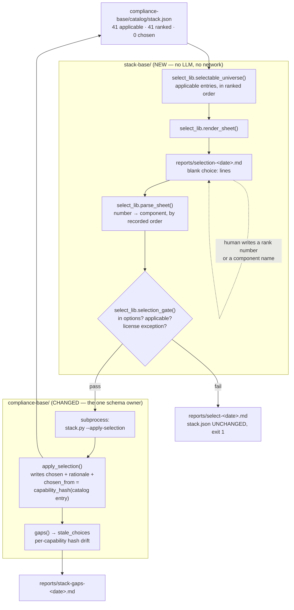

# Fix the component choice per capability, in the tracked file, against a recorded catalog state

**Plan ID:** `stack-compiler-selection`
**Source PRD:** `/home/felix/projects/howtobuildsoftware2026/.claude/PRPs/prds/stack-compiler.prd.md`
**PRD Phase:** `3 — Selection`
**Source Issue:** `None`
**Plan Publication:** `None`

## Outcome

**Problem:** `compliance-base/catalog/stack.json` now carries 68 capabilities, 41 of them
scoped as applicable to this product, and all 41 ranked best-fit-first with a per-position
reason — and **0 chosen**. The engineer holding a justified shortlist still has nowhere to
put the answer: `stack.py` has `--apply-scope` and `--apply-ranking`, but no entry point
writes `chosen`. The gap report therefore reads 41 of 41 and will keep reading 41 no matter
how good the ranking gets, and the Phase-4 gate has no allowlist to enforce.

**Affected user:** the NeuraWork engineer/architect who ran `scope.py` and `rank.py` and now
has to fix the stack for this product — and, later, an auditor asking why each component is
there.

**User outcome:** the engineer opens one sheet listing every applicable capability with its
ranked options and the reason each sits where it does, writes a rank number per capability,
applies it, and the decision is in the tracked file. When the catalog later changes, the
staleness check names exactly the choices that changed underneath them — not the whole file.

**Invariant:** every `chosen` value in `stack.json` is a component a human explicitly named,
drawn from that capability's own closed `options` pool, on a capability that is still
applicable, and recorded together with the catalog state it was chosen against.

**Success signal:** the gap report reaches 0 after a complete pass and stays there; a later
capability edit in `capabilities.json` reopens exactly the affected choices instead of
invalidating the whole stack.

**Approach:** a fifth decision-owned field (`chosen_from`) and a fourth entry point
(`--apply-selection`) on the schema owner `compliance-base/scripts/stack.py`, plus a new
LLM-free `select.py` / `select_lib.py` pair in `stack-base/` that renders an editable
markdown **selection sheet** from `stack.json`'s own `ranked` order, parses it back, gates it
deterministically, and applies it through `stack.py`. No agents, no network, no second
artifact.

## Recommendation

Three things make this the smallest coherent shape:

1. **The proposal already exists.** Phase 2 left `ranked` — a full best-fit-first ordering of
   the closed pool with a rationale per position — in `stack.json`
   (`compliance-base/catalog/stack.json`, 41 of 41 applicable entries ranked). Selection does
   not need to compute, rank, or re-argue anything, so it needs **no SDK agent, no API key,
   and no cost accounting**: it is a render, a parse, a set check, and a subprocess. That is
   the single largest simplification available here, and it is why `select.py` is unlike its
   two siblings.
2. **The write path is settled.** `scope.py:517-456` and `rank.py:438-456` both end in
   `subprocess.run([sys.executable, stack_py, "--apply-…", payload])`. `apply_selection()` is
   the fourth member of a family whose validation shape (`apply_scope:224-260`,
   `apply_ranking:263-332`) is already proven: collect every problem, refuse the whole write,
   never partially corrupt the file.
3. **The interaction has to survive being run by an agent.** Every other entry point in this
   harness is a non-interactive script invoked through `uv run` — often by Claude, where
   stdin is not a TTY. A `input()` prompt loop would work for a human in a terminal and
   `EOFError` everywhere else. A rendered sheet is editable by both, resumable across
   sessions, diffable, and its parser is unit-testable without stdin stubbing.

The sheet arrives with **every `choice:` line blank**. Nothing is chosen without an explicit
human keystroke — the PRD's "the engine proposes, the human fixes" becomes a mechanical
property rather than a convention. Typing `1` (a rank index) is accepted as shorthand for the
top-ranked component, so confirming a shortlist stays cheap without a pre-filled default that
an inattentive apply would silently ratify.

### Evidence

- `compliance-base/scripts/stack.py:118-160` — `scaffold()` is the only place a `stack.json`
  entry is constructed; its carry-over literal (`:141-153`) already lists seven
  decision-owned fields and must gain the eighth, or a re-scaffold erases every choice.
- `compliance-base/scripts/stack.py:163-221` — `gaps()` already computes `stale` from a
  **whole-file** `capabilities_hash` (`:210,220`). Per-capability staleness is the same idea
  one level down and belongs here, where the catalog is already loaded, rather than in a
  second engine computing a second hash.
- `compliance-base/scripts/stack.py:263-332` — `apply_ranking()`: problem accumulation,
  all-or-nothing refusal, `setdefault` for entries the pass did not touch so every entry
  carries every field. The template for `apply_selection()`, with one deliberate divergence
  (below).
- `stack-base/scripts/rank_lib.py:39-56` — `license_check()` already resolves
  `ok`/`exception`/`violation` against the catalog's own `license_policy`, including
  `verdict: "keep-exception"`. Selection reuses it; it does not re-implement license logic.
- `stack-base/scripts/rank.py:297-330` — the four-check preflight (compliance dir,
  `capabilities.json`, `stack.json`, `stack.py`) with the exact remediation command in each
  message. `select.py` repeats it verbatim.
- `stack-base/scripts/rank.py:264-272` — `is_scoped()`: ranking refuses to run on an unscoped
  stack. Selection needs the same guard for the same reason.
- `plugins/neurawork-cc-harness/engines/stack-compiler/tests/test_payload_drift.py:38-46` —
  globs `scripts/*.py`, so the two new modules are covered by the drift guard the moment they
  exist in both trees. No test change needed for that.
- `plugins/neurawork-cc-harness/engines/compliance-compiler/tests/test_stack.py:11` — the
  compliance tests import from `payload/scripts`, and `payload/scripts/stack.py` is currently
  byte-identical to `compliance-base/scripts/stack.py` (verified by `diff`). Both copies must
  change together or the tests measure a file the repo does not run.

### Alternatives considered

- **TTY prompt loop in `select.py`.** No sheet, no parser. Rejected: raises `EOFError` under
  the Bash tool and in CI, is not resumable, and leaves no reviewable record of what was
  presented at decision time. (User-confirmed.)
- **Defer the human-facing flow to Phase 5's `/st-select`.** Phase 3 would ship only
  `--apply-selection` plus the gate. Rejected: Phase 3's success signal is "the gap report
  reads 0 after a complete pass", which is unreachable without a way to make the pass.
  (User-confirmed.)
- **Pre-fill each `choice:` with the top-ranked component.** Faster, and it matches the
  Phase-2 plan's phrasing ("confirm or override the top entry"), but an un-reviewed apply
  becomes indistinguishable from auto-picking, which the PRD explicitly excludes.
  (User-confirmed.)
- **Put the whole selection pass in `stack.py`.** It is stdlib-only, owns the artifact, and
  already loads everything the sheet needs. Rejected on the PRD's placement decision: a user
  who installs only `compliance-compiler` should not inherit the selection flow. `stack.py`
  gets the thin schema-owner entry point; the sheet, the parser and the gate live in
  `stack-base/`, exactly as scoping and ranking do.
- **Derive staleness from `options` alone** (chosen vanished / pool changed), avoiding a new
  field. Rejected: it cannot see a license or role change on a component that stayed in the
  pool — precisely the change that should reopen a choice — and `chosen_from` mirrors
  `scoped_from` / `ranked_from`, which the schema already establishes.

## Visuals



The sheet is the only new human surface, and it is a working file under gitignored
`reports/`. The decision of record stays in tracked `stack.json`, written by the same schema
owner that already accepts scoping and ranking — so the two engines still meet at exactly one
file and one script.

## Implementation Context

### Mandatory reading

| File | Why it matters |
|---|---|
| `compliance-base/scripts/stack.py:118-160` | `scaffold()` — the carry-over literal that decides whether a decision survives a re-scaffold. Missing `chosen_from` here silently erases staleness tracking on the next `co-capabilities` run. |
| `compliance-base/scripts/stack.py:163-221` | `gaps()` — where `applicable` already suppresses false gaps, and where per-capability staleness joins the existing whole-file `stale` flag. |
| `compliance-base/scripts/stack.py:263-332` | `apply_ranking()` — the validation and write shape `apply_selection()` follows, including `setdefault` so every entry carries every field. |
| `compliance-base/scripts/stack.py:476-587` | `main()` — flag handling, per-branch print summaries, and the unconditional gap-report tail every branch falls through to. |
| `stack-base/scripts/rank.py:286-462` | `main()` end-to-end: preflight → guard → gate → report → subprocess apply → exit-code propagation. `select.py` is this pipeline minus the agents, the cost accounting and `state.json`. |
| `stack-base/scripts/rank_lib.py:59-167` | `rankable_universe()` (join `options` to catalog metadata by name) and `ranking_gate()` (problem buckets + `exceptions`) — the two shapes `select_lib` mirrors. |
| `plugins/neurawork-cc-harness/engines/stack-compiler/tests/test_rank.py:172-260` | The CLI-test precedent: build a fake repo in `tempfile`, run the script as a subprocess with `STACK_ROOT` set, assert on the remediation message. |
| `plugins/neurawork-cc-harness/engines/compliance-compiler/tests/test_stack.py:1-60` | Fixture builders (`_constraints`, `_capabilities`) the new `stack.py` tests reuse rather than re-invent. |

### Existing patterns and primitives

- **Problem accumulation, then one refusal:** `stack.py:279-312` collects every problem into a
  list and raises a single joined `ValueError`. A caller sees all the sheet's mistakes at once
  instead of fixing them one run at a time.
- **Every entry carries every field:** `stack.py:325-330` — a pass that skips an entry still
  `setdefault`s its fields to `None`, so no consumer has to guard a missing key. `chosen_from`
  follows this rule.
- **Hash width:** `utils.file_hash:40-42` and `scope_lib.product_hash:25-31` both take
  `sha256(...)[:16]`. `capability_hash()` matches so every hash in the catalog reads alike.
- **Two-tree edit:** `plugins/…/engines/stack-compiler/payload/scripts/` and `stack-base/scripts/`
  are kept byte-identical by `test_payload_drift.py` (there is no `install.py` yet — PRD Phase 5).
  `plugins/…/engines/compliance-compiler/payload/scripts/stack.py` and
  `compliance-base/scripts/stack.py` are kept identical by `install.py`'s ADOPT copy
  (`install.py:60-69`); the tests read the payload copy, so both must be written.
- **Repo guard before any report write:** `rank.py:364-369` calls
  `assert_in_repo_not_dotclaude(REPORTS_DIR, ROOT_DIR.parent)` and refuses on failure.

### Integration points

- `compliance-base/scripts/stack.py:477-486` — argparse block; gains `--apply-selection PATH`.
- `compliance-base/scripts/stack.py:546-568` — the `--apply-ranking` branch; the
  `--apply-selection` branch sits directly after it and falls through to the same gap tail.
- `compliance-base/scripts/stack.py:335-452` — `render_gap_report()`; the Informational section
  gains a stale-choices block next to `off_catalog`.
- `stack-base/scripts/rank.py:264-272` — `is_scoped()` moves to `rank_lib` so `select.py` and
  `rank.py` share one definition of "has scoping run".
- `CLAUDE.md:47-57` and `CLAUDE.md:95-110` — the command block and the `stack-base/` bullet
  that describe this engine's two passes; selection is the third.
- `compliance-base/CLAUDE.md:69-75` — the "stack.json ownership is split" bullet, which still
  names only `--apply-scope` and lists five carried fields (Phase 2 added two more and did not
  update it). This change adds an eighth; fix the whole bullet once.

## Scope

### In scope

- `chosen_from` as an eighth decision-owned field on every `stack.json` entry, carried by
  `scaffold()`, computed by `stack.py` from the live catalog at apply time.
- `stack.py --apply-selection <file>` with its own gate: known key, still applicable, chosen
  component present in that entry's `options`, non-empty.
- Per-capability staleness in `gaps()` + the gap report.
- `stack-base/scripts/select_lib.py` — universe, sheet render, sheet parse, selection gate,
  report render, payload builder. Pure stdlib, no SDK.
- `stack-base/scripts/select.py` — CLI: render the sheet (default) / `--apply <sheet>` /
  `--dry-run`.
- Byte-identical payload mirrors of all four changed or new script files.
- Tests for every new behaviour in both engines' suites.
- `AGENTS.md` boundary correction (both copies) and the `CLAUDE.md` command/ownership updates.

### Not building

- **The `st-` gate on PRD and plan writes.** PRD Phase 4, parallel to this one, and it consumes
  what this plan produces.
- **`install.py` / `recon.py` / `/st-select` / `docs/`.** PRD Phase 5. `docs/ARCHITECTURE.md`
  does not mention `stack-compiler` at all yet; adding it here would half-document the engine
  ahead of the phase that owns it.
- **Un-choosing.** No `chosen: null` clearing path — a re-selection overwrites, and no
  identified flow needs to blank a choice.
- **Choosing more than one component per capability.** `chosen` stays a single string; the
  PRD's open question ("one component or a set?") is unresolved and nothing in this pass
  forces it. A set would be a schema change owned by `compliance-compiler`.
- **Off-catalog choices.** The gate refuses anything outside `options`; `gaps()`'s existing
  `off_catalog` report stays the reporter for hand-edits to `stack.json`.
- **Live research on the shortlist** (PRD "Could") and a **VERSION bump** — Phase 2 changed
  both engines' payloads without bumping either counter (`git show 2da4b38 --stat`); staying
  consistent, the counters advance when Phase 5 ships the installer.

## Delivery Considerations

| Concern | Decision and owned work |
|---|---|
| Compatibility / migration | `chosen_from` is additive and defaults to `None`. Existing `stack.json` files (this repo's included: 68 entries, 0 chosen) gain the key on the next `--scaffold` or apply; nothing re-derives or invalidates prior decisions. A choice recorded without a hash is never reported stale — deliberate, and stated in the `gaps()` docstring. |
| Rollout / reversibility | `stack.json` is tracked: a bad apply is a reviewable diff and `git checkout` reverts it. Every failure path in `select.py` writes its report and leaves `stack.json` untouched, mirroring `rank.py:415-436`. |
| Observability | Two reports: `stack-base/reports/select-<date>.md` (what was chosen and why it passed) and the existing `compliance-base/reports/stack-gaps-<date>.md` (what remains, plus stale choices). Both gitignored working artifacts; the tracked record is `stack.json`. |
| Documentation | Root `CLAUDE.md` command block + `stack-base/` bullet; `compliance-base/CLAUDE.md` ownership bullet; `AGENTS.md` boundary. `docs/` is Phase 5's. |

## Implementation

### 1. `stack.py` records a human's choice against the catalog state it was made under

**Files and integration points**
- `compliance-base/scripts/stack.py:118-160` — UPDATE — `scaffold()`'s carry-over literal is the
  only construction site for an entry; `chosen_from` must join it.
- `compliance-base/scripts/stack.py:163-221` — UPDATE — `gaps()` gains `stale_choices`.
- `compliance-base/scripts/stack.py:263-332` — UPDATE — add `apply_selection()` after
  `apply_ranking()`, plus `capability_hash()` and a `catalog_capabilities()` key→capability map
  near `component_options():101-115`.
- `compliance-base/scripts/stack.py:335-452` — UPDATE — `render_gap_report()` Informational
  section gains a stale-choices block.
- `compliance-base/scripts/stack.py:476-587` — UPDATE — `--apply-selection PATH` flag, its
  branch after the `--apply-ranking` branch, and a stale-choices line in the summary print.
- `plugins/neurawork-cc-harness/engines/compliance-compiler/payload/scripts/stack.py` — UPDATE —
  byte-identical mirror (the tests import this copy).
- `plugins/neurawork-cc-harness/engines/compliance-compiler/tests/test_stack.py` — UPDATE.

**Implementation**
- `capability_hash(cap) -> str` — `sha256` of a canonical JSON dump (`sort_keys=True`) of the
  **decision-relevant** subset of one catalog capability: `name`, `description`, sorted
  `satisfies`, and for each `stack[]` entry `name` / `license` / `role` / `verdict`. First 16
  hex chars, matching `utils.file_hash:40-42`. Free prose (`why`, `stack_notes`, `category`) is
  excluded on purpose: a wording fix must not reopen a settled choice, while a pool, license,
  role or obligation change must. Document that boundary in the docstring — it is the whole
  semantics of the field.
- `apply_selection(stack, selections, catalog) -> dict` — `selections` maps a capability key to
  `{"chosen": str, "rationale": str}`. Collect problems, then refuse the whole write (mirroring
  `apply_ranking:279-312`): unknown key; key whose entry is not `applicable`; blank `chosen`;
  `chosen` not in that entry's `options`; key the catalog no longer describes (no capability to
  hash). On success, for each given key set `chosen` (stripped), `rationale` (stripped, may be
  empty) and `chosen_from = capability_hash(catalog_capability_for(key))`; for every other entry
  `setdefault("chosen_from", None)`. `options`, `ranked`, and the three applicability fields are
  never read or written.
- **Deliberate divergence from its two siblings:** `apply_selection` is *partial by design* —
  it writes the keys it was given and leaves the rest alone, where `apply_scope` and
  `apply_ranking` demand the complete key set. Selection is incremental human work spread over
  sittings, and an omitted key here is not a silent drop: it stays `chosen: null` and is counted
  by the gap report on every run. State that reasoning in the docstring, because a reader
  arriving from `apply_ranking` will otherwise read it as an inconsistency.
- `gaps()` gains `stale_choices: list[dict]` — for each key with a non-empty `chosen` **and** a
  non-empty `chosen_from`, compare against `capability_hash()` of the current catalog capability
  and record `{key, chosen, chosen_from, current}` on mismatch. A choice with `chosen_from: None`
  (hand-recorded, or predating this field) is not reported: there is no reference to compare
  against, and guessing would either cry wolf on every run or hide a real drift. Non-applicable
  entries are skipped, as they already are for gaps (`:195-199`).
- `render_gap_report()` — add a stale-choices block to the Informational section beside
  `off_catalog` (`:429-439`), naming the chosen component and pointing at the re-selection
  command. Include it in the "Nothing to report" condition at `:449-451`.
- `main()` — `--apply-selection PATH`: load the file, require a non-empty `selections` object
  (mirroring the `rankings` check at `:552-559`; no hash is required in the payload because
  `chosen_from` is computed here, from the catalog this process already loaded), call
  `apply_selection`, print the refusal on `ValueError` and return 1, else write atomically and
  print `N choice(s) recorded, M applicable capability/-ies still undecided`. Fall through to the
  existing gap tail. Print a `! N chosen component(s) were decided against an older catalog`
  line when `stale_choices` is non-empty.

**Tests**
- `capability_hash` is stable across calls, changes when a component's `license` changes, and
  does **not** change when a component's `why` prose changes.
- `apply_selection` writes `chosen`/`rationale`/`chosen_from`; leaves untouched keys' `chosen`
  as it was and gives them `chosen_from: None`; preserves `ranked`, `options`, `applicable`,
  `applicability_reason`, `scoped_from` byte-identically on every entry.
- `apply_selection` refuses — writing nothing — an unknown key, a non-applicable key, a blank
  `chosen`, and a component outside `options`, naming all offenders in one message.
- `scaffold()` carries `chosen_from` over by key.
- `gaps()` marks exactly the edited capability's choice stale when one capability's component
  license changes in the catalog and the others do not (**PRD Phase-3 success signal**), and
  reports nothing stale when `chosen_from` is `None`.

**Validation**
- `cd plugins/neurawork-cc-harness/engines && python3 -m unittest discover -s compliance-compiler/tests`
  — all pass, including the new cases.
- `diff plugins/neurawork-cc-harness/engines/compliance-compiler/payload/scripts/stack.py compliance-base/scripts/stack.py`
  — no output.

### 2. `select_lib.py` renders the sheet, reads it back, and gates it

**Files and integration points**
- `plugins/neurawork-cc-harness/engines/stack-compiler/payload/scripts/select_lib.py` — CREATE —
  pure logic, stdlib only, no SDK import, mirroring `rank_lib.py`'s role.
- `stack-base/scripts/select_lib.py` — CREATE — byte-identical mirror.
- `plugins/neurawork-cc-harness/engines/stack-compiler/payload/scripts/rank_lib.py` +
  `stack-base/scripts/rank_lib.py` — UPDATE — receive `is_scoped()` from `rank.py:264-272`.
- `plugins/neurawork-cc-harness/engines/stack-compiler/payload/scripts/rank.py` +
  `stack-base/scripts/rank.py` — UPDATE — drop the moved function, call `rank_lib.is_scoped`
  at `:334`.
- `plugins/neurawork-cc-harness/engines/stack-compiler/tests/test_rank.py:136-140` — UPDATE —
  the two `is_scoped` tests now address `rank_lib`.
- `plugins/neurawork-cc-harness/engines/stack-compiler/tests/test_select_lib.py` — CREATE.

**Implementation**
- `selectable_universe(stack) -> list[dict]` — mirrors `rank_lib.rankable_universe:59-102` but
  reads only `stack.json`: skip non-applicable entries; per entry emit `key`, `capability`,
  `framework`, `mandatory_linked`, `options`, `chosen`, and `order` — the component names from
  `ranked` when present, otherwise `options` verbatim — plus `rationales` (component →
  ranking rationale, empty when unranked) and `ranked: bool`. The displayed `order` is what a
  numeric `choice:` resolves against, so it must come from one place.
- `render_sheet(universe, generated, stack_path) -> str` — a header stating the counts
  (`N applicable, M already chosen, K undecided`), the filling instructions and the exact
  `--apply` command, then one block per capability:

  ```markdown
  ## gdpr/encryption-at-rest

  **Encryption at rest** — mandatory-linked

  1. OpenBao — <ranking rationale>
  2. age — <ranking rationale>

  choice:
  reason:
  ```

  An entry that already carries a `chosen` renders it after `choice:` so a re-render is
  resumable and shows at a glance what is left. An unranked applicable entry (possible when
  the catalog gained a capability after the last `rank.py` run) renders its `options` in
  catalog order under a `not ranked — run scripts/rank.py` note, so it cannot silently
  disappear from the sheet.
- `parse_sheet(text, universe) -> dict` — the parser reads **only** three line shapes: a
  `## <key>` heading opens a block, `choice:` and `reason:` close it. It never re-derives
  component names from the numbered list — that list is human-facing prose, and the numeric
  resolution uses the universe's recorded `order` for that key. Rules: a blank `choice:` means
  "still deciding" and is omitted from the result; an all-digit value indexes `order` 1-based;
  anything else must match a name in `order` exactly. Accumulate and raise one joined
  `ValueError` for: a heading naming an unknown or non-applicable key, a duplicate heading, a
  number out of range, a name not in that block's list, and a second `choice:` in one block.
- `selection_gate(universe, selections, policy) -> dict` — returns
  `{ok, unknown, not_applicable, off_pool, blank, exceptions, pending}`. `off_pool` and
  `not_applicable` re-check what `stack.py` will check, so a bad sheet fails inside this engine
  with the sheet's own vocabulary before a subprocess refuses it. `exceptions` reuses
  `rank_lib.license_check:39-56` on the chosen component and lists `keep-exception` picks
  without failing — the exception travels with the choice, as `AGENTS.md` requires. `pending`
  counts applicable capabilities with no choice yet, and is informational: a partial pass is
  legitimate, so it never fails the gate. A license `violation` cannot reach here (the ranking
  gate refuses to write a pool containing one) but is treated as a failure if it does.
- `render_select_report(universe, selections, gate, generated, sheet_path) -> str` — mirrors
  `render_rank_report:191-283`: a gate-failure section first when it failed ("This run wrote
  nothing"), then one line per recorded choice (component, its rank position, the reason if
  given), then the exceptions block, then what is still pending.
- `selections_payload(selections) -> dict` — `{"selections": {key: {chosen, rationale}}}`, the
  one place this engine's internal shape meets the schema owner's field names, exactly as
  `rank_lib.rankings_payload:170-188` does.
- Move `is_scoped` into `rank_lib` rather than duplicating it: both passes must agree on what
  "scoping has run" means, and a second copy is a divergence waiting to happen.

**Tests**
- Round trip: `render_sheet` output parsed by `parse_sheet` with `1` written into two blocks
  yields those two keys' top-ranked components and nothing else.
- A blank `choice:` yields no entry (pending, not an error); `reason:` is carried through.
- An exact component name resolves; a name not in the block's list, a number out of range, an
  unknown `##` heading, a non-applicable heading and a duplicate heading each raise, and one
  raise names every offender.
- `selectable_universe` excludes non-applicable entries, orders components by `ranked`, and
  falls back to `options` with `ranked: False` for an unranked applicable entry.
- `selection_gate` flags an off-pool choice, surfaces a `keep-exception` chosen component
  without failing, and stays `ok` with only some capabilities decided.

**Validation**
- `cd plugins/neurawork-cc-harness/engines && python3 -m unittest discover -s stack-compiler/tests`
  — all pass, including the relocated `is_scoped` tests.

### 3. `select.py` turns the sheet into a tracked decision

**Files and integration points**
- `plugins/neurawork-cc-harness/engines/stack-compiler/payload/scripts/select.py` — CREATE.
- `stack-base/scripts/select.py` — CREATE — byte-identical mirror.
- `plugins/neurawork-cc-harness/engines/stack-compiler/tests/test_select.py` — CREATE.

**Implementation**
- Module docstring in the house style: what it reads, that it is the human's pass, that it runs
  **no agent and needs no API key**, and that the write goes through
  `<compliance_dir>/scripts/stack.py --apply-selection`, the one schema owner.
- CLI: no flag → render the sheet; `--apply PATH` → parse, gate, apply; `--dry-run` (with
  `--apply`) → parse, gate, write the report, write nothing to `stack.json`.
- Preflight identical to `rank.py:297-330`: compliance dir, `capabilities.json`, `stack.json`,
  `scripts/stack.py`, each with its remediation command. Then `rank_lib.is_scoped(stack)` — if
  false, print the `scope.py` remediation (`rank.py:334-338`) and return 1, because an unscoped
  stack would offer all 68 capabilities including the ones scoping exists to rule out.
- Empty universe → "Every capability was scoped out of this product — nothing to select."
  and return 0 (mirroring `rank.py:341-343`).
- Render path: `assert_in_repo_not_dotclaude(REPORTS_DIR, ROOT_DIR.parent)`, `mkdir` the
  reports dir, write `reports/selection-<today>.md`, print the path plus
  `N applicable, M chosen, K undecided` and a warning naming any unranked applicable
  capability.
- Apply path: read the sheet (missing file → name it and return 1), `parse_sheet` (`ValueError`
  → print each problem, return 1), `selection_gate`, write `reports/select-<today>.md` **always**,
  then on failure print the buckets and return 1 with nothing written. On success write
  `.shards/selections.json` and
  `subprocess.run([sys.executable, str(stack_py), "--apply-selection", str(path)], cwd=str(comp))`,
  echo its stdout, and propagate a non-zero exit as "stack.json is unchanged"
  (`rank.py:445-455`). `stack.py`'s own tail prints the remaining gap count, so `select.py`
  does not recompute it.
- No `state.json` and no cost accounting: there is no LLM run to debounce or bill, and adding
  the file only to match the siblings' shape would be state nothing reads.

**Tests**
- Preflight, as subprocesses against a temp repo with `STACK_ROOT` set
  (`test_rank.py:172-190`): missing compliance install, missing `stack.json` (names the
  `--scaffold` command), unscoped stack (names `scope.py`), fully scoped-out product exits 0.
- Render: the sheet file appears at the expected path, contains every applicable key and no
  non-applicable key, and its counts match the fixture.
- Apply with an off-pool `choice:` exits non-zero, writes the report, and leaves the fixture's
  `stack.json` byte-identical.

**Validation**
- `cd plugins/neurawork-cc-harness/engines && python3 -m unittest discover -s stack-compiler/tests`
- `cd plugins/neurawork-cc-harness/engines && python3 -m unittest discover -s stack-compiler/tests -k payload_drift`
  — proves both trees match for all four script files.

### 4. The constitution and the CLAUDE.md hierarchy describe the third pass

**Files and integration points**
- `stack-base/AGENTS.md` + `plugins/neurawork-cc-harness/engines/stack-compiler/payload/AGENTS.md`
  — UPDATE — byte-identical mirrors (drift-guarded).
- `CLAUDE.md:47-57` and `CLAUDE.md:95-110` — UPDATE.
- `compliance-base/CLAUDE.md:69-75` — UPDATE.

**Implementation**
- `AGENTS.md` is read verbatim into every scoping and ranking agent prompt
  (`rank.py:63-64`), so add **no** selection rules — there is no selection agent. Change only
  the Boundaries bullet that currently reads "This engine **never** picks a component and never
  touches `chosen` or `rationale`", which this phase makes false at the engine level while it
  stays true at the agent level: the agents never pick; the selection pass writes the choice a
  human made, through `stack.py --apply-selection`. Keep the surrounding rules unchanged.
- Root `CLAUDE.md`: add
  `uv run --directory stack-base python scripts/select.py   # render the selection sheet`
  and its `--apply` companion to the command block, and extend the `stack-base/` bullet's
  "Two passes" sentence to three, naming `--apply-selection` alongside `--apply-scope` and
  `--apply-ranking`.
- `compliance-base/CLAUDE.md`: rewrite the ownership bullet so it names all four `stack.py`
  entry points and all eight carried fields (it currently names one entry point and five
  fields — Phase 2 added `ranked`/`ranked_from` without updating it), and add
  `--apply-selection` to the command list at `:44`.

**Tests**
- No new automated test; `test_payload_drift.py:48-52` already fails if the two `AGENTS.md`
  copies diverge.

**Validation**
- `cd plugins/neurawork-cc-harness/engines && python3 -m unittest discover -s stack-compiler/tests`
  — the drift guard passes with both `AGENTS.md` copies updated.
- `grep -n "select.py" CLAUDE.md compliance-base/CLAUDE.md` — the new entry points appear in
  both.

### 5. Prove the pass end to end on the real 41-capability stack

**Files and integration points**
- `compliance-base/catalog/stack.json` — touched **only** during the check, then reverted.

**Implementation**
- Run `uv run --directory stack-base python scripts/select.py`; confirm the sheet lists 41
  blocks, none of them a non-applicable key, each showing its ranked order and rationales.
- Write `1` into exactly two `choice:` lines (one mandatory-linked), leave the rest blank, run
  `--apply`, and confirm: `stack.py` reports 2 choices recorded, `stack.json`'s two entries
  carry `chosen` + `chosen_from` while the other 66 are untouched, and the gap line drops from
  41 to 39.
- Change one component's `license` in `compliance-base/catalog/capabilities.json`, re-run
  `uv run --directory compliance-base python scripts/stack.py`, and confirm the stale-choices
  block names only that capability.
- `git checkout compliance-base/catalog/stack.json compliance-base/catalog/capabilities.json`.
  The real 41-capability selection pass is the engineer's to make, not this implementation's —
  leaving a half-filled stack in the diff would be a decision nobody made.

**Validation**
- `git status --porcelain compliance-base/catalog/` — empty after the revert.

## Acceptance

1. **AC1 — The shortlist becomes a sheet.** `select.py` with no flags writes
   `stack-base/reports/selection-<date>.md` containing exactly the applicable capabilities, each
   with its components in the recorded `ranked` order and that ranking's rationale per position,
   and a blank `choice:` line. Non-applicable capabilities do not appear.
2. **AC2 — A filled sheet becomes the tracked decision.** `select.py --apply <sheet>` writes each
   filled `choice:` (rank number or exact name) into `stack.json`'s `chosen`, with its optional
   `reason:` in `rationale` and `chosen_from` set to the current hash of that capability's
   catalog content, via `stack.py --apply-selection`. Blank lines stay `chosen: null` and are
   counted by the gap report; the gap count drops by exactly the number of choices recorded.
3. **AC3 — The pool stays closed and the scoping stands.** A `choice:` naming a component outside
   that capability's `options`, or a `##` heading for a non-applicable or unknown capability,
   fails the run: a report is written, `stack.json` is byte-identical, and the exit code is
   non-zero. The same input is refused independently by `stack.py --apply-selection`.
4. **AC4 — A catalog change reopens only what it changed.** Changing one capability's
   decision-relevant catalog content (pool membership, a component's license, role or verdict,
   the capability's description or `satisfies`) makes `stack.py` report exactly that
   capability's choice as stale; other choices and the whole-file `stale` flag behave as before.
   A prose-only edit (`why`, `stack_notes`) reports nothing stale.
5. **AC5 — Nothing else moved.** Selection never writes `options`, `ranked`, `ranked_from`,
   `applicable`, `applicability_reason` or `scoped_from`; a re-scaffold carries `chosen_from`
   over by key; `stack-base/` writes `stack.json` only through `stack.py`; both engines' payload
   and self-host trees remain byte-identical; `select.py` runs with no API key and makes no
   network call.

## Validation

| Gate | Command or procedure | Proves |
|---|---|---|
| Schema owner | `cd plugins/neurawork-cc-harness/engines && python3 -m unittest discover -s compliance-compiler/tests` | AC2, AC4, AC5 — `apply_selection`, `capability_hash`, `scaffold` carry-over, `gaps().stale_choices` |
| Selection engine | `cd plugins/neurawork-cc-harness/engines && python3 -m unittest discover -s stack-compiler/tests` | AC1, AC3, AC5 — universe, render/parse round trip, gate, CLI preflight, payload drift |
| Untouched suites | `cd plugins/neurawork-cc-harness/engines && python3 -m unittest discover -s _shared/tests && python3 -m unittest discover -s knowledge-compiler/tests && python3 -m unittest discover -s claudemd-lerner/tests` | No regression in the other engines (baseline: 34 / 15 / 13 tests, all passing) |
| Lint | `cd stack-base && uvx ruff check` and `cd compliance-base && uvx ruff check` | `line-length = 100` and the repo's lint rules on all changed files |
| Mirror | `diff plugins/neurawork-cc-harness/engines/compliance-compiler/payload/scripts/stack.py compliance-base/scripts/stack.py` | AC5 — the compliance payload and self-host did not diverge (the stack-compiler pair is covered by `test_payload_drift.py`) |
| Runtime | Task 5's real run on the live 41-capability stack, then `git status --porcelain compliance-base/catalog/` | AC1–AC4 against real data, and that the check left no unmade decision behind |

## Risks and Decisions

| Decision or risk | Recommendation | Evidence / mitigation | Consequence if different |
|---|---|---|---|
| What `capability_hash` covers | Pool membership + each component's `license`/`role`/`verdict`, plus the capability's `name`/`description`/`satisfies`; free prose excluded | A `why` rewrite must not reopen 41 settled choices; a license change must reopen the one it affects | Hashing the whole capability dict makes staleness fire on copy-editing and trains the engineer to ignore it; hashing only `options` misses a license change on a component that stayed in the pool |
| `apply_selection` is partial where its siblings are total | Keep it partial, and say why in the docstring | Selection is incremental human work; an omitted key stays `chosen: null` and is counted by the gap report every run, so nothing is silently dropped | Demanding all 41 keys at once makes a sitting-by-sitting pass impossible and pushes the engineer to hand-edit `stack.json`, bypassing every gate |
| A choice recorded with `chosen_from: null` is never reported stale | Accept it; do not guess | Hand-edited `stack.json` entries and choices predating this field have no reference to compare against | Treating null as stale makes every hand-recorded choice permanently noisy; treating it as a separate report bucket adds a third state nobody acts on |
| Moving `is_scoped` from `rank.py` to `rank_lib.py` | Move it and update the two tests that address it | Both passes must agree on "scoping has run"; a second copy in `select.py` is a divergence waiting to happen | Duplicating it means a future change to the definition silently applies to one pass only |
| PRD open question: one component per capability, or a set? | Ship single-string `chosen`, unchanged | The schema already defines `chosen` as a string (`stack.py:141-153`); nothing in this pass forces the question | A set would be a `compliance-compiler` schema change plus a sheet grammar for multiple picks — a separate, larger decision |
| Sheet lives under gitignored `reports/` | Keep it there | It is a working file; the decision of record is tracked `stack.json`, and a re-render pre-fills from what was already recorded | Tracking the sheet would put a half-filled working file into review and create a second place a choice appears to live |

## Compliance

**Capabilities**: none — this change is design-time tooling. It adds one field to a tracked
JSON file, one deterministic gate, one entry point on a stdlib script, and one LLM-free CLI
that renders and reads back a repository-local markdown sheet. It processes no personal data,
exposes no runtime interface, ships nothing into a product, makes no network call, and writes
only inside the repo (`compliance-base/catalog/stack.json` plus gitignored
`stack-base/reports/` and `stack-base/.shards/`, guarded by `_shared/repo_guard.py`), so no
capability in `catalog/capabilities.json` is delivered by it.

**Relationship to the catalog is supportive, not substitutive:** this phase is what finally
*closes* the capability→component gap the catalog reports. The constraint→capability coverage
guarantee stays with `compliance-compiler`, and its `PostToolUse` plan validator is untouched.
After this phase `stack.py`'s `gaps()` still reads 41 unchosen until the engineer makes the
selection pass — the machinery is the deliverable, the decision is theirs — and the
component-level enforcement that consumes `chosen` is PRD Phase 4's `st-` gate, not this one's.

## Related Plans

- **Depends on:** `/home/felix/projects/howtobuildsoftware2026/.claude/PRPs/plans/completed/stack-compiler-map-rank.plan.md` — PRD Phase 2, which produced the `ranked` order this pass presents.
- **Followed by:** PRD Phase 4 (`st-` gate) consumes the `chosen` allowlist this pass fills; PRD Phase 5 wraps it in `/st-select`.

## Agent Notes

- Current live state, worth checking before and after: `compliance-base/catalog/stack.json`
  holds 68 entries — 41 applicable, 41 ranked, 0 chosen — scoped from product hash
  `dbc748613f86f0e7`.
- Test discovery must be run **per directory** from `plugins/neurawork-cc-harness/engines/`;
  a single top-level `discover` under-collects because the engine dirs are not importable
  packages (root `CLAUDE.md:20-33`).
- `plugins/…/engines/compliance-compiler/tests/test_stack.py` imports
  `payload/scripts/stack.py`, not the self-host copy. Editing only `compliance-base/scripts/stack.py`
  produces a green suite that tested the wrong file — write both, then `diff`.
- Phase 4 runs in parallel against the same PRD and will read `chosen` + `options` from
  `stack.json`. It does not touch `stack.py` or `select*.py`, so the two plans do not collide;
  the only shared file is the PRD's phase table.
