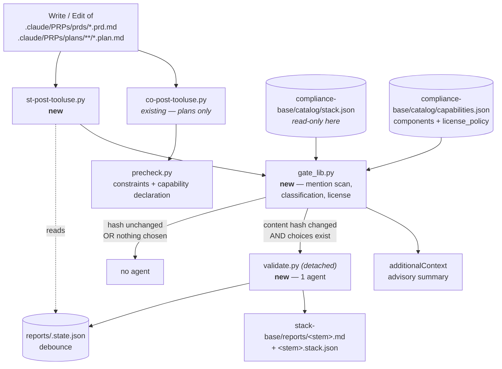

# Flag an off-stack component the moment a PRD or plan proposes it

**Plan ID:** `stack-compiler-st-gate`
**Source PRD:** `/home/felix/projects/howtobuildsoftware2026/.claude/PRPs/prds/stack-compiler.prd.md`
**PRD Phase:** `4 — st- gate`
**Source Issue:** `None`
**Plan Publication:** `None`

## Outcome

**Problem:** `compliance-base/catalog/stack.json` now carries 68 capabilities, 41 scoped as
applicable, all 41 ranked best-fit-first — and Phases 1–3 built every machine that *decides*
the stack. Nothing *reads* the decision back. A PRD or plan written tomorrow can name any of
the catalog's 163 components, or a component belonging to a capability this product
deliberately scoped out, and no surface in the repo notices. The compliance `co-` hook checks
plans at the constraint and capability level only (`compliance-base/scripts/precheck.py:170`);
component identity is outside its question.

**Affected user:** the NeuraWork engineer/architect authoring the next PRD or plan — and the
auditor who later asks why the shipped design names a component the tracked stack does not.

**User outcome:** the moment a PRD or plan is written, the engineer sees which catalog
components the document names, which of them the stack already fixed to something else, which
belong to a capability this product ruled out, and which carry a license the policy forbids —
in the same session, before the document is acted on.

**Invariant:** every catalog component a live PRD or plan names is classified against
`stack.json` at write time — recorded as this product's choice, contradicting a recorded
choice, standing on a scoped-out capability, or filling a capability still undecided — and no
document write is ever lost, slowed past a second, or silently duplicated into a second LLM
run when its content did not change.

**Success signal:** a PRD naming an off-stack component is flagged on the write that
introduces it, and repeated saves of unchanged content spawn no second agent — the two signals
PRD Phase 4 names.

**Approach:** one more `PostToolUse` hook beside the proven `co-` one, at the component level:
`stack-base/hooks/st-post-tooluse.py` matches live PRD **and** plan paths, runs a pure
`scripts/gate_lib.py` precheck inline (case-sensitive closed-pool mention scan → per-mention
classification against `stack.json` → license check via the existing `rank_lib.license_check`),
emits an advisory summary as `additionalContext`, and — only when the content hash changed and
the stack actually carries choices — spawns `scripts/validate.py` detached to have one agent
separate a *proposal* from a passing *mention* and name the applicable capabilities the
document ignores.

## Recommendation

Three things make this the smallest coherent shape:

1. **The hook is a port, not an invention.** `compliance-base/hooks/co-post-tooluse.py` already
   solves every non-domain problem this hook has: defensive payload reading
   (`:45-49`), the recursion guard (`:27`), the worktree redirect (`:36-42`), the inline
   `<1s` precheck plus detached `subprocess.Popen` split (`:120-127`), and the
   `warn`/`block` switch (`:137-142`). The `st-` hook differs from it in exactly two places —
   which paths it matches, and what its precheck asks — and PRD-side settings merging is
   additive and already proven by three coexisting installs (`.claude/settings.json`).
2. **The closed pool makes the deterministic half exact.** The gate does not need to recognise
   technology in general — an open-world problem — because the PRD scopes it to the catalog's
   own 163 component names ("Product-domain technology gating … not gated in v1"). A
   case-sensitive whole-word scan over those names plus a tiny alias table is precise on real
   documents: measured against this repo's own corpus it returns 5 components for
   `stack-compiler.prd.md` (Keycloak, OpenFGA, PostgreSQL, Temporal), 2 for the Phase-3 plan,
   and **0** for `CLAUDE.md` and `docs/ARCHITECTURE.md`. Case-insensitivity was measured too
   and is strictly worse: it turns every "GitHub" into two catalog entries and puts `fleet`,
   `fides`, `cedar`, `probo` — ordinary words — into the index.
3. **Both halves of the license question already exist.** `rank_lib.license_check`
   (`stack-base/scripts/rank_lib.py:39`) and `rank_lib.normalize_license` (`:29`) decide
   `ok` / `exception` / `violation` for one component against the catalog's own
   `license_policy`, honouring `verdict: "keep-exception"`. The gate calls them. No second
   license opinion enters the repo.

What this deliberately does **not** build: the deterministic layer never enumerates the
applicable capabilities a document fails to mention. `compliance-base/scripts/precheck.py:113-117`
already rejected that shape in this exact position, in writing — "a 62-item 'undeclared' list
on every plan write is noise nobody acts on" — and the reasoning transfers unchanged: with 41
applicable capabilities, a mechanical "you did not mention these 39" fires identically on every
document and gets ignored by week two. That judgment goes to the agent, which reads what the
document is *for*.

### Evidence

- `compliance-base/hooks/co-post-tooluse.py:96-146` — the working PostToolUse template: write-tool
  filter, path match, inline precheck, detached spawn with `child_env()`, advisory
  `additionalContext`, conditional `decision: "block"`.
- `compliance-base/scripts/precheck.py:40-56` — `is_plan_path`: `.plan.md` suffix, `PLANS_SUBPATH`
  prefix, `completed` anywhere after the prefix disqualifies. The PRD matcher is the same shape
  against `.claude/PRPs/prds` (which likewise has a `completed/` subdir).
- `stack-base/scripts/rank_lib.py:39-57` — `license_check`: `internal-infra` is always `ok`;
  `in-product` must be embeddable unless the catalog recorded `keep-exception`.
- `stack-base/scripts/selection_lib.py:39-88` / `rank_lib.py:71-113` — `selectable_universe` /
  `rankable_universe`: the existing join from `stack.json`'s `options` to each component's
  catalog `license` / `role` / `verdict`. The gate needs exactly this join, one level wider
  (all components, not just an applicable capability's).
- `compliance-base/scripts/validate.py:140-176, 190-236` — the detached-validator shape: one SDK
  agent writes a markdown report **and** a JSON verdict; the script, never the agent, does the
  set math and owns the exit code; an invented key is filtered against the known set before it
  can move the verdict (`precheck.py:146-168`).
- `compliance-base/catalog/stack.json` — the live state this gate reads: 68 keys, 41 applicable,
  41 ranked, **0 chosen**. The zero is why the "nothing chosen yet" path is a first-class
  behaviour and not an afterthought.
- Measured, this session, over the repo's own documents: case-sensitive closed-pool scan →
  5 / 2 / 0 / 0 hits on `stack-compiler.prd.md`, the Phase-3 plan, `CLAUDE.md`,
  `docs/ARCHITECTURE.md`; case-insensitive → 7 / 2 with generic-word false positives.

### Alternatives considered

- **Extend the `co-` hook instead of adding `st-`.** Loses the PRD's ownership boundary
  ("Component-allowlist + license gate on PRD/plan writes → `stack-compiler`"), and forces a
  compliance-only install to carry stack machinery. The additive settings merge means a second
  hook costs one JSON entry.
- **Deterministic-only gate, no agent.** Cheaper, and it would satisfy the off-stack half of
  the invariant. It cannot satisfy the other half the PRD lists as Must — "applicable
  capabilities the document ignores" — and it cannot tell "we will use Keycloak" from "Keycloak
  is an example of an IAM component", which is precisely how this PRD itself mentions Keycloak.
  The agent is the only layer that reads intent; the precheck is the only layer that is free.
- **Scan for technology names in general (not just catalog names).** Requires an open-world
  name list, contradicts "Product-domain technology gating … not gated in v1", and would report
  the repo's own tooling (uv, ruff, Python) on every write.

## Visuals

Both hooks fire on the same write and never interact: different install dirs, different
report dirs, different questions (constraint/capability vs component). `stack.json` is **read**
by this phase and written by nothing in it — `stack.py` remains the sole schema owner.

## Implementation Context

### Mandatory reading

| File | Why it matters |
|---|---|
| `compliance-base/hooks/co-post-tooluse.py:1-146` | The complete hook template being ported: docstring contract, import order (`_shared` then `scripts`), guard placement, spawn, output shape |
| `compliance-base/scripts/precheck.py:40-56` | `is_plan_path` — the exact path-matching semantics to reproduce for plans and mirror for PRDs |
| `stack-base/scripts/rank_lib.py:20-113` | `normalize_license`, `license_check`, and the `options`→catalog-component join the mention classifier reuses |
| `stack-base/scripts/selection.py:76-125` | The preflight ladder every stack-base entry point runs (missing install / capabilities / stack / stack.py / unscoped) and the late `_shared.repo_guard` import |
| `compliance-base/scripts/validate.py:96-236` | Prompt shape, `ClaudeAgentOptions`, the agent-writes-JSON / script-does-set-math split, and `known_keys` filtering of invented output |
| `plugins/neurawork-cc-harness/engines/stack-compiler/tests/test_selection.py:63-110` | The temp-install test harness (`STACK_ROOT`, `_stack_dir`, `_compliance`) every new CLI test builds on |

### Existing patterns and primitives

- **Pure-logic / entry-point split:** `scope_lib` + `scope.py`, `rank_lib` + `rank.py`,
  `selection_lib` + `selection.py`. `gate_lib.py` follows it with one difference worth naming
  in its docstring: it serves *two* entry points (the hook and `validate.py`), which is why it
  is not named after either.
- **Stdlib-only pure modules:** `stack-base/scripts/rank_lib.py:1-16` — no `claude_agent_sdk`,
  no `compliance-base` import (a cross-engine import binds the wrong `config`). `gate_lib.py`
  inherits both rules; it may import `rank_lib` and `scope_lib` (same engine, same dir).
- **Content hashing:** `stack-base/scripts/scope_lib.py:25-32` — `product_hash` is the repo's
  16-hex SHA-256. The debounce hash is the same function on the document text; do not add a
  second hash implementation.
- **Late `_shared` import:** `stack-base/scripts/selection.py:52-55, 115` — `_shared/` exists in
  an install, never in `payload/`, so pure logic stays importable straight from `payload/scripts`
  and the tests do exactly that.
- **Worktree redirect:** `compliance-base/hooks/co-post-tooluse.py:36-42` + `_shared/gitctx.py:60-85`
  — inside a linked worktree the hook resolves the *main checkout's* install dir and passes it to
  the child as `STACK_ROOT` (`stack-base/scripts/config.py:23`), so reports never land in a
  disposable tree.

### Integration points

- `.claude/settings.json:69-82` — the existing single-entry `PostToolUse` group; the `st-` entry
  is appended beside the `co-` one exactly as `_shared/settings.py:23-77` would merge it.
- `stack-base/scripts/config.py:22-40` — `REPORTS_DIR`, `DEFAULT_CFG`, `compliance_root()`; the
  new path constants and config keys belong here, not in the hook.
- `plugins/neurawork-cc-harness/engines/stack-compiler/tests/test_payload_drift.py:22-58` — the
  only thing keeping `payload/` and `stack-base/` identical until Phase 5 ships `install.py`.
  It compares `scripts/*.py` and two flat files and knows nothing about `hooks/`.

## Scope

### In scope

- A pure `gate_lib.py`: PRD/plan path matching, the case-sensitive closed-pool component index
  with its alias table, mention extraction, per-mention classification against `stack.json`,
  license verdicts, the debounce decision, and the advisory-summary renderer.
- `hooks/st-post-tooluse.py`: the write-tool + path filter, worktree redirect, inline precheck,
  advisory `additionalContext`, debounced detached spawn, per-kind `warn` / `block`.
- `scripts/validate.py`: the detached single-agent pass writing `reports/<stem>.md` and a
  `reports/<stem>.stack.json` verdict; the script owns the set math and the exit code.
- Config: `prds_subpath`, `plans_subpath`, and a per-kind `validate_mode` in
  `stack-base/config.json` + the engine's `config.default.json`.
- `AGENTS.md` gate rules (both copies) — the constitution the validator agent is handed.
- Tests in `plugins/neurawork-cc-harness/engines/stack-compiler/tests/`, and `test_payload_drift.py`
  extended to cover `hooks/`.
- Wiring the `st-` entry into this repo's `.claude/settings.json` so the gate actually fires here.

### Not building

- **Technology outside the catalog.** Closed pool, per the PRD's NOT Building.
- **Any write to `stack.json`.** This phase reads it. `chosen` is written only by `selection.py`.
- **A mechanical "capabilities you did not mention" list.** Rejected above with the precedent.
- **`install.py` / `recon.py` / `/st-*` slash commands / `docs/` + `CLAUDE.md` prose.** PRD Phase 5.
  The `.claude/settings.json` entry is functional wiring this phase's success signal depends on,
  not the install ergonomics Phase 5 owns.
- **Constraint-level checks.** Shipped in `compliance-compiler`; the `st-` gate runs beside it.

## Delivery Considerations

| Concern | Decision and owned work |
|---|---|
| Rollout / reversibility | The gate lands in `warn` for both PRDs and plans (Task 6). It never blocks a write in this repo on day one; reverting is deleting one `.claude/settings.json` entry, which leaves every other harness hook untouched. |
| Compatibility | The `co-` hook is not modified. Both fire on the same write, write to different `reports/` dirs, and emit independent `additionalContext`. Task 7 proves the pair on a real write. |
| Observability | Every spawn is stamped in `stack-base/reports/.state.json` with the document, its hash and the outcome — so "did the agent actually run for this edit" is answerable, and the PRD's gate-noise metric is measurable rather than asserted. |
| Documentation | The user-facing docs (`docs/`, `CLAUDE.md`, slash commands) are Phase 5. This phase documents itself where the agents read: `AGENTS.md` gate rules and the hook/`gate_lib` docstrings. |

## Implementation

### 1. Path matching and config for the two document kinds

**Files and integration points**
- `stack-base/scripts/config.py:22-40` — UPDATE — path constants and config defaults live here,
  as they do for every other stack-base entry point.
- `stack-base/config.json` — UPDATE — the self-host's live config.
- `plugins/neurawork-cc-harness/engines/stack-compiler/config.default.json` — UPDATE — must stay
  in step with it (they are byte-identical today).
- `stack-base/scripts/gate_lib.py` — CREATE — `document_kind()`.

**Implementation**
- Add to `config.py`: `HOOKS_DIR = ROOT_DIR / "hooks"`, `GATE_STATE_FILE = REPORTS_DIR / ".state.json"`,
  and `DEFAULT_CFG` keys `"prds_subpath": ".claude/PRPs/prds"`, `"plans_subpath": ".claude/PRPs/plans"`,
  `"validate_mode": {"prd": "warn", "plan": "warn"}`. Add a `gate_mode(cfg, kind)` helper that
  tolerates a bare string (`"warn"`) as well as the dict, so a hand-edited config cannot crash the hook.
- `gate_lib.document_kind(path_str, repo_root, cfg) -> "prd" | "plan" | ""`: suffix `.prd.md`
  under `prds_subpath`, or `.plan.md` under `plans_subpath`; `completed` anywhere in the remainder
  disqualifies both. Same resolve-and-`relative_to` shape and same `(ValueError, OSError)` handling
  as `compliance-base/scripts/precheck.py:40-56`; `gate_lib` stays stdlib-only and takes `cfg`
  rather than importing the sibling engine's constant.

**Tests**
- Live PRD, live plan, archived PRD, archived plan, a `.md` that is neither, a path outside the
  repo, and a relative path all classify correctly.
- `gate_mode` returns `"warn"` for an absent key, a bare string, and a garbage value.

**Validation**
- `cd plugins/neurawork-cc-harness/engines && python3 -m unittest discover -s stack-compiler/tests` —
  new path tests pass; the 134 existing ones still pass.

### 2. The closed-pool mention scan

**Files and integration points**
- `stack-base/scripts/gate_lib.py` — UPDATE — `component_index()`, `mentions()`.

**Implementation**
- `component_index(capabilities) -> dict[str, set[str]]`: variant → canonical component name(s),
  built from every `stack[].name` in `capabilities.json`. Variants: the exact name, plus the head
  before the first ` — `, ` (`, ` with `, or ` / ` (this is what turns
  `"PostgreSQL (append-only disclosure ledger via …)"` into `PostgreSQL`), plus a small explicit
  alias table (`Postgres`/`PostgreSQL`, and the handful the catalog spells differently) in the
  shape and spirit of `rank_lib._LICENSE_ALIASES:23-27` — it maps spellings, it does not interpret.
  Drop variants shorter than 3 characters.
- `mentions(text, index) -> list[str]`: **case-sensitive**, whole-word
  (`(?<![\w-])…(?![\w-])`) search per variant; returns sorted canonical names. Case-sensitivity is
  load-bearing and the docstring must say why, with the measurement: lowercasing puts `fleet`,
  `fides`, `cedar`, `probo` into the index and doubles every "GitHub".
- Precompile per index; the whole scan must stay far inside the hook's 15s budget.

**Tests**
- `PostgreSQL`, `Postgres` and the parenthesised catalog spelling all resolve to the same canonical
  component; `postgresql` (lowercase prose) does not.
- A component name inside a longer word or a hyphenated identifier is not a mention.
- `CLAUDE.md` and `docs/ARCHITECTURE.md` (read from the repo when present, skipped otherwise)
  yield zero mentions — the false-positive floor, measured, not assumed.

**Validation**
- `cd plugins/neurawork-cc-harness/engines && python3 -m unittest discover -s stack-compiler/tests`

### 3. Classification against the recorded stack

**Files and integration points**
- `stack-base/scripts/gate_lib.py` — UPDATE — `classify()`, `render_summary()`.

**Implementation**
- `classify(mentioned, stack, capabilities) -> dict`. For each mentioned component `C`, collect the
  capability keys whose `options` contain `C`, then assign exactly one status:
  - `on_stack` — `C` is `chosen` for at least one of them;
  - `off_stack` — some capability is applicable with a *different* component chosen; carries the
    capability key and what was chosen instead;
  - `undecided` — some capability is applicable with nothing chosen yet;
  - `scoped_out` — every capability naming `C` was ruled out; carries the recorded
    `applicability_reason`;
  - `orphaned` — `C` is in the catalog but in no `stack.json` `options` list (a stale stack file).
- License: run `rank_lib.license_check` (`stack-base/scripts/rank_lib.py:39`) on each mention's
  catalog component against `capabilities["license_policy"]`, reusing the `options`→component join
  already written in `rank_lib.rankable_universe:71-113`. Report `violation` and `exception`
  separately; an exception is recorded, never a failure.
- `catalog_built` / `scoped` / `chosen_total` flags so the caller can degrade instead of guessing:
  today `chosen_total == 0` for this repo's own stack.
- `render_summary(result, kind, cfg)` returns the single advisory paragraph, mirroring
  `co-post-tooluse.py:80-93`: name the unbuilt/unscoped/nothing-chosen state and the command that
  fixes it, else lead with the off-stack findings, cap the listing, and stay one paragraph.

**Tests**
- Each of the five statuses from a fixture stack, including a component that is an option under two
  capabilities where only one is applicable.
- An `AGPL-3.0` `in-product` mention is a violation; the same license under `internal-infra` is not;
  a `keep-exception` component is an exception, not a violation.
- Zero mentions, empty stack, and corrupt/missing `capabilities.json` all produce a summary and no
  exception.

**Validation**
- `cd plugins/neurawork-cc-harness/engines && python3 -m unittest discover -s stack-compiler/tests`

### 4. Debounce, and the hook that fires it

**Files and integration points**
- `stack-base/scripts/gate_lib.py` — UPDATE — `should_spawn()`, `record_spawn()`.
- `stack-base/hooks/st-post-tooluse.py` — CREATE — the entry point.

**Implementation**
- `should_spawn(state, doc_path, text_hash, result) -> bool`: False when the state's entry for
  `doc_path` already carries `text_hash`, and False when there is nothing to enforce
  (`not result["catalog_built"]` or `result["chosen_total"] == 0`) — the second condition is what
  keeps this repo's live 0-chosen stack from spawning an agent per write. Text hash is
  `scope_lib.product_hash(text)` (`stack-base/scripts/scope_lib.py:25`); no second hash function.
- `record_spawn(state, doc_path, text_hash, at)` returns the updated state; the hook writes it
  atomically (tmp + `replace`, as `scope.py:save_state` does) *before* `Popen`, so two writes in the
  same second cannot both spawn. `validate.py` (Task 5) updates the same entry with its outcome.
- The hook is `co-post-tooluse.py` with three substitutions: `document_kind()` in place of
  `is_plan_path()`, `STACK_ROOT` in place of `COMPLIANCE_ROOT`, and `gate_mode(cfg, kind)` in
  place of the flat `validate_mode`. Everything else — `recursion_guard()` first, `WRITE_TOOLS`,
  defensive `tool_input` reading, `effective_root()` worktree redirect, `child_env()`,
  `Popen(..., DEVNULL)` inside `try/OSError`, the `hookSpecificOutput.additionalContext` shape —
  is ported unchanged. Block only when `gate_mode(cfg, kind) == "block"` **and**
  `result["off_stack"]` is non-empty: an undecided capability is not a violation.

**Tests**
- `should_spawn` unit tests: same hash → False; changed hash → True; nothing chosen → False even on
  a changed hash; unbuilt catalog → False. (The spawning path itself is deliberately *not* driven
  through a subprocess — that would launch a real agent — which is exactly why the decision lives in
  a pure function.)
- Hook subprocess tests over a temp install, on paths that provably cannot spawn: a non-write tool,
  a non-PRP path, an archived plan, an absent file, an unbuilt catalog, and a debounce hit. Each
  exits 0; the first three print nothing at all.
- A live PRD write with a 0-chosen stack emits an advisory naming `selection.py` and writes no
  state entry.

**Validation**
- `cd plugins/neurawork-cc-harness/engines && python3 -m unittest discover -s stack-compiler/tests`
- `printf '%s' '{"tool_name":"Read"}' | python3 stack-base/hooks/st-post-tooluse.py` — exits 0,
  prints nothing.

### 5. The detached validator and its constitution

**Files and integration points**
- `stack-base/scripts/validate.py` — CREATE.
- `stack-base/AGENTS.md` — UPDATE — a `## Gate rules` section after `## Ranking rules`.
- `plugins/neurawork-cc-harness/engines/stack-compiler/payload/AGENTS.md` — UPDATE — byte-identical.

**Implementation**
- CLI `validate.py <document>`: the same preflight ladder as `selection.py:76-113` (missing
  compliance install / `capabilities.json` / `stack.json`, unscoped stack via `rank_lib.is_scoped`),
  then `assert_in_repo_not_dotclaude` on both output paths before any write
  (`compliance-base/scripts/validate.py:206`).
- One SDK agent, options copied from `compliance-base/scripts/validate.py:152-166`
  (`allowed_tools=["Read", "Write"]`, `permission_mode="acceptEdits"`, `setting_sources=[]`,
  `strict_mcp_config=True`, `model` from cfg). Prompt carries: `AGENTS.md`, the document, the
  precheck result, and the applicable capabilities with their `chosen` component. Two outputs:
  `reports/<stem>.md` (human report) and `reports/<stem>.stack.json`
  (`{"proposed": [...], "ignored_capabilities": [...], "reasoning": "..."}`).
- The script, not the agent, owns the verdict: filter `proposed` against the known component names
  and `ignored_capabilities` against the applicable keys — an invented name can neither inflate nor
  deflate the result, exactly as `precheck.capability_verdict:146-168` does — then exit 1 when a
  *proposed* component is `off_stack` or license-`violation`, else 0. Delete a stale verdict file
  before the run (`validate.py:217`) so a previous run's output can never be judged.
- Update the debounce entry with `{report, ok, at}` on completion.
- `AGENTS.md` gate rules, in the voice of the existing sections: (1) the pool is closed — never
  name a component the catalog does not list; (2) a **mention is not a proposal** — a comparison, a
  prior-art note or an example is not a proposal, and only proposals count; (3) never re-litigate
  applicability or a recorded choice — report the contradiction, do not argue it; (4) an ignored
  capability must be named by key from the list given; (5) write exactly the two files named in the
  prompt, nothing else; (6) this engine never edits `stack.json` or `capabilities.json`.

**Tests**
- Verdict set math: a proposed off-stack component fails; a *mentioned but not proposed* off-stack
  component passes; an invented component name is filtered out before the math; an invented
  capability key is filtered out; a missing or corrupt verdict file degrades to exit 0 and says so
  (`compliance-base/scripts/validate.py:178-188, 226-231`).
- Preflight: no compliance install, no `stack.json`, unscoped stack — each exits non-zero with the
  command that fixes it, and makes no agent call.
- `AGENTS.md` gate-rule section exists in both copies and both are byte-identical (Task 6's drift test).

**Validation**
- `cd plugins/neurawork-cc-harness/engines && python3 -m unittest discover -s stack-compiler/tests`
- `uv run --directory stack-base python scripts/validate.py .claude/PRPs/prds/stack-compiler.prd.md`
  — after Task 7's selection pass, writes `stack-base/reports/stack-compiler.prd.md` and a verdict.

### 6. Mirror the payload and extend the drift guard

**Files and integration points**
- `plugins/neurawork-cc-harness/engines/stack-compiler/payload/scripts/{gate_lib,validate,config}.py`
  — CREATE / UPDATE — byte-identical to `stack-base/scripts/`.
- `plugins/neurawork-cc-harness/engines/stack-compiler/payload/hooks/st-post-tooluse.py` — CREATE.
- `plugins/neurawork-cc-harness/engines/stack-compiler/tests/test_payload_drift.py:38-58` — UPDATE.

**Implementation**
- Copy the three scripts and the hook into `payload/`; `payload/` still carries no `_shared/` (the
  installer refreshes it — `compliance-compiler/payload/` has `hooks/` and no `_shared/` for the
  same reason).
- Add `test_hooks_are_identical` mirroring `test_scripts_are_identical`: compare the `hooks/*.py`
  file *lists* first, then bytes, so a hook added to one side and not the other fails loudly. Update
  the module docstring — it currently promises to cover the two trees and does not mention `hooks/`.
- Bump `VERSION` in both `stack-base/` and the engine dir (kept equal by
  `test_version_is_identical`).

**Tests**
- The extended drift test fails when a hook is present on one side only, and when the bytes differ
  (exercised by a deliberate temporary edit during implementation, not committed).

**Validation**
- `cd plugins/neurawork-cc-harness/engines && python3 -m unittest discover -s stack-compiler/tests`
- `diff -r plugins/neurawork-cc-harness/engines/stack-compiler/payload/scripts stack-base/scripts` and
  `diff -r plugins/neurawork-cc-harness/engines/stack-compiler/payload/hooks stack-base/hooks` — no output.

### 7. Fire it in this repo, against real data

**Files and integration points**
- `.claude/settings.json:69-82` — UPDATE — append the `st-` entry to the existing `PostToolUse` group.
- `compliance-base/catalog/stack.json` — UPDATE (data, via `selection.py`) — a minimal real selection
  so the gate has an allowlist to enforce.

**Implementation**
- Add, beside the `co-` entry and in the same shape:
  `uv run --directory "$CLAUDE_PROJECT_DIR/stack-base" python hooks/st-post-tooluse.py`, timeout 15.
- Record a **small, real** set of choices through the existing pass —
  `uv run --directory stack-base python scripts/selection.py`, fill a handful of `choice:` lines for
  capabilities this repo genuinely decides, then `--apply` — so the gate has a non-empty allowlist.
  This is a decision the human makes, not a fixture: the selection sheet is the interface
  (`stack-base/scripts/selection.py:127-145`). Do not fabricate choices to make a test pass.
- Then write a throwaway PRD under `.claude/PRPs/prds/` naming a catalog component that is *not*
  the chosen one, observe the advisory, and delete it.

**Tests**
- Covered by the manual procedure in Validation — this task is the integration proof, and its
  observations are the evidence for AC1 and AC5.

**Validation**
- `python3 -c "import json;json.load(open('.claude/settings.json'))"` — settings remain valid JSON
  and the `co-` entry is untouched.
- The throwaway-PRD procedure above: the advisory names the off-stack component, the capability, and
  the recorded choice; a second identical write spawns no second agent
  (`stack-base/reports/.state.json` gains no new timestamp).

## Acceptance

1. **AC1 — An off-stack component is flagged on the write that introduces it.** Writing a live
   `.claude/PRPs/prds/*.prd.md` or `.claude/PRPs/plans/**/*.plan.md` that names a catalog component
   which is not this product's recorded choice for its capability produces a `PostToolUse`
   `additionalContext` advisory naming the component, the capability, and the component `stack.json`
   records instead. An archived (`completed/`) document, a non-PRP path, and a non-write tool produce
   no output at all.
2. **AC2 — Every mention is classified, and only real contradictions count.** Each catalog component
   named by the document resolves to exactly one of `on_stack`, `off_stack`, `undecided`,
   `scoped_out`, `orphaned`, plus a license verdict from the catalog's own `license_policy` via
   `rank_lib.license_check`; a `keep-exception` component is reported as an exception and never as a
   violation; an `undecided` capability never blocks. Matching is case-sensitive and whole-word:
   this repo's `CLAUDE.md` and `docs/ARCHITECTURE.md` yield zero mentions.
3. **AC3 — One LLM run per document per meaningful change.** A write whose document content hashes
   to the value already recorded in `stack-base/reports/.state.json` spawns no agent; a changed hash
   spawns exactly one; a stack with no chosen component and an unbuilt catalog spawn none and say so
   in the advisory. The state entry is written before the spawn, so two writes in the same second
   cannot both fire.
4. **AC4 — The agent proposes, the script decides.** `validate.py` writes `reports/<stem>.md` and
   `reports/<stem>.stack.json`, filters the agent's `proposed` components and `ignored_capabilities`
   against the known sets before any set math, and exits non-zero only when a *proposed* component is
   off-stack or a license violation. A missing, corrupt, or unusable verdict exits 0 and reports that
   it skipped the gate rather than passing silently.
5. **AC5 — Nothing else moved.** The gate never writes `stack.json` or `capabilities.json`;
   `co-post-tooluse.py` and the compliance suite are unchanged and both hooks fire independently on
   the same write; `payload/` and `stack-base/` remain byte-identical across `scripts/`, `hooks/`,
   `AGENTS.md`, `pyproject.toml` and `VERSION`; every output stays inside the repo and outside
   `.claude/` (`_shared/repo_guard.py`); and the deterministic layer runs with no API key and no
   network call.

## Validation

| Gate | Command or procedure | Proves |
|---|---|---|
| Gate engine | `cd plugins/neurawork-cc-harness/engines && python3 -m unittest discover -s stack-compiler/tests` | AC1–AC5 — path matching, mention scan, classification, license verdicts, debounce, verdict set math, payload+hook drift (baseline: 134 tests, all passing) |
| Untouched suites | `cd plugins/neurawork-cc-harness/engines && python3 -m unittest discover -s _shared/tests && python3 -m unittest discover -s knowledge-compiler/tests && python3 -m unittest discover -s claudemd-lerner/tests && python3 -m unittest discover -s compliance-compiler/tests` | AC5 — no regression (baselines: 34 / 15 / 13 / 125, all passing) |
| Prompt-only assets | `cd plugins/neurawork-cc-harness && python3 -m unittest discover -s tests` | AC5 — the skill/command/workflow guards still hold (baseline: 9 tests) |
| Lint | `cd stack-base && uvx ruff check` and `cd plugins/neurawork-cc-harness/engines/stack-compiler && uvx ruff check` | `line-length = 100` and the repo's lint rules on every changed file |
| Mirror | `diff -r plugins/neurawork-cc-harness/engines/stack-compiler/payload/scripts stack-base/scripts && diff -r plugins/neurawork-cc-harness/engines/stack-compiler/payload/hooks stack-base/hooks` | AC5 — no output |
| Hook smoke | `printf '%s' '{"tool_name":"Read"}' \| python3 stack-base/hooks/st-post-tooluse.py; echo $?` | AC1 — a non-write tool exits 0 and prints nothing |
| Runtime / manual | Task 7: record real choices via `selection.py`, add the `st-` settings entry, write a throwaway PRD naming an off-stack component, observe the advisory, rewrite it unchanged, confirm `stack-base/reports/.state.json` gained no second stamp, then delete the throwaway PRD | AC1, AC3, AC5 against live data and both hooks running together |

## Risks and Decisions

| Decision or risk | Recommendation | Evidence / mitigation | Consequence if different |
|---|---|---|---|
| PRD open question: gate on `Write` only, or also `Edit`? | Gate `Write`, `Edit` and `MultiEdit` | The debounce + the "nothing chosen → no spawn" rule already bound the cost, and the `co-` hook has run on all three (`co-post-tooluse.py:33`) without an agent storm. An Edit-authored PRD is the common case; excluding Edit would leave most PRDs unchecked. | Write-only halves the coverage for interactive PRD authoring — the exact surface the PRD added PRDs to the gate for |
| Blocking posture | `warn` for both kinds in v1 | `stack.json` currently records 0 chosen components; blocking would fire on documents whose "violation" is only that nothing is decided yet. `block` stays available per kind in config. | `block` on plans would stop plan writes until a full selection pass has run |
| Deterministic layer does not list unmentioned applicable capabilities | Leave it to the agent | `compliance-base/scripts/precheck.py:113-117` rejected the same shape in the same position, in writing | A mechanical 39-item list on every write; measured-noise, not signal |
| A component named as an *example* is flagged as off-stack by the precheck | Accept in the advisory, resolve in the agent | This very PRD names Keycloak and OpenFGA as illustrations. `warn` mode plus rule 2 of the new `AGENTS.md` gate rules ("a mention is not a proposal") means only the agent's verdict can fail a run | Making the precheck itself decide intent would need an LLM inline, blowing the sub-second budget the hook depends on |
| Two `PostToolUse` validators on the same write | Ship both, measure | Different install dirs, different report dirs, independent `additionalContext`; the deterministic halves are both sub-second and only `st-`'s spawn is debounced | If the pair proves noisy in practice, the `st-` advisory is the one to quieten — it is the newer and the coarser |
| The alias table drifts from catalog spellings | Keep it tiny and explicit | Same posture as `rank_lib._LICENSE_ALIASES:20-27`: it maps spellings, it does not interpret. A missing alias costs a missed mention, never a false accusation | A generous fuzzy matcher would trade the measured zero-false-positive floor for recall nobody asked for |

## Compliance

**Capabilities**: none — this change is design-time tooling. It adds one read-only `PostToolUse`
hook, one pure stdlib module, one detached report generator, and test coverage for them. It
processes no personal data, exposes no runtime interface, ships nothing into a product, and writes
only inside the repo (`stack-base/reports/`, gitignored, guarded by `_shared/repo_guard.py`) plus one
additive entry in `.claude/settings.json`. No capability in `catalog/capabilities.json` is delivered
by it.

**Relationship to the catalog is enforcement, not substitution:** this phase *reads* the decisions
Phases 1–3 recorded and reports contradictions. `compliance-compiler` remains the sole owner of the
constraint catalog, the capability catalog, the `stack.json` schema, and the constraint-level plan
validator; its `co-` hook is untouched and keeps running beside this one.

## Related Plans

- **Depends on:** `/home/felix/projects/howtobuildsoftware2026/.claude/PRPs/plans/completed/stack-compiler-selection.plan.md` — Phase 3, which wrote the `chosen` field this gate enforces
- **Followed by:** PRD Phase 5 (wire & document) — `install.py`, `recon.py`, `/st-*` commands, `docs/` and `CLAUDE.md`
