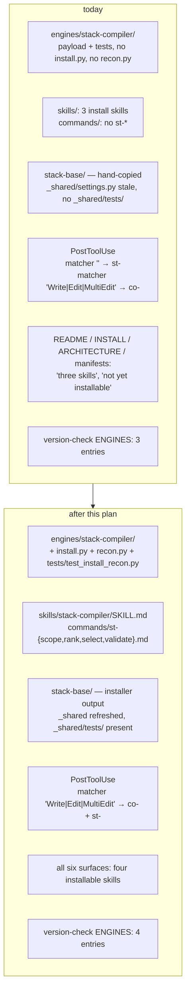
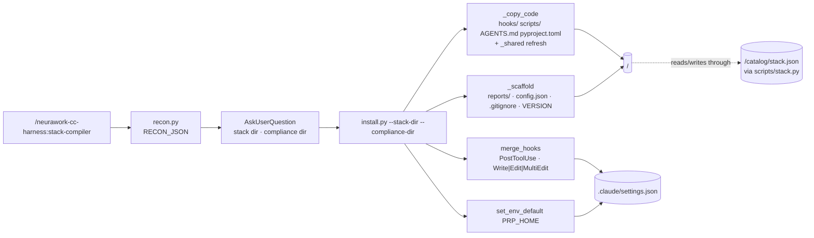

# `stack-compiler` becomes the fourth installable skill, and every surface says so

**Plan ID:** `stack-compiler-wire-document`
**Source PRD:** `/home/felix/projects/howtobuildsoftware2026/.claude/PRPs/prds/stack-compiler.prd.md`
**PRD Phase:** `5 — Wire & document`
**Source Issue:** `None`
**Plan Publication:** `None`

## Outcome

**Problem:** `engines/stack-compiler/` ships a complete, tested payload — nine scripts, the
`st-` `PostToolUse` gate, `AGENTS.md`, `pyproject.toml`, `config.default.json`, `VERSION` — and
**no way to install it**. There is no `install.py`, no `recon.py`, no `skills/stack-compiler/`,
and no `commands/st-*.md`. A repo that installs `neurawork-cc-harness` from the marketplace gets
the other three engines and cannot reach this one. This repo's own `stack-base/` was put there by
hand (`plugins/neurawork-cc-harness/README.md:75-90`), which is why `stack-base/_shared/settings.py`
is the last stale copy of the shared helper in the tree (`.claude/BACKLOG.md:40`) and why the
`st-` hook still sits in the catch-all `matcher: ""` group while compliance's `co-` hook moved to
`Write|Edit|MultiEdit` (`.claude/settings.json`).

**Affected user:** An engineer installing `neurawork-cc-harness` into a product repo that must
satisfy GDPR / SOC 2 / ISO 27001. They can install the constraint catalog today; they cannot
install the thing that narrows it to their product, fixes the components, and gates PRD and plan
writes against those choices. Also this repo, which pays a `uv run` subprocess on every tool call
for the un-narrowed `st-` registration and carries a `_shared/` copy no installer refreshes.

**User outcome:** `/neurawork-cc-harness:stack-compiler` installs the engine into any git repo the
same way the other three install — recon, ask, ADOPT-safe execute — and `/st-scope`, `/st-rank`,
`/st-select`, `/st-validate` drive its four passes. Re-running the installer in this repo refreshes
`stack-base/_shared/`, moves the `st-` hook under `Write|Edit|MultiEdit`, and closes the backlog
item that only an installer could close.

**Invariant:** Every claim the plugin makes about `stack-compiler` matches the tree. A repo that
runs the installer ends with the same machinery, the same hook registration, the same ignore rules
and the same `_shared/` as a fresh install would produce, and with its own `product.md`,
`config.json` and any recorded stack decisions untouched. The installed engine writes only inside
the target repo, never under `.claude/`.

**Success signal:** The PRD's own signal for this phase — a second repo installs `stack-compiler`
from the marketplace and the `st-` gate fires there on the next PRD write. Directly observable in
the scratch-repo validation below; no separate metric is invented.

**Approach:** Copy the shipped install engine shape onto `stack-compiler` and then correct the six
surfaces that currently describe it as un-installable. `install.py` and `recon.py` are near-clones
of `compliance-compiler`'s, minus the two mechanisms this engine has no use for (no data artifact
to seed, no removed files to prune) and plus one this engine needs (a sibling `compliance-base` it
reads through). Nothing new is invented: `_shared.merge_hooks`, `_shared.merge_gitignore`,
`_shared.set_env_default`, `_shared.repo_guard` and `_shared.recon` already own every step.

## Recommendation

**Clone the shape, do not generalize it.** Three installers exist. Their differences are exactly
their engines' differences, and every part they share already lives in `engines/_shared/`. A fourth
copy of `main()`'s eight-line flow is cheaper and clearer than the abstraction that would have to
absorb compliance's catalog seeding, knowledge-compiler's five hooks and the learner's marker
protection. The laziness test applies to the *engine*, not to the plan: `stack-compiler`'s installer
is smaller than compliance's because it owns no data artifact and has nothing to prune.

**The installer is the fix for the two open defects, not a separate task.** Both are consequences of
the hand install, and both resolve when the engine's own installer runs against this repo:

- `stack-base/_shared/settings.py` is the pre-matcher 4-tuple-only copy — the one stale `_shared/`
  in the tree, and the only self-host with no `_shared/tests/` directory. `_copy_code`'s
  `shutil.copytree(SHARED_SRC, …, dirs_exist_ok=True)` refreshes it, exactly as it does for the
  other three. `.claude/BACKLOG.md:40` already names Phase 5 as the closer.
- The `st-` hook is registered under `matcher: ""`, so every tool call in every session spawns a
  `uv run` subprocess that reads stdin and exits at `st-post-tooluse.py:86`. Registering the hook
  with the 5-tuple form and `"Write|Edit|MultiEdit"` — the registration compliance already
  uses (`compliance-compiler/install.py:162-169`) — makes `merge_hooks` **move** the existing entry
  between groups rather than duplicating it (`_shared/settings.py:118-135`). The self-host run is
  the migration.

**Do not seed `product.md`.** `scope.py:54-73` already carries `PRODUCT_TEMPLATE` and writes it to
the configured path on the first run that finds no description, then exits 1 telling the user to
fill it in (`scope.py:377-386`). A second template in `install.py` would be a second thing to keep
correct. The installer prints the next step and lets the pass that needs the file own it.

**A missing `compliance-base` warns, it does not fail.** The engine reads the sibling catalog and
writes through `compliance-base/scripts/stack.py`; without it the gate classifies against empty
dicts and reports "nothing chosen" rather than erroring (`st-post-tooluse.py:109`, `gate_lib` via
`_load_json` returning `{}`), while the three CLI passes exit 1 with a message
(`scope.py:361-364`, `rank.py:293-296`, `selection.py:85-88`). Independent *installability* is
preserved; independent *operation* is not claimed. The installer states which of the two the target
repo is in.

**Four slash commands, not three, and no `/st-init`.** The PRD's Phase 5 scope names `/st-init`,
`/st-scope`, `/st-select`, `/st-validate`. Two deviations, both confirmed with the user:
installation is a *skill* named after the engine in this plugin — `skills/compliance-compiler/SKILL.md`
is the precedent and `tests/test_skill_assets.py:73-88` pins the name↔directory contract — so there
is no `/st-init`; and `rank.py` is a full paid parallel-agent pass between scope and selection with
no command under the PRD's list, so `/st-rank` joins the set.

### Evidence

- `plugins/neurawork-cc-harness/engines/compliance-compiler/install.py:1-295` — the closest
  precedent: `_is_adopt` dual-file detection (`:66-68`), `_copy_code` with the `_shared` refresh and
  the `PLUGIN_ONLY_SHARED_TESTS` exclusion (`:71-91`, `:49`), `_scaffold`'s create-if-absent
  `config.json` from `config.default.json` plus the unconditional `VERSION` copy (`:94-109`),
  `merge_gitignore` (`:108`), the 5-tuple `_hooks` with the matcher rationale (`:160-169`),
  `set_env_default(root, "PRP_HOME", ".claude/PRPs")` and its `wrote`/`already`/`conflict` handling
  (`:262-274`), and the `NOT_A_GIT_REPO` + `assert_in_repo_not_dotclaude` guards (`:234-245`).
- `plugins/neurawork-cc-harness/engines/compliance-compiler/recon.py:1-115` — `HOOK_EVENTS`,
  `_find_existing_dir`'s dual-file signature matching `_is_adopt`, `_existing_hooks`,
  `_branch_and_clean`, and the `emit_recon_json` contract the SKILL.md parses.
- `plugins/neurawork-cc-harness/engines/_shared/settings.py:72-135` — `merge_hooks` accepts the
  4- or 5-tuple form, and **moves** a hook found under a different matcher into the requested group,
  dropping the group it leaves behind once empty. This is what migrates this repo's `st-` entry.
- `plugins/neurawork-cc-harness/engines/_shared/settings.py:155-195` — `merge_gitignore`, appended
  only where a rule is missing, comments carried with the rule below them. Landed in 0.4.0; all
  three installers already call it.
- `plugins/neurawork-cc-harness/engines/stack-compiler/config.default.json` — `stack_dir`,
  `compliance_dir`, `model`, `max_concurrency`, `product_file`, `prds_subpath`, `plans_subpath`,
  `validate_mode.{prd,plan}`. Byte-identical to `stack-base/config.json` today; `stack_dir` and
  `compliance_dir` are the two the installer must inject.
- `stack-base/scripts/config.py:37-46,49-59,80-92` — `DEFAULT_CFG`, the tolerant `load_cfg` merge,
  `compliance_root()` and `product_file()`; the installed `config.json` is the only place the two
  dir names are recorded.
- `stack-base/scripts/scope.py:54-73,344-352,377-386` — `PRODUCT_TEMPLATE`, the
  `[--product PATH] [--all] [--dry-run]` CLI, and the first-run template write. Same flags on
  `rank.py:279-283`; `selection.py:72-75` takes `[--apply PATH] [--dry-run]` and needs no API key
  (`selection.py:7-9`); `validate.py:206-213` takes `document [--repo-root PATH]`.
- `stack-base/hooks/st-post-tooluse.py:31-33,48,86,109,123-138` — the hook resolves its own install
  dir from `__file__`, keeps its own `WRITE_TOOLS` filter, reads the sibling catalog defensively,
  and records the debounce in `reports/.state.json` before spawning `validate.py`.
- `.claude/settings.json` — `PostToolUse` currently holds two groups: `matcher: ""` with
  `stack-base/hooks/st-post-tooluse.py`, and `matcher: "Write|Edit|MultiEdit"` with
  `compliance-base/hooks/co-post-tooluse.py`. `env.PRP_HOME` is `.claude/PRPs`.
- `plugins/neurawork-cc-harness/engines/stack-compiler/tests/test_payload_drift.py:1-11,39-69` —
  the drift guard's comparison surface (`scripts/*.py`, `hooks/*.py`, `AGENTS.md`,
  `pyproject.toml`, `VERSION`; `_shared/` and `config.json` excluded) and the docstring that says
  in so many words that `install.py` "lands in the PRD's Phase 5".
- `plugins/neurawork-cc-harness/engines/compliance-compiler/tests/test_install_recon.py:27-234` —
  the install-test pattern: a real git temp repo, the installer run as a subprocess, assertions on
  scaffolded paths, hook presence, `_shared` minus the plugin-only tests, idempotent reinstall, and
  ADOPT never clobbering human data.
- `plugins/neurawork-cc-harness/hooks/version-check.py:25-36,71-89` — the three-entry `ENGINES` map
  and the comment that names the exact condition for a fourth: "It joins this map when phase 5 ships
  its installer." `installed_dir_for` finds an install by grepping its hook command, which the `st-`
  hook already provides.
- `plugins/neurawork-cc-harness/README.md:11,20-22,75-90`, `docs/INSTALL.md:113-160`,
  `docs/ARCHITECTURE.md:47-48,205-209`, root `CLAUDE.md`, `plugins/CLAUDE.md`,
  `.claude-plugin/marketplace.json:16`, `.claude-plugin/plugin.json:3-4` — the six surfaces that
  say "three skills" or "not yet installable".
- `plugins/neurawork-cc-harness/CHANGELOG.md:1-30` and
  `engines/_shared/tests/test_manifest.py:48-52` — a release whose `plugin.json` version has no
  CHANGELOG section fails the test. The version bump and the entry are one change.
- `.claude/BACKLOG.md:40` — the stale `stack-base/_shared/settings.py`, recorded at PR #41 as
  "Resolves itself when phase 5 ships the installer — close it then".
- `plugins/neurawork-cc-harness/tests/test_skill_assets.py:38-50,73-98` — `SAMPLE_TEST_COMMAND`
  already counts `stack-compiler/tests` in the six suites; new assets are covered on arrival by
  `test_every_skill_name_matches_its_directory` and `test_every_command_has_a_description`.

### Alternatives considered

- **Factor the four installers into a shared `install_base`:** the three existing `main()` bodies
  differ in seeding, pruning, hook count and env writes — everything they share is already a
  `_shared` function. The abstraction would carry four engines' special cases and buy back roughly
  the twenty lines that are genuinely identical. Rejected against the laziness test.
- **Seed `product.md` from `install.py`:** duplicates `scope.py`'s `PRODUCT_TEMPLATE` into a second
  file with no owner for keeping them equal. Rejected; the pass that reads the file writes it.
- **Refuse to install when `compliance-base` is absent:** would make install order load-bearing and
  break the "independently installable" property the other three have. Rejected — warn, and let the
  passes that genuinely need the sibling exit 1 as they already do.
- **Leave the `st-` hook under `matcher: ""`:** ships a brand-new installer that knowingly registers
  a hook the repo already proved wasteful, and leaves the migration to a later cleanup. Rejected;
  `merge_hooks` already implements the move, and Phase 5 is the first moment this registration has
  an owner.
- **Hand-copy `_shared/settings.py` into `stack-base/` now and keep the hand install:** the backlog
  item's own alternative. Rejected — it fixes one file and leaves the class of problem (nothing
  refreshes this install) exactly where it is.
- **Drop `test_payload_drift.py` once the installer exists:** the installer prevents drift only when
  someone runs it; a direct edit to `stack-base/scripts/` still diverges silently. Kept, with its
  docstring corrected.

## Visuals

## Implementation Context

### Mandatory reading

| File | Why it matters |
|---|---|
| `plugins/neurawork-cc-harness/engines/compliance-compiler/install.py:1-295` | The shape to clone: mode detection, `_copy_code`, `_scaffold`, `_hooks` 5-tuple + matcher rationale, `set_env_default`, guards, printed next steps |
| `plugins/neurawork-cc-harness/engines/compliance-compiler/recon.py:1-115` | The recon shape and the RECON_JSON contract the SKILL.md parses |
| `plugins/neurawork-cc-harness/engines/_shared/settings.py:72-195` | `merge_hooks` (5-tuple, cross-matcher move), `merge_gitignore`, `set_env_default` — every hook/ignore/env step is already owned here |
| `plugins/neurawork-cc-harness/engines/compliance-compiler/tests/test_install_recon.py:1-238` | The install-test pattern: real git temp repo, installer as subprocess, FRESH/ADOPT/idempotence assertions |
| `plugins/neurawork-cc-harness/skills/compliance-compiler/SKILL.md:1-82` | Frontmatter contract, the Phase A/B/C section shape, the naming/collision note |
| `plugins/neurawork-cc-harness/commands/co-validate.md:1-28` | The command-file shape: `description` + `argument-hint` frontmatter, locate-dir → `uv run` → report-back |
| `stack-base/scripts/config.py:37-92` | Which config keys exist and how `compliance_root()` / `product_file()` resolve from them |
| `stack-base/scripts/scope.py:54-73,344-386` | `PRODUCT_TEMPLATE` and the first-run write — the reason `install.py` seeds no `product.md` |
| `plugins/neurawork-cc-harness/engines/stack-compiler/tests/test_payload_drift.py:1-11` | The docstring that must stop saying the installer does not exist |

### Existing patterns and primitives

- **ADOPT detection by dual-file signature:** `compliance-compiler/install.py:66-68` and
  `recon.py:43-51` use the same pair of paths so mode detection and dir discovery cannot disagree.
  For `stack-compiler` the pair is `hooks/st-post-tooluse.py` + `scripts/scope.py`.
- **`_shared` refresh minus plugin-only tests:** `install.py:49,86-91` — `test_manifest.py` and
  `test_version_check.py` assert plugin-level facts that do not exist in an installed copy, so they
  are excluded and any stale copy an older install left behind is deleted.
- **Hook registration owns the matcher:** `compliance-compiler/install.py:162-169` states why the
  matcher is a registration and not hand-editable state, and `_shared/settings.py:118-135`
  implements the move. Reuse both verbatim in shape.
- **`config.json` is create-if-absent, `VERSION` is unconditional:** `install.py:96-109`. A repo's
  chosen `validate_mode` survives ADOPT; the version marker always reflects the shipped code.
- **Deferred-import test pattern:** `stack-compiler/tests/test_*_lib.py` insert
  `payload/scripts` on `sys.path` and import the module under test directly — the same shape the
  new install test does not need (it runs the installer as a subprocess) but the suite already uses.

### Integration points

- `plugins/neurawork-cc-harness/hooks/version-check.py:25-36` — `ENGINES` gains
  `"stack-compiler": "hooks/st-post-tooluse.py"`; the comment above it, which names Phase 5 as the
  condition, is replaced by the map itself.
- `.claude/settings.json` — the self-host run moves the `st-` entry into the
  `Write|Edit|MultiEdit` group next to `co-`, leaving the `matcher: ""` group empty and removed.
- `compliance-base/scripts/stack.py` — unchanged. It stays the single schema owner; the installer
  never touches `catalog/stack.json`.
- `plugins/neurawork-cc-harness/CHANGELOG.md` + `.claude-plugin/plugin.json` — one paired change;
  `engines/_shared/tests/test_manifest.py:48-52` fails a version with no section.

## Scope

### In scope

- `engines/stack-compiler/install.py` and `recon.py`, plus `tests/test_install_recon.py`.
- `skills/stack-compiler/SKILL.md`.
- `commands/st-scope.md`, `st-rank.md`, `st-select.md`, `st-validate.md`.
- Running the new installer against this repo (self-host), which refreshes `stack-base/_shared/`,
  adds `stack-base/_shared/tests/`, merges the `.gitignore`, and migrates the `st-` hook matcher.
- `version-check.py`'s fourth `ENGINES` entry.
- The six description surfaces: plugin `README.md`, `docs/INSTALL.md`, `docs/ARCHITECTURE.md`, root
  `CLAUDE.md`, `plugins/CLAUDE.md`, `stack-base/CLAUDE.md`, plus `.claude-plugin/plugin.json`
  (description + version), `.claude-plugin/marketplace.json` (description) and `CHANGELOG.md`.
  `engines/_shared/__init__.py:3` still says "Both skills (knowledge-compiler, claudemd-lerner)" and
  is copied into every install — corrected here.
- `test_payload_drift.py`'s docstring, and closing `.claude/BACKLOG.md:40`.
- PRD bookkeeping: `stack-compiler.prd.md` Phase 5, and the `neurawork-cc-harness.prd.md` skill
  registry row (`stack-compiler` → `shipped`).

### Not building

- **No engine `VERSION` bump.** The payload does not change, so `engines/stack-compiler/VERSION`
  stays `2` and matches `stack-base/VERSION`. A bump would fire a staleness nudge for code that is
  already current.
- **No `_prune_removed`.** This engine has never shipped a file it later dropped; the mechanism
  exists in compliance because it dropped a `SessionStart` hook. Add it when there is something to
  prune.
- **No `product.md` seeding, no `stack-base/CLAUDE.md` templating.** `scope.py` owns the template;
  `CLAUDE.md` in an install dir is the learner's output, not an installer's.
- **No changes to `compliance-base/scripts/stack.py`, the catalog, or the gate's behaviour.** This
  phase wires and describes what Phases 1–4 built.
- **No `/st-init` command.** Installation is a skill in this plugin.

## Delivery Considerations

| Concern | Decision and owned work |
|---|---|
| Discoverability / adoption | Task 6 — the plugin README's skills table gains a fourth row and its "not yet installable" section is deleted; `docs/INSTALL.md` gains `### 5. Install stack-compiler` and the coding-rules section becomes `### 6`; both manifests' prose says four skills |
| Compatibility / migration | Task 4 — the only existing install is this repo's hand-made `stack-base/`. Re-running the installer over it is the migration: `_shared/` refreshed, `_shared/tests/` added, `.gitignore` merged, `st-` hook moved between matcher groups by `merge_hooks`. `config.json`, `product.md` and `compliance-base/catalog/stack.json` are untouched — proved by the ADOPT test in Task 1 and by `git diff` in Task 4 |
| Rollout / reversibility | Version `0.5.0` with a CHANGELOG section (Task 6). Reversal is a `git revert` plus re-running the previous installer set; no data migration to undo, because the installer writes no data artifact |
| Observability | Task 5 — the fourth `ENGINES` entry makes the `SessionStart` staleness nudge cover `stack-base/` for the first time, and it can now name a real command to re-run |
| Documentation / communication | Task 6 covers all six prose surfaces plus `_shared/__init__.py`'s own module docstring; Task 7 records the phase in both PRDs |

## Implementation

### 1. `stack-compiler` installs itself into a git repo

**Files and integration points**
- `plugins/neurawork-cc-harness/engines/stack-compiler/install.py` — CREATE — the engine dir is
  where every other installer lives; `ENGINE_DIR.parent` puts `_shared` on `sys.path`.
- `plugins/neurawork-cc-harness/engines/stack-compiler/recon.py` — CREATE — read-only detection the
  SKILL.md runs before asking anything.
- `plugins/neurawork-cc-harness/engines/stack-compiler/tests/test_install_recon.py` — CREATE.

**Implementation**
- `install.py` mirrors `compliance-compiler/install.py` with these differences:
  - CLI: `--stack-dir` (default `stack-base`) and `--compliance-dir` (default `compliance-base`).
    No `--extract` equivalent — the first pass needs a `product.md` a human has written, so there is
    nothing the installer can usefully run.
  - `_is_adopt(target)`: `(target/"hooks"/"st-post-tooluse.py").exists()` and
    `(target/"scripts"/"scope.py").exists()`.
  - `_copy_code`: `payload/hooks/*.py`, `payload/scripts/*.py`, `payload/pyproject.toml`,
    `payload/AGENTS.md`, then the `_shared` `copytree` with
    `ignore_patterns("__pycache__", *PLUGIN_ONLY_SHARED_TESTS)` and the stale-copy unlink loop —
    identical to `compliance-compiler/install.py:71-91`. There is no `*.txt` in this payload;
    copy `.py` only.
  - `_scaffold`: `mkdir` `reports/`; write `config.json` from `config.default.json` only if absent,
    setting both `stack_dir` and `compliance_dir` from the parsed args; `merge_gitignore(target,
    GITIGNORE)` with `stack-base/.gitignore`'s rules (`.shards/`, `reports/`, `scripts/state.json`,
    `scripts/*.log`, `__pycache__/`, `*.pyc`, `.venv/`, `uv.lock`) under the comment that says
    `product.md` is tracked; `shutil.copy2(VERSION_FILE, target/"VERSION")` unconditionally.
  - `_hooks(sdir)` returns the 5-tuple
    `("PostToolUse", f'uv run --directory "$CLAUDE_PROJECT_DIR/{sdir}" python hooks/st-post-tooluse.py',
    15, "hooks/st-post-tooluse.py", "Write|Edit|MultiEdit")`.
  - `set_env_default(root, "PRP_HOME", ".claude/PRPs")` with the same three-branch reporting: the
    `st-` gate matches documents under `prds_subpath`/`plans_subpath`, so a `PRP_HOME` outside the
    repo makes it see nothing.
  - Guards: `git_root_or_none()` → `NOT_A_GIT_REPO` and return 1;
    `assert_in_repo_not_dotclaude(target, root)` on the resolved target.
  - Sibling check: after scaffolding, if `root/<compliance-dir>/catalog/capabilities.json` is
    missing, print that the passes and the gate have nothing to read until
    `/neurawork-cc-harness:compliance-compiler` is installed and its catalog built. Do not fail.
  - Printed next steps: `uv sync --directory <sdir>`, write `<sdir>/product.md` (naming
    `/neurawork-cc-harness:st-scope` as the pass that creates the template on first run), and the
    `git add <sdir> .claude/settings.json` commit line.
- `recon.py` mirrors `compliance-compiler/recon.py`: `HOOK_EVENTS = {"PostToolUse":
  "st-post-tooluse.py"}`; `_find_existing_dir` on the same dual-file signature as `_is_adopt`;
  `_find_compliance_dir` scanning top-level dirs for `scripts/stack.py` + `catalog/capabilities.json`;
  `_stack_state(root, compliance_dir)` reporting whether `catalog/stack.json` exists and how many of
  its entries are scoped and chosen (read defensively; `{}` on any error). Emit
  `status, repo_root, branch, clean, existing_dir, compliance_dir, existing_hooks, stack_state,
  timezone` through `emit_recon_json`, after the same human-readable print block.

**Tests**
- `test_fresh_scaffold_and_hooks` — in a git temp repo: every machinery file lands, `_shared/` is
  present without `test_manifest.py`/`test_version_check.py`, `reports/` exists, `config.json`
  carries the two dir names passed on the CLI, `.gitignore` holds the shipped rules, `VERSION`
  matches the engine's, `.claude/settings.json` has exactly one `PostToolUse` hook for
  `st-post-tooluse.py` under `matcher: "Write|Edit|MultiEdit"`, and no `SessionStart` entry exists.
- `test_idempotent_reinstall` — a sentinel written into `config.json` and into a `product.md`
  survives a second run; no duplicate hook entry appears.
- `test_adopt_migrates_a_catch_all_registration` — pre-seed `.claude/settings.json` with the `st-`
  hook under `matcher: ""` (this repo's current state), run the installer, assert the entry now sits
  under `Write|Edit|MultiEdit`, appears exactly once, and the empty group is gone.
- `test_adopt_refreshes_shared` — write a divergent `_shared/settings.py` into the target, reinstall,
  assert it matches the engine's copy byte-for-byte and that `_shared/tests/` arrived.
- `test_install_without_compliance_dir_warns_and_succeeds` — no `compliance-base` in the temp repo:
  exit code 0, machinery installed, stdout names `compliance-compiler`.
- `test_refuses_dotclaude_target` — `--stack-dir .claude/stack` exits non-zero and writes nothing.
- `test_recon_emits_json` / `test_recon_not_a_git_repo` — mirroring
  `compliance-compiler/tests/test_install_recon.py:218-234`.

**Validation**
- `cd plugins/neurawork-cc-harness/engines && python3 -m unittest discover -s stack-compiler/tests`
  — all suites pass, including the pre-existing scope/rank/selection/gate/drift tests.

### 2. The install skill drives recon → ask → execute

**Files and integration points**
- `plugins/neurawork-cc-harness/skills/stack-compiler/SKILL.md` — CREATE — directory name must equal
  the frontmatter `name` (`tests/test_skill_assets.py:73-88`).

**Implementation**
- Frontmatter: `name: stack-compiler`; a `description` naming the trigger phrases in the register
  the other three use ("stack compiler", "install stack compiler", "product scoping", "choose the
  stack", "stack festschreiben", "gate PRDs against the chosen stack").
- Body sections, in `skills/compliance-compiler/SKILL.md`'s order:
  - What it installs — the four passes (`scope` → `rank` → `selection`, then the `st-` gate) and the
    fact that it owns no data artifact: every write goes through
    `<compliance-dir>/scripts/stack.py`, the single schema owner for `catalog/stack.json`.
  - **Data dependency** — `compliance-compiler` must be installed and its catalog built for the
    passes and the gate to have anything to read. State that the install itself succeeds either way.
  - **Authentication** — `scope.py`, `rank.py` and the deep `validate.py` use the Agent SDK and need
    `ANTHROPIC_API_KEY` / `CLAUDE_CODE_OAUTH_TOKEN`; install, scaffolding, the inline precheck and
    the whole of `selection.py` work without one.
  - **Naming / collision note** — invoke as `neurawork-cc-harness:stack-compiler`; hooks are `st-`
    prefixed and register under `matcher: "Write|Edit|MultiEdit"` on `PostToolUse`, sharing that
    group with compliance's `co-` hook, so all four engines coexist in one `.claude/settings.json`.
    Name the collision with the unrelated external `stack-tools` plugin: this skill decides what may
    be used, `stack-tools` reports what is running.
  - **Phase A — Recon**: `python3 "${CLAUDE_PLUGIN_ROOT}/engines/stack-compiler/recon.py"`, with the
    same bullet list of what to read out of RECON_JSON (`NOT_A_GIT_REPO` → stop; `existing_dir` →
    ADOPT and reuse the name; note `compliance_dir`, `stack_state`, `existing_hooks`, `clean`).
  - **Phase B — Ask**: AskUserQuestion for the stack dir name (default `stack-base` or the detected
    `existing_dir`) and the compliance dir (default the detected `compliance_dir`, else
    `compliance-base`). Nothing else — there is no framework subset and no extract-now here.
  - **Phase C — Execute**: run `install.py --stack-dir <NAME> --compliance-dir <NAME>` then
    `uv sync --directory <NAME>`; tell the user to commit `<NAME>/` and `.claude/settings.json`;
    relay any line the installer printed about a missing compliance install or a `PRP_HOME` it left
    alone; then name the four commands in order — `/st-scope` (writes the `product.md` template on
    first run), `/st-rank`, `/st-select`, `/st-validate`.

**Tests**
- Covered by `plugins/neurawork-cc-harness/tests/test_skill_assets.py:73-88` — the new directory is
  picked up automatically and the name↔directory and non-empty-description invariants apply on
  arrival. No new test file; the behaviour a new test could pin here is prose.

**Validation**
- `cd plugins/neurawork-cc-harness && python3 -m unittest discover -s tests` — passes with the new
  skill present.

### 3. Four commands cover the four passes

**Files and integration points**
- `plugins/neurawork-cc-harness/commands/st-scope.md`, `st-rank.md`, `st-select.md`,
  `st-validate.md` — CREATE — the flat `commands/` dir, `st-` prefixed like the hook.

**Implementation**
- Each follows `commands/co-validate.md:1-28`: `description` + `argument-hint` frontmatter, an
  `# <Title>`, one paragraph of intent, then numbered steps — (1) locate the stack dir as the
  top-level directory holding `scripts/scope.py` and `hooks/st-post-tooluse.py`, telling the user to
  install via `/neurawork-cc-harness:stack-compiler` if absent; (2) the `uv run --directory
  <stack-dir> python scripts/<name>.py $ARGUMENTS` line; (3) what to report back.
- `st-scope.md` — `argument-hint: "[--product PATH] [--all] [--dry-run]"`. Needs an API key. Report:
  how many capabilities stayed applicable per framework, the reasons recorded for those scoped out,
  the report path under `<stack-dir>/reports/scope-<date>.md`, and — on a non-zero exit — whether it
  was the challenge agent refuting a "not applicable" claim or the mandatory-safety gate, since both
  mean nothing was written. If it exits 1 because `product.md` did not exist, say that the template
  was just written and must be filled in before re-running.
- `st-rank.md` — same flags. Needs an API key, and requires a scoped `stack.json`. Report the
  per-capability ordering summary and `reports/rank-<date>.md`; on a ranking-gate failure say that
  the pool must match the capability's `options` exactly and that nothing was written.
- `st-select.md` — `argument-hint: "[--apply <selection-sheet.md>] [--dry-run]"`. Needs **no** API
  key. Two modes: with no arguments it renders `reports/selection-sheet-<date>.md` for the human to
  fill in; with `--apply <sheet>` it records the choices through `stack.py --apply-selection`.
  Report the sheet path in render mode; in apply mode, how many capabilities were recorded this
  sitting and how many remain undecided — an undecided capability is a counted gap, not an omission.
- `st-validate.md` — `argument-hint: "<path-to-prd-or-plan.md>"`. Needs an API key. The same deep
  check the `st-` hook spawns, on demand. Report `<stack-dir>/reports/<stem>.md`, the verdict in
  `<stem>.stack.json`, and which named components are off-stack or violate the license policy.

**Tests**
- Covered by `tests/test_skill_assets.py:90-98` (every command file carries a non-empty
  `description`). The `uv run` lines are prose; their runtime proof is Task 4's manual run.

**Validation**
- `cd plugins/neurawork-cc-harness && python3 -m unittest discover -s tests` — passes.

### 4. This repo's `stack-base/` becomes installer output

**Files and integration points**
- `stack-base/_shared/**` — UPDATED by running the installer (stale `settings.py` refreshed,
  `_shared/tests/` added).
- `stack-base/.gitignore` — UPDATED only if a shipped rule is missing (expected: no change).
- `.claude/settings.json` — UPDATED: the `st-` hook moves from `matcher: ""` into the
  `Write|Edit|MultiEdit` group.
- `.claude/BACKLOG.md:40` — UPDATED: the item is closed with a pointer to this phase.
- `plugins/neurawork-cc-harness/engines/stack-compiler/tests/test_payload_drift.py:1-11` — UPDATED
  docstring: the guard now backs up an installer instead of substituting for one.

**Implementation**
- Run `python3 plugins/neurawork-cc-harness/engines/stack-compiler/install.py --stack-dir stack-base
  --compliance-dir compliance-base` from the repo root. Expect `ADOPT`.
- Verify with `git diff --stat` that the change set is exactly: `stack-base/_shared/settings.py`,
  new `stack-base/_shared/tests/*`, and `.claude/settings.json`. `stack-base/config.json`,
  `stack-base/product.md`, `stack-base/VERSION`, `stack-base/scripts/*`, `stack-base/hooks/*` and
  `compliance-base/catalog/stack.json` must be untouched — the last three because `VERSION` is
  already `2` and the payload is already byte-identical.
- Confirm `.claude/settings.json`'s `PostToolUse` holds one group, `matcher: "Write|Edit|MultiEdit"`,
  with the `co-` and `st-` commands in it and no empty `matcher: ""` group left behind.
- Close `.claude/BACKLOG.md:40` — the item's own text names this phase as the closer.
- Correct the drift test's docstring: it currently asserts that `stack-compiler` "has no
  `install.py` yet (it lands in the PRD's Phase 5), so the self-host was installed by hand". It now
  guards against a direct edit to either copy that the installer was never re-run to propagate.

**Tests**
- No new automated test. The claim under test is "running this installer against this repo produces
  exactly this diff", which the temp-repo suite in Task 1 already proves in the general case; here
  it is a one-time migration verified by inspection.

**Validation**
- `git diff --stat` — exactly the three paths named above.
- `python3 -c "import json;d=json.load(open('.claude/settings.json'));print(json.dumps(d['hooks']['PostToolUse'],indent=1))"`
  — one group, matcher `Write|Edit|MultiEdit`, two hooks.
- `cd plugins/neurawork-cc-harness/engines && python3 -m unittest discover -s stack-compiler/tests`
  — the drift suite still passes after the `_shared` refresh (it excludes `_shared/` by design).
- `cd plugins/neurawork-cc-harness/engines && python3 -m unittest discover -s _shared/tests` — the
  refreshed copy is the same module the plugin tests.

### 5. The staleness nudge covers `stack-base/`

**Files and integration points**
- `plugins/neurawork-cc-harness/hooks/version-check.py:25-36` — UPDATE — `ENGINES` gains
  `"stack-compiler": "hooks/st-post-tooluse.py"`, and the four-line comment explaining why there are
  three entries is removed; the general comment above it (`:25-28`) stays.

**Implementation**
- `installed_dir_for` finds an install by grepping the engine's hook command in
  `.claude/settings.json` (`version-check.py:37-52`), and the `st-` hook provides exactly that
  marker, so the entry works with no other change. `find_stale` compares
  `<repo>/<dir>/VERSION` against `engines/stack-compiler/VERSION` — both `2` today, so no nudge
  fires until the payload actually changes.
- `_build_note` renders `re-run /neurawork-cc-harness:stack-compiler`, which now resolves to the
  skill created in Task 2 — the precondition the removed comment named.

**Tests**
- Add a case to `plugins/neurawork-cc-harness/engines/_shared/tests/test_version_check.py`
  alongside `test_stale_detected` (`:89-97`): a settings file registering the `st-` hook under an
  install dir whose `VERSION` is behind produces a stale entry naming `stack-compiler` and that dir.

**Validation**
- `cd plugins/neurawork-cc-harness/engines && python3 -m unittest discover -s _shared/tests` — the
  new case passes and `test_no_install_silent` still holds for a repo with no `st-` hook.

### 6. Every surface says four installable skills

**Files and integration points**
- `plugins/neurawork-cc-harness/README.md:11,20-22,55-72,75-90` — UPDATE.
- `docs/INSTALL.md:113-160` — UPDATE (insert `### 5`, renumber the rules section to `### 6`).
- `docs/ARCHITECTURE.md:9-13,47-48,205-209` — UPDATE.
- `CLAUDE.md` (root) — UPDATE the `stack-base/` bullet and the command list.
- `plugins/CLAUDE.md` — UPDATE the engine/command inventory.
- `stack-base/CLAUDE.md` — UPDATE: it states the dir was installed by hand.
- `plugins/neurawork-cc-harness/.claude-plugin/plugin.json:3-4` — UPDATE `version` to `0.5.0` and
  the `description` prose.
- `.claude-plugin/marketplace.json:16` — UPDATE the description prose.
- `plugins/neurawork-cc-harness/CHANGELOG.md` — UPDATE: a `## [0.5.0]` section.
- `plugins/neurawork-cc-harness/engines/_shared/__init__.py:3` — UPDATE: "Both skills
  (knowledge-compiler, claudemd-lerner)" is wrong in a file copied into all four installs.

**Implementation**
- README: heading `## Three independently installable skills` → four; add the `stack-compiler` /
  `stack-base/` / `st-` row to the table, whose *Produces* cell is the honest one — it writes no
  artifact of its own, it records choices into `compliance-base/catalog/stack.json`; add the prose
  bullet (three passes + the gate); add the four `/st-*` rows to the slash-command table; **delete**
  the `## stack-compiler — shipped, not yet installable` section (`:75-90`) whole, including its
  `ENGINES`-has-three-entries paragraph.
- `docs/INSTALL.md`: new `### 5. Install stack-compiler` modelled on `### 4` (`:113-147`) — the
  install command, the install dir, the `st-`/`PostToolUse` registration and its coexistence with
  `co-` in the same matcher group, the `compliance-base` data dependency, then the four commands in
  pass order with the API-key split (selection needs none). The existing `### 5. Write the baseline
  coding rules (no install)` becomes `### 6`.
- `docs/ARCHITECTURE.md`: the skills table (`:9-13`) gains a `stack-compiler` row; the engine-tree
  comment (`:47-48`) drops "no install.py/recon.py yet — hand-installed" and reads like the other
  three; the self-hosting bullet (`:205-209`) drops "installed by hand" and says the drift test now
  backs the installer rather than replacing it.
- Root `CLAUDE.md`: the `stack-base/` bullet currently says the engine is "**installed by hand**"
  and that the two copies are "kept byte-identical by `tests/test_payload_drift.py`, not by an
  installer" — both now false. Add the four `/st-*` commands next to the `co-` ones in the command
  list.
- `plugins/CLAUDE.md`: add `stack-compiler`'s install skill and its four commands to the inventory.
- `stack-base/CLAUDE.md`: replace the hand-install paragraph with the installer invocation.
- `plugin.json` / `marketplace.json`: "three independently installable skills" → four, with one
  clause for `stack-compiler` (product scoping, closed-pool component selection, `st-` gate on PRD
  and plan writes). Bump `version` to `0.5.0` — a new installable skill is a feature, not a fix.
- `CHANGELOG.md`: a `## [0.5.0] — <today>` section with **Added** (the installer, recon, install
  skill, four commands, the fourth `ENGINES` entry) and **Changed** (the `st-` hook now registers
  under `Write|Edit|MultiEdit`; re-running the installer migrates an existing catch-all
  registration). `engines/_shared/tests/test_manifest.py:48-52` fails without this section.

**Tests**
- `engines/_shared/tests/test_manifest.py` already pins version↔CHANGELOG; it must pass with
  `0.5.0`.
- Add one assertion to `plugins/neurawork-cc-harness/tests/test_skill_assets.py`: every
  `skills/*/SKILL.md` directory name that matches an engine under `engines/` has that engine listed
  in `hooks/version-check.py`'s `ENGINES` map. That is the invariant the deleted README paragraph
  was carrying in prose — an installable skill whose staleness nudge cannot name it is the defect,
  and it is cheap to pin now that all four are installable.

**Validation**
- `cd plugins/neurawork-cc-harness/engines && python3 -m unittest discover -s _shared/tests` —
  `test_manifest` passes against `0.5.0`.
- `cd plugins/neurawork-cc-harness && python3 -m unittest discover -s tests` — the new
  skill↔ENGINES assertion passes for all four engines.
- `grep -rn "not yet installable\|installed by hand\|Three independently installable\|three independently installable" plugins/ docs/ CLAUDE.md stack-base/CLAUDE.md .claude-plugin/`
  — no hits.

### 7. Both PRDs record the phase

**Files and integration points**
- `.claude/PRPs/prds/stack-compiler.prd.md` — UPDATE — Phase 5 row: status, plan link, report link,
  PR link. Driven by `/prp-prd-update`, not by hand.
- `.claude/PRPs/prds/neurawork-cc-harness.prd.md:31` — UPDATE — the skill registry row for
  `stack-compiler` reads `planned (supersedes Phase 5)`; it becomes `shipped`.

**Implementation**
- `/prp-prd-update planned` runs at the end of this planning session; `/prp-prd-update implemented`
  at the end of implementation. The harness PRD's registry row is a one-cell edit in the same
  commit.

**Validation**
- `grep -n "stack-compiler" .claude/PRPs/prds/neurawork-cc-harness.prd.md` — the registry row says
  `shipped`; `grep -n "^| 5 |" .claude/PRPs/prds/stack-compiler.prd.md` — Phase 5 is `complete` with
  its plan, report and PR links.

## Acceptance

1. **AC1 — Installable from a clean repo:** In a git repo with no `stack-base/`, running
   `engines/stack-compiler/install.py --stack-dir stack-base --compliance-dir compliance-base` exits
   0 and leaves `stack-base/` holding `hooks/st-post-tooluse.py`, all nine `scripts/*.py`,
   `AGENTS.md`, `pyproject.toml`, `config.json` (carrying both dir names), `.gitignore`, `VERSION`,
   `reports/`, and a `_shared/` that matches `engines/_shared/` minus `test_manifest.py` and
   `test_version_check.py`. `.claude/settings.json` holds exactly one `PostToolUse` hook for
   `st-post-tooluse.py`, under `matcher: "Write|Edit|MultiEdit"`, and no `SessionStart` entry.
2. **AC2 — ADOPT preserves decisions and migrates registration:** Re-running the installer over an
   existing install leaves `config.json`, `product.md` and `compliance-base/catalog/stack.json`
   byte-identical, adds no duplicate hook entry, refreshes `_shared/`, and moves an `st-` hook found
   under `matcher: ""` into the `Write|Edit|MultiEdit` group, removing the group it left if empty.
3. **AC3 — The four passes are reachable by name:** `/neurawork-cc-harness:stack-compiler` installs;
   `/neurawork-cc-harness:st-scope`, `:st-rank`, `:st-select` and `:st-validate` each resolve and
   each names the correct script, flags and API-key requirement — `st-select` documents that it needs
   none.
4. **AC4 — Install without `compliance-base` is a warning, not a failure:** the installer exits 0,
   installs the machinery, and prints that the passes and the gate have nothing to read until
   `compliance-compiler` is installed and its catalog built.
5. **AC5 — The write guard holds:** `--stack-dir .claude/stack` is refused with a non-zero exit and
   writes nothing, and every path the installer writes is inside the repo and outside `.claude/`
   except the `.claude/settings.json` hook and env merges.
6. **AC6 — This repo's self-host is installer output:** after the ADOPT run,
   `stack-base/_shared/settings.py` matches `engines/_shared/settings.py` byte-for-byte,
   `stack-base/_shared/tests/` exists, `.claude/settings.json`'s `PostToolUse` has a single
   `Write|Edit|MultiEdit` group containing both the `co-` and `st-` hooks, and `.claude/BACKLOG.md`
   no longer carries the stale-`_shared` item.
7. **AC7 — No surface claims three skills or a hand install:** the grep in Task 6's validation
   returns nothing, `hooks/version-check.py`'s `ENGINES` has four entries, `plugin.json` is `0.5.0`
   and `CHANGELOG.md` has a matching section.
8. **AC8 — Nothing Phases 1–4 shipped changed:** `engines/stack-compiler/payload/**`,
   `engines/stack-compiler/VERSION`, `compliance-base/scripts/stack.py` and the catalog are
   untouched, and `test_payload_drift.py` still passes.

## Validation

| Gate | Command or procedure | Proves |
|---|---|---|
| Engine suite | `cd plugins/neurawork-cc-harness/engines && python3 -m unittest discover -s stack-compiler/tests` | AC1, AC2, AC4, AC5, AC8 — the new install/recon suite plus the untouched scope/rank/selection/gate/drift suites |
| Shared suite | `cd plugins/neurawork-cc-harness/engines && python3 -m unittest discover -s _shared/tests` | AC7 — `test_manifest` on `0.5.0`+CHANGELOG, and the new `version-check` case for the fourth engine |
| Prompt assets | `cd plugins/neurawork-cc-harness && python3 -m unittest discover -s tests` | AC3, AC7 — skill name↔directory, every command has a description, every installable skill is in `ENGINES` |
| Other engines unaffected | `cd plugins/neurawork-cc-harness/engines && python3 -m unittest discover -s knowledge-compiler/tests` then `-s claudemd-lerner/tests` then `-s compliance-compiler/tests` | AC8 — the shared-helper and settings changes broke nothing |
| Lint | `cd plugins/neurawork-cc-harness/engines/stack-compiler && uvx ruff check` | `line-length = 100` and the engine's lint config hold for the new modules |
| Self-host migration | Run the installer at the repo root, then `git diff --stat` and read back `.claude/settings.json`'s `PostToolUse` | AC6 — the diff is exactly `stack-base/_shared/settings.py`, new `stack-base/_shared/tests/*`, `.claude/settings.json` |
| End-to-end in a scratch repo | `git init` a temp repo; install `compliance-compiler` then `stack-compiler`; write `<stack-dir>/product.md`; run `/st-scope`, `/st-rank`, `/st-select`; then write a PRD naming a component that is not the chosen one and confirm the `st-` hook flags it and leaves a report under `<stack-dir>/reports/` | The PRD's Phase 5 success signal — a second repo installs the skill and the gate fires there on the next PRD write. Needs `ANTHROPIC_API_KEY`; the selection pass and the inline precheck do not |

## Risks and Decisions

| Decision or risk | Recommendation | Evidence / mitigation | Consequence if different |
|---|---|---|---|
| `st-` hook matcher: keep `""` or register `Write\|Edit\|MultiEdit` | Register the narrow matcher | `compliance-compiler/install.py:162-169` made the same change for the same reason in 0.4.0; `_shared/settings.py:118-135` moves an existing entry rather than duplicating it, so the migration is the install | Keeping `""` ships a new installer that knowingly registers a per-tool-call subprocess, and leaves the repo's own registration split across two groups |
| Slash-command surface: `/st-init` + 3, or install skill + 4 | Install skill + `/st-scope`, `/st-rank`, `/st-select`, `/st-validate` | Confirmed with the user this session. Install-is-a-skill is the convention of all three shipped engines; `rank.py` is a full paid pass with no entry under the PRD's list | The PRD's literal wording would break the install convention for one engine and leave a pass reachable only by raw `uv run` |
| Plugin version: `0.4.1` or `0.5.0` | `0.5.0` | A new installable skill is a feature. `engines/_shared/tests/test_manifest.py:48-52` requires the matching CHANGELOG section either way | A patch bump understates the release in the only signal an installed copy has that something new exists |
| Engine `VERSION` bump alongside it | No bump — stays `2` | The payload does not change; `find_stale` compares installed against shipped `VERSION` (`version-check.py:71-89`), so a bump would nudge every install to re-run for code that is already current | A gratuitous nudge that teaches users to ignore the nudge |
| Keep `test_payload_drift.py` now that an installer exists | Keep, with a corrected docstring | The installer prevents drift only when someone runs it; a direct edit to `stack-base/scripts/` still diverges silently, and the test is free | Dropping it removes the only guard on a copy that is still hand-editable |
| `stack-base/_shared/tests/` arrives for the first time | Accept it | Every other self-host carries it; `_copy_code`'s `copytree` is what puts it there, and the two plugin-only tests are excluded | Excluding it would make `stack-base/` the one install whose `_shared/` differs in shape from the other three |

## Related Plans

- **Depends on:** `/home/felix/projects/howtobuildsoftware2026/.claude/PRPs/plans/completed/stack-compiler-st-gate.plan.md` — PRD Phase 4, merged as PR #31; the `st-` hook this installer registers.
- **Depends on:** `/home/felix/projects/howtobuildsoftware2026/.claude/PRPs/plans/harness-self-description-and-install-reach.plan.md` — merged as PR #41 on 2026-08-27; it shipped `_shared.merge_gitignore`, the `merge_hooks` matcher parameter, `CHANGELOG.md`, and the README/`ENGINES` statements this plan supersedes.

## Agent Notes

- **This plan supersedes two statements PR #41 deliberately wrote.** `README.md:75-90` explains that
  `stack-compiler` is not installable and that this is deliberate; `version-check.py:29-32` carries a
  four-line comment explaining why `ENGINES` has three entries and naming Phase 5 as the condition for
  a fourth. Both were correct when written. Delete them rather than editing around them — the comment
  in particular says "It joins this map when phase 5 ships its installer", which is this plan.
- **Branch from `main` at or after `13c46db`.** Everything this plan builds on — `merge_gitignore`,
  the `merge_hooks` matcher parameter, `CHANGELOG.md`, `plugin.json` `0.4.0` — landed in that merge.
- **The compliance installer is the file to read, not to import.** `engines/` is not an importable
  package (each engine inserts `ENGINE_DIR.parent` on `sys.path` for `_shared` only), which is also
  why the test suites must be discovered per directory.
- `stack-base/.venv/` and `stack-base/uv.lock` are gitignored local build state. The installer must
  not touch them; `uv sync --directory <dir>` is a printed next step, not something it runs.
