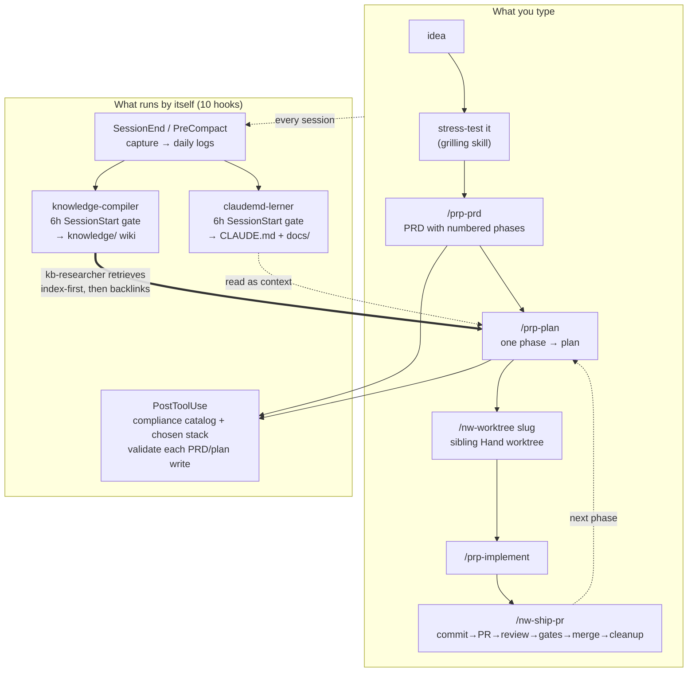

# howtobuildsoftware2026

> How to build software in 2026.

## Overview

This repository documents modern practices, tools, and workflows for building
software in 2026 — from project setup and architecture through delivery and
operations. It also ships the tooling that does it: **`neurawork-cc-harness`**, a
Claude Code plugin (under `plugins/`) that keeps a repo's project knowledge fresh,
its `CLAUDE.md` current, and its PRDs and plans checked against a compliance
catalog and a chosen stack.

The repo **self-hosts** everything it ships: `knowledge-base/`, `claudemd-lerner/`,
`compliance-base/` and `stack-base/` are live installs of the four skills into this
repo itself, so the repo is its own worked example.

Current plugin version: `0.5.1`. The live roadmap is the phase table in
[`.claude/PRPs/prds/completed/neurawork-cc-harness.prd.md`](.claude/PRPs/prds/completed/neurawork-cc-harness.prd.md).

## Install

Install the plugin via its marketplace from inside the repo you want to upgrade, in
a Claude Code session — you do **not** clone this repo to use it:

```text
/plugin marketplace add neurawork-git/howtobuildsoftware2026
/plugin install neurawork-cc-harness@neurawork-harness
```

Then install any skill into your repo by invoking it. Each runs its own recon +
seed and wires its own hooks — independent, install one or all four:

```text
/neurawork-cc-harness:knowledge-compiler
/neurawork-cc-harness:claudemd-lerner
/neurawork-cc-harness:compliance-compiler
/neurawork-cc-harness:stack-compiler
```

| Skill | Install dir | Hooks | What it produces |
|-------|-------------|-------|------------------|
| `knowledge-compiler` | `knowledge-base/` | 5, no prefix | A per-repo `knowledge/` wiki (concepts + connections + index) distilled from session logs, re-injected at session start. |
| `claudemd-lerner` | `claudemd-lerner/` | 3, `cl-` prefix | Your `CLAUDE.md` hierarchy and `docs/` tree, edited in place from session logs. No wiki. |
| `compliance-compiler` | `compliance-base/` | 1 `PostToolUse`, `co-` prefix | A tracked catalog of atomic GDPR/SOC 2/ISO 27001 constraints plus a derived capability layer, distilled by ~30 parallel agents. |
| `stack-compiler` | `stack-base/` | 1 `PostToolUse`, `st-` prefix | Which of those capabilities apply to *your* product, which component was chosen from a closed pool, and a gate on every PRD/plan write. |

The hook filenames are prefixed on purpose: distinct filenames are what let all four
installs coexist in one `.claude/settings.json` without clobbering each other.

## Before you start

Two things outside this plugin are **required**, not recommended.

**1. The `prp-core` plugin** — [Wirasm/PRPs-agentic-eng](https://github.com/Wirasm/PRPs-agentic-eng):

```text
/plugin marketplace add Wirasm/PRPs-agentic-eng
/plugin install prp-core@prp-marketplace
```

It supplies `/prp-prd`, `/prp-plan`, `/prp-implement`, `/prp-review`, `/prp-commit`,
`/prp-pr` and the three research agents (`codebase-explorer`, `codebase-analyst`,
`web-researcher`) that this plugin's `kb-researcher` joins as the fourth. Without it,
two of the four installs are inert: the compliance and stack `PostToolUse` gates key on
`.claude/PRPs/plans/*.plan.md` and `.claude/PRPs/prds/*.prd.md` — paths only `prp-core`
writes — and the `kb-researcher` spawn directive matches nothing, so the agent is never
spawned automatically.

**2. The `gh` CLI**, installed and authenticated. `/nw-ship-pr` uses it throughout for
default-branch detection, PR create/view/checks, and merge. It calls the CLI directly —
not a GitHub plugin, not GitHub MCP.

**API key.** The LLM paths — `kc-compile`, `cl-update`, `co-extract`, `co-capabilities`,
`co-validate`, `st-scope`, `st-rank`, `st-validate` — need `ANTHROPIC_API_KEY` or
`CLAUDE_CODE_OAUTH_TOKEN`. Install, scaffolding, the inline plan and PRD prechecks,
`st-select` (the proposal already exists, so it runs no agent) and `/nw-doctor` all run
without one.

## The standard workflow

Six stages, one command each. Steps 2 onward are the loop; step 1 is optional.

1. **Stress-test the idea.** Optional and outside this plugin —
   `mattpocock-skills:grilling` from `anthropics/claude-plugins-official` questions an
   idea before it becomes a spec. Output: an idea that survived.
2. **`/prp-prd`** — a PRD with numbered implementation phases, written to
   `.claude/PRPs/prds/<name>.prd.md`.
3. **`/prp-plan`** — one phase becomes an implementation-ready plan in
   `.claude/PRPs/plans/<name>.plan.md`. This is where `kb-researcher` is spawned
   automatically.
4. **`/nw-worktree <slug>`** — a sibling (Hand) git worktree on a new branch, session
   cwd switched into it, so the phase is built in isolation. The repo's conventions are
   detected once and cached in `<repo-root>/.claude/worktree.local.md`.
5. **`/prp-implement`** — build the plan.
6. **`/nw-ship-pr`** — the fixed lifecycle: commit → push → PR → workflow review →
   validation gate → explanation → approval gate → follow-up capture → merge → branch
   cleanup. The review fan-out runs `workflows/nw-ship-pr-review.js`.

Then back to step 3 for the next PRD phase.

While you do that, ten hooks registered in this repo's own `.claude/settings.json` run
without being asked: every session is captured on `SessionEnd` and `PreCompact`; behind a
6-hour `SessionStart` gate, `knowledge-compiler` distils the logs into `knowledge/` and
`claudemd-lerner` edits `CLAUDE.md` + `docs/` in place; and a `PostToolUse` pair checks
each PRD and plan write against the compliance catalog and the chosen stack as it is
written.



The thick edge is the point: the knowledge a later phase plans against was written by the
earlier phases, and nobody asked for it.

### The fourth research axis: `kb-researcher`

`neurawork-cc-harness:kb-researcher` is the plugin's one exported agent. It is read-only
(`Read`, `Grep`, `Glob`) and searches the compiled knowledge base — prior findings,
gotchas, root causes and decisions — beside `prp-core`'s three axes (where code lives, how
it behaves, what external sources say).

It reads `knowledge/index.md` **first**, then greps vocabulary, then walks **backlinks**.
The backlink walk is what distinguishes it: a connection article links *down* to the
concepts it relates, and nothing requires a concept to link back up, so forward traversal
terminates inside `concepts/` and never reaches the cross-cutting `connections/` layer. A
backlink grep reaches it in one hop.

Two hooks spawn it — `knowledge-base/hooks/user-prompt-submit.py` and
`knowledge-base/hooks/pre-skill.py` — because a typed `/prp-prd` is visible only to
`UserPromptSubmit` and a model-invoked one only to `PreToolUse`. Both fail open. The
directive fires on `/prp-plan`, `/prp-prd` and `/prp-debug` only, typed or model-invoked;
it is not general search on every research task. Setting `"research_directive": false` in
`knowledge-base/config.json` disables both, live.

The mechanism is documented in full in
[the architecture guide](docs/ARCHITECTURE.md#runtime-the-fourth-research-axis).

## Command reference

Nine commands belong to the install skills: they act on what an install put into the repo,
and otherwise run on their own hooks (a 6-hour `SessionStart` gate for the first two,
`PostToolUse` for compliance and stack). Four are **workflow surfaces** — prompt-only
procedures that install nothing and work in any git repo, with or without an install.

| Command | What it does |
|---------|--------------|
| `/neurawork-cc-harness:kc-compile` | Compile the knowledge base now — distil daily logs into `knowledge/` articles. |
| `/neurawork-cc-harness:cl-update` | Update `CLAUDE.md` + `docs/` now from captured session logs. |
| `/neurawork-cc-harness:co-extract` | (Re)build the compliance constraint catalog now (~30 parallel agents). |
| `/neurawork-cc-harness:co-capabilities` | Derive the capability layer from the constraints and refresh the stack scaffold. |
| `/neurawork-cc-harness:co-validate <plan>` | Validate a PRP plan against the catalog (deep gap report). |
| `/neurawork-cc-harness:st-scope` | Decide which compliance capabilities apply to this product, and why. |
| `/neurawork-cc-harness:st-rank` | Order each applicable capability's catalog components best-fit-first. |
| `/neurawork-cc-harness:st-select` | Render the stack selection sheet, or record the components chosen on it. |
| `/neurawork-cc-harness:st-validate <doc>` | Validate a PRD or PRP plan against the chosen stack (deep report). |
| `/nw-worktree <slug>` | Create a sibling (Hand) git worktree on a new branch and switch the session into it. |
| `/nw-ship-pr [pr]` | PR lifecycle in a fixed order: commit → push → PR → workflow review → validation gate → explanation → **approval gate** → follow-up capture → merge → branch cleanup. |
| `/nw-rules-init` | Write the baseline coding rules — scope, simplicity/YAGNI, PR routing through `/nw-ship-pr`, and evaluation-first with this repo's real test command — into the root `CLAUDE.md` as one marker-delimited, idempotent block. |
| `/nw-doctor [--json]` | Read-only health report: which engines are installed and wired, version and `_shared/` drift, file integrity, and whether each queue is draining. |

`nw-worktree` and `nw-rules-init` ship as skills with no file in `commands/`, so a bare
`/nw-worktree` resolves only when no other enabled plugin claims the name. The fully
qualified `/neurawork-cc-harness:nw-worktree` always resolves.

**If the harness seems quiet — nothing compiled, `CLAUDE.md` stopped moving, a hook you are
unsure ever fired — run `/nw-doctor` first.** The engines run as detached hooks whose output
goes nowhere, so a compile that dies leaves no trace; the doctor is what surfaces it. It
only reads: no lock is removed, no compile is spawned, nothing is written. It needs no API
key and no `uv` — it runs under system `python3` precisely so it still works when the thing
it diagnoses is what is broken. Exit code: `0` clean, `1` warnings, `2` errors.

## Deeper documentation

For the full install/upgrade flow (requirements, recon, seeding), see the
[install & upgrade guide](docs/INSTALL.md), and for how the harness is built —
engine/payload split, `_shared/`, install flow, runtime — see
[the architecture guide](docs/ARCHITECTURE.md).

## Sources

The principles and setup in this repo draw on:

- [How Claude Code works in large codebases: Best practices and where to start](https://claude.com/blog/how-claude-code-works-in-large-codebases-best-practices-and-where-to-start) — Anthropic
- [multica-ai/andrej-karpathy-skills — CLAUDE.md](https://github.com/multica-ai/andrej-karpathy-skills/blob/main/CLAUDE.md) — source of the working principles in `CLAUDE.md`, derived from Andrej Karpathy's observations on LLM coding pitfalls
- [coleam00/claude-memory-compiler](https://github.com/coleam00/claude-memory-compiler) — evolving memory for Claude Code via session capture + LLM compilation

## Contributing

Working **on** the harness (not just using it)? Clone the repo:

```bash
git clone git@github.com:neurawork-git/howtobuildsoftware2026.git
cd howtobuildsoftware2026
```

See the [install guide's local-development section](docs/INSTALL.md#local-development-working-on-the-plugin)
for loading the plugin from a checkout.

Issues and pull requests welcome. Keep changes focused and documented.

## License

MIT — see [LICENSE](LICENSE).
